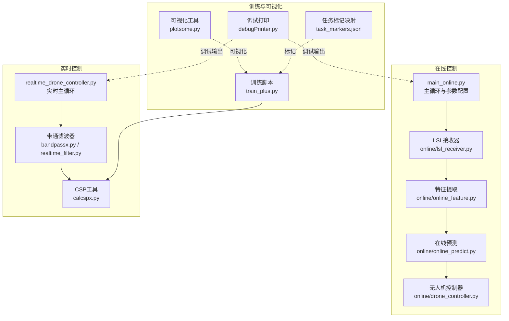
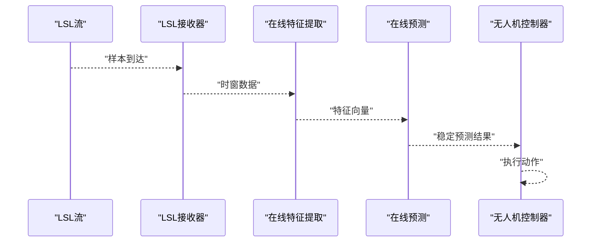
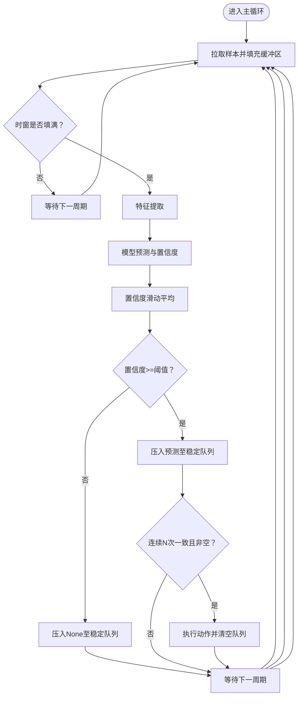
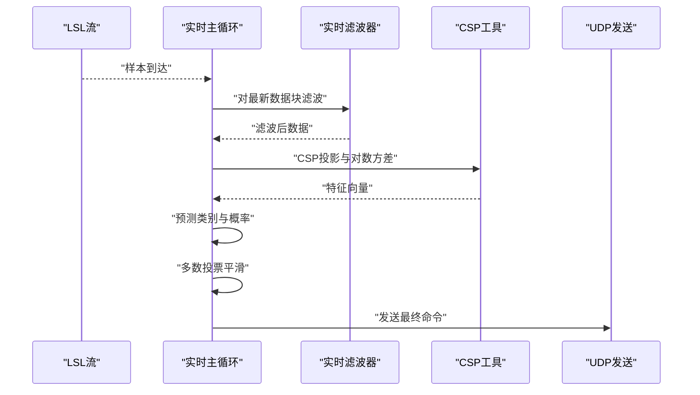
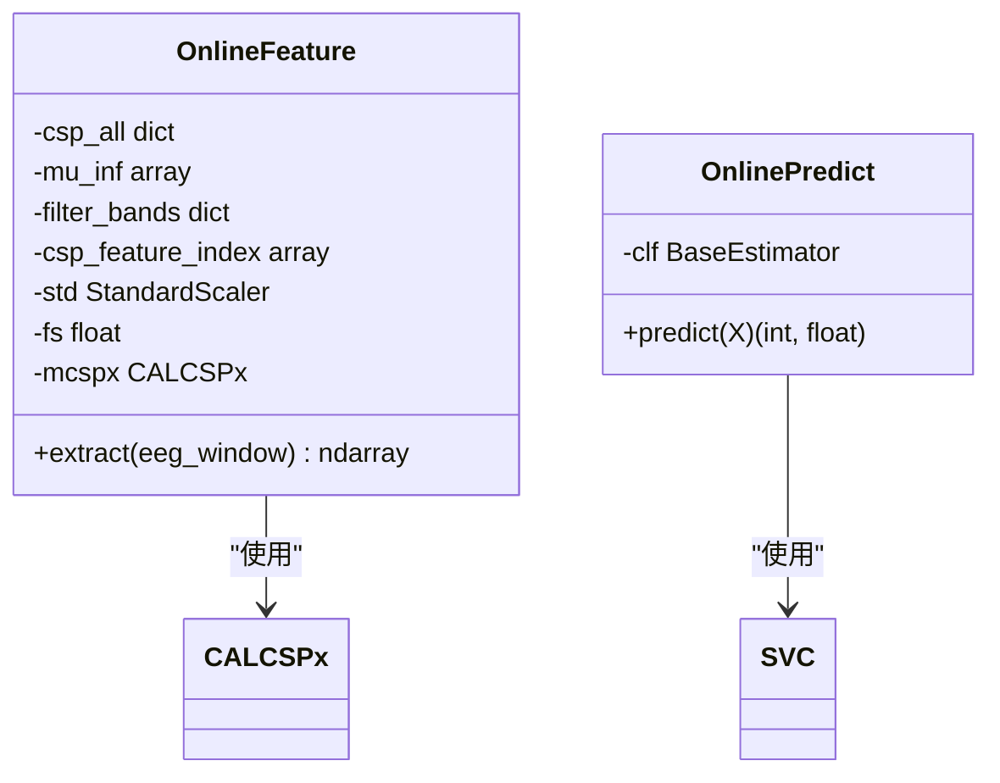
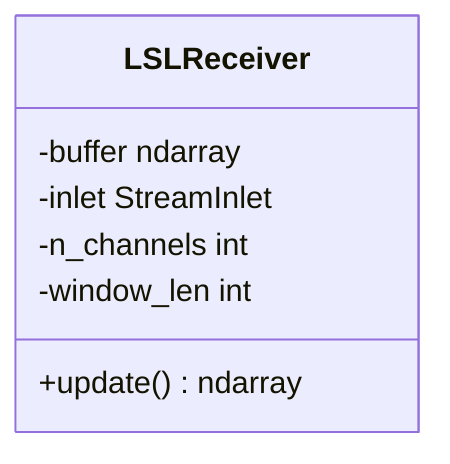
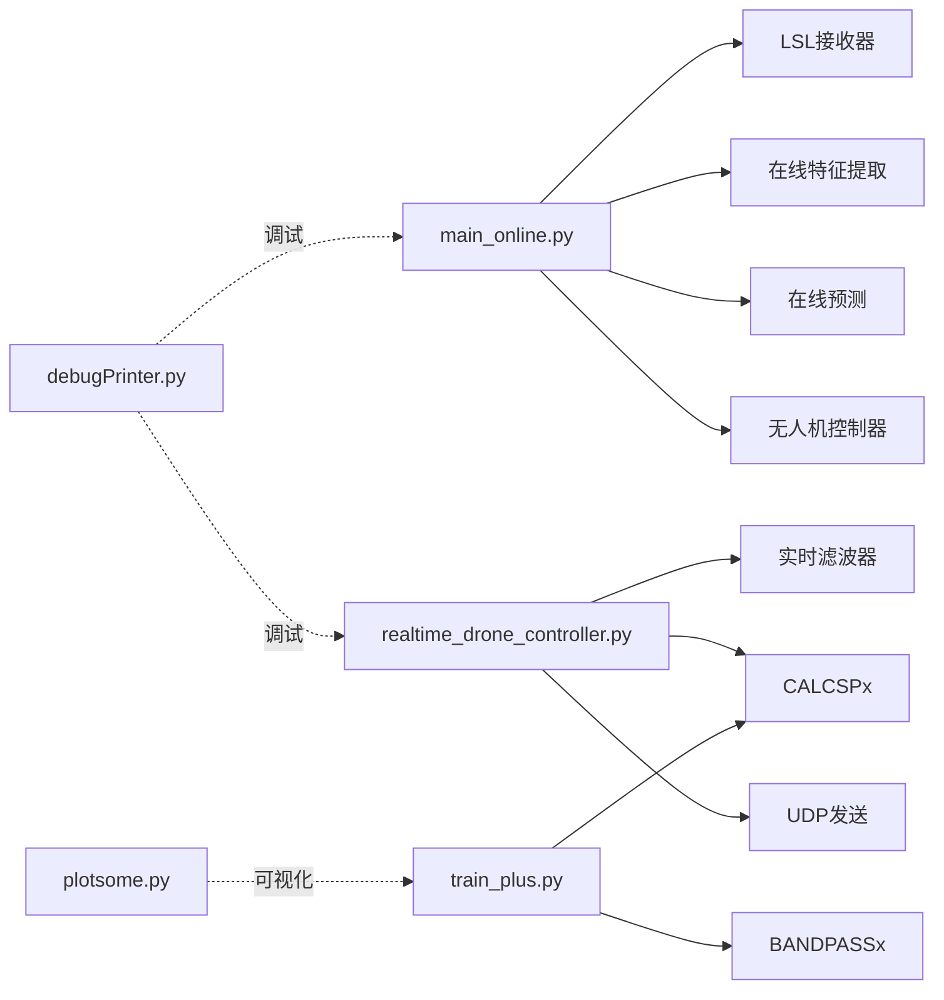

# 实时控制系统

<cite>
**本文引用的文件**
- [main_online.py](file://paradigm/main_online.py)
- [realtime_drone_controller.py](file://paradigm/realtime_drone_controller.py)
- [online/lsl_receiver.py](file://paradigm/online/lsl_receiver.py)
- [online/online_feature.py](file://paradigm/online/online_feature.py)
- [online/online_predict.py](file://paradigm/online/online_predict.py)
- [online/drone_controller.py](file://paradigm/online/drone_controller.py)
- [bandpassx.py](file://paradigm/bandpassx.py)
- [calcspx.py](file://paradigm/calcspx.py)
- [realtime_filter.py](file://paradigm/realtime_filter.py)
- [debugPrinter.py](file://paradigm/debugPrinter.py)
- [plotsome.py](file://paradigm/plotsome.py)
- [train_plus.py](file://paradigm/train_plus.py)
- [task_markers.json](file://paradigm/task_markers.json)
</cite>

## 目录
1. [简介](#简介)
2. [项目结构](#项目结构)
3. [核心组件](#核心组件)
4. [架构总览](#架构总览)
5. [详细组件分析](#详细组件分析)
6. [依赖关系分析](#依赖关系分析)
7. [性能考虑](#性能考虑)
8. [故障排查指南](#故障排查指南)
9. [结论](#结论)
10. [附录](#附录)

## 简介
本技术文档面向实时脑机接口控制系统，围绕主控制循环的实现机制展开，覆盖数据采集、特征提取、预测决策与控制执行的完整链路；同时深入解析稳定性保障（连续性判断、滑动平均平滑、误判过滤）、性能优化（缓冲区管理、预测间隔调整、资源使用优化）、调试与监控工具（debugPrinter 输出分析、plotsome 可视化）以及实时性指标（延迟测量、吞吐量计算、瓶颈识别）。文档旨在帮助开发者快速理解系统设计、定位问题并进行优化。

## 项目结构
本仓库采用按功能域划分的组织方式，核心在线控制流程位于 paradigm/online 子目录，实时控制与网络通信位于 paradigm 根目录，训练与特征工程位于 paradigm/train_plus.py 及相关模块。

**图表来源**
- [main_online.py:1-97](file://paradigm/main_online.py#L1-L97)
- [realtime_drone_controller.py:1-121](file://paradigm/realtime_drone_controller.py#L1-L121)
- [online/lsl_receiver.py:1-32](file://paradigm/online/lsl_receiver.py#L1-L32)
- [online/online_feature.py:1-52](file://paradigm/online/online_feature.py#L1-L52)
- [online/online_predict.py:1-17](file://paradigm/online/online_predict.py#L1-L17)
- [online/drone_controller.py:1-13](file://paradigm/online/drone_controller.py#L1-L13)
- [bandpassx.py:1-79](file://paradigm/bandpassx.py#L1-L79)
- [calcspx.py:1-87](file://paradigm/calcspx.py#L1-L87)
- [realtime_filter.py:1-32](file://paradigm/realtime_filter.py#L1-L32)
- [train_plus.py:1-213](file://paradigm/train_plus.py#L1-L213)
- [debugPrinter.py:1-28](file://paradigm/debugPrinter.py#L1-L28)
- [plotsome.py:1-135](file://paradigm/plotsome.py#L1-L135)
- [task_markers.json:1-23](file://paradigm/task_markers.json#L1-L23)

**章节来源**
- [main_online.py:1-97](file://paradigm/main_online.py#L1-L97)
- [realtime_drone_controller.py:1-121](file://paradigm/realtime_drone_controller.py#L1-L121)

## 核心组件
- 在线主循环与参数配置：负责加载模型、初始化接收器、特征提取器、预测器与无人机控制器，并设置阈值、预测间隔、稳定窗口与置信度滑动窗口等控制参数。
- LSL接收器：从Lab Streaming Layer流中持续拉取样本，维护固定长度环形缓冲区，保证后续特征提取所需的时窗数据。
- 在线特征提取：基于多频带带通滤波与CSP投影，计算每频带的对数方差特征，再经特征选择与标准化。
- 在线预测：调用训练好的分类器输出预测类别与置信度。
- 稳定性保障：通过置信度滑动平均与连续性判断，结合多数投票平滑，过滤误判。
- 无人机控制器：根据稳定预测结果执行上升/下降动作。
- 实时控制主循环：与在线版本类似，但引入实时滤波器与UDP通信，适配更严格的实时性需求。
- 训练与可视化：训练脚本构建CSP+LogVar特征，网格搜索SVM超参，保存模型；可视化工具提供PSD分析能力。

**章节来源**
- [main_online.py:14-97](file://paradigm/main_online.py#L14-L97)
- [online/lsl_receiver.py:6-32](file://paradigm/online/lsl_receiver.py#L6-L32)
- [online/online_feature.py:7-52](file://paradigm/online/online_feature.py#L7-L52)
- [online/online_predict.py:3-17](file://paradigm/online/online_predict.py#L3-L17)
- [online/drone_controller.py:3-13](file://paradigm/online/drone_controller.py#L3-L13)
- [realtime_drone_controller.py:12-121](file://paradigm/realtime_drone_controller.py#L12-L121)
- [bandpassx.py:7-79](file://paradigm/bandpassx.py#L7-L79)
- [calcspx.py:7-87](file://paradigm/calcspx.py#L7-L87)
- [realtime_filter.py:6-32](file://paradigm/realtime_filter.py#L6-L32)
- [train_plus.py:1-213](file://paradigm/train_plus.py#L1-L213)
- [plotsome.py:9-135](file://paradigm/plotsome.py#L9-L135)

## 架构总览
系统采用“数据采集—特征提取—预测—稳定与控制”的流水线式架构。在线版本与实时版本共享核心模块，差异在于数据源、滤波策略与执行路径。

**图表来源**
- [main_online.py:54-97](file://paradigm/main_online.py#L54-L97)
- [online/lsl_receiver.py:23-32](file://paradigm/online/lsl_receiver.py#L23-L32)
- [online/online_feature.py:20-52](file://paradigm/online/online_feature.py#L20-L52)
- [online/online_predict.py:9-17](file://paradigm/online/online_predict.py#L9-L17)
- [online/drone_controller.py:5-13](file://paradigm/online/drone_controller.py#L5-L13)

## 详细组件分析

### 在线主循环与稳定性保障
- 参数配置：阈值、预测间隔、稳定窗口、置信度滑动窗口等。
- 数据采集：从LSL流拉取样本，填充环形缓冲区，等待完整时窗。
- 特征提取：多频带带通滤波后进行CSP投影，取特征子集并标准化。
- 预测与置信度：分类器输出概率分布，取最大概率作为置信度。
- 稳定性保障：
  - 置信度滑动平均：对最近若干次置信度取均值，平滑波动。
  - 连续性判断：当连续N次预测一致且非空时，判定为稳定预测。
  - 误判过滤：低置信度时将预测压入None，避免不稳定动作。
- 控制执行：稳定预测后执行对应动作，并清空队列防止重复执行。
- 循环节拍：通过sleep维持固定预测间隔。

**图表来源**
- [main_online.py:54-97](file://paradigm/main_online.py#L54-L97)

**章节来源**
- [main_online.py:44-97](file://paradigm/main_online.py#L44-L97)

### 实时控制主循环与UDP执行
- 模型加载与参数：从预训练模型读取采样率、时窗长度、CSP权重、频带范围等。
- 实时滤波器：为每个频带维护因果滤波器状态，仅对最新数据块进行滤波，减少延迟。
- 缓冲区管理：固定长度环形缓冲区，按步长左移并追加新数据，确保时窗一致性。
- 特征提取与预测：按频带提取CSP特征，计算对数方差，经特征选择与标准化后预测类别与概率。
- 控制逻辑：高概率时根据类别发送“up”或“down”，否则发送“hover”。
- 平滑输出：多数投票平滑命令，降低抖动。
- 执行路径：通过UDP发送最终命令到目标设备。

**图表来源**
- [realtime_drone_controller.py:59-121](file://paradigm/realtime_drone_controller.py#L59-L121)
- [realtime_filter.py:22-32](file://paradigm/realtime_filter.py#L22-L32)
- [calcspx.py:62-78](file://paradigm/calcspx.py#L62-L78)

**章节来源**
- [realtime_drone_controller.py:12-121](file://paradigm/realtime_drone_controller.py#L12-L121)
- [realtime_filter.py:6-32](file://paradigm/realtime_filter.py#L6-L32)
- [calcspx.py:7-87](file://paradigm/calcspx.py#L7-L87)

### 在线特征提取与预测
- 特征提取：遍历预设频带，对时窗数据进行带通滤波，应用CSP混合矩阵，取特征子集，计算对数方差，拼接为特征向量，再经特征选择与标准化。
- 在线预测：调用训练模型中的分类器，输出类别与置信度。

**图表来源**
- [online/online_feature.py:7-52](file://paradigm/online/online_feature.py#L7-L52)
- [online/online_predict.py:3-17](file://paradigm/online/online_predict.py#L3-L17)
- [calcspx.py:7-87](file://paradigm/calcspx.py#L7-L87)

**章节来源**
- [online/online_feature.py:20-52](file://paradigm/online/online_feature.py#L20-L52)
- [online/online_predict.py:9-17](file://paradigm/online/online_predict.py#L9-L17)
- [bandpassx.py:33-73](file://paradigm/bandpassx.py#L33-L73)
- [calcspx.py:45-78](file://paradigm/calcspx.py#L45-L78)

### LSL接收器与缓冲区管理
- 维护固定长度环形缓冲区，按样本到达顺序左移并追加最新样本。
- 保证后续特征提取所需的完整时窗数据。

**图表来源**
- [online/lsl_receiver.py:6-32](file://paradigm/online/lsl_receiver.py#L6-L32)

**章节来源**
- [online/lsl_receiver.py:23-32](file://paradigm/online/lsl_receiver.py#L23-L32)

### 无人机控制器
- 提供上升与下降动作接口，便于替换为真实硬件或模拟器控制。

**章节来源**
- [online/drone_controller.py:3-13](file://paradigm/online/drone_controller.py#L3-L13)

### 训练与可视化
- 训练脚本：读取XDF标注，构造Epochs，多频带带通滤波，CSP+LogVar特征，互信息特征选择，标准化+SVM训练，保存模型。
- 可视化：提供PSD计算与绘制工具，便于分析频谱特性。

**章节来源**
- [train_plus.py:109-213](file://paradigm/train_plus.py#L109-L213)
- [plotsome.py:19-135](file://paradigm/plotsome.py#L19-L135)
- [task_markers.json:1-23](file://paradigm/task_markers.json#L1-L23)

## 依赖关系分析
- 在线主循环依赖于LSL接收器、在线特征提取器、在线预测器与无人机控制器。
- 实时主循环依赖于实时滤波器与CALCSPx，通过UDP与外部设备交互。
- 训练脚本依赖于BANDPASSx与CALCSPx，输出模型供在线/实时模块使用。
- debugPrinter与plotsome为开发与调试辅助工具。

**图表来源**
- [main_online.py:8-38](file://paradigm/main_online.py#L8-L38)
- [realtime_drone_controller.py:9-41](file://paradigm/realtime_drone_controller.py#L9-L41)
- [train_plus.py:110-125](file://paradigm/train_plus.py#L110-L125)
- [debugPrinter.py:21-28](file://paradigm/debugPrinter.py#L21-L28)
- [plotsome.py:9-135](file://paradigm/plotsome.py#L9-L135)

**章节来源**
- [main_online.py:8-38](file://paradigm/main_online.py#L8-L38)
- [realtime_drone_controller.py:9-41](file://paradigm/realtime_drone_controller.py#L9-L41)
- [train_plus.py:110-125](file://paradigm/train_plus.py#L110-L125)

## 性能考虑
- 缓冲区管理
  - 在线版本：固定长度环形缓冲区，按样本逐点推进，适合批处理特征提取。
  - 实时版本：按UPDATE_INTERVAL对应的样本数为步长，对最新数据块进行滤波与特征提取，减少历史数据处理开销。
- 预测间隔调整
  - 在线版本通过step_time控制循环节拍，实时版本通过UPDATE_INTERVAL控制处理频率，二者均影响延迟与吞吐量。
- 资源使用优化
  - 实时滤波器为每个通道维护状态，避免跨通道状态干扰，提高实时性。
  - 多数投票平滑减少命令抖动，降低执行设备的频繁切换成本。
- 计算复杂度
  - 特征提取阶段涉及多频带滤波与CSP投影，整体复杂度与通道数、频带数、样本长度成正比。
  - 预测阶段为线性复杂度，受特征维数限制。

[本节为通用性能讨论，不直接分析具体文件，故无“章节来源”]

## 故障排查指南
- 调试输出分析（debugPrinter）
  - 通过dpt函数自动获取调用文件名与行号，便于定位日志来源。
  - 在在线与实时主循环中插入调试输出，观察置信度、预测类别与命令发送情况。
- 可视化工具（plotsome）
  - 使用PSD分析工具对CSP后的信号进行频谱可视化，辅助诊断特征有效性与滤波效果。
- 常见问题
  - LSL流断连：实时主循环检测到样本为空时会发送“hover”命令，需检查数据流与网络连接。
  - 稳定性不足：适当增大稳定窗口与置信度阈值，或增加多数投票窗口。
  - 抖动问题：增大多数投票窗口或优化滤波参数。

**章节来源**
- [debugPrinter.py:21-28](file://paradigm/debugPrinter.py#L21-L28)
- [plotsome.py:19-135](file://paradigm/plotsome.py#L19-L135)
- [realtime_drone_controller.py:63-66](file://paradigm/realtime_drone_controller.py#L63-L66)

## 结论
本系统通过清晰的模块化设计实现了从数据采集到控制执行的闭环。在线与实时两条主循环满足不同场景下的实时性与稳定性需求，配合稳定性保障机制与调试可视化工具，能够有效提升系统的鲁棒性与可维护性。建议在部署前根据硬件性能与任务需求微调预测间隔、稳定窗口与阈值，并结合PSD可视化验证特征质量。

[本节为总结性内容，不直接分析具体文件，故无“章节来源”]

## 附录

### 实时性指标与分析方法
- 延迟测量
  - 采样到执行：记录样本到达时间戳与命令发送时间戳，计算端到端延迟。
  - 处理延迟：记录特征提取与预测耗时，评估模型与滤波开销。
- 吞吐量计算
  - 单位时间内处理的样本数或命令数，用于评估系统承载能力。
- 性能瓶颈识别
  - 通过调试输出与可视化工具定位高频耗时环节（如滤波、CSP、预测）。
  - 优化方向：减少频带数、降低样本长度、简化特征维度、使用更快的分类器或量化模型。

[本节为通用指导，不直接分析具体文件，故无“章节来源”]