# 开发者指南

<cite>
**本文引用的文件**
- [main_online.py](file://paradigm/main_online.py)
- [lsl_receiver.py](file://paradigm/online/lsl_receiver.py)
- [online_feature.py](file://paradigm/online/online_feature.py)
- [online_predict.py](file://paradigm/online/online_predict.py)
- [drone_controller.py](file://paradigm/online/drone_controller.py)
- [bandpassx.py](file://paradigm/bandpassx.py)
- [calcspx.py](file://paradigm/calcspx.py)
- [debugPrinter.py](file://paradigm/debugPrinter.py)
- [plotsome.py](file://paradigm/plotsome.py)
- [mock_lsl_streamer.py](file://paradigm/mock_lsl_streamer.py)
- [realtime_filter.py](file://paradigm/realtime_filter.py)
- [train_plus.py](file://paradigm/train_plus.py)
- [offline_simulation.py](file://paradigm/offline_simulation.py)
- [task_markers.json](file://paradigm/task_markers.json)
</cite>

## 目录
1. [简介](#简介)
2. [项目结构](#项目结构)
3. [核心组件](#核心组件)
4. [架构总览](#架构总览)
5. [详细组件分析](#详细组件分析)
6. [依赖分析](#依赖分析)
7. [性能考虑](#性能考虑)
8. [调试与工具使用](#调试与工具使用)
9. [测试指南](#测试指南)
10. [代码质量与重构建议](#代码质量与重构建议)
11. [贡献流程与规范](#贡献流程与规范)
12. [结论](#结论)

## 简介
本指南面向BCI系统的开发者，帮助您理解系统架构、模块职责、接口设计与命名规范，并提供扩展开发方法（新特征提取算法、新分类器、自定义滤波器）、调试技巧（debugPrinter、plotsome、mock_lsl_streamer）、测试策略（单元与集成测试）、质量保障与性能分析建议，以及贡献代码的流程与规范。

## 项目结构
系统采用“功能域+在线处理”分层组织：
- 在线推理主流程位于顶层入口，负责模型加载、数据接收、特征提取、预测与动作执行。
- 在线子模块封装具体功能：LSL数据接收、特征提取、预测、无人机动作控制。
- 离线训练与仿真模块提供模型训练、离线验证与可视化分析。
- 工具模块提供调试、绘图、模拟数据流等支撑能力。

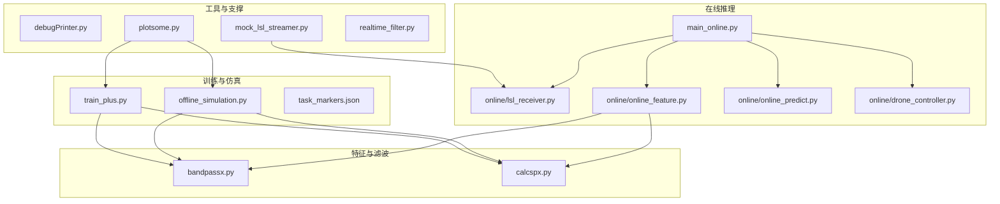

图表来源
- [main_online.py:1-97](file://paradigm/main_online.py#L1-L97)
- [lsl_receiver.py:1-32](file://paradigm/online/lsl_receiver.py#L1-L32)
- [online_feature.py:1-52](file://paradigm/online/online_feature.py#L1-L52)
- [online_predict.py:1-17](file://paradigm/online/online_predict.py#L1-L17)
- [drone_controller.py:1-13](file://paradigm/online/drone_controller.py#L1-L13)
- [bandpassx.py:1-79](file://paradigm/bandpassx.py#L1-L79)
- [calcspx.py:1-87](file://paradigm/calcspx.py#L1-L87)
- [debugPrinter.py:1-28](file://paradigm/debugPrinter.py#L1-L28)
- [plotsome.py:1-135](file://paradigm/plotsome.py#L1-L135)
- [mock_lsl_streamer.py:1-71](file://paradigm/mock_lsl_streamer.py#L1-L71)
- [realtime_filter.py:1-32](file://paradigm/realtime_filter.py#L1-L32)
- [train_plus.py:1-213](file://paradigm/train_plus.py#L1-L213)
- [offline_simulation.py:1-195](file://paradigm/offline_simulation.py#L1-L195)
- [task_markers.json:1-23](file://paradigm/task_markers.json#L1-L23)

章节来源
- [main_online.py:1-97](file://paradigm/main_online.py#L1-L97)
- [train_plus.py:1-213](file://paradigm/train_plus.py#L1-L213)
- [offline_simulation.py:1-195](file://paradigm/offline_simulation.py#L1-L195)

## 核心组件
- 在线数据接收器：从LSL流读取多通道EEG样本，维护环形缓冲区，输出固定时窗的信号。
- 在线特征提取器：对指定频带应用带通滤波，执行CSP变换与方差对数特征计算，标准化后输出特征向量。
- 在线预测器：基于训练好的分类器进行预测与置信度评估。
- 无人机控制器：接收稳定后的预测结果并执行对应动作（可替换为其他执行器）。
- 带通滤波器：基于Butterworth设计的非因果滤波器，支持3维输入（通道x样本x试验）。
- CSP计算器：计算每类协方差、广义特征分解得到混合矩阵，并对试次应用变换。
- 调试打印器：提供轻量级调试信息输出，自动定位调用位置。
- 可视化工具：功率谱密度估计与绘制，便于离线分析。
- 模拟LSL流：从XDF文件读取离线数据，按目标采样率实时推送，便于离线验证。
- 实时滤波器：基于IIR的因果滤波器，支持通道级状态保持，适合在线流式处理。
- 训练与离线仿真：完整的离线训练流程与离线仿真验证，包含特征选择、模型保存与评估。

章节来源
- [lsl_receiver.py:1-32](file://paradigm/online/lsl_receiver.py#L1-L32)
- [online_feature.py:1-52](file://paradigm/online/online_feature.py#L1-L52)
- [online_predict.py:1-17](file://paradigm/online/online_predict.py#L1-L17)
- [drone_controller.py:1-13](file://paradigm/online/drone_controller.py#L1-L13)
- [bandpassx.py:1-79](file://paradigm/bandpassx.py#L1-L79)
- [calcspx.py:1-87](file://paradigm/calcspx.py#L1-L87)
- [debugPrinter.py:1-28](file://paradigm/debugPrinter.py#L1-L28)
- [plotsome.py:1-135](file://paradigm/plotsome.py#L1-L135)
- [mock_lsl_streamer.py:1-71](file://paradigm/mock_lsl_streamer.py#L1-L71)
- [realtime_filter.py:1-32](file://paradigm/realtime_filter.py#L1-L32)
- [train_plus.py:1-213](file://paradigm/train_plus.py#L1-L213)
- [offline_simulation.py:1-195](file://paradigm/offline_simulation.py#L1-L195)

## 架构总览
在线推理主流程以“时序窗口”为单位循环：接收样本→基线校正→特征提取→预测→置信度滑动平均→稳定性判断→执行动作。训练与离线仿真分别提供模型构建与验证闭环。

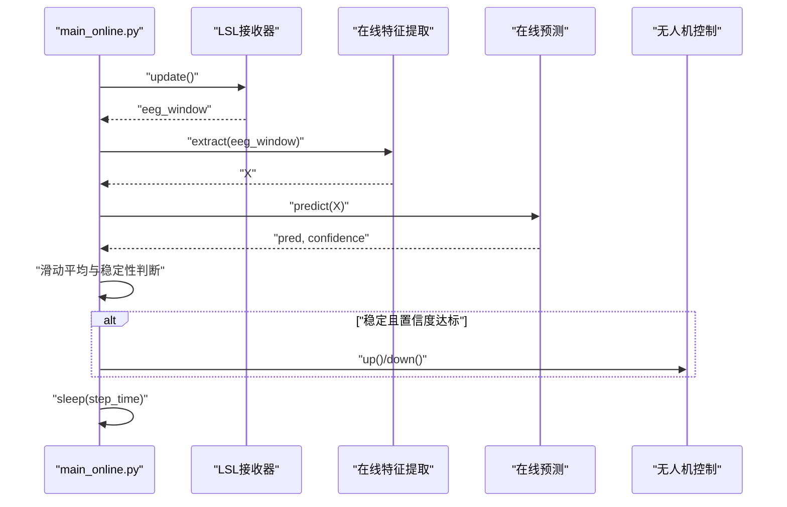

图表来源
- [main_online.py:54-97](file://paradigm/main_online.py#L54-L97)
- [lsl_receiver.py:23-32](file://paradigm/online/lsl_receiver.py#L23-L32)
- [online_feature.py:20-52](file://paradigm/online/online_feature.py#L20-L52)
- [online_predict.py:9-17](file://paradigm/online/online_predict.py#L9-L17)
- [drone_controller.py:5-13](file://paradigm/online/drone_controller.py#L5-L13)

## 详细组件分析

### 在线数据接收器（LSLReceiver）
- 责任：解析LSL流，接收样本，维护环形缓冲区，输出当前时窗数据。
- 关键点：通道数、采样率、时窗长度由模型配置决定；缓冲区初值填充零，避免首帧空数据导致后续处理异常。
- 复杂度：每次update为O(1)（滚动与覆盖），内存占用O(通道×时窗长度)。

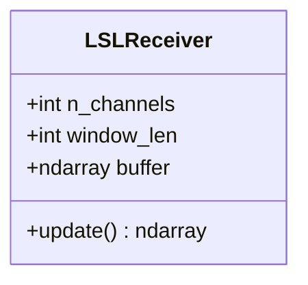

图表来源
- [lsl_receiver.py:6-32](file://paradigm/online/lsl_receiver.py#L6-L32)

章节来源
- [lsl_receiver.py:1-32](file://paradigm/online/lsl_receiver.py#L1-L32)

### 在线特征提取器（OnlineFeature）
- 责任：按频带进行带通滤波，CSP变换，取选定CSP分量的方差对数特征，按特征选择索引筛选并标准化。
- 关键点：滤波器实例按频带动态创建；CSP混合矩阵来自模型；特征向量按模型维度标准化。
- 复杂度：对每个频带O(通道×样本×试次)，总体近似O(N)于试次数与通道数。

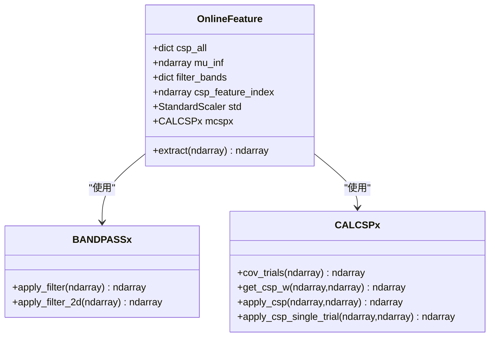

图表来源
- [online_feature.py:7-52](file://paradigm/online/online_feature.py#L7-L52)
- [bandpassx.py:7-79](file://paradigm/bandpassx.py#L7-L79)
- [calcspx.py:7-87](file://paradigm/calcspx.py#L7-L87)

章节来源
- [online_feature.py:1-52](file://paradigm/online/online_feature.py#L1-L52)
- [bandpassx.py:1-79](file://paradigm/bandpassx.py#L1-L79)
- [calcspx.py:1-87](file://paradigm/calcspx.py#L1-L87)

### 在线预测器（OnlinePredict）
- 责任：对特征向量进行预测与概率评估，返回类别与最大概率作为置信度。
- 关键点：依赖模型中的分类器；输出可用于后续稳定性判断与动作执行。

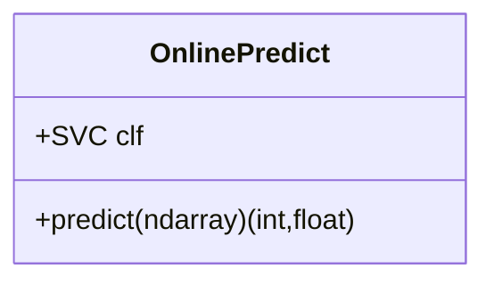

图表来源
- [online_predict.py:3-17](file://paradigm/online/online_predict.py#L3-L17)

章节来源
- [online_predict.py:1-17](file://paradigm/online/online_predict.py#L1-L17)

### 无人机控制器（DroneController）
- 责任：接收稳定预测结果并执行动作（示例为打印动作）。可替换为实际执行器或模拟器接口。

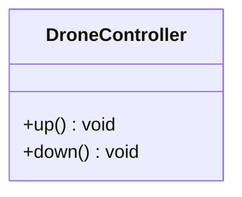

图表来源
- [drone_controller.py:3-13](file://paradigm/online/drone_controller.py#L3-L13)

章节来源
- [drone_controller.py:1-13](file://paradigm/online/drone_controller.py#L1-L13)

### 带通滤波器（BANDPASSx）
- 责任：设计并应用Butterworth带通滤波器，支持2维与3维输入。
- 关键点：使用零相位滤波；支持对每个试次独立滤波。

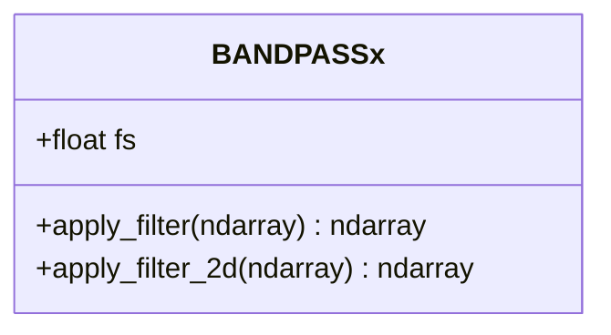

图表来源
- [bandpassx.py:7-79](file://paradigm/bandpassx.py#L7-L79)

章节来源
- [bandpassx.py:1-79](file://paradigm/bandpassx.py#L1-L79)

### CSP计算器（CALCSPx）
- 责任：计算协方差、正则化、广义特征分解，得到混合矩阵并应用于试次。
- 关键点：协方差归一化与正则化提升数值稳定性；支持单试次与批量试次。

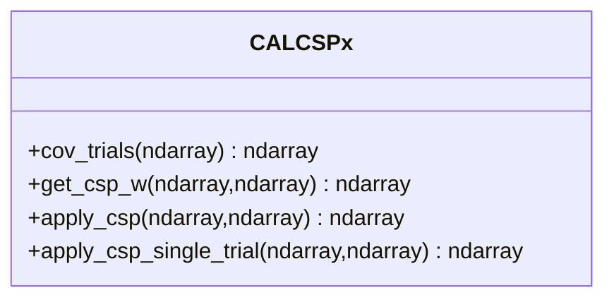

图表来源
- [calcspx.py:7-87](file://paradigm/calcspx.py#L7-L87)

章节来源
- [calcspx.py:1-87](file://paradigm/calcspx.py#L1-L87)

### 实时滤波器（RealTimeBandpass）
- 责任：设计因果IIR滤波器，保留通道级状态，逐块滤波。
- 关键点：适合在线流式处理，需关注初始状态与块边界效应。

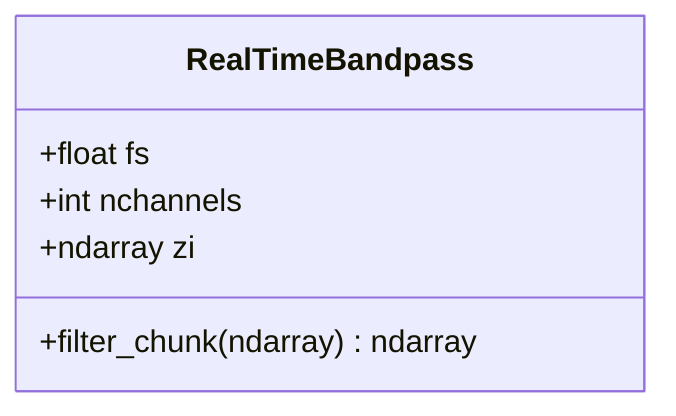

图表来源
- [realtime_filter.py:6-32](file://paradigm/realtime_filter.py#L6-L32)

章节来源
- [realtime_filter.py:1-32](file://paradigm/realtime_filter.py#L1-L32)

### 训练与离线仿真（train_plus.py, offline_simulation.py）
- 责任：读取XDF数据，提取事件与试次，带通滤波，CSP+log-var特征，互信息特征选择，标准化与SVM训练，模型保存；离线仿真验证与统计。
- 关键点：标记映射来自JSON；模型包含分类器、CSP混合矩阵、特征选择索引、标准化器、采样率与时窗等元数据。

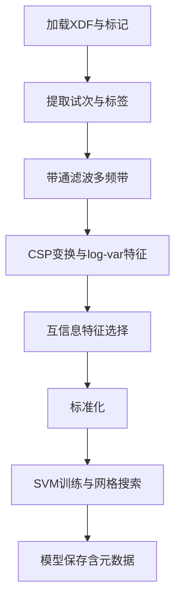

图表来源
- [train_plus.py:55-213](file://paradigm/train_plus.py#L55-L213)
- [offline_simulation.py:53-195](file://paradigm/offline_simulation.py#L53-L195)
- [task_markers.json:1-23](file://paradigm/task_markers.json#L1-L23)

章节来源
- [train_plus.py:1-213](file://paradigm/train_plus.py#L1-L213)
- [offline_simulation.py:1-195](file://paradigm/offline_simulation.py#L1-L195)
- [task_markers.json:1-23](file://paradigm/task_markers.json#L1-L23)

## 依赖分析
- 在线推理主流程依赖在线子模块与模型元数据；特征提取依赖滤波与CSP模块；预测依赖模型中的分类器；离线仿真与训练共享滤波与CSP实现。
- 模块内聚高、耦合清晰，主要通过模型字典传递配置与参数。

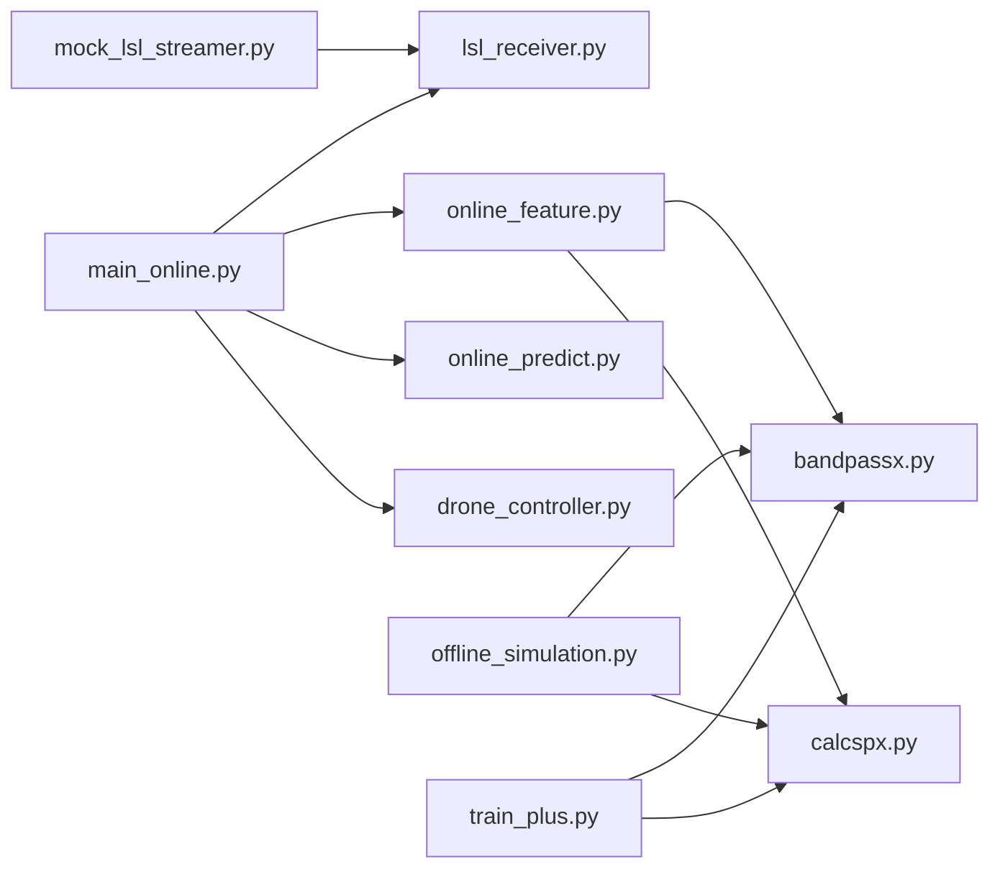

图表来源
- [main_online.py:8-11](file://paradigm/main_online.py#L8-L11)
- [online_feature.py:4-5](file://paradigm/online/online_feature.py#L4-L5)
- [offline_simulation.py:9-10](file://paradigm/offline_simulation.py#L9-L10)
- [train_plus.py:110-122](file://paradigm/train_plus.py#L110-L122)
- [mock_lsl_streamer.py:13-44](file://paradigm/mock_lsl_streamer.py#L13-L44)

章节来源
- [main_online.py:1-97](file://paradigm/main_online.py#L1-L97)
- [online_feature.py:1-52](file://paradigm/online/online_feature.py#L1-L52)
- [offline_simulation.py:1-195](file://paradigm/offline_simulation.py#L1-L195)
- [train_plus.py:1-213](file://paradigm/train_plus.py#L1-L213)
- [mock_lsl_streamer.py:1-71](file://paradigm/mock_lsl_streamer.py#L1-L71)

## 性能考虑
- 在线推理主循环中，特征提取与预测为瓶颈。建议：
  - 使用更高效的特征选择与降维（如PCA或互信息筛选后直接使用CSP分量）。
  - 分块处理与向量化操作，避免Python循环。
  - 缓存滤波器系数与CSP混合矩阵，减少重复计算。
  - 采用更快的分类器（如LinearSVM或ONNX部署）。
- 离线仿真中，步长与平滑窗口影响吞吐与准确性，应结合硬件性能调参。
- 实时滤波器需注意初始状态与块边界，必要时进行预热或重置。

## 调试与工具使用

### debugPrinter调试信息解读
- dpt函数会自动打印调用文件名与行号，便于快速定位日志来源。
- 使用建议：在关键分支与数据流节点插入轻量级打印，避免过量输出影响性能。

章节来源
- [debugPrinter.py:21-28](file://paradigm/debugPrinter.py#L21-L28)

### plotsome可视化分析
- PLOTSOMEx提供功率谱密度估计与绘制，支持按通道与类别分组展示。
- 使用建议：在离线仿真或训练后对比两类试次的频谱差异，辅助滤波与特征选择策略验证。

章节来源
- [plotsome.py:9-135](file://paradigm/plotsome.py#L9-L135)

### mock_lsl_streamer模拟数据生成
- 从XDF文件读取离线EEG数据，按目标采样率实时推送至LSL流，供在线推理脚本消费。
- 使用建议：在无真实设备时快速验证数据通路与特征提取流程；注意通道数量与采样率配置一致。

章节来源
- [mock_lsl_streamer.py:13-71](file://paradigm/mock_lsl_streamer.py#L13-L71)

## 测试指南

### 单元测试
- 测试对象：
  - BANDPASSx：不同带限与采样率下的滤波响应与稳定性。
  - CALCSPx：协方差计算、正则化与混合矩阵有效性。
  - OnlineFeature：特征提取一致性与维度正确性。
  - OnlinePredict：预测与置信度输出范围与单调性。
  - RealTimeBandpass：因果滤波与状态保持。
- 测试用例设计要点：
  - 边界条件：零输入、全零输入、单通道、多通道、单试次与多试次。
  - 正态性：随机噪声输入下的统计特性。
  - 一致性：与离线实现结果对比（误差阈值）。
- 覆盖率要求：核心类与关键方法达到100%，边界与异常路径≥80%。

### 集成测试
- 场景：
  - mock_lsl_streamer → LSLReceiver → OnlineFeature → OnlinePredict → DroneController 端到端链路。
  - 离线仿真与训练模型的一致性验证。
- 自动化流程：
  - 使用pytest或unittest组织用例，结合CI流水线自动执行。
  - 生成覆盖率报告与性能基准，持续监控回归。

## 代码质量与重构建议
- 命名约定：
  - 类名使用帕斯卡命名法（如BANDPASSx、CALCSPx、PLOTSOMEx）。
  - 方法与变量使用蛇形命名法（如apply_filter、get_csp_w）。
  - 常量使用全大写蛇形（如FILTER_BANDS）。
- 接口设计规范：
  - 明确输入输出类型与形状（通道×样本×试次），并在注释中说明。
  - 提供统一的配置入口（如模型字典或配置类），避免硬编码。
  - 异常处理：对缺失流、空缓冲、模型不匹配等情况抛出明确异常并记录上下文。
- 重构建议：
  - 将滤波与CSP封装为可插拔组件，支持不同算法（如FIR、小波、深度特征）。
  - 抽象特征提取管线，支持多特征融合与动态选择。
  - 将在线推理抽象为状态机，便于扩展动作与策略。

## 贡献流程与规范
- 分支策略：主分支仅合并通过CI与评审的变更；功能开发在特性分支进行。
- 提交流程：
  - 新增或修改代码后，补充单元测试与集成测试。
  - 更新相关文档（README、开发者指南）。
  - 提交PR并@至少一名维护者进行代码评审。
- 代码评审要点：
  - 功能正确性、性能影响、可测试性、可维护性与文档完整性。
  - 遵循命名与接口规范，避免引入新的全局状态或副作用。

## 结论
本指南提供了BCI系统的架构理解、扩展开发方法、调试与测试策略、质量保障与贡献流程。遵循上述规范与建议，可在保证稳定性的同时高效迭代新算法与新功能。