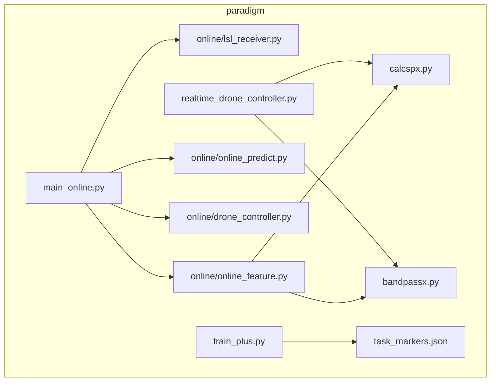
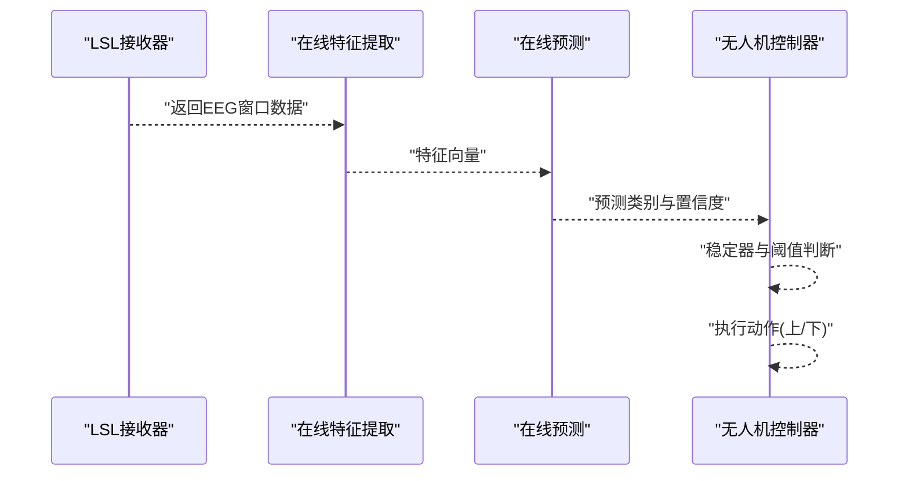
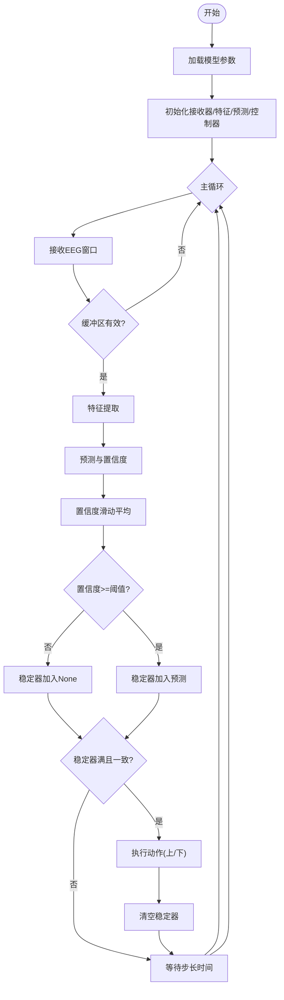
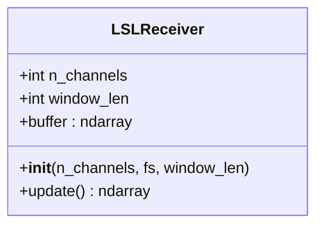
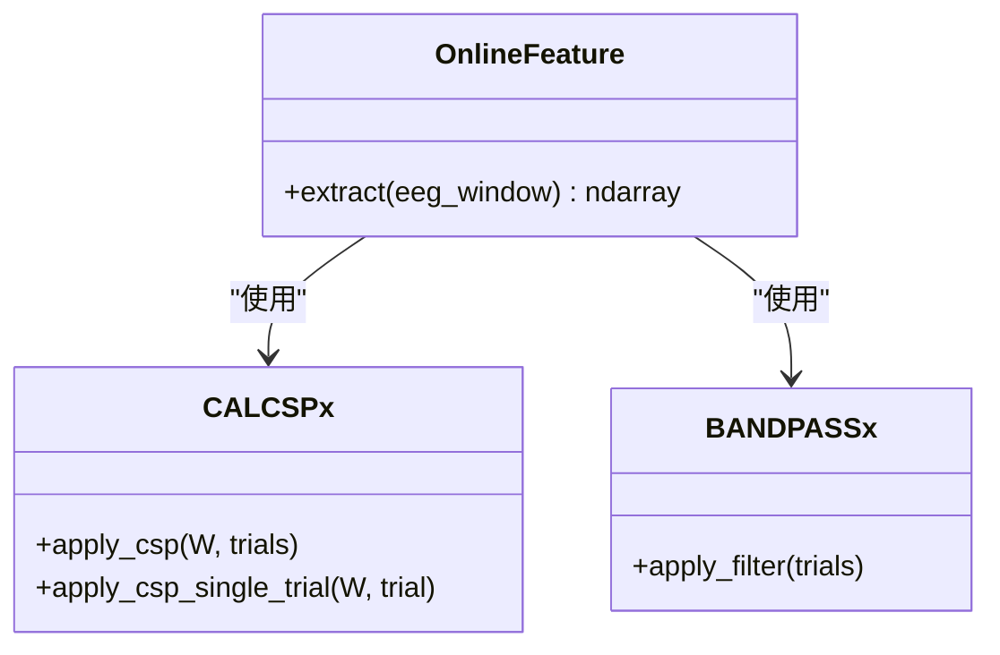
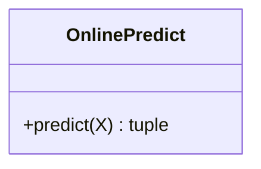
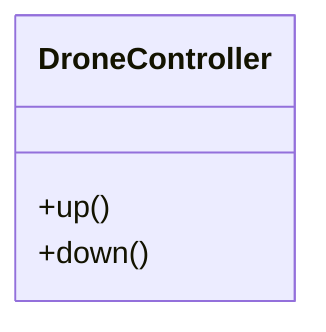
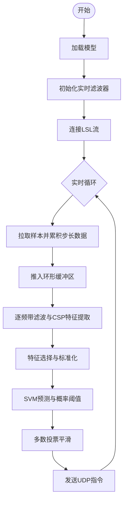
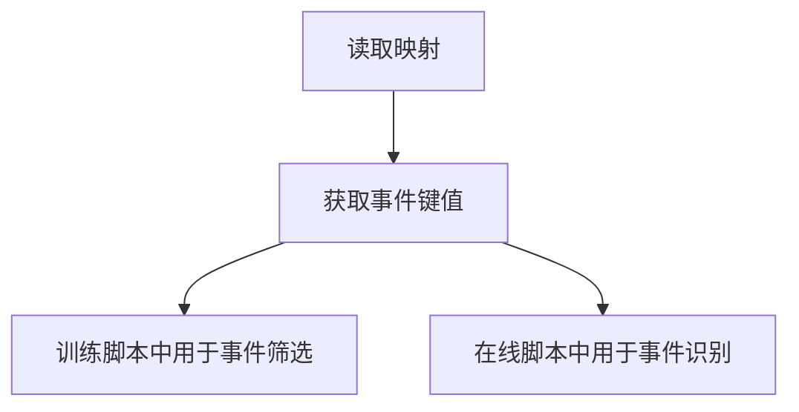
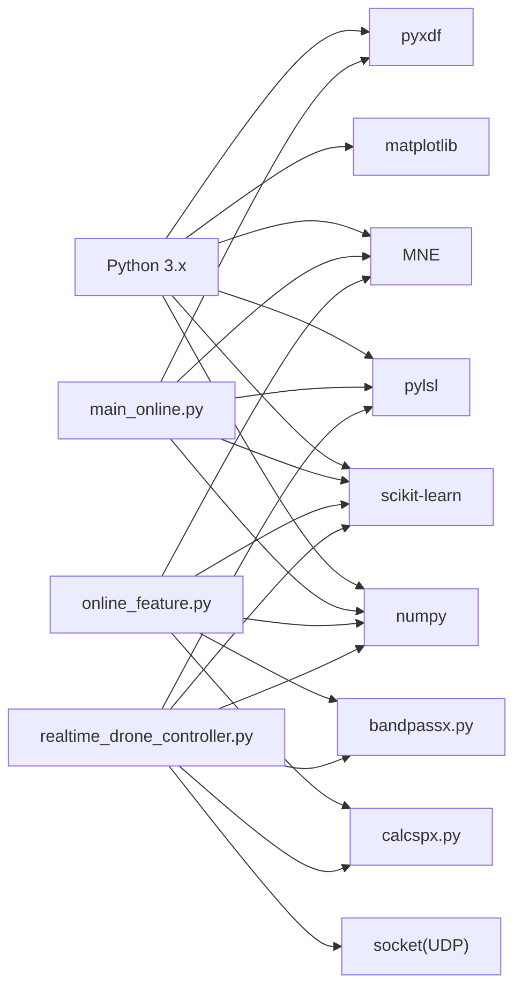

# 快速开始

<cite>
**本文引用的文件**
- [paradigm/task_markers.json](file://paradigm/task_markers.json)
- [paradigm/main_online.py](file://paradigm/main_online.py)
- [paradigm/online/lsl_receiver.py](file://paradigm/online/lsl_receiver.py)
- [paradigm/online/online_feature.py](file://paradigm/online/online_feature.py)
- [paradigm/online/online_predict.py](file://paradigm/online/online_predict.py)
- [paradigm/online/drone_controller.py](file://paradigm/online/drone_controller.py)
- [paradigm/realtime_drone_controller.py](file://paradigm/realtime_drone_controller.py)
- [paradigm/calcspx.py](file://paradigm/calcspx.py)
- [paradigm/bandpassx.py](file://paradigm/bandpassx.py)
- [paradigm/train_plus.py](file://paradigm/train_plus.py)
</cite>

## 目录
1. [简介](#简介)
2. [项目结构](#项目结构)
3. [核心组件](#核心组件)
4. [架构总览](#架构总览)
5. [详细组件分析](#详细组件分析)
6. [依赖分析](#依赖分析)
7. [性能考虑](#性能考虑)
8. [故障排除指南](#故障排除指南)
9. [结论](#结论)
10. [附录](#附录)

## 简介
本指南面向首次接触BCI无人机控制系统的用户，帮助你在约30分钟内完成环境搭建、模型准备、数据采集与在线控制的全流程演示。你将学会：
- 安装Python 3.x与虚拟环境
- 安装所需依赖库（pyxdf、MNE、scikit-learn、pylsl、numpy、matplotlib等）
- 配置任务标记映射文件 task_markers.json
- 运行第一个在线实验：从LSL数据流接收、特征提取、分类预测到无人机动作执行
- 常见问题排查与性能优化建议

## 项目结构
该仓库采用按功能分层的组织方式，核心在线控制流程位于 paradigm/online 子目录，实时UDP控制位于 paradigm/realtime_drone_controller.py，模型训练与特征工程位于 paradigm/train_plus.py，任务标记定义位于 paradigm/task_markers.json。

图表来源
- [paradigm/main_online.py:1-97](file://paradigm/main_online.py#L1-L97)
- [paradigm/online/lsl_receiver.py:1-32](file://paradigm/online/lsl_receiver.py#L1-L32)
- [paradigm/online/online_feature.py:1-52](file://paradigm/online/online_feature.py#L1-L52)
- [paradigm/online/online_predict.py:1-17](file://paradigm/online/online_predict.py#L1-L17)
- [paradigm/online/drone_controller.py:1-13](file://paradigm/online/drone_controller.py#L1-L13)
- [paradigm/realtime_drone_controller.py:1-121](file://paradigm/realtime_drone_controller.py#L1-L121)
- [paradigm/calcspx.py:1-87](file://paradigm/calcspx.py#L1-L87)
- [paradigm/bandpassx.py:1-79](file://paradigm/bandpassx.py#L1-L79)
- [paradigm/task_markers.json:1-23](file://paradigm/task_markers.json#L1-L23)
- [paradigm/train_plus.py:1-213](file://paradigm/train_plus.py#L1-L213)

章节来源
- [paradigm/main_online.py:1-97](file://paradigm/main_online.py#L1-L97)
- [paradigm/realtime_drone_controller.py:1-121](file://paradigm/realtime_drone_controller.py#L1-L121)
- [paradigm/task_markers.json:1-23](file://paradigm/task_markers.json#L1-L23)

## 核心组件
- 在线主循环：负责加载模型、初始化接收器、特征提取器、预测器与无人机控制器，并在主循环中完成数据采集、特征提取、预测、阈值与稳定器判断、以及动作执行。
- LSL接收器：通过pylsl解析并连接EEG流，维护固定长度环形缓冲区，提供最新的窗口数据。
- 在线特征提取：基于带通滤波与CSP+方差对数特征，结合离线训练的特征选择与标准化参数，输出可用于分类的特征向量。
- 在线预测：调用SVM分类器输出预测类别与置信度。
- 无人机控制器：抽象出向上/向下两个动作接口，便于替换为真实无人机或模拟器。
- 实时UDP控制器：在实时模式下直接通过UDP发送控制指令，集成滤波、特征提取、预测与平滑逻辑。
- 任务标记映射：定义实验事件与标记码之间的对应关系，用于训练与在线控制中的事件识别。

章节来源
- [paradigm/main_online.py:14-97](file://paradigm/main_online.py#L14-L97)
- [paradigm/online/lsl_receiver.py:6-32](file://paradigm/online/lsl_receiver.py#L6-L32)
- [paradigm/online/online_feature.py:7-52](file://paradigm/online/online_feature.py#L7-L52)
- [paradigm/online/online_predict.py:3-17](file://paradigm/online/online_predict.py#L3-L17)
- [paradigm/online/drone_controller.py:3-13](file://paradigm/online/drone_controller.py#L3-L13)
- [paradigm/realtime_drone_controller.py:1-121](file://paradigm/realtime_drone_controller.py#L1-L121)
- [paradigm/task_markers.json:1-23](file://paradigm/task_markers.json#L1-L23)

## 架构总览
下面的序列图展示了从数据采集到动作执行的完整链路，涵盖在线主循环、特征提取、预测与控制四个阶段。

图表来源
- [paradigm/main_online.py:54-97](file://paradigm/main_online.py#L54-L97)
- [paradigm/online/lsl_receiver.py:23-32](file://paradigm/online/lsl_receiver.py#L23-L32)
- [paradigm/online/online_feature.py:20-52](file://paradigm/online/online_feature.py#L20-L52)
- [paradigm/online/online_predict.py:9-17](file://paradigm/online/online_predict.py#L9-L17)
- [paradigm/online/drone_controller.py:5-13](file://paradigm/online/drone_controller.py#L5-L13)

## 详细组件分析

### 在线主循环与控制参数
- 模型加载：从离线训练保存的模型文件中读取采样率、信号窗、CSP矩阵、特征索引、标准化器等参数。
- 初始化模块：创建LSL接收器、在线特征提取器、在线预测器与无人机控制器。
- 控制参数：阈值、预测间隔、稳定窗口、置信度滑动窗口等。
- 主循环：持续从LSL接收窗口数据，进行基线校正、特征提取、预测、置信度滑动平均、稳定器判断与动作执行。

图表来源
- [paradigm/main_online.py:14-97](file://paradigm/main_online.py#L14-L97)

章节来源
- [paradigm/main_online.py:14-97](file://paradigm/main_online.py#L14-L97)

### LSL接收器
- 功能：解析类型为“EEG”的流，建立Inlet，维护通道数与窗口长度，提供环形缓冲区与update接口。
- 数据结构：缓冲区为通道×样本的二维数组，每次pull_sample后左移一位并写入最新样本。

图表来源
- [paradigm/online/lsl_receiver.py:6-32](file://paradigm/online/lsl_receiver.py#L6-L32)

章节来源
- [paradigm/online/lsl_receiver.py:6-32](file://paradigm/online/lsl_receiver.py#L6-L32)

### 在线特征提取
- 功能：对每个频带进行带通滤波，应用CSP变换，取特定特征索引，计算对数方差，按离线特征选择与标准化进行转换。
- 依赖：CALCSPx（CSP相关）、BANDPASSx（带通滤波）。

图表来源
- [paradigm/online/online_feature.py:7-52](file://paradigm/online/online_feature.py#L7-L52)
- [paradigm/calcspx.py:62-78](file://paradigm/calcspx.py#L62-L78)
- [paradigm/bandpassx.py:54-73](file://paradigm/bandpassx.py#L54-L73)

章节来源
- [paradigm/online/online_feature.py:7-52](file://paradigm/online/online_feature.py#L7-L52)
- [paradigm/calcspx.py:62-78](file://paradigm/calcspx.py#L62-L78)
- [paradigm/bandpassx.py:54-73](file://paradigm/bandpassx.py#L54-L73)

### 在线预测
- 功能：调用SVM分类器输出预测类别与最大概率作为置信度。

图表来源
- [paradigm/online/online_predict.py:3-17](file://paradigm/online/online_predict.py#L3-L17)

章节来源
- [paradigm/online/online_predict.py:3-17](file://paradigm/online/online_predict.py#L3-L17)

### 无人机控制器
- 功能：提供向上与向下两个动作接口，便于替换为真实设备或模拟器。

图表来源
- [paradigm/online/drone_controller.py:3-13](file://paradigm/online/drone_controller.py#L3-L13)

章节来源
- [paradigm/online/drone_controller.py:3-13](file://paradigm/online/drone_controller.py#L3-L13)

### 实时UDP控制器
- 功能：直接通过UDP发送控制指令；集成实时滤波、特征提取、预测与多数投票平滑。
- 参数：模型路径、目标IP与端口、概率阈值、更新间隔、平滑窗口等。

图表来源
- [paradigm/realtime_drone_controller.py:21-121](file://paradigm/realtime_drone_controller.py#L21-L121)

章节来源
- [paradigm/realtime_drone_controller.py:1-121](file://paradigm/realtime_drone_controller.py#L1-L121)

### 任务标记映射
- 作用：定义实验事件与标记码的映射，如左右命令、开始/结束、预测标记、游标控制等。
- 使用：训练脚本与在线脚本均通过该映射识别事件起止与类别标签。

图表来源
- [paradigm/task_markers.json:1-23](file://paradigm/task_markers.json#L1-L23)
- [paradigm/train_plus.py:24-40](file://paradigm/train_plus.py#L24-L40)

章节来源
- [paradigm/task_markers.json:1-23](file://paradigm/task_markers.json#L1-L23)
- [paradigm/train_plus.py:24-40](file://paradigm/train_plus.py#L24-L40)

## 依赖分析
- Python 3.x：项目中多处使用了Python 3语法与特性（如f-string、类型注解风格），需使用Python 3.6及以上版本。
- 核心依赖：
  - pylsl：用于接收LSL数据流
  - numpy：数值计算基础
  - scikit-learn：SVM分类与特征选择
  - MNE：XDF读取与Epochs构建
  - pyxdf：XDF文件读取
  - matplotlib：可视化（训练与评估报告中使用）
- 项目内部模块：
  - bandpassx：带通滤波
  - calcspx：CSP特征工程
  - 在线模块：lsl_receiver、online_feature、online_predict、drone_controller

图表来源
- [paradigm/main_online.py:1-11](file://paradigm/main_online.py#L1-L11)
- [paradigm/online/online_feature.py:1-6](file://paradigm/online/online_feature.py#L1-L6)
- [paradigm/realtime_drone_controller.py:1-11](file://paradigm/realtime_drone_controller.py#L1-L11)
- [paradigm/calcspx.py:1-87](file://paradigm/calcspx.py#L1-L87)
- [paradigm/bandpassx.py:1-79](file://paradigm/bandpassx.py#L1-L79)

章节来源
- [paradigm/main_online.py:1-11](file://paradigm/main_online.py#L1-L11)
- [paradigm/online/online_feature.py:1-6](file://paradigm/online/online_feature.py#L1-L6)
- [paradigm/realtime_drone_controller.py:1-11](file://paradigm/realtime_drone_controller.py#L1-L11)

## 性能考虑
- 采样率与窗口：模型参数包含采样率与信号窗，应确保LSL流采样率与模型一致，避免重采样带来的误差。
- 预测间隔：主循环中的步长时间决定了控制刷新率，过短可能造成CPU压力，过长影响响应速度。
- 稳定器与阈值：稳定窗口与置信度阈值可平衡误触发与迟滞，建议先以默认值运行，再根据实际脑电波动调整。
- 实时UDP模式：实时脚本内置多数投票与概率阈值，适合直接对接无人机或模拟器，减少抖动。
- 可视化与日志：打印信息有助于观察置信度变化，便于调试与参数调优。

[本节为通用指导，不直接分析具体文件]

## 故障排除指南
- 无法找到EEG流
  - 现象：启动后提示未找到EEG流或连接失败。
  - 排查：确认LSL发射端已启动并发布类型为“EEG”的流；检查网络与防火墙设置。
  - 参考：[paradigm/online/lsl_receiver.py:10-16](file://paradigm/online/lsl_receiver.py#L10-L16)
- 缓冲区始终无效
  - 现象：主循环持续跳过处理。
  - 排查：确认采样率与模型参数一致；检查通道数量是否匹配；查看是否有数据到达。
  - 参考：[paradigm/main_online.py:58-60](file://paradigm/main_online.py#L58-L60)
- 预测置信度低或频繁切换
  - 现象：动作频繁切换或长时间无动作。
  - 排查：提高置信度阈值或增大稳定窗口；检查滤波与特征提取是否合理。
  - 参考：[paradigm/main_online.py:44-49](file://paradigm/main_online.py#L44-L49)
- UDP控制无响应
  - 现象：实时模式下未收到控制指令。
  - 排查：确认目标IP与端口正确；检查目标设备是否监听相应端口；查看发送日志。
  - 参考：[paradigm/realtime_drone_controller.py:13-15](file://paradigm/realtime_drone_controller.py#L13-L15)
- 任务标记不生效
  - 现象：训练或在线阶段无法识别事件。
  - 排查：核对task_markers.json中的键名与实际标记码；确保训练脚本与在线脚本使用同一映射。
  - 参考：[paradigm/task_markers.json:1-23](file://paradigm/task_markers.json#L1-L23)

章节来源
- [paradigm/online/lsl_receiver.py:10-16](file://paradigm/online/lsl_receiver.py#L10-L16)
- [paradigm/main_online.py:44-60](file://paradigm/main_online.py#L44-L60)
- [paradigm/realtime_drone_controller.py:13-15](file://paradigm/realtime_drone_controller.py#L13-L15)
- [paradigm/task_markers.json:1-23](file://paradigm/task_markers.json#L1-L23)

## 结论
通过本指南，你可以在30分钟内完成从环境搭建到第一个BCI实验的全流程演示。建议先以在线主循环模式验证数据链路与控制逻辑，再切换至实时UDP模式对接真实设备。后续可根据自身硬件与实验需求调整参数与算法。

[本节为总结性内容，不直接分析具体文件]

## 附录

### 系统要求与硬件兼容性
- Python 3.6及以上
- 支持的EEG设备：任何能通过LSL发布“EEG”流的设备（如OpenBCI、BrainStorm等）
- 网络：实时UDP模式需要目标设备在同一局域网内
- 操作系统：Windows/Linux/MacOS（需满足各依赖库的平台支持）

[本节为通用信息，不直接分析具体文件]

### 依赖安装步骤（概览）
- 创建并激活虚拟环境（推荐使用venv或conda）
- 安装核心依赖：pylsl、numpy、scikit-learn、MNE、pyxdf、matplotlib
- 运行训练脚本生成模型文件（如需重新训练）
- 准备task_markers.json并确保键名与实验一致

[本节为通用指导，不直接分析具体文件]

### 第一个实验操作流程（在线主循环）
- 准备：确保LSL发射端已启动并发布EEG流；准备好模型文件与task_markers.json
- 运行：启动在线主循环脚本
- 观察：关注控制台输出的预测类别与置信度；确认稳定器触发后执行动作
- 调参：根据脑电信号质量调整阈值、稳定窗口与步长时间

章节来源
- [paradigm/main_online.py:14-97](file://paradigm/main_online.py#L14-L97)
- [paradigm/task_markers.json:1-23](file://paradigm/task_markers.json#L1-L23)