# 故障排除

<cite>
**本文引用的文件**
- [main_online.py](file://paradigm/main_online.py)
- [realtime_drone_controller.py](file://paradigm/realtime_drone_controller.py)
- [offline_simulation.py](file://paradigm/offline_simulation.py)
- [mock_lsl_streamer.py](file://paradigm/mock_lsl_streamer.py)
- [lsl_receiver.py](file://paradigm/online/lsl_receiver.py)
- [online_feature.py](file://paradigm/online/online_feature.py)
- [online_predict.py](file://paradigm/online/online_predict.py)
- [drone_controller.py](file://paradigm/online/drone_controller.py)
- [realtime_filter.py](file://paradigm/realtime_filter.py)
- [bandpassx.py](file://paradigm/bandpassx.py)
- [calcspx.py](file://paradigm/calcspx.py)
- [debugPrinter.py](file://paradigm/debugPrinter.py)
- [plotsome.py](file://paradigm/plotsome.py)
- [train_plus.py](file://paradigm/train_plus.py)
- [xdf.py](file://paradigm/xdf.py)
- [task_markers.json](file://paradigm/task_markers.json)
</cite>

## 目录
1. [简介](#简介)
2. [项目结构](#项目结构)
3. [核心组件](#核心组件)
4. [架构总览](#架构总览)
5. [详细组件分析](#详细组件分析)
6. [依赖分析](#依赖分析)
7. [性能考虑](#性能考虑)
8. [故障排除指南](#故障排除指南)
9. [结论](#结论)
10. [附录](#附录)

## 简介
本指南面向BCI系统开发与运维人员，聚焦于在线脑控无人机控制链路中的常见问题与系统性排障方法。内容覆盖：
- 信号质量：EEG信号缺失、噪声、基线漂移与伪影
- 模型预测：置信度低、误判、特征提取异常
- 控制异常：命令不生效、抖动、延迟过大
- 实时性能：缓冲区与采样率不匹配、CPU占用高、网络丢包
- 硬件兼容：LSL流解析失败、采样率不一致、网络通信异常
- 软件问题：依赖版本冲突、内存增长、并发访问风险
- 优化建议：缓冲区大小、预测频率、资源监控
- 离线仿真与测试：基于XDF数据的离线验证与UDP回传测试

## 项目结构
系统采用分层模块化设计，核心由“数据采集-特征提取-模型预测-控制执行-网络通信”构成，同时提供离线仿真与LSL模拟器辅助调试。

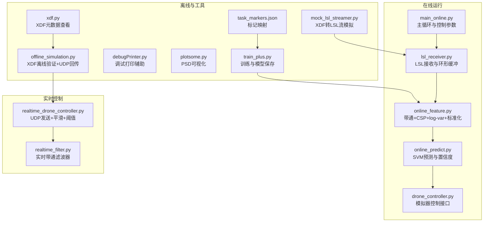

图表来源
- [main_online.py:1-97](file://paradigm/main_online.py#L1-L97)
- [realtime_drone_controller.py:1-121](file://paradigm/realtime_drone_controller.py#L1-L121)
- [offline_simulation.py:1-195](file://paradigm/offline_simulation.py#L1-L195)
- [mock_lsl_streamer.py:1-71](file://paradigm/mock_lsl_streamer.py#L1-L71)
- [lsl_receiver.py:1-32](file://paradigm/online/lsl_receiver.py#L1-L32)
- [online_feature.py:1-52](file://paradigm/online/online_feature.py#L1-L52)
- [online_predict.py:1-17](file://paradigm/online/online_predict.py#L1-L17)
- [drone_controller.py:1-13](file://paradigm/online/drone_controller.py#L1-L13)
- [realtime_filter.py:1-32](file://paradigm/realtime_filter.py#L1-L32)
- [bandpassx.py:1-79](file://paradigm/bandpassx.py#L1-L79)
- [calcspx.py:1-87](file://paradigm/calcspx.py#L1-L87)
- [debugPrinter.py:1-28](file://paradigm/debugPrinter.py#L1-L28)
- [plotsome.py:1-135](file://paradigm/plotsome.py#L1-L135)
- [train_plus.py:1-213](file://paradigm/train_plus.py#L1-L213)
- [xdf.py:1-37](file://paradigm/xdf.py#L1-L37)
- [task_markers.json:1-23](file://paradigm/task_markers.json#L1-L23)

章节来源
- [main_online.py:1-97](file://paradigm/main_online.py#L1-L97)
- [realtime_drone_controller.py:1-121](file://paradigm/realtime_drone_controller.py#L1-L121)
- [offline_simulation.py:1-195](file://paradigm/offline_simulation.py#L1-L195)
- [mock_lsl_streamer.py:1-71](file://paradigm/mock_lsl_streamer.py#L1-L71)

## 核心组件
- 在线主循环与控制参数：负责从LSL接收窗口数据、特征提取、模型预测、置信度平滑、稳定器与无人机控制执行。
- LSL接收器：解析并连接EEG LSL流，维护环形缓冲区，保证固定窗口长度的连续数据。
- 在线特征提取：带通滤波、CSP投影、方差对数域特征、互信息索引筛选与标准化。
- 在线预测：SVM分类器输出类别与最大概率（置信度）。
- 无人机控制器：模拟器控制接口（打印动作），可替换为真实硬件。
- 实时控制：基于UDP发送控制指令，阈值化与多数投票平滑，定时拉取新样本。
- 实时滤波器：为每个频带维护滤波器状态，逐通道因果滤波。
- 离线仿真：基于XDF数据离线重放，特征提取与预测，UDP回传延迟测量。
- 模拟LSL流：将XDF数据转换为LSL流，便于离线联调。
- 调试与可视化：调试打印、PSD可视化、XDF元数据查看、训练脚本与标记映射。

章节来源
- [main_online.py:14-97](file://paradigm/main_online.py#L14-L97)
- [lsl_receiver.py:6-32](file://paradigm/online/lsl_receiver.py#L6-L32)
- [online_feature.py:7-52](file://paradigm/online/online_feature.py#L7-L52)
- [online_predict.py:3-17](file://paradigm/online/online_predict.py#L3-L17)
- [drone_controller.py:3-13](file://paradigm/online/drone_controller.py#L3-L13)
- [realtime_drone_controller.py:12-121](file://paradigm/realtime_drone_controller.py#L12-L121)
- [realtime_filter.py:6-32](file://paradigm/realtime_filter.py#L6-L32)
- [offline_simulation.py:12-195](file://paradigm/offline_simulation.py#L12-L195)
- [mock_lsl_streamer.py:13-71](file://paradigm/mock_lsl_streamer.py#L13-L71)
- [bandpassx.py:7-79](file://paradigm/bandpassx.py#L7-L79)
- [calcspx.py:7-87](file://paradigm/calcspx.py#L7-L87)
- [debugPrinter.py:21-28](file://paradigm/debugPrinter.py#L21-L28)
- [plotsome.py:9-135](file://paradigm/plotsome.py#L9-L135)
- [train_plus.py:1-213](file://paradigm/train_plus.py#L1-L213)
- [xdf.py:1-37](file://paradigm/xdf.py#L1-L37)
- [task_markers.json:1-23](file://paradigm/task_markers.json#L1-L23)

## 架构总览
以下序列图展示在线主循环从LSL接收、特征提取、预测到控制执行的关键调用链。

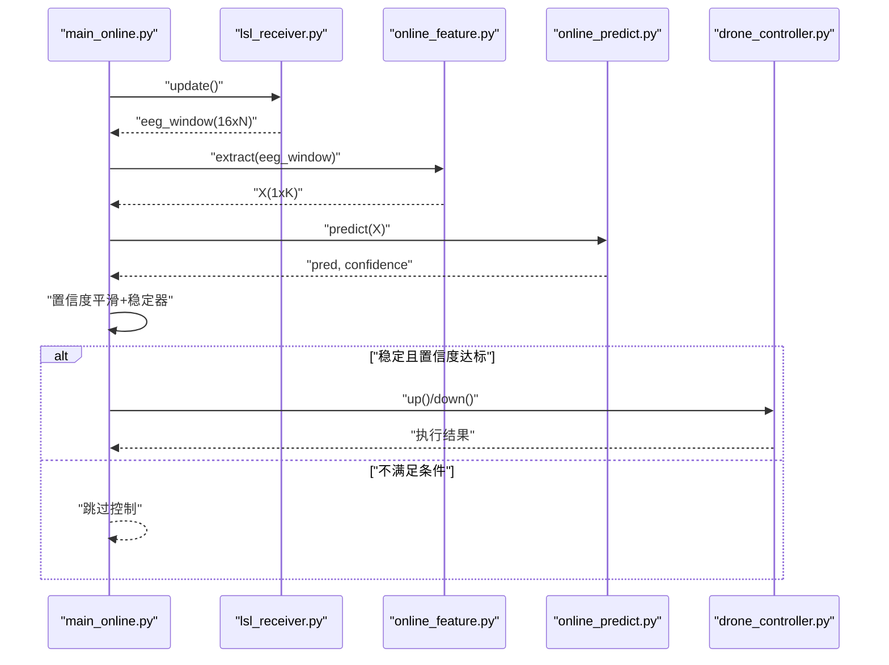

图表来源
- [main_online.py:54-97](file://paradigm/main_online.py#L54-L97)
- [lsl_receiver.py:23-32](file://paradigm/online/lsl_receiver.py#L23-L32)
- [online_feature.py:20-52](file://paradigm/online/online_feature.py#L20-L52)
- [online_predict.py:9-17](file://paradigm/online/online_predict.py#L9-L17)
- [drone_controller.py:5-13](file://paradigm/online/drone_controller.py#L5-L13)

## 详细组件分析

### 在线主循环与控制参数
- 关键参数：采样率、窗口长度、预测间隔、稳定器长度、置信度滑动窗口、阈值。
- 数据路径：LSL接收→零填充检测→基线校正→特征提取→预测→置信度平滑→稳定器→控制。
- 错误点：窗口未填满导致跳过、置信度阈值过高导致频繁跳过、稳定器长度过短导致误触发。

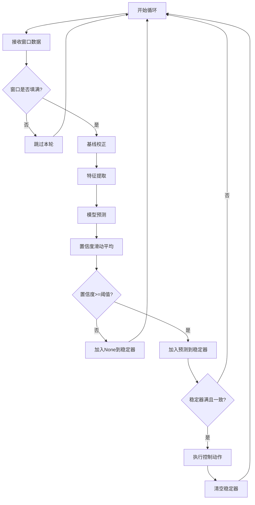

图表来源
- [main_online.py:54-97](file://paradigm/main_online.py#L54-L97)

章节来源
- [main_online.py:14-97](file://paradigm/main_online.py#L14-L97)

### LSL接收器
- 功能：解析并连接EEG LSL流，维护环形缓冲区，每次返回固定长度窗口。
- 关键点：流解析失败、通道数不匹配、采样率不一致、缓冲区滚动与写入位置。

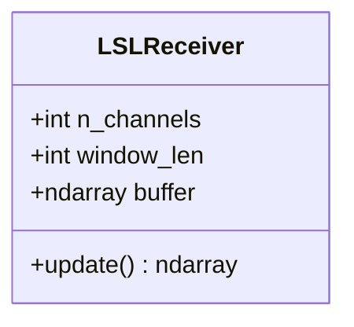

图表来源
- [lsl_receiver.py:6-32](file://paradigm/online/lsl_receiver.py#L6-L32)

章节来源
- [lsl_receiver.py:1-32](file://paradigm/online/lsl_receiver.py#L1-L32)

### 在线特征提取
- 流程：对每个频带执行带通滤波→CSP投影→取特征通道→方差对数域→拼接→互信息索引筛选→标准化。
- 关键点：滤波器阶数与相位失真、CSP协方差正则化、特征维度与模型不匹配。

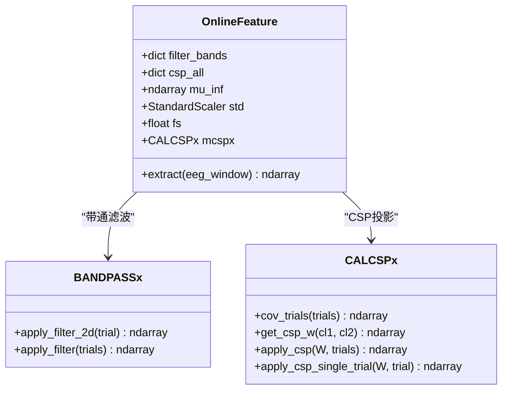

图表来源
- [online_feature.py:7-52](file://paradigm/online/online_feature.py#L7-L52)
- [bandpassx.py:7-79](file://paradigm/bandpassx.py#L7-L79)
- [calcspx.py:7-87](file://paradigm/calcspx.py#L7-L87)

章节来源
- [online_feature.py:1-52](file://paradigm/online/online_feature.py#L1-L52)
- [bandpassx.py:1-79](file://paradigm/bandpassx.py#L1-L79)
- [calcspx.py:1-87](file://paradigm/calcspx.py#L1-L87)

### 在线预测
- 功能：SVM分类器输出类别与最大概率（置信度），用于后续阈值化与稳定器。
- 关键点：模型pickle加载、特征维度一致性、概率阈值设定。

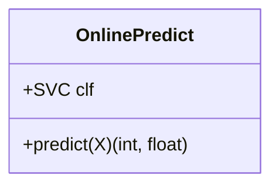

图表来源
- [online_predict.py:3-17](file://paradigm/online/online_predict.py#L3-L17)

章节来源
- [online_predict.py:1-17](file://paradigm/online/online_predict.py#L1-L17)

### 无人机控制器
- 功能：模拟器控制接口，打印动作名称，可扩展为真实硬件控制。
- 关键点：动作与标签对应关系、与上层稳定器的对接。

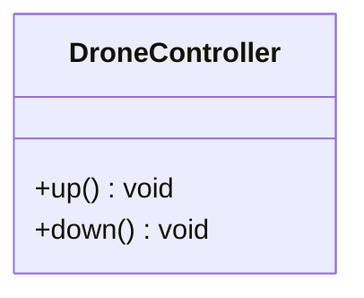

图表来源
- [drone_controller.py:3-13](file://paradigm/online/drone_controller.py#L3-L13)

章节来源
- [drone_controller.py:1-13](file://paradigm/online/drone_controller.py#L1-L13)

### 实时控制与UDP发送
- 功能：定时拉取新样本、实时滤波、特征提取、预测、阈值化与多数投票、UDP发送。
- 关键点：超时处理（信号丢失→悬停）、平滑窗口长度、发送端IP与端口配置。

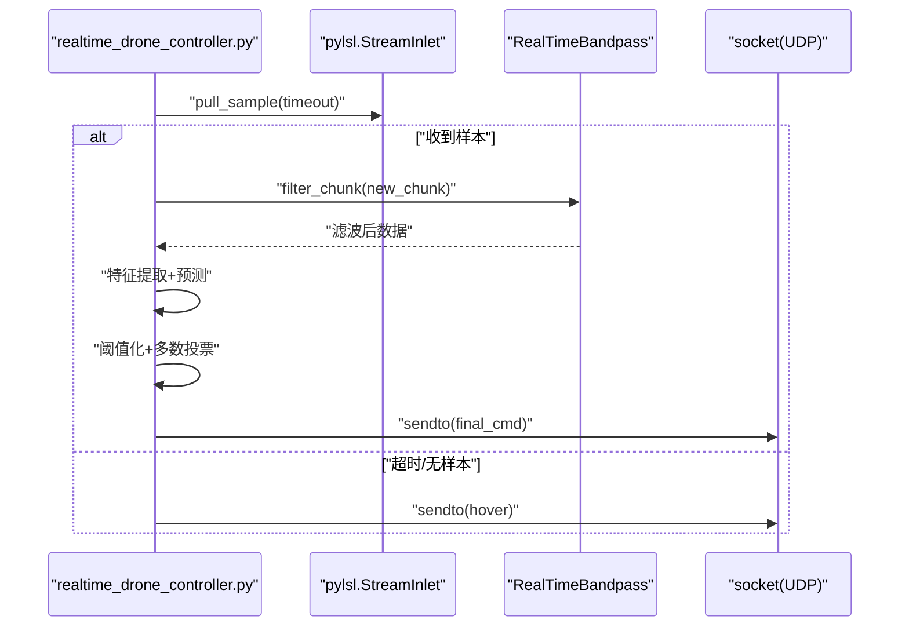

图表来源
- [realtime_drone_controller.py:59-121](file://paradigm/realtime_drone_controller.py#L59-L121)
- [realtime_filter.py:22-32](file://paradigm/realtime_filter.py#L22-L32)

章节来源
- [realtime_drone_controller.py:1-121](file://paradigm/realtime_drone_controller.py#L1-L121)
- [realtime_filter.py:1-32](file://paradigm/realtime_filter.py#L1-L32)

### 离线仿真与UDP回传
- 功能：加载模型与XDF数据，按步长提取特征与预测，统计有效决策、过滤数量与准确率，UDP发送并测量回传延迟。
- 关键点：步长计算、平滑窗口、置信度阈值、回传端口绑定与超时。

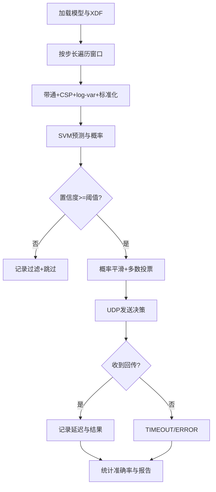

图表来源
- [offline_simulation.py:53-195](file://paradigm/offline_simulation.py#L53-L195)

章节来源
- [offline_simulation.py:1-195](file://paradigm/offline_simulation.py#L1-L195)

### 模拟LSL流
- 功能：将XDF数据转换为LSL流，便于离线联调与验证。
- 关键点：采样率与通道数匹配、推送节拍补偿、键盘中断停止。

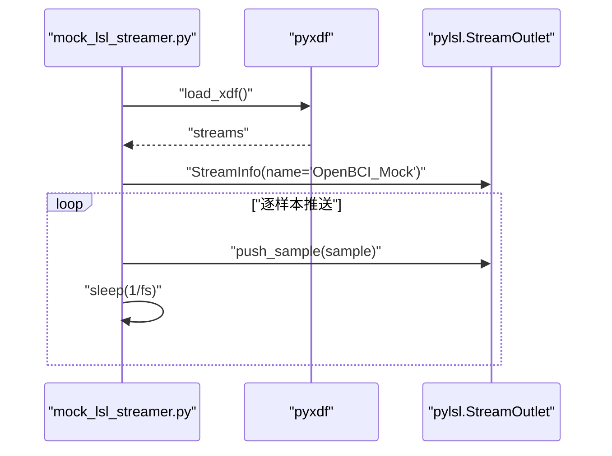

图表来源
- [mock_lsl_streamer.py:13-71](file://paradigm/mock_lsl_streamer.py#L13-L71)

章节来源
- [mock_lsl_streamer.py:1-71](file://paradigm/mock_lsl_streamer.py#L1-L71)

## 依赖分析
- 模块耦合：在线主循环依赖LSL接收、特征提取、预测与控制；实时控制独立于在线主循环，但共享特征与模型。
- 外部依赖：pylsl（LSL）、pyxdf（XDF读取）、numpy/scipy（信号处理）、scikit-learn（SVM与标准化）、matplotlib（可视化）。
- 潜在循环依赖：当前文件间无循环导入；注意实时控制中对实时滤波器的导入路径。

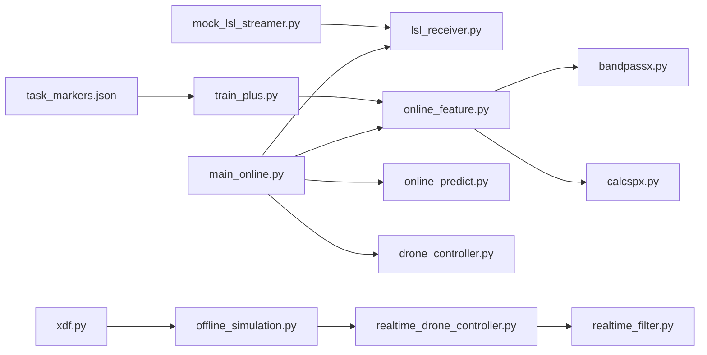

图表来源
- [main_online.py:8-11](file://paradigm/main_online.py#L8-L11)
- [realtime_drone_controller.py:9-10](file://paradigm/realtime_drone_controller.py#L9-L10)
- [offline_simulation.py:1-11](file://paradigm/offline_simulation.py#L1-L11)
- [mock_lsl_streamer.py:2-3](file://paradigm/mock_lsl_streamer.py#L2-L3)
- [online_feature.py:4-5](file://paradigm/online/online_feature.py#L4-L5)
- [bandpassx.py:1-4](file://paradigm/bandpassx.py#L1-L4)
- [calcspx.py:1-4](file://paradigm/calcspx.py#L1-L4)
- [train_plus.py:1-22](file://paradigm/train_plus.py#L1-L22)
- [xdf.py:1-3](file://paradigm/xdf.py#L1-L3)
- [task_markers.json:1-23](file://paradigm/task_markers.json#L1-L23)

章节来源
- [main_online.py:1-97](file://paradigm/main_online.py#L1-L97)
- [realtime_drone_controller.py:1-121](file://paradigm/realtime_drone_controller.py#L1-L121)
- [offline_simulation.py:1-195](file://paradigm/offline_simulation.py#L1-L195)
- [mock_lsl_streamer.py:1-71](file://paradigm/mock_lsl_streamer.py#L1-L71)
- [online_feature.py:1-52](file://paradigm/online/online_feature.py#L1-L52)
- [bandpassx.py:1-79](file://paradigm/bandpassx.py#L1-L79)
- [calcspx.py:1-87](file://paradigm/calcspx.py#L1-L87)
- [train_plus.py:1-213](file://paradigm/train_plus.py#L1-L213)
- [xdf.py:1-37](file://paradigm/xdf.py#L1-L37)
- [task_markers.json:1-23](file://paradigm/task_markers.json#L1-L23)

## 性能考虑
- 缓冲区与采样率：确保窗口长度与采样率匹配，避免零填充导致的特征不稳定。
- 预测频率：在线主循环sleep间隔与实时控制UPDATE_INTERVAL需与模型与网络延迟平衡。
- 平滑与稳定：置信度滑动窗口与稳定器长度影响响应速度与鲁棒性，需结合实验调优。
- 资源监控：关注CPU占用、内存增长（尤其是特征拼接与概率缓冲区）、网络发送超时。
- 实时滤波：逐通道因果滤波可降低相位延迟，但需维护每通道zi状态。

章节来源
- [main_online.py:44-49](file://paradigm/main_online.py#L44-L49)
- [realtime_drone_controller.py:17-18](file://paradigm/realtime_drone_controller.py#L17-L18)
- [realtime_filter.py:6-21](file://paradigm/realtime_filter.py#L6-L21)

## 故障排除指南

### 一、EEG信号质量问题
- 症状
  - 在线主循环跳过：窗口未填满导致持续continue。
  - 信号缺失：LSL接收超时或pull_sample返回None。
  - 基线漂移/噪声：特征不稳定、置信度波动大。
- 诊断与解决
  - 检查LSL流解析：确认EEG流存在且类型为“EEG”，通道数与模型一致。
  - 使用模拟LSL流：将XDF数据转为LSL流，验证特征与预测链路。
  - 基线校正：确认在线主循环中的基线校正步骤执行。
  - 可视化：使用PSD工具观察频谱，定位噪声与伪影。
  - 采样率：确保目标采样率与模型一致，模拟器与真实设备一致。

章节来源
- [main_online.py:58-64](file://paradigm/main_online.py#L58-L64)
- [lsl_receiver.py:10-16](file://paradigm/online/lsl_receiver.py#L10-L16)
- [mock_lsl_streamer.py:32-43](file://paradigm/mock_lsl_streamer.py#L32-L43)
- [plotsome.py:19-54](file://paradigm/plotsome.py#L19-L54)

### 二、模型预测错误
- 症状
  - 置信度低：多数预测被过滤。
  - 误判：稳定器触发但动作相反。
  - 特征不匹配：模型加载后维度不一致。
- 诊断与解决
  - 离线仿真：使用XDF数据离线重放，统计有效决策与准确率，调整置信度阈值和平滑窗口。
  - 标记映射：核对任务标记与训练时一致，确保窗口标注正确。
  - 特征一致性：确认带通频带、CSP特征索引、互信息筛选与模型保存一致。
  - 概率阈值：在线主循环与实时控制的阈值应协同设置，避免过严或过松。

章节来源
- [offline_simulation.py:128-178](file://paradigm/offline_simulation.py#L128-L178)
- [train_plus.py:194-210](file://paradigm/train_plus.py#L194-L210)
- [task_markers.json:12-13](file://paradigm/task_markers.json#L12-L13)

### 三、无人机控制异常
- 症状
  - 不响应：UDP未发送或目标端口未监听。
  - 抖动：阈值过低或平滑窗口过短。
  - 延迟大：网络拥塞或回传超时。
- 诊断与解决
  - UDP配置：核对目标IP与端口，确保实时控制与接收端一致。
  - 超时处理：信号丢失时发送悬停指令，避免长时间无响应。
  - 平滑策略：增大多数投票窗口，提高稳定性。
  - 回传测试：离线仿真中启用回传端口绑定与超时设置，评估端到端延迟。

章节来源
- [realtime_drone_controller.py:13-18](file://paradigm/realtime_drone_controller.py#L13-L18)
- [realtime_drone_controller.py:63-66](file://paradigm/realtime_drone_controller.py#L63-L66)
- [realtime_drone_controller.py:115-121](file://paradigm/realtime_drone_controller.py#L115-L121)
- [offline_simulation.py:54-70](file://paradigm/offline_simulation.py#L54-L70)
- [offline_simulation.py:153-171](file://paradigm/offline_simulation.py#L153-L171)

### 四、实时性能问题
- 症状
  - CPU占用高：特征提取与预测耗时过长。
  - 内存增长：概率缓冲区与历史数据累积。
  - 丢包/超时：网络发送端口未监听或防火墙阻断。
- 诊断与解决
  - 资源监控：使用系统监控工具观察CPU与内存，定位热点函数。
  - 缓冲区优化：合理设置窗口长度与步长，避免过度拷贝。
  - 并发访问：避免在多线程中共享可变状态，必要时加锁或使用队列。
  - 网络健壮性：增加发送端端口绑定与超时处理，减少阻塞。

章节来源
- [main_online.py:44-49](file://paradigm/main_online.py#L44-L49)
- [realtime_drone_controller.py:41-47](file://paradigm/realtime_drone_controller.py#L41-L47)
- [offline_simulation.py:59-69](file://paradigm/offline_simulation.py#L59-L69)

### 五、硬件兼容性问题
- 症状
  - LSL流解析失败：resolve_stream未找到EEG流。
  - 采样率不一致：模型与设备采样率不匹配。
  - 网络通信异常：UDP端口不可达或被拦截。
- 诊断与解决
  - LSL环境：确认LabStreamLayer安装与运行，流名称与类型正确。
  - 采样率：在模拟器与真实设备中统一采样率，确保模型pickle中的fs一致。
  - 网络：检查防火墙与路由器设置，确保UDP端口开放。

章节来源
- [lsl_receiver.py:10-16](file://paradigm/online/lsl_receiver.py#L10-L16)
- [mock_lsl_streamer.py:10-10](file://paradigm/mock_lsl_streamer.py#L10-L10)
- [realtime_drone_controller.py:13-15](file://paradigm/realtime_drone_controller.py#L13-L15)

### 六、软件层面问题排查
- 依赖版本冲突
  - 现象：导入失败、API变更、行为异常。
  - 解决：锁定关键库版本（pylsl、pyxdf、numpy、scipy、scikit-learn、matplotlib），使用虚拟环境隔离。
- 内存泄漏
  - 现象：长时间运行内存持续增长。
  - 解决：检查概率缓冲区与历史数据结构，及时清理；避免在循环中创建大对象。
- 并发访问问题
  - 现象：数据竞争、状态不一致。
  - 解决：使用线程安全的数据结构或锁；避免共享可变状态。

章节来源
- [debugPrinter.py:21-28](file://paradigm/debugPrinter.py#L21-L28)

### 七、性能优化建议
- 缓冲区大小调整
  - 在线主循环：根据模型窗口长度与采样率设置固定长度，避免零填充。
  - 实时控制：UPDATE_INTERVAL与步长样本数匹配，减少多余拷贝。
- 预测频率优化
  - 在线主循环：step_time与稳定器长度权衡响应与稳定。
  - 实时控制：PROB_THRESHOLD与SMOOTH_WINDOW协同，避免频繁切换。
- 资源使用监控
  - 使用系统监控工具观察CPU与内存；对特征提取与预测关键路径进行性能剖析。

章节来源
- [main_online.py:44-49](file://paradigm/main_online.py#L44-L49)
- [realtime_drone_controller.py:17-19](file://paradigm/realtime_drone_controller.py#L17-L19)

### 八、离线仿真与测试工具
- XDF离线验证
  - 使用离线仿真脚本加载XDF与模型，按步长提取特征与预测，统计有效决策与准确率。
  - 通过UDP发送与回传，测量端到端延迟，评估系统性能。
- 模拟LSL流
  - 将XDF数据转换为LSL流，便于离线联调与验证特征链路。
- 调试与可视化
  - 使用调试打印辅助定位调用位置。
  - 使用PSD工具观察频谱，辅助信号质量诊断。

章节来源
- [offline_simulation.py:12-195](file://paradigm/offline_simulation.py#L12-L195)
- [mock_lsl_streamer.py:13-71](file://paradigm/mock_lsl_streamer.py#L13-L71)
- [debugPrinter.py:21-28](file://paradigm/debugPrinter.py#L21-L28)
- [plotsome.py:19-54](file://paradigm/plotsome.py#L19-L54)

## 结论
本指南提供了从信号质量、模型预测、控制执行到实时性能与软硬件兼容性的系统性排障方法。建议以离线仿真与模拟LSL流为起点，逐步过渡到真实设备联调；通过参数调优与资源监控持续优化系统稳定性与响应速度。

## 附录
- 关键参数速查
  - 在线主循环：采样率、窗口长度、预测间隔、稳定器长度、置信度滑动窗口、阈值。
  - 实时控制：UDP目标IP与端口、概率阈值、更新间隔、平滑窗口。
- 常用工具
  - XDF查看：XDF元数据与标记解析。
  - 训练与模型：训练脚本与模型保存路径。
  - 标记映射：任务标记与事件代码对应关系。

章节来源
- [main_online.py:20-49](file://paradigm/main_online.py#L20-L49)
- [realtime_drone_controller.py:13-20](file://paradigm/realtime_drone_controller.py#L13-L20)
- [xdf.py:1-37](file://paradigm/xdf.py#L1-L37)
- [train_plus.py:194-210](file://paradigm/train_plus.py#L194-L210)
- [task_markers.json:1-23](file://paradigm/task_markers.json#L1-L23)