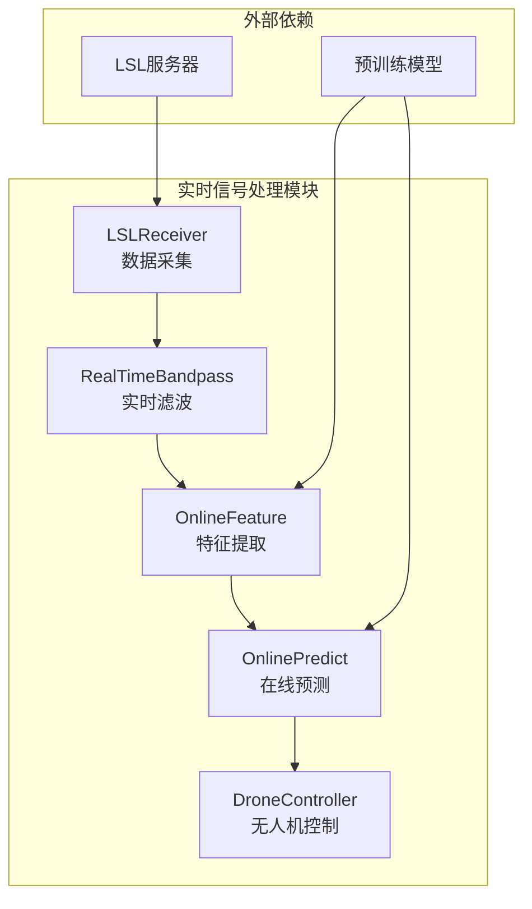
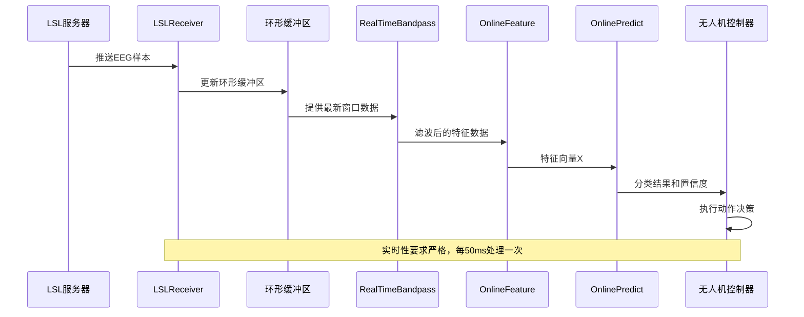
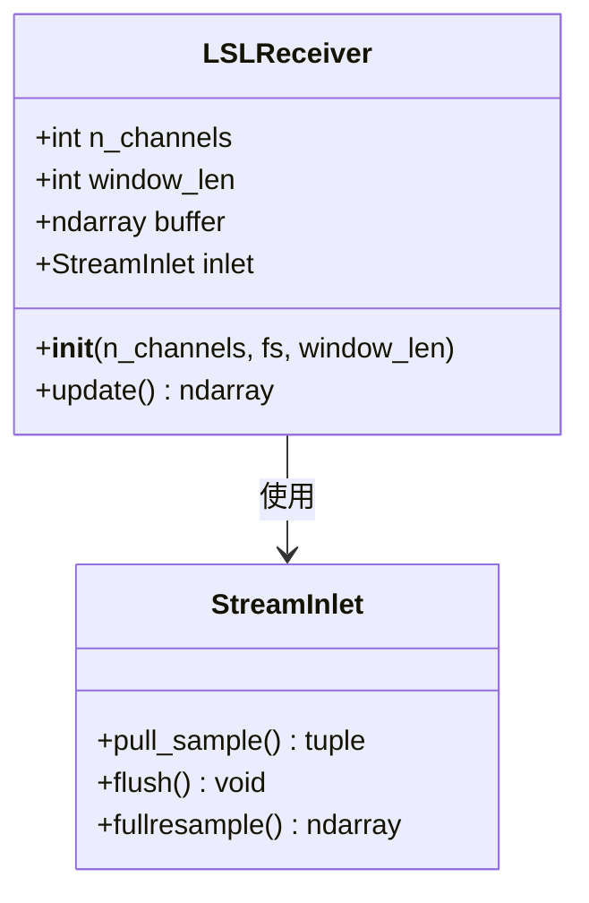
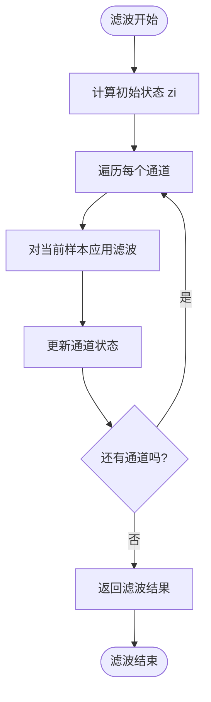
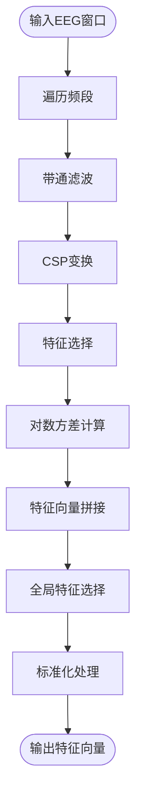
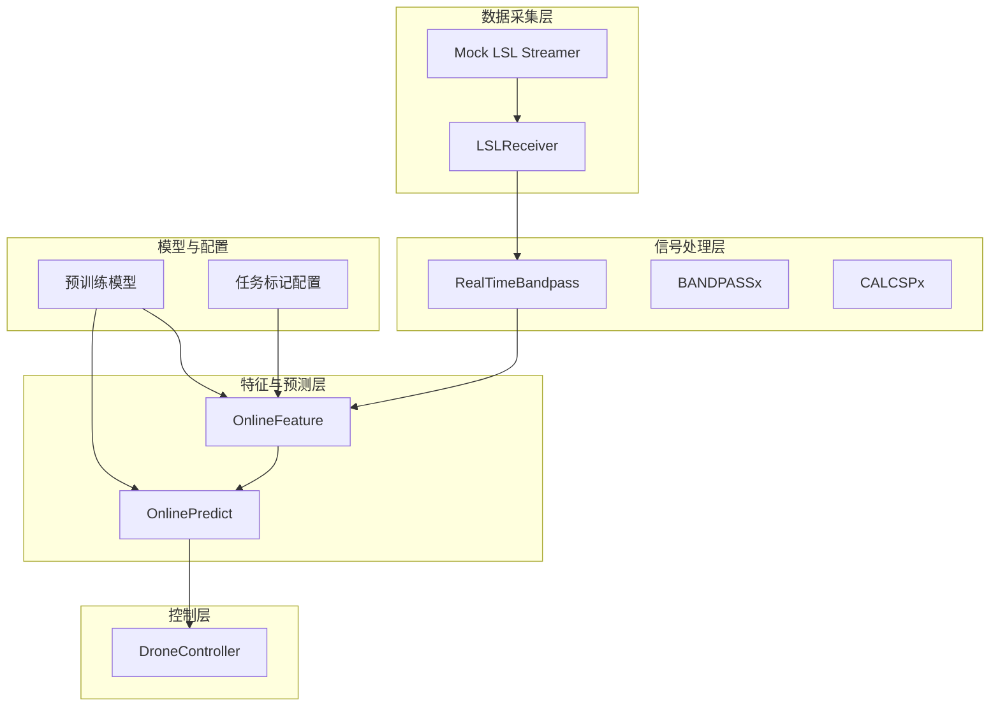

# 实时信号处理模块

<cite>
**本文档引用的文件**
- [paradigm/online/lsl_receiver.py](file://paradigm/online/lsl_receiver.py)
- [paradigm/realtime_filter.py](file://paradigm/realtime_filter.py)
- [paradigm/online/online_feature.py](file://paradigm/online/online_feature.py)
- [paradigm/online/online_predict.py](file://paradigm/online/online_predict.py)
- [paradigm/bandpassx.py](file://paradigm/bandpassx.py)
- [paradigm/calcspx.py](file://paradigm/calcspx.py)
- [paradigm/main_online.py](file://paradigm/main_online.py)
- [paradigm/mock_lsl_streamer.py](file://paradigm/mock_lsl_streamer.py)
- [paradigm/train_plus.py](file://paradigm/train_plus.py)
- [paradigm/task_markers.json](file://paradigm/task_markers.json)
</cite>

## 目录
1. [简介](#简介)
2. [项目结构](#项目结构)
3. [核心组件](#核心组件)
4. [架构概览](#架构概览)
5. [详细组件分析](#详细组件分析)
6. [依赖关系分析](#依赖关系分析)
7. [性能考虑](#性能考虑)
8. [故障排除指南](#故障排除指南)
9. [结论](#结论)
10. [附录](#附录)

## 简介
本文件为实时信号处理模块的详细技术文档，重点围绕LSLReceiver类的数据采集机制、缓冲区管理策略、实时滤波器实现以及完整的API参考。系统采用Lab Streaming Layer (LSL) 接口进行数据采集，结合带通滤波、CSP特征提取和SVM分类器实现脑机接口(BMI)的在线实时控制。

## 项目结构
实时信号处理模块位于paradigm目录下，主要包含以下子模块：
- 在线数据采集：LSLReceiver类负责从LSL流中获取实时EEG数据
- 实时滤波：RealTimeBandpass类提供因果滤波器实现
- 特征提取：OnlineFeature类整合多频段CSP特征
- 在线预测：OnlinePredict类进行实时分类决策
- 辅助工具：BANDPASSx、CALCSPx等滤波和特征计算组件
- 主程序：main_online.py实现完整的实时处理流水线

**图表来源**
- [paradigm/main_online.py:1-97](file://paradigm/main_online.py#L1-L97)
- [paradigm/online/lsl_receiver.py:1-32](file://paradigm/online/lsl_receiver.py#L1-L32)

**章节来源**
- [paradigm/main_online.py:1-97](file://paradigm/main_online.py#L1-L97)
- [paradigm/online/lsl_receiver.py:1-32](file://paradigm/online/lsl_receiver.py#L1-L32)

## 核心组件
本模块的核心组件包括数据采集、实时滤波、特征提取和在线预测四个主要部分，它们通过主程序main_online.py协调工作，形成完整的实时BMI控制系统。

**章节来源**
- [paradigm/online/lsl_receiver.py:1-32](file://paradigm/online/lsl_receiver.py#L1-L32)
- [paradigm/realtime_filter.py:1-32](file://paradigm/realtime_filter.py#L1-L32)
- [paradigm/online/online_feature.py:1-52](file://paradigm/online/online_feature.py#L1-L52)
- [paradigm/online/online_predict.py:1-17](file://paradigm/online/online_predict.py#L1-L17)

## 架构概览
系统采用流水线式架构，数据从LSL流采集开始，经过实时滤波、特征提取、分类预测，最终驱动无人机控制。整个流程具有严格的时序要求和实时性约束。

**图表来源**
- [paradigm/main_online.py:54-97](file://paradigm/main_online.py#L54-L97)
- [paradigm/online/lsl_receiver.py:23-32](file://paradigm/online/lsl_receiver.py#L23-L32)
- [paradigm/realtime_filter.py:22-32](file://paradigm/realtime_filter.py#L22-L32)

## 详细组件分析

### LSLReceiver类 - 数据采集与缓冲管理

LSLReceiver是实时信号处理的核心数据采集组件，负责建立LSL连接、接收数据流并维护环形缓冲区。

#### 数据采集机制
- **流发现与连接**：使用resolve_stream('type','EEG')自动发现EEG类型的LSL流
- **StreamInlet接口**：通过StreamInlet对象进行实时数据拉取
- **样本同步**：pull_sample()返回样本值和时间戳，确保数据同步性

#### 环形缓冲区实现
- **内存布局**：使用numpy数组存储(n_channels × window_len)的二维缓冲区
- **滚动更新**：np.roll(buffer,-1,axis=1)实现数据向左滚动一位
- **尾部写入**：将新样本写入最后一列，实现先进先出的数据管理

**图表来源**
- [paradigm/online/lsl_receiver.py:6-32](file://paradigm/online/lsl_receiver.py#L6-L32)

#### 缓冲区管理策略
- **内存复用**：预先分配固定大小的缓冲区，避免频繁内存分配
- **零填充检测**：通过检查首列是否全零判断缓冲区是否已填满
- **数据完整性**：确保每次update()返回完整的时间窗口数据

**章节来源**
- [paradigm/online/lsl_receiver.py:8-32](file://paradigm/online/lsl_receiver.py#L8-L32)

### RealTimeBandpass类 - 实时滤波器

RealTimeBandpass实现了因果滤波器，支持实时信号处理的连续性要求。

#### 滤波器设计
- **滤波器类型**：使用Butterworth带通滤波器
- **滤波器阶数**：4阶滤波器提供良好的频率响应特性
- **截止频率**：以奈奎斯特定理归一化的相对频率表示

#### 状态保持机制
- **初始状态计算**：使用lfilter_zi()计算稳态初始条件
- **通道独立处理**：为每个通道维护独立的状态向量zi
- **状态更新**：每次滤波后更新对应通道的状态

**图表来源**
- [paradigm/realtime_filter.py:6-32](file://paradigm/realtime_filter.py#L6-L32)

**章节来源**
- [paradigm/realtime_filter.py:6-32](file://paradigm/realtime_filter.py#L6-L32)

### OnlineFeature类 - 多频段特征提取

OnlineFeature类实现了基于CSP的多频段特征提取，是实时BMI系统的关键特征工程组件。

#### 多频段处理流程
- **频段扫描**：遍历预定义的频段范围(6-30Hz，步长2Hz)
- **带通滤波**：对每个频段应用BANDPASSx滤波器
- **CSP变换**：对每个频段应用CSP混合矩阵W
- **方差对数变换**：计算CSP特征的对数方差作为最终特征

#### 特征选择机制
- **CSP特征索引**：使用预定义的特征索引选择最具判别性的CSP分量
- **全局特征选择**：通过mutual_info_rank_use进行全局特征选择
- **标准化处理**：使用训练时计算的标准差进行特征标准化

**图表来源**
- [paradigm/online/online_feature.py:20-52](file://paradigm/online/online_feature.py#L20-L52)

**章节来源**
- [paradigm/online/online_feature.py:7-52](file://paradigm/online/online_feature.py#L7-L52)

### OnlinePredict类 - 实时分类预测

OnlinePredict类提供了简单的在线预测功能，基于训练好的SVM模型进行实时分类。

#### 预测流程
- **概率计算**：使用predict_proba()获取各类别的概率分布
- **置信度评估**：取最大概率值作为置信度指标
- **决策输出**：根据置信度阈值和稳定性窗口进行最终决策

**章节来源**
- [paradigm/online/online_predict.py:3-17](file://paradigm/online/online_predict.py#L3-L17)

## 依赖关系分析

**图表来源**
- [paradigm/main_online.py:8-39](file://paradigm/main_online.py#L8-L39)
- [paradigm/online/lsl_receiver.py:3-4](file://paradigm/online/lsl_receiver.py#L3-L4)
- [paradigm/realtime_filter.py:2-3](file://paradigm/realtime_filter.py#L2-L3)

**章节来源**
- [paradigm/main_online.py:1-97](file://paradigm/main_online.py#L1-L97)

## 性能考虑

### 实时性优化
- **采样间隔**：主循环设置为50ms间隔，平衡处理延迟和CPU负载
- **缓冲区预分配**：避免运行时内存分配开销
- **向量化操作**：充分利用NumPy的向量化计算能力

### 内存管理
- **固定缓冲区大小**：减少内存碎片化
- **状态向量复用**：滤波器状态在通道间共享
- **数据类型优化**：使用float32减少内存占用

### 算法复杂度
- **滤波复杂度**：O(n_channels × n_samples)的线性复杂度
- **特征提取**：主要瓶颈在于CSP变换和矩阵运算
- **预测复杂度**：SVM分类的常数时间复杂度

## 故障排除指南

### LSL连接问题
- **流发现失败**：检查LSL服务器是否正常运行，确认流类型为'EEG'
- **连接超时**：增加等待时间或检查网络连接
- **数据格式不匹配**：确认通道数量和采样率配置正确

### 实时性能问题
- **处理延迟过大**：检查CPU使用率，优化滤波器参数
- **内存泄漏**：确认缓冲区大小合理，避免频繁重新分配
- **数据丢失**：检查LSL服务器的推送频率和客户端处理速度

### 模型精度问题
- **特征选择不当**：调整CSP特征索引和全局特征选择参数
- **阈值设置不合理**：根据实际应用场景调整置信度阈值
- **数据预处理问题**：检查基线校正和标准化参数

**章节来源**
- [paradigm/main_online.py:54-97](file://paradigm/main_online.py#L54-L97)
- [paradigm/mock_lsl_streamer.py:13-71](file://paradigm/mock_lsl_streamer.py#L13-L71)

## 结论
实时信号处理模块通过精心设计的组件架构和优化策略，实现了从LSL数据采集到实时控制的完整流水线。LSLReceiver的高效数据采集、RealTimeBandpass的因果滤波、OnlineFeature的多频段特征提取以及OnlinePredict的稳定分类决策，共同构成了可靠的实时BMI系统。系统在保证实时性的同时，通过合理的内存管理和算法优化，确保了长期稳定运行。

## 附录

### API参考

#### LSLReceiver类
- **构造函数参数**：
  - n_channels: 通道数量（整数）
  - fs: 采样率（浮点数，Hz）
  - window_len: 缓冲区长度（整数，采样点数）

- **update()方法**：
  - 返回值：(n_channels × window_len)的numpy数组
  - 功能：获取最新样本并更新缓冲区

#### RealTimeBandpass类
- **构造函数参数**：
  - fs: 采样率（浮点数，Hz）
  - lo: 低频截止频率（浮点数，Hz）
  - hi: 高频截止频率（浮点数，Hz）
  - nchannels: 通道数量（整数）

- **filter_chunk()方法**：
  - 参数：(nchannels × nsamples)的numpy数组
  - 返回值：滤波后的相同尺寸数组

#### OnlineFeature类
- **构造函数参数**：
  - model: 包含训练模型参数的字典

- **extract()方法**：
  - 参数：(n_channels × window_len)的numpy数组
  - 返回值：(1 × n_features)的特征向量

#### OnlinePredict类
- **构造函数参数**：
  - model: 包含训练模型参数的字典

- **predict()方法**：
  - 参数：(1 × n_features)的特征向量
  - 返回值：(预测标签, 置信度)元组

### 配置参数说明

#### 主程序配置
- threshold: 置信度阈值（默认0.75）
- step_time: 预测间隔（默认0.05秒）
- stability_window: 稳定性窗口长度（默认3次）
- confidence_queue_len: 置信度滑动窗口（默认5次）

#### 模型配置
- fs: 采样率（125Hz）
- signal_win_start: 信号窗口起始时间（0.5秒）
- signal_win_end: 信号窗口结束时间（2.5秒）
- n_channels: 通道数量（16通道）

### 实际使用示例

#### 基本使用流程
1. 加载预训练模型
2. 初始化LSLReceiver
3. 初始化OnlineFeature和OnlinePredict
4. 进入主循环，调用update()获取数据
5. 进行特征提取和预测
6. 根据结果执行控制动作

#### 模拟数据流
使用mock_lsl_streamer.py可以模拟真实的LSL数据流，便于开发和测试环境搭建。

**章节来源**
- [paradigm/main_online.py:14-97](file://paradigm/main_online.py#L14-L97)
- [paradigm/mock_lsl_streamer.py:13-71](file://paradigm/mock_lsl_streamer.py#L13-L71)