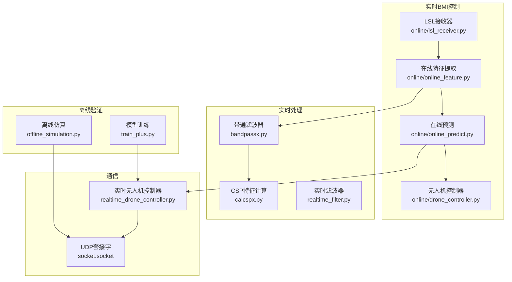
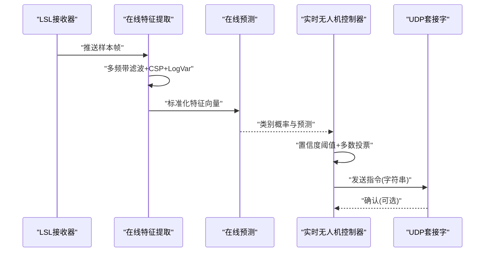
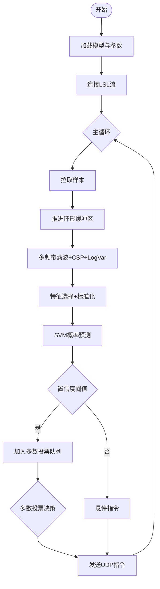
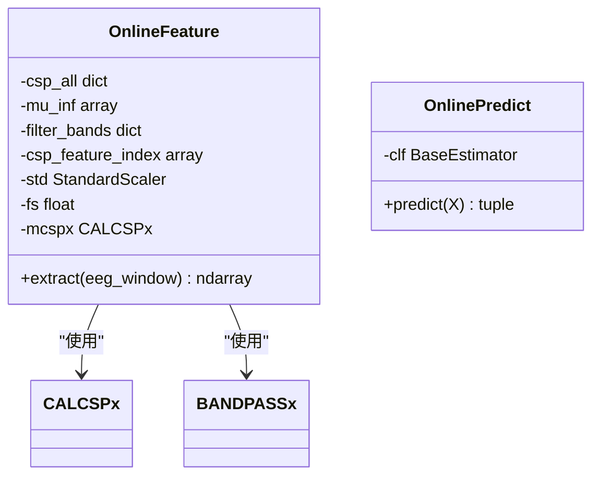
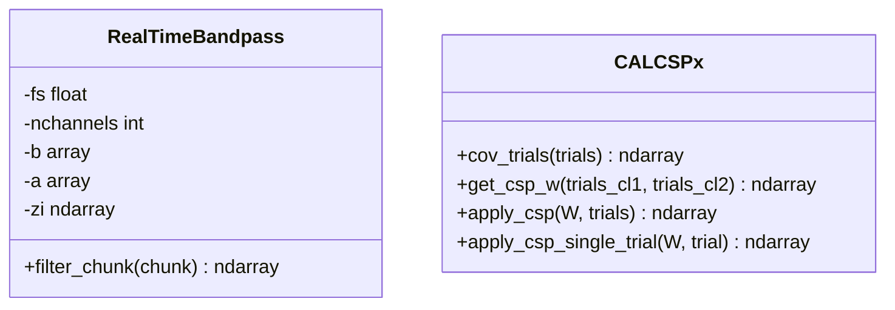
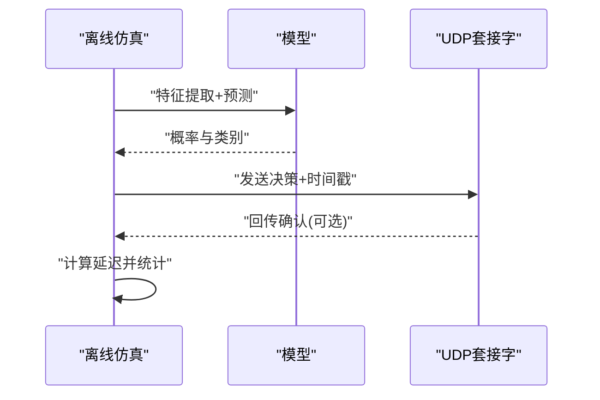
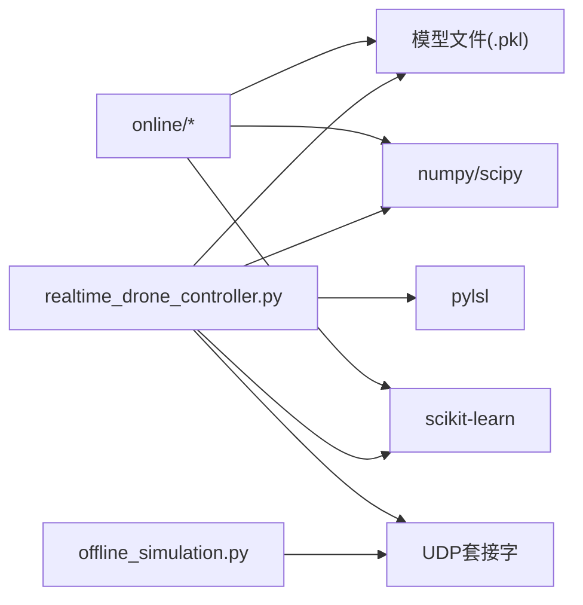

# 无人机控制模块

<cite>
**本文引用的文件**
- [paradigm/realtime_drone_controller.py](file://paradigm/realtime_drone_controller.py)
- [paradigm/online/drone_controller.py](file://paradigm/online/drone_controller.py)
- [paradigm/online/lsl_receiver.py](file://paradigm/online/lsl_receiver.py)
- [paradigm/online/online_feature.py](file://paradigm/online/online_feature.py)
- [paradigm/online/online_predict.py](file://paradigm/online/online_predict.py)
- [paradigm/calcspx.py](file://paradigm/calcspx.py)
- [paradigm/bandpassx.py](file://paradigm/bandpassx.py)
- [paradigm/realtime_filter.py](file://paradigm/realtime_filter.py)
- [paradigm/main_online.py](file://paradigm/main_online.py)
- [paradigm/offline_simulation.py](file://paradigm/offline_simulation.py)
- [paradigm/train_plus.py](file://paradigm/train_plus.py)
- [paradigm/task_markers.json](file://paradigm/task_markers.json)
- [paradigm/xdf.py](file://paradigm/xdf.py)
- [paradigm/mock_lsl_streamer.py](file://paradigm/mock_lsl_streamer.py)
</cite>

## 目录
1. [简介](#简介)
2. [项目结构](#项目结构)
3. [核心组件](#核心组件)
4. [架构总览](#架构总览)
5. [详细组件分析](#详细组件分析)
6. [依赖关系分析](#依赖关系分析)
7. [性能考虑](#性能考虑)
8. [故障排查指南](#故障排查指南)
9. [结论](#结论)
10. [附录](#附录)

## 简介
本技术文档聚焦于无人机控制模块，围绕实时脑机接口(BMI)控制无人机的完整链路展开，涵盖以下重点：
- 控制指令生成机制：从意图识别到控制命令的映射、动作编码规则与指令格式规范
- UDP通信协议：网络连接建立、数据包格式设计与通信安全机制
- 实时控制系统：控制循环、状态管理、异常处理与安全保护
- API参考：控制命令发送方法、状态查询接口与错误码定义
- 测试与评估：控制精度测试、响应延迟测量与系统稳定性分析

## 项目结构
本仓库中与无人机控制密切相关的模块主要位于 paradigm 目录，核心文件如下：
- 实时控制主程序：paradigm/realtime_drone_controller.py
- 在线控制示例：paradigm/main_online.py、paradigm/online/drone_controller.py
- LSL数据接收：paradigm/online/lsl_receiver.py
- 特征与预测：paradigm/online/online_feature.py、paradigm/online/online_predict.py
- 滤波与CSP：paradigm/bandpassx.py、paradigm/calcspx.py、paradigm/realtime_filter.py
- 离线仿真与验证：paradigm/offline_simulation.py
- 训练与模型：paradigm/train_plus.py
- 其他辅助：paradigm/task_markers.json、paradigm/xdf.py、paradigm/mock_lsl_streamer.py

图表来源
- [paradigm/realtime_drone_controller.py:1-121](file://paradigm/realtime_drone_controller.py#L1-L121)
- [paradigm/online/lsl_receiver.py:1-32](file://paradigm/online/lsl_receiver.py#L1-L32)
- [paradigm/online/online_feature.py:1-52](file://paradigm/online/online_feature.py#L1-L52)
- [paradigm/online/online_predict.py:1-17](file://paradigm/online/online_predict.py#L1-L17)
- [paradigm/bandpassx.py:1-79](file://paradigm/bandpassx.py#L1-L79)
- [paradigm/calcspx.py:1-87](file://paradigm/calcspx.py#L1-L87)
- [paradigm/realtime_filter.py:1-32](file://paradigm/realtime_filter.py#L1-L32)
- [paradigm/offline_simulation.py:1-195](file://paradigm/offline_simulation.py#L1-L195)
- [paradigm/train_plus.py:1-213](file://paradigm/train_plus.py#L1-L213)

章节来源
- [paradigm/realtime_drone_controller.py:1-121](file://paradigm/realtime_drone_controller.py#L1-L121)
- [paradigm/main_online.py:1-97](file://paradigm/main_online.py#L1-L97)

## 核心组件
- DroneController：在线控制示例中的无人机动作封装，提供上/下动作接口，便于与实时控制链路集成。
- LSLReceiver：从LSL流中拉取单样本，维护环形缓冲区，供特征提取使用。
- OnlineFeature：基于多频带带通滤波与CSP+LogVar特征的在线特征提取流水线。
- OnlinePredict：基于训练模型进行概率预测与类别决策。
- RealTimeBandpass：为实时处理维护滤波器状态，保证因果性与稳定性。
- realtime_drone_controller：实时BMI控制主程序，负责模型加载、特征提取、预测、指令平滑与UDP发送。
- offline_simulation：离线仿真与延迟测量，验证控制策略与通信链路。
- train_plus：模型训练与特征工程，产出可用于实时推理的模型文件。

章节来源
- [paradigm/online/drone_controller.py:1-13](file://paradigm/online/drone_controller.py#L1-L13)
- [paradigm/online/lsl_receiver.py:1-32](file://paradigm/online/lsl_receiver.py#L1-L32)
- [paradigm/online/online_feature.py:1-52](file://paradigm/online/online_feature.py#L1-L52)
- [paradigm/online/online_predict.py:1-17](file://paradigm/online/online_predict.py#L1-L17)
- [paradigm/realtime_drone_controller.py:1-121](file://paradigm/realtime_drone_controller.py#L1-L121)
- [paradigm/offline_simulation.py:1-195](file://paradigm/offline_simulation.py#L1-L195)
- [paradigm/train_plus.py:1-213](file://paradigm/train_plus.py#L1-L213)

## 架构总览
实时控制链路由“感知—特征—预测—动作—通信”构成闭环，核心流程如下：
- 数据采集：通过LSL接收器持续拉取样本，维护固定长度的时窗缓冲。
- 特征提取：对每个频带进行带通滤波，应用CSP投影，计算每频带的对数方差特征，拼接后进行特征选择与标准化。
- 分类预测：使用SVM模型输出类别概率，结合置信度阈值与多数投票策略生成稳定指令。
- 动作执行：将最终指令发送至UDP端口，驱动无人机或模拟器执行对应动作。
- 反馈与验证：离线仿真可记录发送时间并测量往返延迟，评估系统性能。

图表来源
- [paradigm/realtime_drone_controller.py:59-121](file://paradigm/realtime_drone_controller.py#L59-L121)
- [paradigm/online/online_feature.py:20-52](file://paradigm/online/online_feature.py#L20-L52)
- [paradigm/online/online_predict.py:9-17](file://paradigm/online/online_predict.py#L9-L17)

## 详细组件分析

### 实时无人机控制器（实时BMI主程序）
- 模型加载与参数初始化：加载预训练模型，解析采样率、信号窗长、CSP特征索引与滤波频带等配置。
- LSL流连接：解析并连接EEG LSL流，准备实时数据接入。
- 缓冲与步进：维护通道数×样本数的环形缓冲区，按UPDATE_INTERVAL步进收集数据块。
- 特征提取与预测：对每个频带进行实时滤波，计算CSP特征与对数方差，拼接后标准化并预测类别概率。
- 安全控制：仅当最大概率超过阈值时才输出有效指令，否则发送悬停。
- 指令平滑：使用多数投票队列平滑输出，减少抖动。
- UDP通信：将最终指令编码为UTF-8字符串并通过UDP发送至指定IP与端口。

图表来源
- [paradigm/realtime_drone_controller.py:21-121](file://paradigm/realtime_drone_controller.py#L21-L121)

章节来源
- [paradigm/realtime_drone_controller.py:1-121](file://paradigm/realtime_drone_controller.py#L1-L121)

### 在线特征提取与预测
- OnlineFeature：遍历滤波频带，对当前窗口进行带通滤波，应用CSP投影，提取每频带对数方差特征，拼接后进行特征选择与标准化。
- OnlinePredict：对输入特征进行SVM概率预测，返回类别与置信度。

图表来源
- [paradigm/online/online_feature.py:1-52](file://paradigm/online/online_feature.py#L1-L52)
- [paradigm/online/online_predict.py:1-17](file://paradigm/online/online_predict.py#L1-L17)
- [paradigm/calcspx.py:1-87](file://paradigm/calcspx.py#L1-L87)
- [paradigm/bandpassx.py:1-79](file://paradigm/bandpassx.py#L1-L79)

章节来源
- [paradigm/online/online_feature.py:1-52](file://paradigm/online/online_feature.py#L1-L52)
- [paradigm/online/online_predict.py:1-17](file://paradigm/online/online_predict.py#L1-L17)

### 实时滤波器与CSP工具
- RealTimeBandpass：为每个通道维护滤波器状态，逐通道因果滤波，保证实时性与稳定性。
- CALCSPx：提供协方差计算、CSP混合矩阵求解与特征投影功能，支持单次试验与批量试验两种模式。

图表来源
- [paradigm/realtime_filter.py:1-32](file://paradigm/realtime_filter.py#L1-L32)
- [paradigm/calcspx.py:1-87](file://paradigm/calcspx.py#L1-L87)

章节来源
- [paradigm/realtime_filter.py:1-32](file://paradigm/realtime_filter.py#L1-L32)
- [paradigm/calcspx.py:1-87](file://paradigm/calcspx.py#L1-L87)

### 离线仿真与延迟测量
- offline_simulation：加载模型与XDF标注，按固定步长提取特征并预测，记录原始预测与最终决策，同时通过UDP发送消息并测量往返延迟，统计准确率与过滤次数。

图表来源
- [paradigm/offline_simulation.py:53-195](file://paradigm/offline_simulation.py#L53-L195)

章节来源
- [paradigm/offline_simulation.py:1-195](file://paradigm/offline_simulation.py#L1-L195)

### 在线控制示例（main_online）
- main_online：演示从LSL接收、特征提取、预测到动作执行的完整流程，包含置信度滑动平均与稳定器，仅在连续一致且置信度达标时执行动作。

章节来源
- [paradigm/main_online.py:1-97](file://paradigm/main_online.py#L1-L97)

## 依赖关系分析
- 模块耦合
  - realtime_drone_controller 依赖模型文件、实时滤波器与LSL流；通过UDP与外部设备通信。
  - online_* 模块与训练产物强耦合，需保持特征维度与标准化参数一致。
- 外部依赖
  - pylsl：LSL数据流解析与接收
  - numpy/scipy：信号处理与数值计算
  - scikit-learn：SVM分类与标准化
- 循环与状态
  - 主循环持续运行，依赖缓冲区与队列维持状态；异常时发送悬停指令保障安全。

图表来源
- [paradigm/realtime_drone_controller.py:1-121](file://paradigm/realtime_drone_controller.py#L1-L121)
- [paradigm/offline_simulation.py:1-195](file://paradigm/offline_simulation.py#L1-L195)
- [paradigm/main_online.py:1-97](file://paradigm/main_online.py#L1-L97)

章节来源
- [paradigm/realtime_drone_controller.py:1-121](file://paradigm/realtime_drone_controller.py#L1-L121)
- [paradigm/offline_simulation.py:1-195](file://paradigm/offline_simulation.py#L1-L195)
- [paradigm/main_online.py:1-97](file://paradigm/main_online.py#L1-L97)

## 性能考虑
- 控制刷新率：UPDATE_INTERVAL决定每轮处理周期，直接影响响应速度与CPU占用。步长步进(UPDATE_INTERVAL×fs)确保每次处理的数据量稳定。
- 指令平滑：SMOOTH_WINDOW越大越稳定但响应越慢；多数投票可显著降低误触发。
- 特征与预测：特征拼接与标准化在实时链路中应尽量避免重复计算；可考虑缓存中间结果。
- 通信开销：UDP为无连接协议，发送开销小；建议在接收端设置超时与重试策略以提升鲁棒性。
- 稳定性：当LSL流断开或信号丢失时，立即发送悬停指令，避免漂移。

## 故障排查指南
- LSL流无法连接
  - 现象：提示流不存在或连接失败
  - 排查：确认LSL服务运行、流名称匹配、采样率一致
  - 参考：[paradigm/realtime_drone_controller.py:49-53](file://paradigm/realtime_drone_controller.py#L49-L53)
- 信号丢失
  - 现象：打印警告并发送悬停
  - 排查：检查电极阻抗、采样线缆、放大器供电
  - 参考：[paradigm/realtime_drone_controller.py:63-66](file://paradigm/realtime_drone_controller.py#L63-L66)
- UDP发送失败
  - 现象：指令未到达设备
  - 排查：确认目标IP/端口、防火墙、网络连通性
  - 参考：[paradigm/realtime_drone_controller.py:120-121](file://paradigm/realtime_drone_controller.py#L120-L121)
- 指令不生效
  - 现象：无人机无响应
  - 排查：检查设备端是否监听相同端口、指令字符串是否匹配
  - 参考：[paradigm/realtime_drone_controller.py:109-111](file://paradigm/realtime_drone_controller.py#L109-L111)
- 置信度阈值不当
  - 现象：频繁悬停或误触发
  - 排查：调整PROB_THRESHOLD与多数投票窗口，结合离线仿真验证
  - 参考：[paradigm/realtime_drone_controller.py:17-19](file://paradigm/realtime_drone_controller.py#L17-L19)

章节来源
- [paradigm/realtime_drone_controller.py:49-66](file://paradigm/realtime_drone_controller.py#L49-L66)
- [paradigm/realtime_drone_controller.py:109-121](file://paradigm/realtime_drone_controller.py#L109-L121)

## 结论
本模块实现了从脑电信号到无人机控制的端到端实时链路，具备以下特点：
- 明确的控制指令生成机制：基于SVM概率阈值与多数投票策略，确保动作稳定性
- 规范的UDP通信：简洁的字符串指令格式，易于扩展与跨平台移植
- 完整的安全保护：信号丢失自动悬停、阈值化与平滑策略降低误操作风险
- 可验证的性能：离线仿真提供延迟测量与准确率统计，便于系统优化

## 附录

### 控制指令生成机制与API参考
- 指令映射
  - up：上升
  - down：下降
  - hover：悬停
- 动作编码规则
  - 字符串编码，UTF-8传输
  - 仅当最大概率≥阈值时输出有效指令，否则输出悬停
- 指令格式规范
  - 单条UDP数据包仅包含一个指令字符串
  - 建议在设备端增加ACK回传以实现可靠通信
- 发送方法
  - UDP发送：将最终指令字符串编码后发送至目标IP与端口
  - 参考：[paradigm/realtime_drone_controller.py:120-121](file://paradigm/realtime_drone_controller.py#L120-L121)
- 状态查询接口
  - 当前概率与指令：打印日志中包含概率与最终指令
  - 参考：[paradigm/realtime_drone_controller.py:118](file://paradigm/realtime_drone_controller.py#L118)
- 错误码定义
  - 无显式错误码：采用字符串指令与日志提示
  - 建议扩展：定义统一错误码与状态枚举，便于上层监控

章节来源
- [paradigm/realtime_drone_controller.py:108-121](file://paradigm/realtime_drone_controller.py#L108-L121)

### UDP通信协议实现细节
- 网络连接建立
  - 服务器端：监听指定端口等待指令
  - 客户端：UDP发送指令，无需握手
- 数据包格式设计
  - 指令字符串：如“up”、“down”、“hover”
  - 可扩展：在离线仿真中采用“类别,时间戳”的复合格式，便于延迟测量
  - 参考：[paradigm/offline_simulation.py:154-158](file://paradigm/offline_simulation.py#L154-L158)
- 通信安全机制
  - 无加密与鉴权：建议在局域网内部署并限制访问源
  - 建议：增加校验和或轻量认证，防止误发

章节来源
- [paradigm/realtime_drone_controller.py:41](file://paradigm/realtime_drone_controller.py#L41)
- [paradigm/offline_simulation.py:55-71](file://paradigm/offline_simulation.py#L55-L71)

### 实时控制系统架构设计
- 控制循环
  - 拉取样本→推进缓冲→特征提取→预测→阈值化→多数投票→发送UDP
  - 参考：[paradigm/realtime_drone_controller.py:59-121](file://paradigm/realtime_drone_controller.py#L59-L121)
- 状态管理
  - 环形缓冲区：存储固定长度的历史数据
  - 指令队列：存放最近N次有效指令，用于多数投票
  - 参考：[paradigm/realtime_drone_controller.py:43-47](file://paradigm/realtime_drone_controller.py#L43-L47)
- 异常处理与安全保护
  - 信号丢失：发送悬停
  - 置信度不足：发送悬停
  - 参考：[paradigm/realtime_drone_controller.py:63-66](file://paradigm/realtime_drone_controller.py#L63-L66)

章节来源
- [paradigm/realtime_drone_controller.py:43-66](file://paradigm/realtime_drone_controller.py#L43-L66)

### 测试与评估方法
- 控制精度测试
  - 使用离线仿真对比最终决策与真实标签，统计准确率
  - 参考：[paradigm/offline_simulation.py:142-152](file://paradigm/offline_simulation.py#L142-L152)
- 响应延迟测量
  - 发送端记录发送时间，接收端回传确认，计算往返延迟
  - 参考：[paradigm/offline_simulation.py:153-168](file://paradigm/offline_simulation.py#L153-L168)
- 系统稳定性分析
  - 通过多数投票窗口与置信度阈值调节，观察误触发与悬停频率
  - 参考：[paradigm/realtime_drone_controller.py:17-19](file://paradigm/realtime_drone_controller.py#L17-L19)

章节来源
- [paradigm/offline_simulation.py:142-168](file://paradigm/offline_simulation.py#L142-L168)
- [paradigm/realtime_drone_controller.py:17-19](file://paradigm/realtime_drone_controller.py#L17-L19)