# 核心模块详解

<cite>
**本文引用的文件**
- [paradigm/online/lsl_receiver.py](file://paradigm/online/lsl_receiver.py)
- [paradigm/online/online_feature.py](file://paradigm/online/online_feature.py)
- [paradigm/online/online_predict.py](file://paradigm/online/online_predict.py)
- [paradigm/online/drone_controller.py](file://paradigm/online/drone_controller.py)
- [paradigm/realtime_filter.py](file://paradigm/realtime_filter.py)
- [paradigm/bandpassx.py](file://paradigm/bandpassx.py)
- [paradigm/calcspx.py](file://paradigm/calcspx.py)
- [paradigm/main_online.py](file://paradigm/main_online.py)
- [paradigm/realtime_drone_controller.py](file://paradigm/realtime_drone_controller.py)
- [paradigm/mock_lsl_streamer.py](file://paradigm/mock_lsl_streamer.py)
- [paradigm/train.py](file://paradigm/train.py)
- [paradigm/offline_simulation.py](file://paradigm/offline_simulation.py)
- [paradigm/task_markers.json](file://paradigm/task_markers.json)
</cite>

## 目录
1. [简介](#简介)
2. [项目结构](#项目结构)
3. [核心组件](#核心组件)
4. [架构总览](#架构总览)
5. [详细组件分析](#详细组件分析)
6. [依赖关系分析](#依赖关系分析)
7. [性能考虑](#性能考虑)
8. [故障排查指南](#故障排查指南)
9. [结论](#结论)
10. [附录](#附录)

## 简介
本文件面向BCI系统的核心模块，提供从数据采集、特征工程、在线预测到无人机控制的完整技术文档。重点覆盖：
- LSL数据接收器的数据采集机制、缓冲区管理与同步策略
- OnlineFeature的CSP特征提取算法、多频带滤波与特征工程流程
- OnlinePredict的SVM分类器使用、置信度计算与决策逻辑
- DroneController的控制指令生成、UDP通信协议与安全保护机制
- 实时滤波器的实现细节、带通滤波器设计原理与CSP算法数学基础
- 各模块API参考、参数配置与性能优化建议

## 项目结构
本项目采用按功能域分层组织：paradigm目录下包含在线推理、离线训练、实时滤波、CSP工具、主控循环等模块。核心在线流水线由数据接收、特征提取、预测与控制组成。

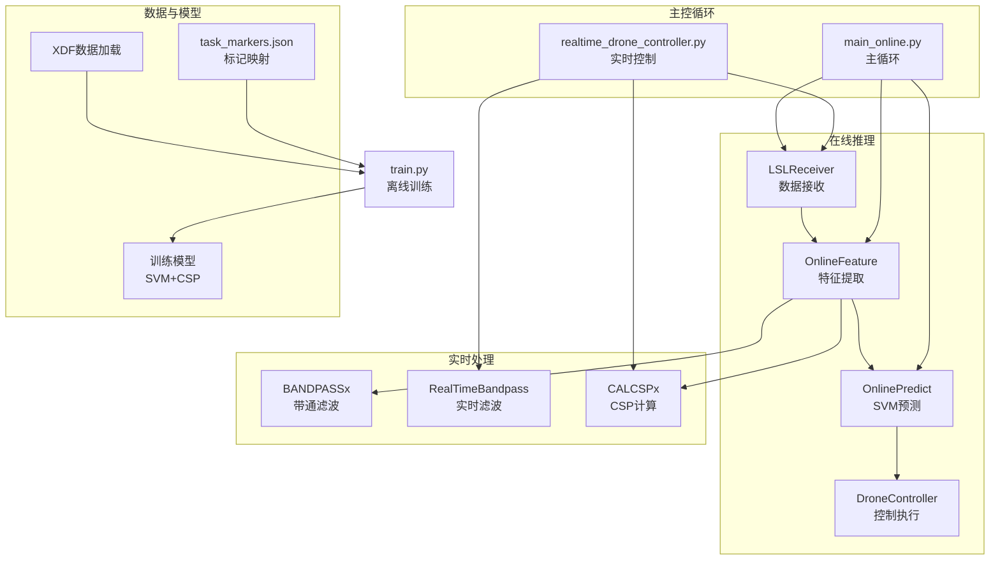

图表来源
- [paradigm/main_online.py:1-97](file://paradigm/main_online.py#L1-L97)
- [paradigm/realtime_drone_controller.py:1-121](file://paradigm/realtime_drone_controller.py#L1-L121)
- [paradigm/online/lsl_receiver.py:1-32](file://paradigm/online/lsl_receiver.py#L1-L32)
- [paradigm/online/online_feature.py:1-52](file://paradigm/online/online_feature.py#L1-L52)
- [paradigm/online/online_predict.py:1-17](file://paradigm/online/online_predict.py#L1-L17)
- [paradigm/online/drone_controller.py:1-13](file://paradigm/online/drone_controller.py#L1-L13)
- [paradigm/bandpassx.py:1-79](file://paradigm/bandpassx.py#L1-L79)
- [paradigm/realtime_filter.py:1-32](file://paradigm/realtime_filter.py#L1-L32)
- [paradigm/calcspx.py:1-87](file://paradigm/calcspx.py#L1-L87)
- [paradigm/train.py:1-201](file://paradigm/train.py#L1-L201)
- [paradigm/task_markers.json:1-23](file://paradigm/task_markers.json#L1-L23)

章节来源
- [paradigm/main_online.py:1-97](file://paradigm/main_online.py#L1-L97)
- [paradigm/realtime_drone_controller.py:1-121](file://paradigm/realtime_drone_controller.py#L1-L121)

## 核心组件
- LSL数据接收器：解析LSL流，维护环形缓冲区，提供固定窗口的EEG片段
- OnlineFeature：多频带带通滤波、CSP投影、方差对数特征、特征选择与标准化
- OnlinePredict：SVM分类器预测与置信度提取
- DroneController：模拟器控制接口（可扩展为UDP通信）
- 实时滤波器：IIR带通滤波，通道独立状态保持
- CSP工具：协方差估计、广义瑞利特征值分解、CSP混合矩阵与投影
- 主控循环：阈值与稳定器、滑动平均置信度、多数投票与控制执行

章节来源
- [paradigm/online/lsl_receiver.py:1-32](file://paradigm/online/lsl_receiver.py#L1-L32)
- [paradigm/online/online_feature.py:1-52](file://paradigm/online/online_feature.py#L1-L52)
- [paradigm/online/online_predict.py:1-17](file://paradigm/online/online_predict.py#L1-L17)
- [paradigm/online/drone_controller.py:1-13](file://paradigm/online/drone_controller.py#L1-L13)
- [paradigm/realtime_filter.py:1-32](file://paradigm/realtime_filter.py#L1-L32)
- [paradigm/calcspx.py:1-87](file://paradigm/calcspx.py#L1-L87)

## 架构总览
在线流水线从LSL流读取样本，写入环形缓冲区，按频带滤波与CSP投影，提取对数方差特征，经过特征选择与标准化后交由SVM分类器，结合置信度阈值与稳定器产生控制指令，最终通过UDP发送至无人机或模拟器。

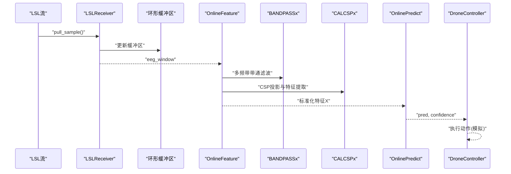

图表来源
- [paradigm/online/lsl_receiver.py:1-32](file://paradigm/online/lsl_receiver.py#L1-L32)
- [paradigm/online/online_feature.py:1-52](file://paradigm/online/online_feature.py#L1-L52)
- [paradigm/bandpassx.py:1-79](file://paradigm/bandpassx.py#L1-L79)
- [paradigm/calcspx.py:1-87](file://paradigm/calcspx.py#L1-L87)
- [paradigm/online/online_predict.py:1-17](file://paradigm/online/online_predict.py#L1-L17)
- [paradigm/online/drone_controller.py:1-13](file://paradigm/online/drone_controller.py#L1-L13)

## 详细组件分析

### LSL数据接收器（LSLReceiver）
- 功能：解析并连接EEG LSL流，维护n通道、window_len长度的环形缓冲区，按样本更新末列
- 关键点：
  - 使用resolve_stream查找EEG流并创建StreamInlet
  - 缓冲区初始化为全零，每次更新通过左移与末位覆盖实现滑动窗口
  - 返回当前窗口供后续特征提取使用
- 同步策略：基于pull_sample的逐样本推进，配合主循环中的窗口填满检测保证稳定性

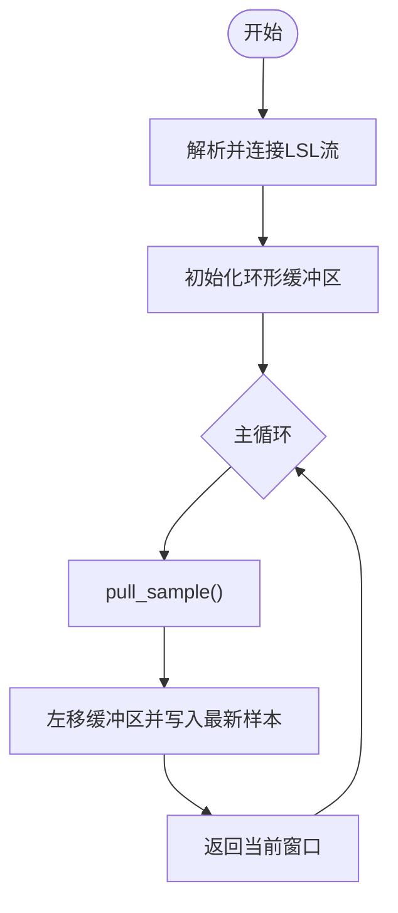

图表来源
- [paradigm/online/lsl_receiver.py:1-32](file://paradigm/online/lsl_receiver.py#L1-L32)

章节来源
- [paradigm/online/lsl_receiver.py:1-32](file://paradigm/online/lsl_receiver.py#L1-L32)

### OnlineFeature（特征提取与工程）
- 功能：多频带滤波、CSP投影、对数方差特征、特征选择与标准化
- 输入：eeg_window（channels × samples）
- 输出：X（1 × n_features），经特征选择与标准化
- 处理流程：
  - 遍历filter_bands，对每个频带构造BANDPASSx并滤波
  - 使用对应频带的CSP混合矩阵W进行投影
  - 选取csp_feature_index通道，计算每trial的对数方差，展平拼接
  - 应用mu_inf特征选择索引，reshape为(1, -1)
  - 使用训练时的StandardScaler进行标准化
- 数学要点：
  - CSP：对两类协方差矩阵求广义特征值分解，得到混合矩阵W
  - 对数方差：log(variance)作为稳健特征
  - 特征选择：互信息排序选取高区分度特征

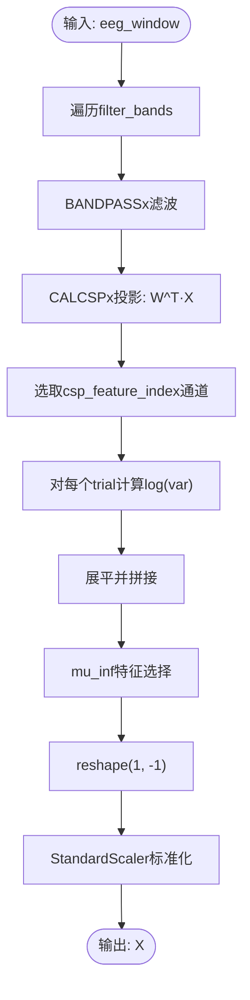

图表来源
- [paradigm/online/online_feature.py:1-52](file://paradigm/online/online_feature.py#L1-L52)
- [paradigm/bandpassx.py:1-79](file://paradigm/bandpassx.py#L1-L79)
- [paradigm/calcspx.py:1-87](file://paradigm/calcspx.py#L1-L87)

章节来源
- [paradigm/online/online_feature.py:1-52](file://paradigm/online/online_feature.py#L1-L52)
- [paradigm/bandpassx.py:1-79](file://paradigm/bandpassx.py#L1-L79)
- [paradigm/calcspx.py:1-87](file://paradigm/calcspx.py#L1-L87)

### OnlinePredict（SVM分类与置信度）
- 功能：使用训练好的SVM进行预测与置信度评估
- 输入：X（标准化特征）
- 输出：pred（类别）、confidence（最大概率）
- 决策逻辑：取预测概率的最大值作为置信度，用于后续稳定器与阈值判断

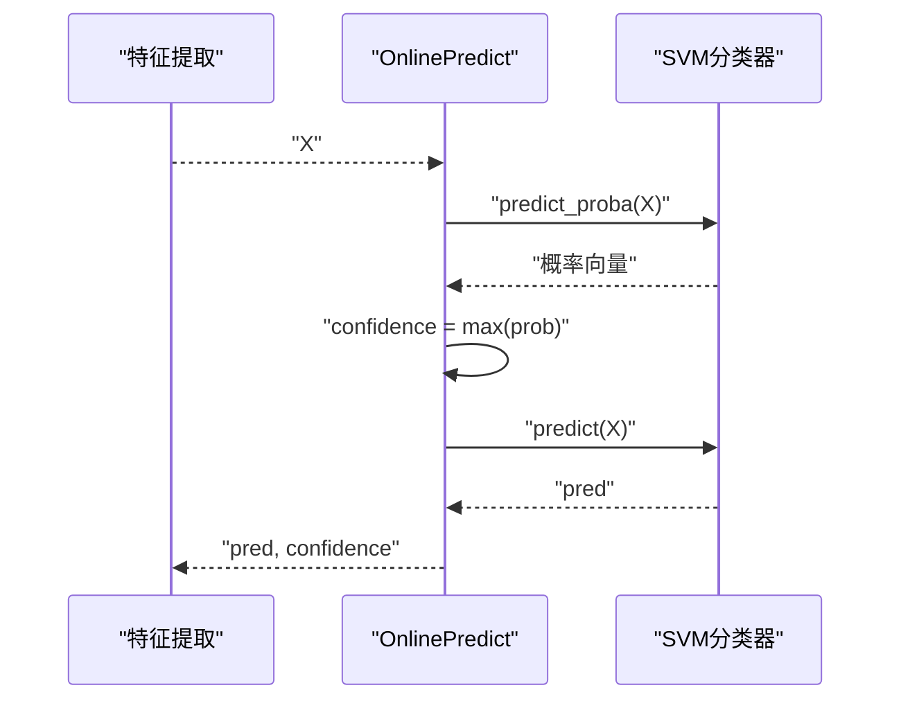

图表来源
- [paradigm/online/online_predict.py:1-17](file://paradigm/online/online_predict.py#L1-L17)

章节来源
- [paradigm/online/online_predict.py:1-17](file://paradigm/online/online_predict.py#L1-L17)

### DroneController（控制执行）
- 功能：模拟器控制接口（当前为print输出）
- 建议扩展：替换为UDP发送控制指令，增加安全保护（如心跳、最大连续命令、异常恢复）

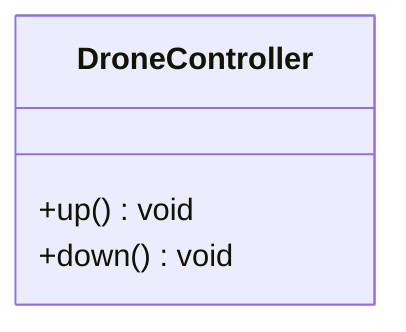

图表来源
- [paradigm/online/drone_controller.py:1-13](file://paradigm/online/drone_controller.py#L1-L13)

章节来源
- [paradigm/online/drone_controller.py:1-13](file://paradigm/online/drone_controller.py#L1-L13)

### 实时滤波器（RealTimeBandpass）
- 功能：IIR带通滤波，通道独立状态保持，适合实时流式处理
- 关键点：
  - 初始化时计算b/a系数与每个通道的初始状态zi
  - filter_chunk对每个通道独立lfilter并更新zi，保证因果性与状态连续
- 适用场景：实时控制脚本中对最新chunk进行滤波以维持状态

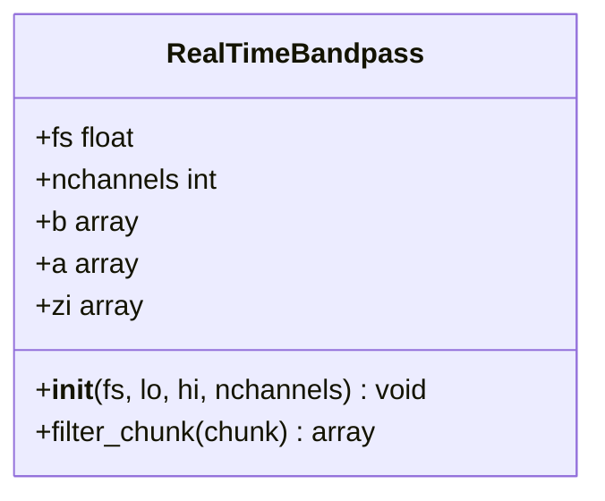

图表来源
- [paradigm/realtime_filter.py:1-32](file://paradigm/realtime_filter.py#L1-L32)

章节来源
- [paradigm/realtime_filter.py:1-32](file://paradigm/realtime_filter.py#L1-L32)

### 带通滤波器（BANDPASSx）
- 功能：基于Butterworth设计的带通滤波器，支持2D/3D数组滤波
- 关键点：
  - apply_filter_2d沿时间轴双向滤波（零相位）
  - apply_filter对每个trial独立滤波
- 参数：滤波阶数、上下限频率、采样率

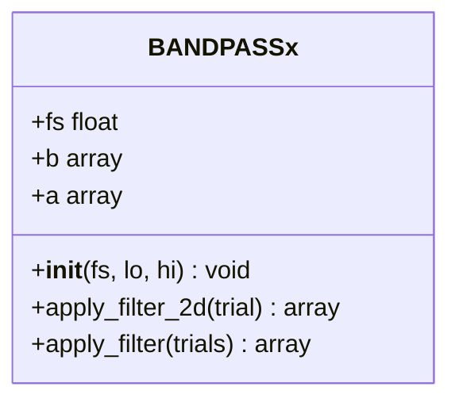

图表来源
- [paradigm/bandpassx.py:1-79](file://paradigm/bandpassx.py#L1-L79)

章节来源
- [paradigm/bandpassx.py:1-79](file://paradigm/bandpassx.py#L1-L79)

### CSP工具（CALCSPx）
- 功能：协方差估计、CSP混合矩阵计算、投影与应用
- 关键点：
  - cov_trials：对每个trial做通道外积归一化，平均后加正则项提升数值稳定
  - get_csp_w：广义特征值分解求W
  - apply_csp/apply_csp_single_trial：将W应用于trials或单trial
- 数学基础：CSP最大化类间方差与类内方差的比值，选择判别性强的投影通道

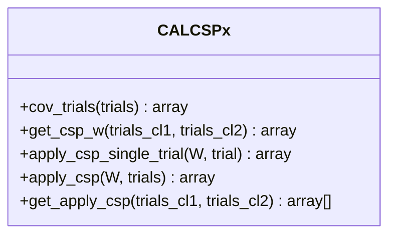

图表来源
- [paradigm/calcspx.py:1-87](file://paradigm/calcspx.py#L1-L87)

章节来源
- [paradigm/calcspx.py:1-87](file://paradigm/calcspx.py#L1-L87)

### 主控循环（main_online.py）
- 功能：加载模型、初始化模块、主循环控制、阈值与稳定器、滑动平均置信度、多数投票与控制执行
- 关键参数：
  - threshold：置信度阈值
  - step_time：预测间隔
  - stability_window：稳定器窗口
  - confidence_queue_len：置信度滑动窗口
- 安全策略：仅当平滑后置信度达标且连续稳定才执行动作，避免误触发

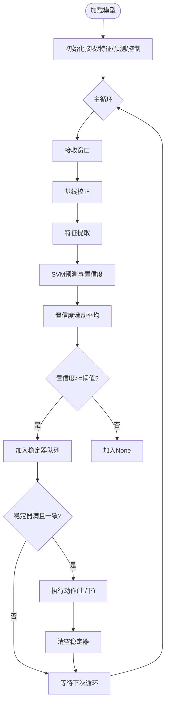

图表来源
- [paradigm/main_online.py:1-97](file://paradigm/main_online.py#L1-L97)

章节来源
- [paradigm/main_online.py:1-97](file://paradigm/main_online.py#L1-L97)

### 实时无人机控制（realtime_drone_controller.py）
- 功能：实时连接LSL流，按UPDATE_INTERVAL收集新chunk，更新环形缓冲区，多频带CSP特征提取，SVM预测，多数投票与UDP发送
- 关键点：
  - 为每个频带维护RealTimeBandpass实例，实时滤波最新chunk
  - 使用apply_csp_single_trial对当前窗口进行投影
  - 通过socket发送“up”/“down”/“hover”指令
  - 信号丢失时自动发送hover，保障安全

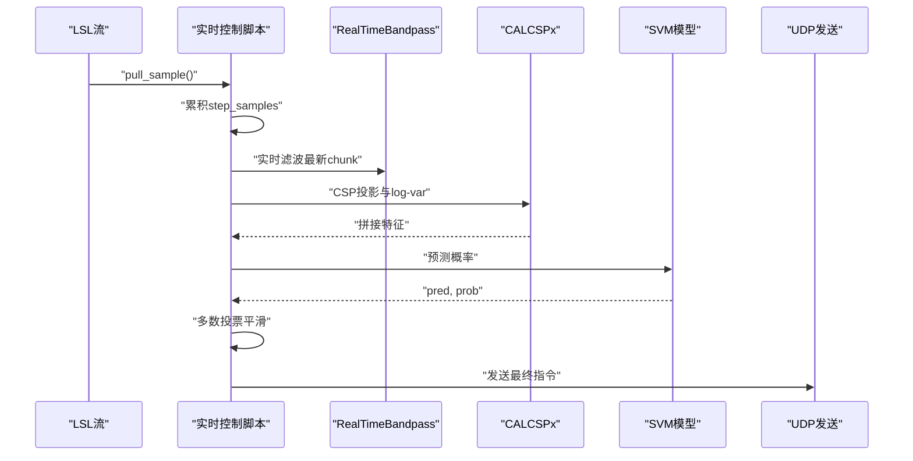

图表来源
- [paradigm/realtime_drone_controller.py:1-121](file://paradigm/realtime_drone_controller.py#L1-L121)
- [paradigm/realtime_filter.py:1-32](file://paradigm/realtime_filter.py#L1-L32)
- [paradigm/calcspx.py:1-87](file://paradigm/calcspx.py#L1-L87)

章节来源
- [paradigm/realtime_drone_controller.py:1-121](file://paradigm/realtime_drone_controller.py#L1-L121)

### 离线训练（train.py）
- 功能：从XDF读取数据，构建事件、截取试验、多频带滤波、CSP与对数方差特征、互信息特征选择、标准化与SVM训练，保存模型
- 关键参数：
  - 采样率、通道数、试验窗口、频带范围、CSP通道选择、特征数量
- 模型字段：clf、csp、mu_inf、filter_bands、fs、signal_win_start/end、csp_feature_index、std

章节来源
- [paradigm/train.py:1-201](file://paradigm/train.py#L1-L201)

### 标记映射（task_markers.json）
- 功能：定义任务标记与事件码的映射，用于离线数据事件提取与训练标签构建

章节来源
- [paradigm/task_markers.json:1-23](file://paradigm/task_markers.json#L1-L23)

## 依赖关系分析
- 在线推理链路：LSLReceiver → OnlineFeature → OnlinePredict → DroneController
- 特征工程依赖：BANDPASSx（滤波）、CALCSPx（CSP）、StandardScaler（标准化）
- 实时控制依赖：RealTimeBandpass（实时滤波）、SVM模型（预测）、UDP（通信）
- 训练依赖：BANDPASSx、CALCSPx、互信息特征选择、SVM、StandardScaler

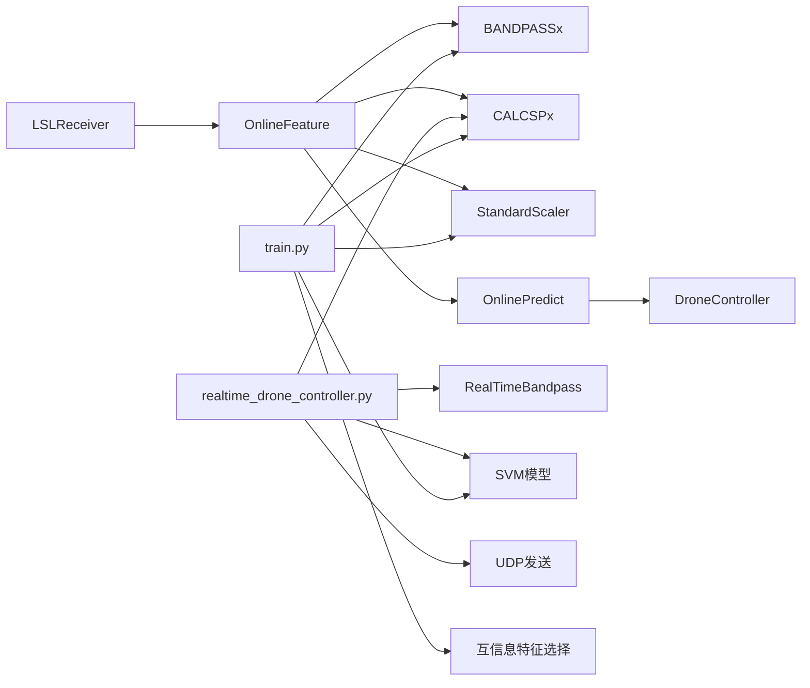

图表来源
- [paradigm/online/lsl_receiver.py:1-32](file://paradigm/online/lsl_receiver.py#L1-L32)
- [paradigm/online/online_feature.py:1-52](file://paradigm/online/online_feature.py#L1-L52)
- [paradigm/online/online_predict.py:1-17](file://paradigm/online/online_predict.py#L1-L17)
- [paradigm/online/drone_controller.py:1-13](file://paradigm/online/drone_controller.py#L1-L13)
- [paradigm/bandpassx.py:1-79](file://paradigm/bandpassx.py#L1-L79)
- [paradigm/calcspx.py:1-87](file://paradigm/calcspx.py#L1-L87)
- [paradigm/realtime_filter.py:1-32](file://paradigm/realtime_filter.py#L1-L32)
- [paradigm/realtime_drone_controller.py:1-121](file://paradigm/realtime_drone_controller.py#L1-L121)
- [paradigm/train.py:1-201](file://paradigm/train.py#L1-L201)

章节来源
- [paradigm/online/lsl_receiver.py:1-32](file://paradigm/online/lsl_receiver.py#L1-L32)
- [paradigm/online/online_feature.py:1-52](file://paradigm/online/online_feature.py#L1-L52)
- [paradigm/online/online_predict.py:1-17](file://paradigm/online/online_predict.py#L1-L17)
- [paradigm/online/drone_controller.py:1-13](file://paradigm/online/drone_controller.py#L1-L13)
- [paradigm/bandpassx.py:1-79](file://paradigm/bandpassx.py#L1-L79)
- [paradigm/calcspx.py:1-87](file://paradigm/calcspx.py#L1-L87)
- [paradigm/realtime_filter.py:1-32](file://paradigm/realtime_filter.py#L1-L32)
- [paradigm/realtime_drone_controller.py:1-121](file://paradigm/realtime_drone_controller.py#L1-L121)
- [paradigm/train.py:1-201](file://paradigm/train.py#L1-L201)

## 性能考虑
- 缓冲区管理
  - 环形缓冲区避免频繁内存分配，建议按采样率与窗口长度合理设置window_len
  - 填满检测可避免无效特征提取，减少CPU占用
- 实时滤波
  - RealTimeBandpass为每个通道维护状态，确保因果性与连续性
  - 建议在数据进入缓冲区前按频带分别滤波，减少状态传播误差
- 特征工程
  - 多频带滤波与CSP投影可并行于不同频带，充分利用多核
  - 特征选择与标准化在训练阶段完成，推理阶段只需变换
- 预测与控制
  - 置信度滑动平均与稳定器降低误触发概率
  - 多数投票平滑控制指令，避免抖动
- 通信
  - UDP发送应设置超时与重试，信号丢失时发送hover
  - 建议增加心跳包与命令去重机制

## 故障排查指南
- LSL连接失败
  - 确认EEG设备已启动并发布LSL流
  - 检查resolve_stream是否返回非空列表
- 缓冲区未填满
  - 等待足够样本后再进行特征提取
  - 检查采样率与窗口长度设置
- 预测不稳定
  - 提升置信度阈值或增大稳定器窗口
  - 增大置信度滑动窗口，提高平滑效果
- UDP通信异常
  - 检查IP与端口配置
  - 添加异常捕获与超时处理
- 模型不匹配
  - 确认加载的模型版本与训练一致
  - 检查fs、filter_bands、csp_feature_index等参数

章节来源
- [paradigm/main_online.py:1-97](file://paradigm/main_online.py#L1-L97)
- [paradigm/realtime_drone_controller.py:1-121](file://paradigm/realtime_drone_controller.py#L1-L121)

## 结论
本系统通过LSL实时采集、多频带CSP特征提取与SVM分类，结合置信度阈值、稳定器与多数投票机制，实现了稳健的脑控无人机控制。实时滤波器与环形缓冲区设计保证了低延迟与高稳定性。建议在生产环境中进一步完善UDP安全保护、心跳与去重机制，并对滤波与特征工程进行并行化优化。

## 附录

### API参考与参数配置

- LSLReceiver
  - 初始化参数
    - n_channels：通道数
    - fs：采样率
    - window_len：窗口长度（样本数）
  - 方法
    - update()：返回当前窗口（channels × samples）

- OnlineFeature
  - 初始化参数
    - model：包含csp、mu_inf、filter_bands、csp_feature_index、std、fs
  - 方法
    - extract(eeg_window)：返回标准化特征X（1 × n_features）

- OnlinePredict
  - 初始化参数
    - model：包含clf
  - 方法
    - predict(X)：返回pred与confidence

- DroneController
  - 方法
    - up()：执行上升动作
    - down()：执行下降动作

- BANDPASSx
  - 初始化参数
    - fs：采样率
    - lo：低频截止
    - hi：高频截止
  - 方法
    - apply_filter_2d(trial)：2D滤波
    - apply_filter(trials)：3D滤波

- RealTimeBandpass
  - 初始化参数
    - fs：采样率
    - lo：低频截止
    - hi：高频截止
    - nchannels：通道数
  - 方法
    - filter_chunk(chunk)：返回滤波后chunk

- CALCSPx
  - 方法
    - cov_trials(trials)：协方差平均与正则化
    - get_csp_w(trials_cl1, trials_cl2)：CSP混合矩阵
    - apply_csp(W, trials)：多trial投影
    - apply_csp_single_trial(W, trial)：单trial投影

- 主控循环（main_online.py）
  - 关键参数
    - threshold：置信度阈值
    - step_time：预测间隔（秒）
    - stability_window：稳定器窗口
    - confidence_queue_len：置信度滑动窗口

- 实时控制（realtime_drone_controller.py）
  - 关键参数
    - MODEL_PATH：模型路径
    - UDP_IP/UDP_PORT：目标IP与端口
    - PROB_THRESHOLD：概率阈值
    - UPDATE_INTERVAL：更新间隔（秒）
    - SMOOTH_WINDOW：多数投票窗口

章节来源
- [paradigm/online/lsl_receiver.py:1-32](file://paradigm/online/lsl_receiver.py#L1-L32)
- [paradigm/online/online_feature.py:1-52](file://paradigm/online/online_feature.py#L1-L52)
- [paradigm/online/online_predict.py:1-17](file://paradigm/online/online_predict.py#L1-L17)
- [paradigm/online/drone_controller.py:1-13](file://paradigm/online/drone_controller.py#L1-L13)
- [paradigm/bandpassx.py:1-79](file://paradigm/bandpassx.py#L1-L79)
- [paradigm/realtime_filter.py:1-32](file://paradigm/realtime_filter.py#L1-L32)
- [paradigm/calcspx.py:1-87](file://paradigm/calcspx.py#L1-L87)
- [paradigm/main_online.py:1-97](file://paradigm/main_online.py#L1-L97)
- [paradigm/realtime_drone_controller.py:1-121](file://paradigm/realtime_drone_controller.py#L1-L121)