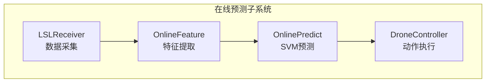
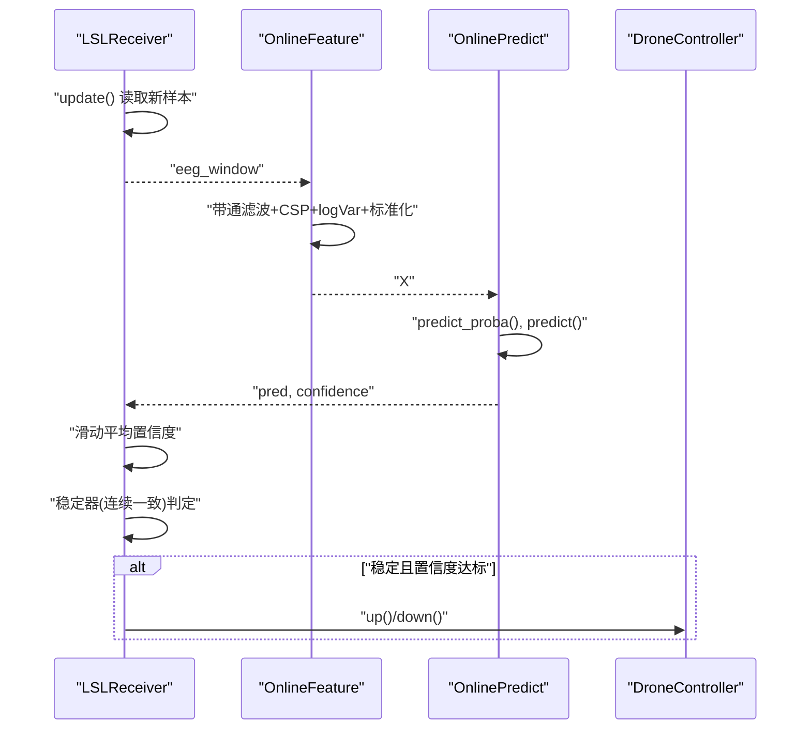
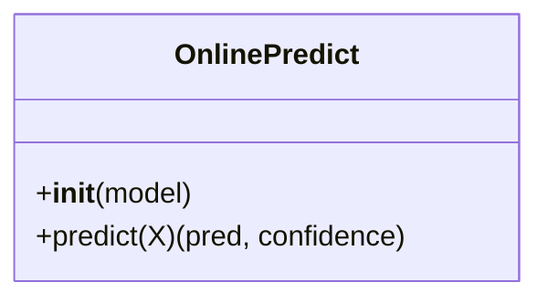
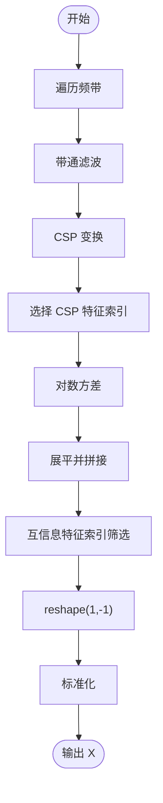
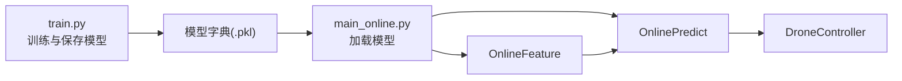

# 模型预测模块

<cite>
**本文引用的文件**
- [paradigm/online/online_predict.py](file://paradigm/online/online_predict.py)
- [paradigm/online/online_feature.py](file://paradigm/online/online_feature.py)
- [paradigm/online/lsl_receiver.py](file://paradigm/online/lsl_receiver.py)
- [paradigm/online/drone_controller.py](file://paradigm/online/drone_controller.py)
- [paradigm/main_online.py](file://paradigm/main_online.py)
- [paradigm/train.py](file://paradigm/train.py)
- [paradigm/offline_simulation.py](file://paradigm/offline_simulation.py)
- [paradigm/bandpassx.py](file://paradigm/bandpassx.py)
- [paradigm/calcspx.py](file://paradigm/calcspx.py)
- [paradigm/task_markers.json](file://paradigm/task_markers.json)
</cite>

## 目录
1. [简介](#简介)
2. [项目结构](#项目结构)
3. [核心组件](#核心组件)
4. [架构总览](#架构总览)
5. [详细组件分析](#详细组件分析)
6. [依赖分析](#依赖分析)
7. [性能考虑](#性能考虑)
8. [故障排查指南](#故障排查指南)
9. [结论](#结论)
10. [附录](#附录)

## 简介
本文件面向“模型预测模块”的技术文档，聚焦在线预测子系统中的 OnlinePredict 类如何使用 SVM 分类器进行实时脑电分类。内容涵盖：
- 模型加载机制与数据流
- 特征向量预处理链路（带通滤波、CSP、方差对数、标准化）
- 预测计算与置信度提取
- 实时性能优化（模型缓存、滑动置信度平滑、稳定器）
- 完整 API 参考（predict 方法、返回值、异常处理）
- 模型评估指标与离线仿真验证

## 项目结构
该模块位于 paradigm/online 子目录，围绕在线预测主循环 main_online.py 组织，涉及数据采集、特征提取、模型预测与执行控制等环节。

图表来源
- [paradigm/main_online.py:54-97](file://paradigm/main_online.py#L54-L97)
- [paradigm/online/lsl_receiver.py:23-32](file://paradigm/online/lsl_receiver.py#L23-L32)
- [paradigm/online/online_feature.py:20-52](file://paradigm/online/online_feature.py#L20-L52)
- [paradigm/online/online_predict.py:9-17](file://paradigm/online/online_predict.py#L9-L17)
- [paradigm/online/drone_controller.py:3-13](file://paradigm/online/drone_controller.py#L3-L13)

章节来源
- [paradigm/main_online.py:1-97](file://paradigm/main_online.py#L1-L97)

## 核心组件
- OnlinePredict：封装已训练的 SVM 分类器，提供 predict(X) 接口，返回类别标签与置信度。
- OnlineFeature：负责从当前窗口的脑电数据中提取多频带 CSP 方差对数特征，并进行标准化。
- LSLReceiver：从 Lab Streaming Layer 流中拉取最新样本，维护环形缓冲区。
- DroneController：根据稳定后的预测结果执行上/下动作（示例）。
- main_online：在线主循环，协调各模块，实现阈值与稳定器逻辑，控制执行节拍。

章节来源
- [paradigm/online/online_predict.py:3-17](file://paradigm/online/online_predict.py#L3-L17)
- [paradigm/online/online_feature.py:7-52](file://paradigm/online/online_feature.py#L7-L52)
- [paradigm/online/lsl_receiver.py:6-32](file://paradigm/online/lsl_receiver.py#L6-L32)
- [paradigm/online/drone_controller.py:3-13](file://paradigm/online/drone_controller.py#L3-L13)
- [paradigm/main_online.py:54-97](file://paradigm/main_online.py#L54-L97)

## 架构总览
在线预测的数据流自下而上为：采集 → 基线校正 → 特征提取 → SVM 预测 → 置信度平滑 → 稳定器 → 动作执行。

图表来源
- [paradigm/main_online.py:54-97](file://paradigm/main_online.py#L54-L97)
- [paradigm/online/lsl_receiver.py:23-32](file://paradigm/online/lsl_receiver.py#L23-L32)
- [paradigm/online/online_feature.py:20-52](file://paradigm/online/online_feature.py#L20-L52)
- [paradigm/online/online_predict.py:9-17](file://paradigm/online/online_predict.py#L9-L17)
- [paradigm/online/drone_controller.py:5-13](file://paradigm/online/drone_controller.py#L5-L13)

## 详细组件分析

### OnlinePredict 类
- 职责：持有训练好的 SVM 分类器，提供 predict(X) 接口。
- 输入：特征向量 X（二维数组，形状为 1×N）。
- 输出：pred（类别标签）、confidence（置信度，即最大类概率）。
- 置信度计算：使用分类器的概率估计接口得到各类别概率，取最大值作为置信度。
- 决策边界：predict() 返回最高概率类别的标签；置信度可作为阈值判定依据。

图表来源
- [paradigm/online/online_predict.py:3-17](file://paradigm/online/online_predict.py#L3-L17)

章节来源
- [paradigm/online/online_predict.py:5-17](file://paradigm/online/online_predict.py#L5-L17)

### OnlineFeature 类
- 职责：从当前窗口 eeg_window 中提取多频带 CSP 方差对数特征，并进行标准化。
- 关键步骤：
  - 遍历预定义频带范围，对每个频带应用带通滤波。
  - 对每个频带计算 CSP 变换，取选定特征索引。
  - 计算每条试次的 CSP 信号方差并对数变换，展平拼接为特征向量。
  - 应用互信息筛选索引，按模型保存的均值/方差进行标准化。
- 输入：eeg_window（形状为 n_channels × n_samples）。
- 输出：X（形状为 1 × N，供 SVM 预测）。

图表来源
- [paradigm/online/online_feature.py:20-52](file://paradigm/online/online_feature.py#L20-L52)
- [paradigm/bandpassx.py:54-73](file://paradigm/bandpassx.py#L54-L73)
- [paradigm/calcspx.py:69-78](file://paradigm/calcspx.py#L69-L78)

章节来源
- [paradigm/online/online_feature.py:9-52](file://paradigm/online/online_feature.py#L9-L52)
- [paradigm/bandpassx.py:7-79](file://paradigm/bandpassx.py#L7-L79)
- [paradigm/calcspx.py:7-87](file://paradigm/calcspx.py#L7-L87)

### LSLReceiver 类
- 职责：解析并连接 EEG 流，维护环形缓冲区，每次返回最新窗口数据。
- 输入：通道数、采样率、窗口长度。
- 输出：n_channels × window_len 的缓冲区副本。

章节来源
- [paradigm/online/lsl_receiver.py:6-32](file://paradigm/online/lsl_receiver.py#L6-L32)

### DroneController 类
- 职责：根据稳定后的预测结果执行动作（示例为上/下）。
- 注意：此处为演示用途，实际应替换为具体控制逻辑。

章节来源
- [paradigm/online/drone_controller.py:3-13](file://paradigm/online/drone_controller.py#L3-L13)

### 在线主循环（main_online）
- 模型加载：从持久化文件加载训练好的模型字典，包含 SVM 分类器、CSP 混合矩阵、标准化器、特征索引等。
- 数据采集与基线校正：读取窗口数据，按通道做零均值基线校正。
- 特征提取与预测：调用 OnlineFeature.extract 与 OnlinePredict.predict。
- 置信度平滑：使用滑动窗口对置信度取均值，降低抖动。
- 稳定器：连续多次一致的预测才视为有效决策，避免误触发。
- 执行控制：当满足条件时调用 DroneController 的动作函数。

章节来源
- [paradigm/main_online.py:14-97](file://paradigm/main_online.py#L14-L97)

## 依赖分析
- 模型依赖：SVM 分类器（含概率估计）、CSP 混合矩阵、标准化器、互信息特征索引、滤波频带字典、采样率与信号窗参数。
- 训练侧产出：训练脚本输出包含上述全部要素的模型字典，供在线侧加载使用。
- 在线侧依赖：特征提取与预测均依赖模型字典中的组件；主循环负责调度与决策。

图表来源
- [paradigm/train.py:184-201](file://paradigm/train.py#L184-L201)
- [paradigm/main_online.py:18-38](file://paradigm/main_online.py#L18-L38)

章节来源
- [paradigm/train.py:184-201](file://paradigm/train.py#L184-L201)
- [paradigm/main_online.py:14-38](file://paradigm/main_online.py#L14-L38)

## 性能考虑
- 模型缓存：在线侧直接从内存加载已训练模型，避免重复训练开销。
- 特征计算：CSP 与标准化均为向量化操作，适合实时场景；注意窗口长度与频带数量对吞吐的影响。
- 置信度平滑：滑动窗口平均可降低瞬时噪声影响，提升稳定性。
- 稳定器：连续次数阈值可进一步抑制误判，但会增加响应延迟。
- 执行节拍：通过 sleep 控制主循环频率，平衡实时性与资源占用。
- 建议：
  - 合理设置置信度阈值与稳定窗口，权衡误报与漏报。
  - 若硬件受限，可减少频带数量或特征维度。
  - 对于高延迟链路，可在离线仿真中评估端到端延迟并调整参数。

## 故障排查指南
- 无法连接 EEG 流
  - 现象：初始化阶段无法解析流。
  - 排查：确认 LSL 系统运行、EEG 设备已启动并发布流。
  - 参考：[paradigm/online/lsl_receiver.py:10-16](file://paradigm/online/lsl_receiver.py#L10-L16)
- 缓冲区未填满
  - 现象：主循环跳过预测。
  - 排查：检查窗口长度与采样率配置是否匹配；等待足够数据。
  - 参考：[paradigm/main_online.py:58-61](file://paradigm/main_online.py#L58-L61)
- 预测结果不稳定
  - 现象：置信度波动大、频繁切换。
  - 排查：增大置信度滑动窗口、提高阈值或稳定器窗口。
  - 参考：[paradigm/main_online.py:70-82](file://paradigm/main_online.py#L70-L82)
- 动作未执行
  - 现象：满足阈值与稳定条件但无动作。
  - 排查：确认稳定器队列已满且类别一致；检查 DroneController 实现。
  - 参考：[paradigm/main_online.py:82-95](file://paradigm/main_online.py#L82-L95), [paradigm/online/drone_controller.py:5-13](file://paradigm/online/drone_controller.py#L5-L13)
- 模型不兼容
  - 现象：加载模型失败或特征维度不匹配。
  - 排查：确保训练与在线侧使用同一模型版本；核对特征索引与标准化器。
  - 参考：[paradigm/main_online.py:18-24](file://paradigm/main_online.py#L18-L24), [paradigm/train.py:184-201](file://paradigm/train.py#L184-L201)

## 结论
本模块以轻量、可扩展的方式实现了基于 CSP+RBF-SVM 的在线脑电分类。通过标准化与置信度平滑，结合稳定器策略，在保证实时性的前提下提升了决策稳定性。建议在部署前完成离线仿真与参数调优，确保在目标硬件与任务场景下的鲁棒性。

## 附录

### API 参考：OnlinePredict.predict
- 方法签名：predict(X)
- 参数
  - X：特征向量，形状为 1×N，由 OnlineFeature.extract 生成
- 返回值
  - pred：整数类别标签（如 0/1）
  - confidence：浮点数，范围 [0,1]，表示最大类别概率
- 异常处理
  - 若输入 X 形状不符合预期，可能引发底层库异常；建议在调用前确保 X 为 1×N 的数值数组
  - 若模型未正确加载，predict_proba/predict 将抛出异常；请确认模型字典完整性
- 使用示例（路径）
  - [paradigm/main_online.py:66-68](file://paradigm/main_online.py#L66-L68)

章节来源
- [paradigm/online/online_predict.py:9-17](file://paradigm/online/online_predict.py#L9-L17)
- [paradigm/main_online.py:66-68](file://paradigm/main_online.py#L66-L68)

### 模型评估与离线仿真
- 训练侧指标
  - 使用分类报告、混淆矩阵与 AUC 进行评估，输出最佳参数与交叉验证精度
  - 参考：[paradigm/train.py:175-183](file://paradigm/train.py#L175-L183)
- 离线仿真
  - 通过滑动窗口与置信度平滑策略，统计有效决策数、被过滤数与最终准确率
  - 参考：[paradigm/offline_simulation.py:128-189](file://paradigm/offline_simulation.py#L128-L189)

章节来源
- [paradigm/train.py:175-183](file://paradigm/train.py#L175-L183)
- [paradigm/offline_simulation.py:128-189](file://paradigm/offline_simulation.py#L128-L189)

### 关键配置与参数
- 频带与 CSP
  - 频带划分与重叠、CSP 特征索引、混合矩阵
  - 参考：[paradigm/train.py:38-40](file://paradigm/train.py#L38-L40), [paradigm/train.py](file://paradigm/train.py#L34), [paradigm/calcspx.py:45-60](file://paradigm/calcspx.py#L45-L60)
- 标准化
  - 使用 StandardScaler，保存均值/方差供在线侧使用
  - 参考：[paradigm/train.py:151-152](file://paradigm/train.py#L151-L152), [paradigm/train.py](file://paradigm/train.py#L194)
- 任务标记
  - 任务起止标记映射，用于离线标注与仿真
  - 参考：[paradigm/task_markers.json:12-13](file://paradigm/task_markers.json#L12-L13)

章节来源
- [paradigm/train.py:34-40](file://paradigm/train.py#L34-L40)
- [paradigm/calcspx.py:45-60](file://paradigm/calcspx.py#L45-L60)
- [paradigm/train.py:151-152](file://paradigm/train.py#L151-L152)
- [paradigm/train.py](file://paradigm/train.py#L194)
- [paradigm/task_markers.json:12-13](file://paradigm/task_markers.json#L12-L13)