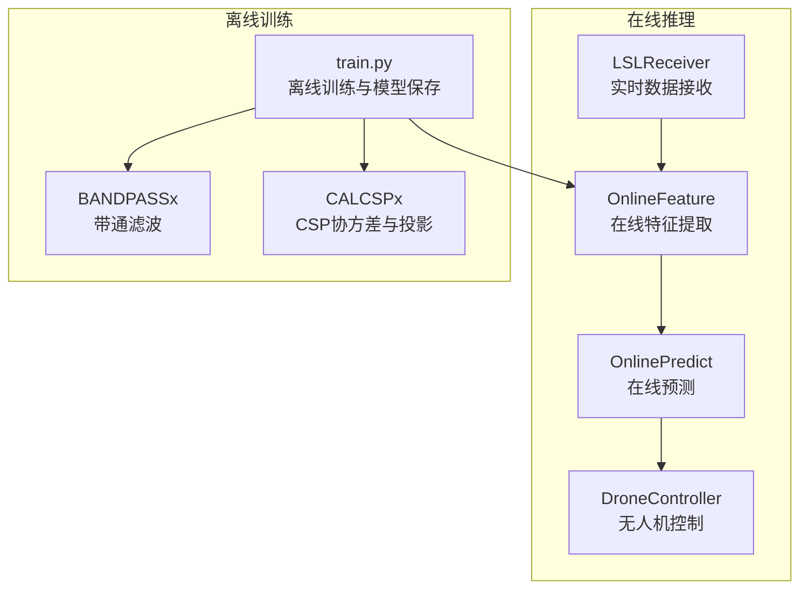
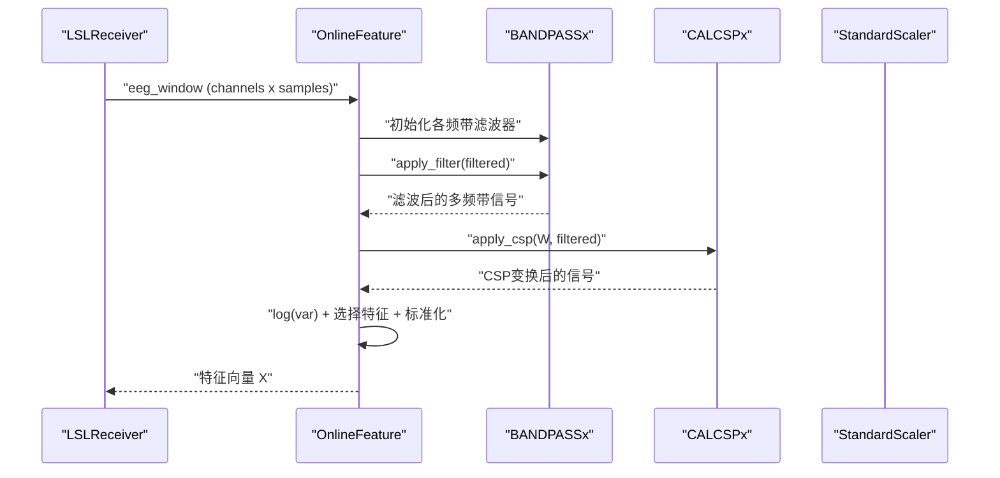
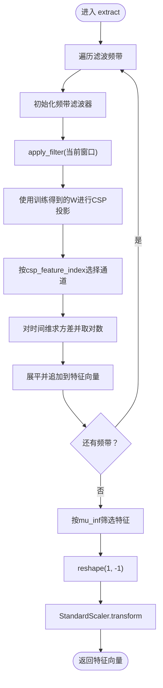
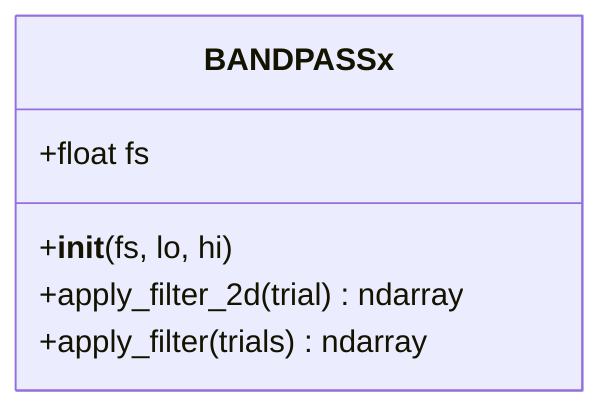
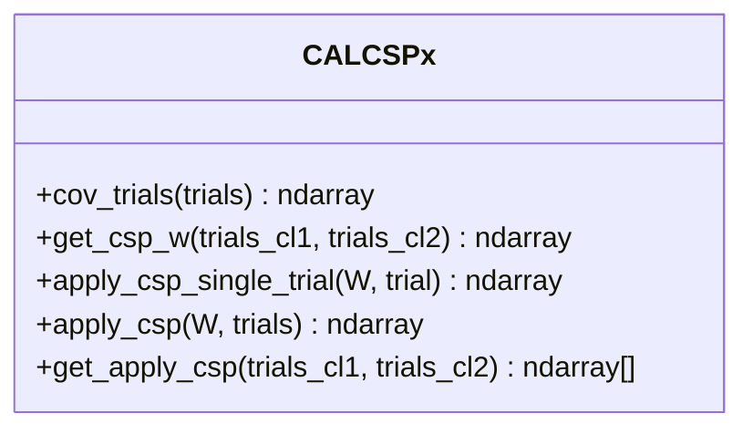
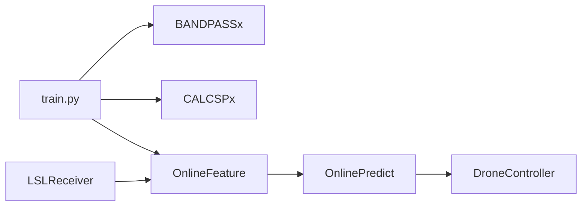

# 特征提取模块

<cite>
**本文引用的文件**
- [paradigm/online/online_feature.py](file://paradigm/online/online_feature.py)
- [paradigm/bandpassx.py](file://paradigm/bandpassx.py)
- [paradigm/calcspx.py](file://paradigm/calcspx.py)
- [paradigm/train.py](file://paradigm/train.py)
- [paradigm/main_online.py](file://paradigm/main_online.py)
- [paradigm/realtime_filter.py](file://paradigm/realtime_filter.py)
- [paradigm/online/lsl_receiver.py](file://paradigm/online/lsl_receiver.py)
- [paradigm/task_markers.json](file://paradigm/task_markers.json)
</cite>

## 目录
1. [简介](#简介)
2. [项目结构](#项目结构)
3. [核心组件](#核心组件)
4. [架构总览](#架构总览)
5. [详细组件分析](#详细组件分析)
6. [依赖分析](#依赖分析)
7. [性能考虑](#性能考虑)
8. [故障排查指南](#故障排查指南)
9. [结论](#结论)
10. [附录](#附录)

## 简介
本技术文档聚焦于在线特征提取模块，系统性阐述OnlineFeature类的CSP（共空间模式）特征提取算法实现，涵盖：
- 共空间模式的数学原理与投影矩阵计算
- 多频带带通滤波器设计与频率响应特性
- 完整特征工程流程：数据预处理、CSP变换、方差对数变换、特征向量标准化
- 算法公式推导、实现代码分析与参数调优建议
- 性能测试与复杂度分析、优化建议

## 项目结构
在线特征提取模块位于paradigm/online目录下，配合离线训练脚本与实时接收器共同构成端到端的脑电特征提取与分类流水线。

图表来源
- [paradigm/online/online_feature.py:1-52](file://paradigm/online/online_feature.py#L1-L52)
- [paradigm/online/lsl_receiver.py:1-32](file://paradigm/online/lsl_receiver.py#L1-L32)
- [paradigm/train.py:1-201](file://paradigm/train.py#L1-L201)
- [paradigm/bandpassx.py:1-79](file://paradigm/bandpassx.py#L1-L79)
- [paradigm/calcspx.py:1-87](file://paradigm/calcspx.py#L1-L87)

章节来源
- [paradigm/online/online_feature.py:1-52](file://paradigm/online/online_feature.py#L1-L52)
- [paradigm/train.py:1-201](file://paradigm/train.py#L1-L201)

## 核心组件
- OnlineFeature：在线特征提取器，负责对当前窗口的EEG进行多频带滤波、CSP投影、方差对数变换、特征选择与标准化。
- BANDPASSx：基于巴特沃斯滤波器的带通滤波器，支持二维与三维数组的滤波。
- CALCSPx：离线训练阶段计算协方差、求解广义特征值问题得到CSP投影矩阵，并对单次或批量试验应用CSP变换。
- 实时滤波器RealTimeBandpass：用于因果实时滤波（训练脚本中未直接使用，但展示了状态保持的思路）。
- LSLReceiver：通过LabStreamLayer实时接收16通道EEG数据，维护固定长度环形缓冲区。
- main_online：在线主循环，整合接收、特征提取、预测与控制逻辑。

章节来源
- [paradigm/online/online_feature.py:7-52](file://paradigm/online/online_feature.py#L7-L52)
- [paradigm/bandpassx.py:7-79](file://paradigm/bandpassx.py#L7-L79)
- [paradigm/calcspx.py:7-87](file://paradigm/calcspx.py#L7-L87)
- [paradigm/realtime_filter.py:6-32](file://paradigm/realtime_filter.py#L6-L32)
- [paradigm/online/lsl_receiver.py:6-32](file://paradigm/online/lsl_receiver.py#L6-L32)
- [paradigm/main_online.py:1-97](file://paradigm/main_online.py#L1-L97)

## 架构总览
在线特征提取的端到端流程如下：
- 数据采集：LSLReceiver从流中拉取样本，填充环形缓冲区形成当前时间窗口。
- 数据预处理：在线主循环对窗口做基线校正（零均值），随后交由OnlineFeature。
- 多频带滤波：按训练时定义的频带范围，对每个频带分别进行带通滤波。
- CSP投影：使用训练得到的投影矩阵对滤波后信号进行线性变换。
- 特征工程：对投影后的通道按时间维求方差，取对数，再按训练时选定的特征索引拼接。
- 特征选择与标准化：仅保留互信息排序靠前的特征，并使用训练时的StandardScaler进行标准化。
- 在线预测：将标准化后的特征向量输入分类器，输出类别与置信度。

图表来源
- [paradigm/online/online_feature.py:20-52](file://paradigm/online/online_feature.py#L20-L52)
- [paradigm/bandpassx.py:54-73](file://paradigm/bandpassx.py#L54-L73)
- [paradigm/calcspx.py:69-78](file://paradigm/calcspx.py#L69-L78)

## 详细组件分析

### OnlineFeature 类
- 输入模型字典包含：各频带的CSP投影矩阵、互信息特征索引、滤波频带、标准化器、采样率等。
- 提取流程要点：
  - 遍历每个频带，构造BANDPASSx滤波器并应用到当前窗口。
  - 使用对应频带的CSP投影矩阵进行线性变换。
  - 选择指定的CSP通道索引，按时间维求方差并对数变换。
  - 将各频带的特征向量展平拼接，按互信息索引筛选，重塑为一行，最后使用训练时的StandardScaler标准化。

图表来源
- [paradigm/online/online_feature.py:20-52](file://paradigm/online/online_feature.py#L20-L52)

章节来源
- [paradigm/online/online_feature.py:7-52](file://paradigm/online/online_feature.py#L7-L52)

### BANDPASSx 带通滤波器
- 设计原理：使用巴特沃斯低阶滤波器（阶数为4）在奈奎斯特定义的归一化频率范围内设计带通滤波器。
- 参数设置：采样率fs决定奈奎斯特频率；滤波器上下限为[lo/(fs/2), hi/(fs/2)]。
- 应用方式：
  - 二维接口：对每个试验沿时间轴（axis=1）进行零相位滤波。
  - 三维接口：对每个试验依次调用二维接口，逐试验滤波。
- 频率响应特性：低阶巴特沃斯提供平滑的通带滚降，零相位滤波消除相位失真，适合离线与在线特征提取场景。

图表来源
- [paradigm/bandpassx.py:7-79](file://paradigm/bandpassx.py#L7-L79)

章节来源
- [paradigm/bandpassx.py:7-79](file://paradigm/bandpassx.py#L7-L79)

### CALCSPx 共空间模式（CSP）
- 协方差估计：对每个试验计算通道数×通道数的协方差矩阵，并按迹归一化，最后对所有试验取平均，添加小正则项以保证数值稳定。
- 投影矩阵计算：对两类试验的平均协方差矩阵求广义特征值分解，按特征值降序排列，得到投影矩阵W。
- CSP变换：对每个试验左乘W^T，得到CSP特征通道。
- 注意：实现中未显式提供“协方差矩阵平均”函数，但通过“对每个试验求协方差并平均”的方式实现，且包含正则化项。

图表来源
- [paradigm/calcspx.py:7-87](file://paradigm/calcspx.py#L7-L87)

章节来源
- [paradigm/calcspx.py:21-60](file://paradigm/calcspx.py#L21-L60)
- [paradigm/calcspx.py:69-78](file://paradigm/calcspx.py#L69-L78)

### 离线训练与模型保存（train.py）
- 频带划分：以4 Hz步长在4–24 Hz范围内生成多频带，采用50%重叠策略。
- 特征工程：对每频带分别计算两类试验的CSP投影矩阵，应用到两类试验上，截取指定通道索引，按时间维求方差并对数变换，拼接为特征矩阵。
- 特征选择：使用互信息对特征进行排序，选择前k个特征。
- 标准化与分类：对所选特征进行标准化，训练SVM分类器，并将模型（含CSP投影矩阵、互信息索引、滤波频带、采样率、标准化器等）保存为pickle文件。

章节来源
- [paradigm/train.py:37-41](file://paradigm/train.py#L37-L41)
- [paradigm/train.py:118-148](file://paradigm/train.py#L118-L148)
- [paradigm/train.py:184-195](file://paradigm/train.py#L184-L195)

### 实时数据接收与在线主循环
- LSLReceiver：解析并连接EEG流，维护n_channels × window_len的环形缓冲区，每次pull_sample移动缓冲区并将新样本写入末尾。
- main_online：主循环中对窗口做零均值基线校正，调用OnlineFeature提取特征，随后进行在线预测与控制决策。

章节来源
- [paradigm/online/lsl_receiver.py:6-32](file://paradigm/online/lsl_receiver.py#L6-L32)
- [paradigm/main_online.py:54-97](file://paradigm/main_online.py#L54-L97)

## 依赖分析
- OnlineFeature依赖BANDPASSx与CALCSPx，以及训练时保存的模型字典（包含CSP投影矩阵、互信息索引、滤波频带、标准化器等）。
- train.py在离线阶段构建滤波与CSP流程，生成模型并保存。
- main_online加载模型，结合LSLReceiver与OnlineFeature、OnlinePredict完成端到端在线推理。

图表来源
- [paradigm/train.py:108-126](file://paradigm/train.py#L108-L126)
- [paradigm/online/online_feature.py:3-5](file://paradigm/online/online_feature.py#L3-L5)
- [paradigm/main_online.py:8-11](file://paradigm/main_online.py#L8-L11)

章节来源
- [paradigm/online/online_feature.py:3-5](file://paradigm/online/online_feature.py#L3-L5)
- [paradigm/train.py:108-126](file://paradigm/train.py#L108-L126)
- [paradigm/main_online.py:8-11](file://paradigm/main_online.py#L8-L11)

## 性能考虑
- 计算复杂度
  - 协方差与平均：对每个试验计算协方差，平均操作的时间复杂度约为O(T·C^2)，其中T为时间样本数，C为通道数。
  - 广义特征值分解：对C×C矩阵求解，复杂度约为O(C^3)。
  - 多频带滤波：对每个频带独立滤波，整体复杂度约O(B·T·C)，B为频带数量。
  - CSP投影：对每个试验左乘W^T，复杂度约O(B·T·C^2)。
  - 方差与对数：对每个通道求方差并取对数，复杂度约O(B·C·T)。
  - 特征选择与标准化：线性复杂度，主要受特征维度影响。
- 优化建议
  - 使用更高效的线性代数库（如BLAS/LAPACK）以降低矩阵运算开销。
  - 对滤波与CSP投影进行向量化与并行化（当前实现已尽量向量化，可进一步评估多核加速）。
  - 减少冗余拷贝：在apply_filter中逐试验处理，可考虑批处理以减少循环开销。
  - 预分配内存：在CALCSPx.apply_csp中预先分配trials_csp，避免多次动态分配。
  - 实时滤波：若需要因果实时滤波，可参考RealTimeBandpass的状态保持方法，但需权衡延迟与稳定性。

[本节为通用性能讨论，不直接分析具体文件，故不附加章节来源]

## 故障排查指南
- 模型加载失败
  - 确认模型路径正确，且模型文件存在。
  - 检查模型字典键是否完整（包含csp、mu_inf、filter_bands、csp_feature_index、std、fs等）。
- 在线特征维度不匹配
  - 确保OnlineFeature使用的csp_feature_index与mu_inf与训练时一致。
  - 检查滤波频带数量与拼接顺序是否一致。
- 零均值预处理
  - 在线主循环中对窗口进行零均值校正，确保与训练时的数据分布一致。
- 实时滤波与因果性
  - 若出现相位延迟或不稳定，可考虑使用RealTimeBandpass的因果滤波方案，但需评估延迟与稳定性。

章节来源
- [paradigm/main_online.py:54-97](file://paradigm/main_online.py#L54-L97)
- [paradigm/online/online_feature.py:18-19](file://paradigm/online/online_feature.py#L18-L19)

## 结论
本特征提取模块通过多频带带通滤波与CSP投影，结合方差对数变换与互信息特征选择，实现了稳健的在线脑电信号特征表示。离线训练阶段确定了最优的滤波频带、CSP投影矩阵与特征选择策略，并在在线推理阶段通过标准化器保持一致性。整体流程清晰、模块化良好，具备良好的扩展性与实用性。

[本节为总结性内容，不直接分析具体文件，故不附加章节来源]

## 附录

### 数学原理与公式推导（概念性说明）
- 协方差与正则化
  - 对每个试验计算未归一化的协方差矩阵C_i = X_i X_i^T，再按迹归一化得到C_i^{(norm)} = C_i / tr(C_i)，最后对所有试验取平均得到Σ̄。
  - 添加小正则项以保证Σ̄为正定矩阵：Σ̄ ← Σ̄ + εI。
- 广义特征值分解
  - 对两类试验的平均协方差Σ̄_1与Σ̄_2求解W使得W^T Σ̄_1 W与W^T Σ̄_2 W对角化，得到投影矩阵W。
- CSP变换
  - 对每个试验y = W^T x，得到CSP特征通道。
- 特征工程
  - 对每个通道按时间维求方差σ_c^2，取对数log(σ_c^2)，拼接为特征向量X。
  - 仅保留互信息排序靠前的特征，并进行标准化。

[本节为概念性说明，不直接映射到具体源码，故不附加图表来源与章节来源]

### 参数调优指南
- 滤波器阶数与带宽
  - 巴特沃斯阶数影响通带滚降与相位失真，较低阶数更平滑但滚降较缓；可根据实时性与精度需求调整。
  - 频带宽度与重叠：4–24 Hz、50%重叠策略在训练脚本中给出，可按任务频段（如μ节律）微调。
- CSP通道选择
  - csp_feature_index决定参与特征的CSP通道索引，应与训练时一致。
- 特征选择
  - 互信息阈值k_top_features影响最终特征维度，需在准确率与实时性之间平衡。
- 标准化
  - 使用训练时的StandardScaler进行标准化，确保在线与离线分布一致。

[本节为通用指导，不直接分析具体文件，故不附加章节来源]