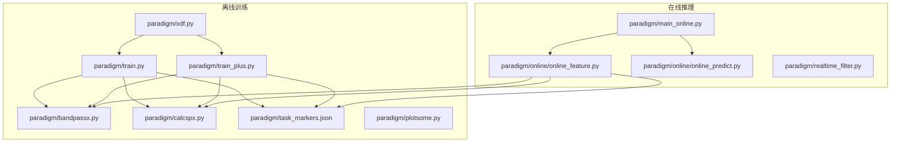
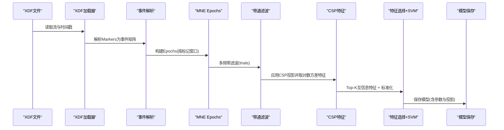
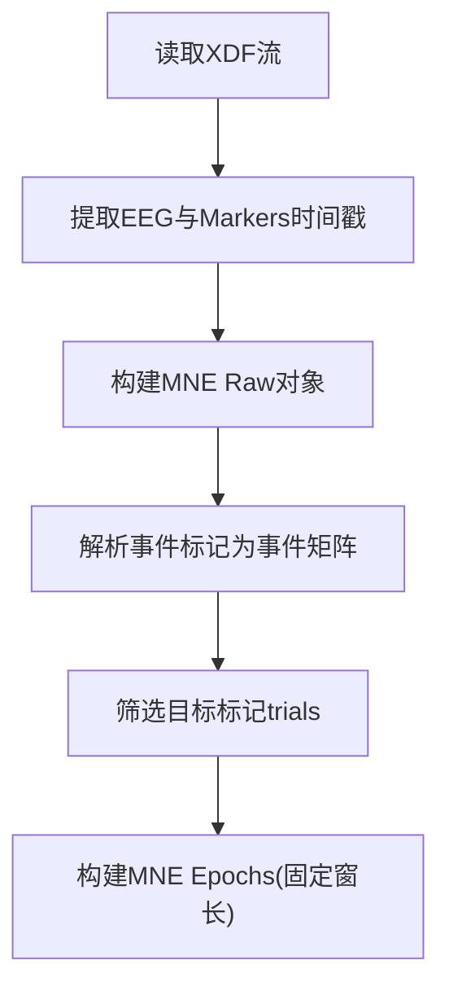
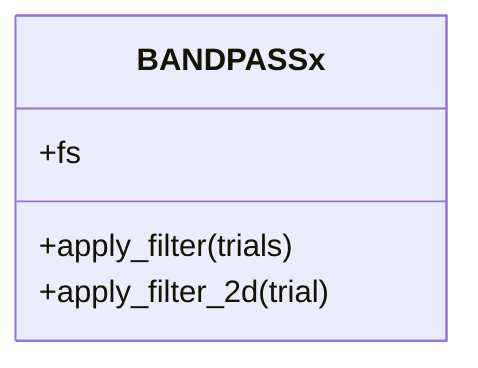
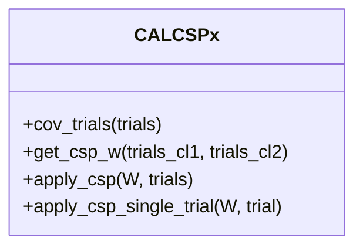
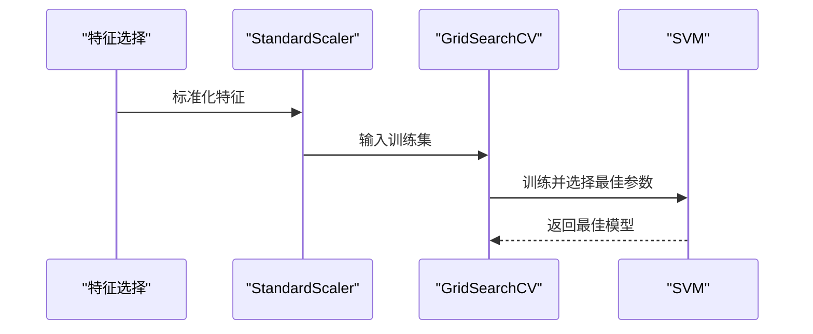
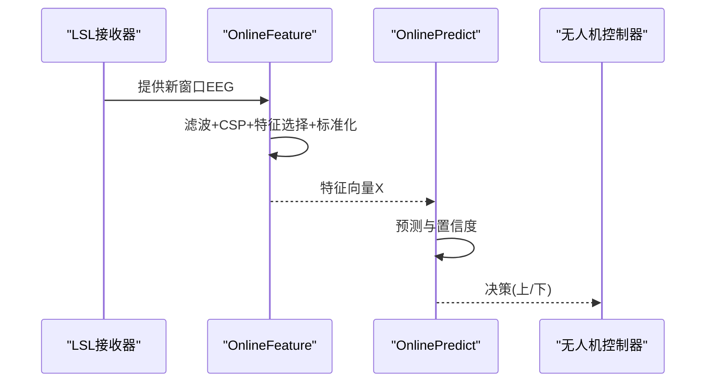
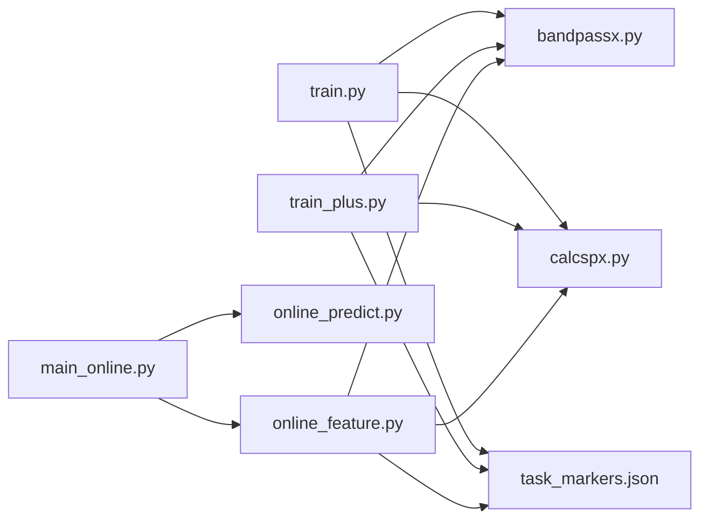

# 单数据集训练

<cite>
**本文引用的文件**
- [paradigm/train.py](file://paradigm/train.py)
- [paradigm/train_plus.py](file://paradigm/train_plus.py)
- [paradigm/xdf.py](file://paradigm/xdf.py)
- [paradigm/bandpassx.py](file://paradigm/bandpassx.py)
- [paradigm/calcspx.py](file://paradigm/calcspx.py)
- [paradigm/task_markers.json](file://paradigm/task_markers.json)
- [paradigm/plotsome.py](file://paradigm/plotsome.py)
- [paradigm/main_online.py](file://paradigm/main_online.py)
- [paradigm/realtime_filter.py](file://paradigm/realtime_filter.py)
- [paradigm/online/online_feature.py](file://paradigm/online/online_feature.py)
- [paradigm/online/online_predict.py](file://paradigm/online/online_predict.py)
</cite>

## 目录
1. [简介](#简介)
2. [项目结构](#项目结构)
3. [核心组件](#核心组件)
4. [架构总览](#架构总览)
5. [详细组件分析](#详细组件分析)
6. [依赖关系分析](#依赖关系分析)
7. [性能与参数配置](#性能与参数配置)
8. [训练数据质量控制与清洗](#训练数据质量控制与清洗)
9. [模型保存与部署准备](#模型保存与部署准备)
10. [故障排查指南](#故障排查指南)
11. [结论](#结论)

## 简介
本文件面向“单数据集训练”场景，系统性阐述从XDF文件加载数据、事件标记解析、MNE Epochs构建、带通滤波、CSP特征提取、SVM分类器训练与评估、以及模型保存与在线部署的完整流程。文档同时给出可操作的参数配置建议、质量控制与清洗最佳实践，帮助读者快速复现并扩展该流水线。

## 项目结构
本项目围绕“离线训练 + 在线推理”的BCI闭环展开，核心训练脚本位于 paradigm 目录下，配合滤波与CSP工具类、任务标记映射文件，以及在线推理模块共同构成端到端方案。

图表来源
- [paradigm/train.py:1-201](file://paradigm/train.py#L1-L201)
- [paradigm/train_plus.py:1-213](file://paradigm/train_plus.py#L1-L213)
- [paradigm/xdf.py:1-37](file://paradigm/xdf.py#L1-L37)
- [paradigm/bandpassx.py:1-79](file://paradigm/bandpassx.py#L1-L79)
- [paradigm/calcspx.py:1-87](file://paradigm/calcspx.py#L1-L87)
- [paradigm/task_markers.json:1-23](file://paradigm/task_markers.json#L1-L23)
- [paradigm/plotsome.py:1-135](file://paradigm/plotsome.py#L1-L135)
- [paradigm/main_online.py:1-97](file://paradigm/main_online.py#L1-L97)
- [paradigm/online/online_feature.py:1-52](file://paradigm/online/online_feature.py#L1-L52)
- [paradigm/online/online_predict.py:1-17](file://paradigm/online/online_predict.py#L1-L17)
- [paradigm/realtime_filter.py:1-32](file://paradigm/realtime_filter.py#L1-L32)

章节来源
- [paradigm/train.py:1-201](file://paradigm/train.py#L1-L201)
- [paradigm/train_plus.py:1-213](file://paradigm/train_plus.py#L1-L213)
- [paradigm/xdf.py:1-37](file://paradigm/xdf.py#L1-L37)
- [paradigm/bandpassx.py:1-79](file://paradigm/bandpassx.py#L1-L79)
- [paradigm/calcspx.py:1-87](file://paradigm/calcspx.py#L1-L87)
- [paradigm/task_markers.json:1-23](file://paradigm/task_markers.json#L1-L23)
- [paradigm/plotsome.py:1-135](file://paradigm/plotsome.py#L1-L135)
- [paradigm/main_online.py:1-97](file://paradigm/main_online.py#L1-L97)
- [paradigm/online/online_feature.py:1-52](file://paradigm/online/online_feature.py#L1-L52)
- [paradigm/online/online_predict.py:1-17](file://paradigm/online/online_predict.py#L1-L17)
- [paradigm/realtime_filter.py:1-32](file://paradigm/realtime_filter.py#L1-L32)

## 核心组件
- XDF数据加载与预处理：从XDF流中提取EEG与Markers，构建MNE Raw对象，解析事件标记，生成MNE Epochs。
- 带通滤波：按设定频带对每个trial进行滤波，支持多频带叠加特征。
- CSP特征提取：计算两类trial的协方差，求解广义特征值问题得到投影矩阵，应用到各trial并取特定导联分量做对数方差特征。
- 特征选择：基于互信息排序，选取Top-K特征，降低维度并提升判别性。
- 分类器训练：标准化后使用网格搜索+5折交叉验证训练SVM，输出最佳参数与评估指标。
- 模型保存与在线部署：将SVM、CSP投影、特征索引、滤波参数等打包保存，供在线推理模块加载并实时预测。

章节来源
- [paradigm/train.py:20-201](file://paradigm/train.py#L20-L201)
- [paradigm/train_plus.py:24-213](file://paradigm/train_plus.py#L24-L213)
- [paradigm/bandpassx.py:7-79](file://paradigm/bandpassx.py#L7-L79)
- [paradigm/calcspx.py:7-87](file://paradigm/calcspx.py#L7-L87)
- [paradigm/task_markers.json:1-23](file://paradigm/task_markers.json#L1-L23)

## 架构总览
下图展示了单数据集训练的端到端流程：XDF读取 -> 事件解析 -> Epochs构建 -> 多频带滤波 -> CSP特征 -> 特征选择 -> SVM训练 -> 模型保存。

图表来源
- [paradigm/train.py:42-199](file://paradigm/train.py#L42-L199)
- [paradigm/bandpassx.py:54-73](file://paradigm/bandpassx.py#L54-L73)
- [paradigm/calcspx.py:45-84](file://paradigm/calcspx.py#L45-L84)

## 详细组件分析

### XDF数据加载与事件解析
- 加载XDF：读取EEG与Markers流，提取时间戳与数值。
- 构建MNE Raw：根据采样率与通道名创建Raw对象，并设置10-20电极位置图。
- 事件解析：将Markers时间戳映射到最近的采样点，生成MNE事件矩阵，再筛选目标标记对应的trials。
- Epochs构建：以目标标记为起点/终点，截取固定窗长，形成训练样本。

图表来源
- [paradigm/train.py:42-97](file://paradigm/train.py#L42-L97)
- [paradigm/xdf.py:5-37](file://paradigm/xdf.py#L5-L37)

章节来源
- [paradigm/train.py:42-97](file://paradigm/train.py#L42-L97)
- [paradigm/xdf.py:5-37](file://paradigm/xdf.py#L5-L37)

### 带通滤波器应用
- 设计与应用：使用巴特沃斯滤波器设计，对每个trial沿时间轴进行零相位滤波。
- 多频带策略：按步长生成多个频带，每个频带独立滤波，随后在特征维度拼接。
- 实时滤波：在线模块提供因果滤波器，维护每通道状态，适合连续流式处理。

图表来源
- [paradigm/bandpassx.py:7-79](file://paradigm/bandpassx.py#L7-L79)

章节来源
- [paradigm/bandpassx.py:7-79](file://paradigm/bandpassx.py#L7-L79)
- [paradigm/realtime_filter.py:6-32](file://paradigm/realtime_filter.py#L6-L32)

### CSP特征提取
- 协方差计算：对每个trial做归一化协方差，按样本外积均值得到平均协方差，并添加小正则项增强稳定性。
- 广义特征值分解：对两类别平均协方差进行特征分解，得到投影矩阵W。
- 特征变换：将W应用于每个trial，取指定导联分量，计算对数方差作为特征向量。

图表来源
- [paradigm/calcspx.py:7-87](file://paradigm/calcspx.py#L7-L87)

章节来源
- [paradigm/calcspx.py:21-84](file://paradigm/calcspx.py#L21-L84)

### SVM分类器训练与评估
- 特征选择：使用互信息对特征重要性排序，选取Top-K特征。
- 标准化：对训练特征进行Z-score标准化。
- 网格搜索：对SVM的C、gamma、kernel进行网格搜索，5折交叉验证选择最佳参数。
- 评估：输出分类报告、混淆矩阵与AUC。

图表来源
- [paradigm/train.py:145-169](file://paradigm/train.py#L145-L169)
- [paradigm/train_plus.py:149-181](file://paradigm/train_plus.py#L149-L181)

章节来源
- [paradigm/train.py:145-183](file://paradigm/train.py#L145-L183)
- [paradigm/train_plus.py:149-192](file://paradigm/train_plus.py#L149-L192)

### 在线推理与部署
- 模型加载：在线主程序加载已保存的训练模型，读取采样率、窗长、滤波参数、CSP投影与特征索引。
- 特征提取：在线特征模块按相同策略对新窗口进行滤波、CSP变换、对数方差与特征选择，并标准化。
- 预测：使用SVM进行预测与置信度估计，结合滑动平均与稳定器做出最终决策。

图表来源
- [paradigm/main_online.py:18-97](file://paradigm/main_online.py#L18-L97)
- [paradigm/online/online_feature.py:20-52](file://paradigm/online/online_feature.py#L20-L52)
- [paradigm/online/online_predict.py:9-17](file://paradigm/online/online_predict.py#L9-L17)

章节来源
- [paradigm/main_online.py:18-97](file://paradigm/main_online.py#L18-L97)
- [paradigm/online/online_feature.py:20-52](file://paradigm/online/online_feature.py#L20-L52)
- [paradigm/online/online_predict.py:9-17](file://paradigm/online/online_predict.py#L9-L17)

## 依赖关系分析
- 训练脚本依赖：XDF加载、事件解析、MNE Epochs、带通滤波、CSP、互信息特征选择、SVM与网格搜索。
- 在线推理依赖：已保存模型、在线特征提取、在线预测、实时滤波（可选）。

图表来源
- [paradigm/train.py:108-116](file://paradigm/train.py#L108-L116)
- [paradigm/train_plus.py:110-119](file://paradigm/train_plus.py#L110-L119)
- [paradigm/online/online_feature.py:4-5](file://paradigm/online/online_feature.py#L4-L5)

章节来源
- [paradigm/train.py:108-116](file://paradigm/train.py#L108-L116)
- [paradigm/train_plus.py:110-119](file://paradigm/train_plus.py#L110-L119)
- [paradigm/online/online_feature.py:4-5](file://paradigm/online/online_feature.py#L4-L5)

## 性能与参数配置
- 采样率与通道数：训练脚本默认采样率为125 Hz，通道数为16；可根据设备调整。
- 试验窗口：信号窗起止时间由配置决定，建议与任务标记一致，避免基线干扰。
- 频带设置：多频带以步长生成，建议覆盖运动想象常用频段（如8–30 Hz），并考虑重叠以增强鲁棒性。
- CSP参数：导联选择索引可正可负，通常选择能量差异较大的前后导联组合；Top-K特征数量需平衡判别性与过拟合风险。
- SVM网格搜索：核函数、C、gamma的候选范围可按经验或更广范围探索；交叉验证折数影响稳定性与耗时。
- 在线推理：滑动平均窗口、稳定器长度与置信度阈值需结合实际任务校准。

章节来源
- [paradigm/train.py:28-40](file://paradigm/train.py#L28-L40)
- [paradigm/train_plus.py:37-52](file://paradigm/train_plus.py#L37-L52)
- [paradigm/train.py:154-158](file://paradigm/train.py#L154-L158)
- [paradigm/train_plus.py:166-170](file://paradigm/train_plus.py#L166-L170)
- [paradigm/main_online.py:44-49](file://paradigm/main_online.py#L44-L49)

## 训练数据质量控制与清洗
- 数据量级检查：训练脚本内置打印最大/最小/均值，便于快速发现异常。
- 事件匹配精度：使用最近邻采样点映射Marker时间戳，确保事件与信号同步。
- 通道与电极：设置标准10–20电极图，有助于后续分析与对比。
- 异常值与缺失：在线主循环对缓冲区进行填充检查；离线阶段可结合统计量与可视化工具（如PSD绘制）识别异常。
- 频谱分析：可使用PSD工具对CSP前后信号进行频谱对比，辅助判断滤波与CSP效果。

章节来源
- [paradigm/train.py:50-57](file://paradigm/train.py#L50-L57)
- [paradigm/train.py:64-69](file://paradigm/train.py#L64-L69)
- [paradigm/plotsome.py:19-54](file://paradigm/plotsome.py#L19-L54)

## 模型保存与部署准备
- 保存内容：SVM分类器、各频带CSP投影矩阵、互信息特征索引、滤波参数、采样率、窗长、CSP导联索引、标准化器。
- 保存格式：使用pickle序列化，便于直接加载。
- 在线加载：在线主程序读取模型并初始化特征提取与预测模块，保证训练与推理参数一致。
- 部署建议：将模型与依赖版本固化，提供参数校准接口，确保不同设备间一致性。

章节来源
- [paradigm/train.py:184-199](file://paradigm/train.py#L184-L199)
- [paradigm/main_online.py:18-38](file://paradigm/main_online.py#L18-L38)
- [paradigm/online/online_feature.py:9-18](file://paradigm/online/online_feature.py#L9-L18)

## 故障排查指南
- 事件未匹配：检查任务标记映射文件与事件时间戳是否对应；确认MNE事件矩阵的采样点映射。
- Epochs为空：确认标记类型与窗长设置；检查基线与截取边界。
- CSP矩阵奇异：检查协方差正则项与样本数；确保两类trials数量均衡。
- 特征全零或异常：检查滤波参数与导联索引；确认CSP变换后方差非零。
- SVM过拟合：增大交叉验证折数、缩小特征维数、调整SVM正则化参数。
- 在线预测不稳定：调整置信度阈值、滑动平均窗口与稳定器长度；检查实时滤波状态初始化。

章节来源
- [paradigm/train.py:75-81](file://paradigm/train.py#L75-L81)
- [paradigm/calcspx.py:40-43](file://paradigm/calcspx.py#L40-L43)
- [paradigm/main_online.py:58-82](file://paradigm/main_online.py#L58-L82)

## 结论
该单数据集训练流程以XDF为入口，结合MNE事件解析与Epochs构建，采用多频带带通滤波与CSP对数方差特征，辅以互信息特征选择与SVM网格搜索训练，最终形成可部署的模型。通过严格的参数配置、质量控制与在线一致性保障，可在离线验证与在线应用之间建立稳健桥梁。