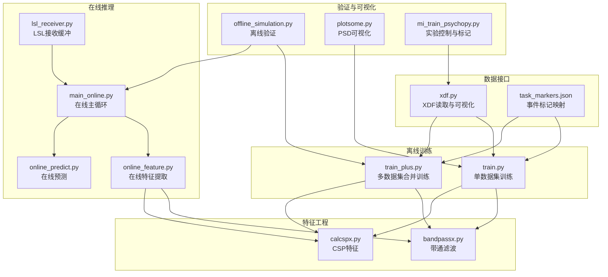
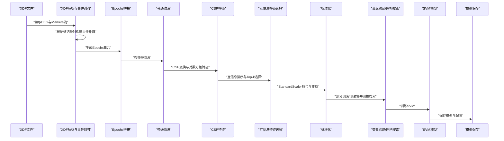
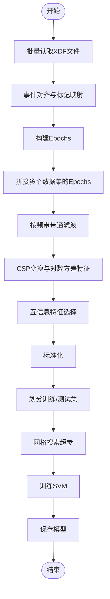
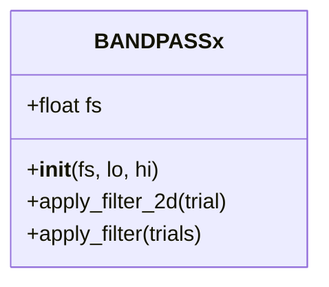
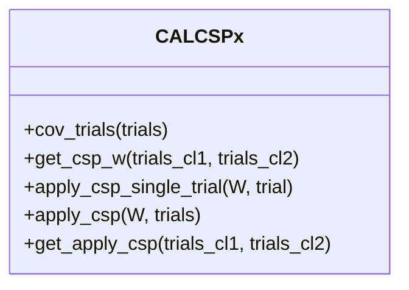
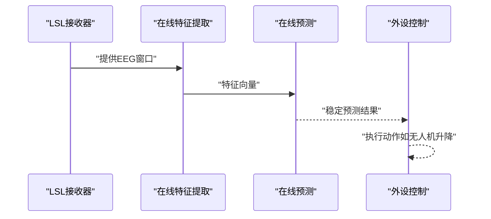
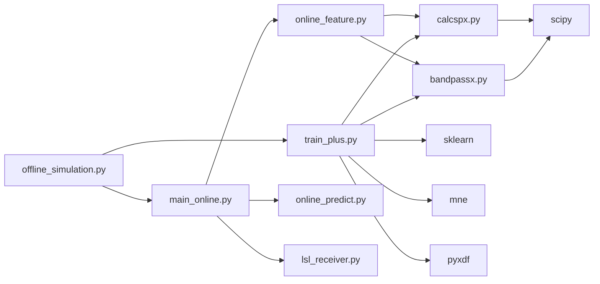

# 多数据集合并训练

<cite>
**本文引用的文件**
- [paradigm/xdf.py](file://paradigm/xdf.py)
- [paradigm/train.py](file://paradigm/train.py)
- [paradigm/train_plus.py](file://paradigm/train_plus.py)
- [paradigm/calcspx.py](file://paradigm/calcspx.py)
- [paradigm/bandpassx.py](file://paradigm/bandpassx.py)
- [paradigm/task_markers.json](file://paradigm/task_markers.json)
- [paradigm/offline_simulation.py](file://paradigm/offline_simulation.py)
- [paradigm/main_online.py](file://paradigm/main_online.py)
- [paradigm/online/lsl_receiver.py](file://paradigm/online/lsl_receiver.py)
- [paradigm/online/online_feature.py](file://paradigm/online/online_feature.py)
- [paradigm/online/online_predict.py](file://paradigm/online/online_predict.py)
- [paradigm/plotsome.py](file://paradigm/plotsome.py)
- [paradigm/mi_train_psychopy.py](file://paradigm/mi_train_psychopy.py)
</cite>

## 目录
1. [引言](#引言)
2. [项目结构](#项目结构)
3. [核心组件](#核心组件)
4. [架构总览](#架构总览)
5. [详细组件分析](#详细组件分析)
6. [依赖分析](#依赖分析)
7. [性能考虑](#性能考虑)
8. [故障排查指南](#故障排查指南)
9. [结论](#结论)
10. [附录](#附录)

## 引言
本文件围绕“多数据集合并训练”主题，系统梳理并解释以下关键能力与流程：
- 多个XDF数据集的合并策略与数据对齐方法（时间戳同步、事件标记映射、数据格式统一）
- 跨数据集的特征标准化技术（统计参数计算、数据归一化、特征空间对齐）
- 交叉验证在多数据集环境下的实施方法（数据分割策略、验证集构建、性能评估流程）
- 数据集间差异处理（采样率不匹配、通道数量差异、实验条件变化）
- 多数据集训练的参数配置指南（权重分配、数据平衡、噪声处理策略）
- 数据质量评估、异常检测与数据清洗的高级技术
- 模型集成方法与性能提升策略

上述内容均基于仓库中的离线训练脚本、特征工程模块、在线推理模块与相关工具函数进行归纳总结。

## 项目结构
本项目以“范式（paradigm）”为核心目录，包含离线训练、在线推理、滤波与特征提取、可视化与实验控制等子模块。与多数据集合并训练直接相关的关键文件如下：
- 离线训练与合并：paradigm/train.py、paradigm/train_plus.py
- 特征工程：paradigm/bandpassx.py（带通滤波）、paradigm/calcspx.py（CSP）
- 数据接口与标注：paradigm/xdf.py、paradigm/task_markers.json
- 在线推理与验证：paradigm/main_online.py、paradigm/offline_simulation.py、paradigm/online/*
- 可视化与辅助：paradigm/plotsome.py、paradigm/mi_train_psychopy.py

图表来源
- [paradigm/train.py:1-201](file://paradigm/train.py#L1-L201)
- [paradigm/train_plus.py:1-213](file://paradigm/train_plus.py#L1-L213)
- [paradigm/bandpassx.py:1-79](file://paradigm/bandpassx.py#L1-L79)
- [paradigm/calcspx.py:1-87](file://paradigm/calcspx.py#L1-L87)
- [paradigm/xdf.py:1-37](file://paradigm/xdf.py#L1-L37)
- [paradigm/task_markers.json:1-23](file://paradigm/task_markers.json#L1-L23)
- [paradigm/main_online.py:1-97](file://paradigm/main_online.py#L1-L97)
- [paradigm/online/online_feature.py:1-52](file://paradigm/online/online_feature.py#L1-L52)
- [paradigm/online/online_predict.py:1-17](file://paradigm/online/online_predict.py#L1-L17)
- [paradigm/online/lsl_receiver.py:1-32](file://paradigm/online/lsl_receiver.py#L1-L32)
- [paradigm/offline_simulation.py:1-195](file://paradigm/offline_simulation.py#L1-L195)
- [paradigm/plotsome.py:1-135](file://paradigm/plotsome.py#L1-L135)
- [paradigm/mi_train_psychopy.py:1-229](file://paradigm/mi_train_psychopy.py#L1-L229)

章节来源
- [paradigm/train.py:1-201](file://paradigm/train.py#L1-L201)
- [paradigm/train_plus.py:1-213](file://paradigm/train_plus.py#L1-L213)
- [paradigm/bandpassx.py:1-79](file://paradigm/bandpassx.py#L1-L79)
- [paradigm/calcspx.py:1-87](file://paradigm/calcspx.py#L1-L87)
- [paradigm/xdf.py:1-37](file://paradigm/xdf.py#L1-L37)
- [paradigm/task_markers.json:1-23](file://paradigm/task_markers.json#L1-L23)
- [paradigm/main_online.py:1-97](file://paradigm/main_online.py#L1-L97)
- [paradigm/online/online_feature.py:1-52](file://paradigm/online/online_feature.py#L1-L52)
- [paradigm/online/online_predict.py:1-17](file://paradigm/online/online_predict.py#L1-L17)
- [paradigm/online/lsl_receiver.py:1-32](file://paradigm/online/lsl_receiver.py#L1-L32)
- [paradigm/offline_simulation.py:1-195](file://paradigm/offline_simulation.py#L1-L195)
- [paradigm/plotsome.py:1-135](file://paradigm/plotsome.py#L1-L135)
- [paradigm/mi_train_psychopy.py:1-229](file://paradigm/mi_train_psychopy.py#L1-L229)

## 核心组件
- 多数据集合并训练管线（train_plus.py）：批量读取多个XDF文件，统一采样率与通道数，对齐事件标记，拼接Epochs，提取带通信号与CSP对数方差特征，进行互信息特征选择与标准化，划分训练/测试集并网格搜索SVM超参，保存模型。
- 单数据集训练管线（train.py）：演示相同流程在单数据集上的实现，便于理解各阶段输入输出与中间变量。
- 特征工程模块：
  - 带通滤波（bandpassx.BANDPASSx）：设计Butterworth带通滤波器，对3D信号（通道x样本x试验）逐试验滤波。
  - CSP特征（calcspx.CALCSPx）：计算每类试验的协方差并求平均，正则化后求解广义特征值问题得到混合矩阵W，对试验应用CSP变换并提取对数方差特征。
- 数据接口与标注（xdf.py、task_markers.json）：解析XDF流，提取EEG与Markers，依据标记映射构建MNE事件矩阵，构造Raw与Epochs对象。
- 在线推理与验证（main_online.py、offline_simulation.py、online/*）：加载已训练模型，实时接收EEG窗口，提取特征并预测，结合置信度平滑与稳定性判据驱动外设或进行离线验证。

章节来源
- [paradigm/train_plus.py:55-98](file://paradigm/train_plus.py#L55-L98)
- [paradigm/train.py:42-98](file://paradigm/train.py#L42-L98)
- [paradigm/bandpassx.py:7-79](file://paradigm/bandpassx.py#L7-L79)
- [paradigm/calcspx.py:7-87](file://paradigm/calcspx.py#L7-L87)
- [paradigm/xdf.py:5-37](file://paradigm/xdf.py#L5-L37)
- [paradigm/task_markers.json:1-23](file://paradigm/task_markers.json#L1-L23)
- [paradigm/main_online.py:1-97](file://paradigm/main_online.py#L1-L97)
- [paradigm/offline_simulation.py:1-195](file://paradigm/offline_simulation.py#L1-L195)
- [paradigm/online/online_feature.py:1-52](file://paradigm/online/online_feature.py#L1-L52)
- [paradigm/online/online_predict.py:1-17](file://paradigm/online/online_predict.py#L1-L17)
- [paradigm/online/lsl_receiver.py:1-32](file://paradigm/online/lsl_receiver.py#L1-L32)

## 架构总览
下图展示了多数据集合并训练的端到端流程：从XDF读取、事件对齐、Epochs拼接，到特征提取、标准化与模型训练，再到在线推理与离线验证。

图表来源
- [paradigm/train_plus.py:55-98](file://paradigm/train_plus.py#L55-L98)
- [paradigm/bandpassx.py:54-73](file://paradigm/bandpassx.py#L54-L73)
- [paradigm/calcspx.py:69-84](file://paradigm/calcspx.py#L69-L84)
- [paradigm/train_plus.py:154-181](file://paradigm/train_plus.py#L154-L181)
- [paradigm/train_plus.py:194-210](file://paradigm/train_plus.py#L194-L210)

## 详细组件分析

### 多数据集合并与对齐（train_plus.py）
- 批量读取XDF：遍历文件列表，分别解析EEG与Markers流，统一采样率与通道数，构建MNE Raw与Epochs。
- 事件对齐与标记映射：依据task_markers.json中的映射，将标记时间戳转换为样本索引，生成事件矩阵并筛选目标事件区间。
- Epochs拼接：使用mne.concatenate_epochs将多个数据集的Epochs合并为一个大集合，保证后续特征提取与训练的一致性。
- 特征工程与训练：对每个频带进行滤波，计算CSP混合矩阵并提取对数方差特征，进行互信息特征选择与标准化，划分训练/测试集并网格搜索SVM超参，保存模型。

图表来源
- [paradigm/train_plus.py:55-98](file://paradigm/train_plus.py#L55-L98)
- [paradigm/train_plus.py:109-147](file://paradigm/train_plus.py#L109-L147)
- [paradigm/train_plus.py:154-181](file://paradigm/train_plus.py#L154-L181)
- [paradigm/train_plus.py:194-210](file://paradigm/train_plus.py#L194-L210)

章节来源
- [paradigm/train_plus.py:27-98](file://paradigm/train_plus.py#L27-L98)
- [paradigm/train_plus.py:109-181](file://paradigm/train_plus.py#L109-L181)
- [paradigm/train_plus.py:194-210](file://paradigm/train_plus.py#L194-L210)

### 单数据集训练对比（train.py）
- 与train_plus.py类似，但仅处理单个XDF文件，便于理解每个阶段的输入输出与中间变量。
- 展示了调试打印、事件对齐、Epochs构建、带通滤波、CSP与对数方差特征、互信息特征选择、标准化与SVM训练的完整流程。

章节来源
- [paradigm/train.py:42-98](file://paradigm/train.py#L42-L98)
- [paradigm/train.py:107-144](file://paradigm/train.py#L107-L144)
- [paradigm/train.py:150-183](file://paradigm/train.py#L150-L183)

### 带通滤波（bandpassx.BANDPASSx）
- 设计Butterworth带通滤波器，支持2D与3D输入，沿样本轴进行零相位滤波（filtfilt），保证时域无失真。
- 适用于单试验与多试验场景，是CSP特征提取前的关键预处理步骤。

图表来源
- [paradigm/bandpassx.py:7-79](file://paradigm/bandpassx.py#L7-L79)

章节来源
- [paradigm/bandpassx.py:7-79](file://paradigm/bandpassx.py#L7-L79)

### CSP特征（calcspx.CALCSPx）
- 计算每类试验的协方差并平均，进行正则化以提升数值稳定性。
- 求解广义特征值问题得到混合矩阵W，对试验应用CSP变换，提取特定通道索引的对数方差作为特征。

图表来源
- [paradigm/calcspx.py:7-87](file://paradigm/calcspx.py#L7-L87)

章节来源
- [paradigm/calcspx.py:21-60](file://paradigm/calcspx.py#L21-L60)
- [paradigm/calcspx.py:62-84](file://paradigm/calcspx.py#L62-L84)

### 事件标记映射与XDF解析（xdf.py、task_markers.json）
- xdf.py演示了如何解析XDF流，提取EEG与Markers，打印通道信息与采样率，并基于MNE创建Raw对象。
- task_markers.json定义了各类任务标记与其对应的数值，用于事件对齐与Epochs构建。

章节来源
- [paradigm/xdf.py:5-37](file://paradigm/xdf.py#L5-L37)
- [paradigm/task_markers.json:1-23](file://paradigm/task_markers.json#L1-L23)

### 在线推理与离线验证（main_online.py、offline_simulation.py、online/*）
- main_online.py：加载模型，初始化LSL接收器、在线特征提取器与预测器，实现置信度平滑与稳定性判据，驱动外设动作。
- offline_simulation.py：加载已训练模型，对XDF数据进行窗口化滑动与特征提取，结合置信度平滑与阈值策略进行离线验证与统计。
- online_feature.py：在线特征提取，复用训练时的滤波与CSP配置，进行标准化与特征选择。
- online_predict.py：基于SVM模型进行预测与置信度输出。

图表来源
- [paradigm/main_online.py:32-96](file://paradigm/main_online.py#L32-L96)
- [paradigm/online/online_feature.py:20-52](file://paradigm/online/online_feature.py#L20-L52)
- [paradigm/online/online_predict.py:9-17](file://paradigm/online/online_predict.py#L9-L17)
- [paradigm/online/lsl_receiver.py:23-32](file://paradigm/online/lsl_receiver.py#L23-L32)

章节来源
- [paradigm/main_online.py:1-97](file://paradigm/main_online.py#L1-L97)
- [paradigm/offline_simulation.py:48-179](file://paradigm/offline_simulation.py#L48-L179)
- [paradigm/online/online_feature.py:1-52](file://paradigm/online/online_feature.py#L1-L52)
- [paradigm/online/online_predict.py:1-17](file://paradigm/online/online_predict.py#L1-L17)
- [paradigm/online/lsl_receiver.py:1-32](file://paradigm/online/lsl_receiver.py#L1-L32)

### 实验控制与标记（mi_train_psychopy.py）
- 使用Psychopy呈现实验界面，通过LSL推送标记（如trial_start/trial_end、curctrl_up/down等），并与task_markers.json中的映射一致，确保离线与在线标记体系统一。

章节来源
- [paradigm/mi_train_psychopy.py:1-229](file://paradigm/mi_train_psychopy.py#L1-L229)
- [paradigm/task_markers.json:1-23](file://paradigm/task_markers.json#L1-L23)

## 依赖分析
- 组件耦合关系
  - train_plus.py依赖bandpassx与calcspx进行特征提取，依赖mne进行事件对齐与Epochs拼接，依赖sklearn进行特征选择、标准化与SVM训练。
  - main_online.py依赖online_feature与online_predict，后者依赖已训练模型中的配置（滤波带、CSP混合矩阵、标准化器、特征索引等）。
  - offline_simulation.py与main_online.py共享相同的特征提取与预测流程，用于离线验证。
- 外部依赖
  - pyxdf：XDF文件解析
  - mne：Raw与Epochs对象、事件对齐
  - scikit-learn：标准化、特征选择、SVM与网格搜索
  - scipy：滤波器设计与信号处理
  - pylsl：在线数据流接收（在线模块）

图表来源
- [paradigm/train_plus.py:1-213](file://paradigm/train_plus.py#L1-L213)
- [paradigm/bandpassx.py:1-79](file://paradigm/bandpassx.py#L1-L79)
- [paradigm/calcspx.py:1-87](file://paradigm/calcspx.py#L1-L87)
- [paradigm/main_online.py:1-97](file://paradigm/main_online.py#L1-L97)
- [paradigm/online/online_feature.py:1-52](file://paradigm/online/online_feature.py#L1-L52)
- [paradigm/online/online_predict.py:1-17](file://paradigm/online/online_predict.py#L1-L17)
- [paradigm/online/lsl_receiver.py:1-32](file://paradigm/online/lsl_receiver.py#L1-L32)
- [paradigm/offline_simulation.py:1-195](file://paradigm/offline_simulation.py#L1-L195)

章节来源
- [paradigm/train_plus.py:1-213](file://paradigm/train_plus.py#L1-L213)
- [paradigm/main_online.py:1-97](file://paradigm/main_online.py#L1-L97)
- [paradigm/online/online_feature.py:1-52](file://paradigm/online/online_feature.py#L1-L52)
- [paradigm/online/online_predict.py:1-17](file://paradigm/online/online_predict.py#L1-L17)
- [paradigm/online/lsl_receiver.py:1-32](file://paradigm/online/lsl_receiver.py#L1-L32)
- [paradigm/offline_simulation.py:1-195](file://paradigm/offline_simulation.py#L1-L195)

## 性能考虑
- 计算复杂度
  - 带通滤波：对每个试验沿样本轴滤波，复杂度近似O(T·C·N)，其中T为样本数、C为通道数、N为试验数。
  - CSP协方差与特征分解：每类协方差平均与特征值分解，复杂度近似O(C^3·N)，受通道维数主导。
  - SVM训练：与样本数与特征维数相关，网格搜索会显著增加计算开销。
- 优化建议
  - 频带划分与重叠：合理设置频带宽度与步长，减少冗余计算。
  - 特征选择：使用互信息快速筛选Top-k特征，降低维度灾难。
  - 并行化：对不同频带或不同试验的滤波与CSP可并行处理（需注意内存与线程安全）。
  - 缓存与增量：对已训练的CSP混合矩阵与标准化器进行持久化，避免重复计算。

## 故障排查指南
- 事件对齐失败
  - 现象：事件样本索引越界或缺失。
  - 排查：确认Markers时间戳与EEG时间戳对齐方式，检查task_markers.json中的标记映射是否与实际一致。
- 采样率不一致
  - 现象：拼接Epochs时报错或特征维度不匹配。
  - 解决：在读取XDF时统一采样率，必要时对不同数据集进行重采样或对齐策略。
- 通道数量差异
  - 现象：CSP混合矩阵维度不匹配。
  - 解决：确保所有数据集使用相同通道集合与顺序，缺失通道补零或删除多余通道。
- 标记映射不一致
  - 现象：事件类别标签错误或为空。
  - 解决：核对task_markers.json与实验脚本（如mi_train_psychopy.py）中的标记定义，保持一致性。
- 在线预测不稳定
  - 现象：频繁切换预测或误判。
  - 解决：调整置信度阈值与平滑窗口，增加稳定性判据（连续次数）。

章节来源
- [paradigm/train_plus.py:75-85](file://paradigm/train_plus.py#L75-L85)
- [paradigm/task_markers.json:1-23](file://paradigm/task_markers.json#L1-L23)
- [paradigm/mi_train_psychopy.py:125-129](file://paradigm/mi_train_psychopy.py#L125-L129)
- [paradigm/main_online.py:44-49](file://paradigm/main_online.py#L44-L49)
- [paradigm/offline_simulation.py:134-142](file://paradigm/offline_simulation.py#L134-L142)

## 结论
本项目提供了完整的多数据集合并训练与在线推理框架：从XDF解析、事件对齐、Epochs拼接，到带通滤波、CSP特征提取、互信息特征选择与标准化，再到SVM训练与模型保存；同时配套在线主循环与离线验证流程，支持置信度平滑与稳定性判据。通过统一的标记映射与特征工程配置，能够有效处理多数据集间的差异并提升模型泛化性能。

## 附录

### 多数据集合并训练参数配置指南
- 数据层面
  - 采样率统一：在读取XDF时设定统一fs，确保所有数据集一致。
  - 通道对齐：统一通道名称与顺序，缺失通道补零或裁剪多余通道。
  - 事件标记映射：严格遵循task_markers.json，确保事件对齐与Epochs构建正确。
- 特征层面
  - 频带范围与步长：根据任务需求设置滤波带宽与重叠比例。
  - CSP特征索引：根据通道布局与感兴趣区域选择合适的特征通道索引。
  - 互信息特征选择：设置Top-k特征数量，平衡模型性能与计算成本。
- 训练层面
  - 标准化：使用StandardScaler对训练集拟合，对测试集与在线数据进行transform。
  - 分割策略：采用分层抽样（stratify）划分训练/测试集，保证类别分布一致。
  - 交叉验证：使用网格搜索进行超参搜索，结合分层K折交叉验证评估稳定性。
- 在线层面
  - 置信度阈值与平滑窗口：根据离线验证结果调整阈值与滑动平均窗口大小。
  - 稳定性判据：设置连续次数阈值，避免误触发。

章节来源
- [paradigm/train_plus.py:27-53](file://paradigm/train_plus.py#L27-L53)
- [paradigm/train_plus.py:154-181](file://paradigm/train_plus.py#L154-L181)
- [paradigm/main_online.py:44-49](file://paradigm/main_online.py#L44-L49)
- [paradigm/offline_simulation.py:134-142](file://paradigm/offline_simulation.py#L134-L142)

### 数据质量评估、异常检测与清洗
- 功率谱密度（PSD）可视化：使用plotsome.PLOTSOMEx对CSP后的信号进行PSD分析，识别异常频段与伪迹。
- 异常检测：基于统计阈值（如均值±N倍标准差）或机器学习方法识别异常窗口。
- 数据清洗：剔除明显伪迹（如肌电、眨眼）或使用滤波进一步抑制干扰；对缺失通道进行插值或删除。

章节来源
- [paradigm/plotsome.py:19-54](file://paradigm/plotsome.py#L19-L54)
- [paradigm/plotsome.py:111-129](file://paradigm/plotsome.py#L111-L129)

### 模型集成与性能提升策略
- 集成方法：对多个频带的特征向量进行拼接或加权融合；对不同数据集训练的模型进行投票或加权平均。
- 性能提升：增加数据增强（如时移、幅值扰动）、引入更复杂的分类器（如XGBoost、神经网络）、多模态特征融合（如加入眼电、呼吸等）。

[本节为概念性建议，无需源码引用]