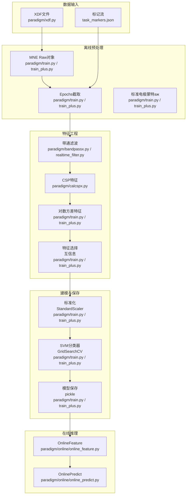
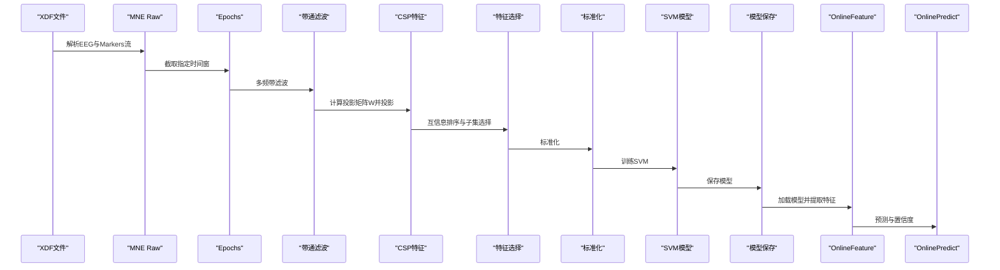
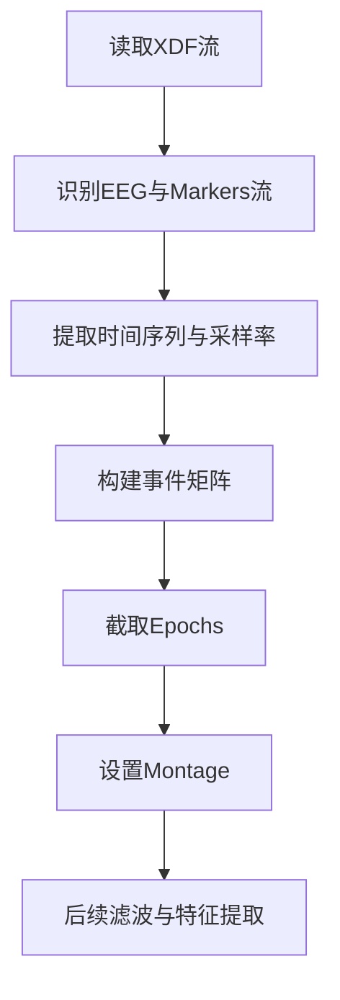
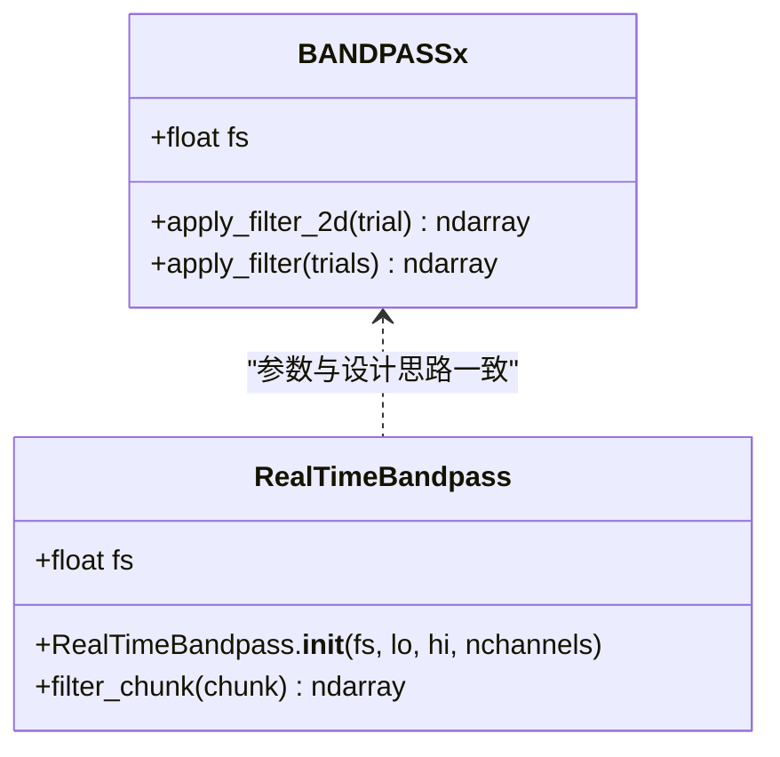
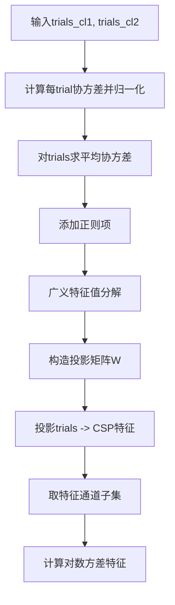
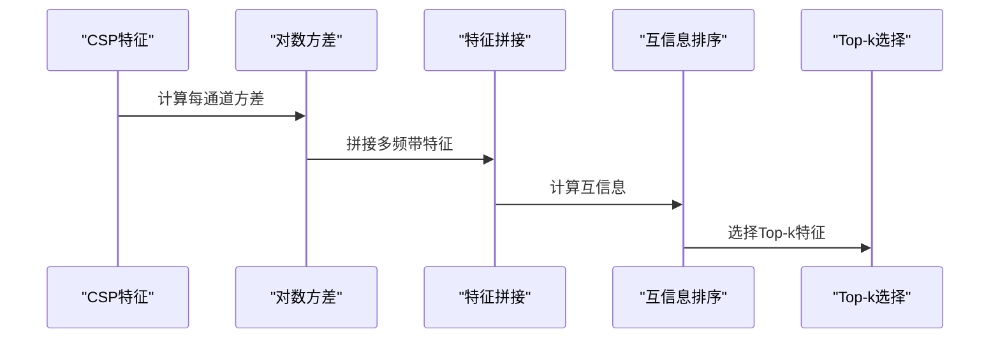
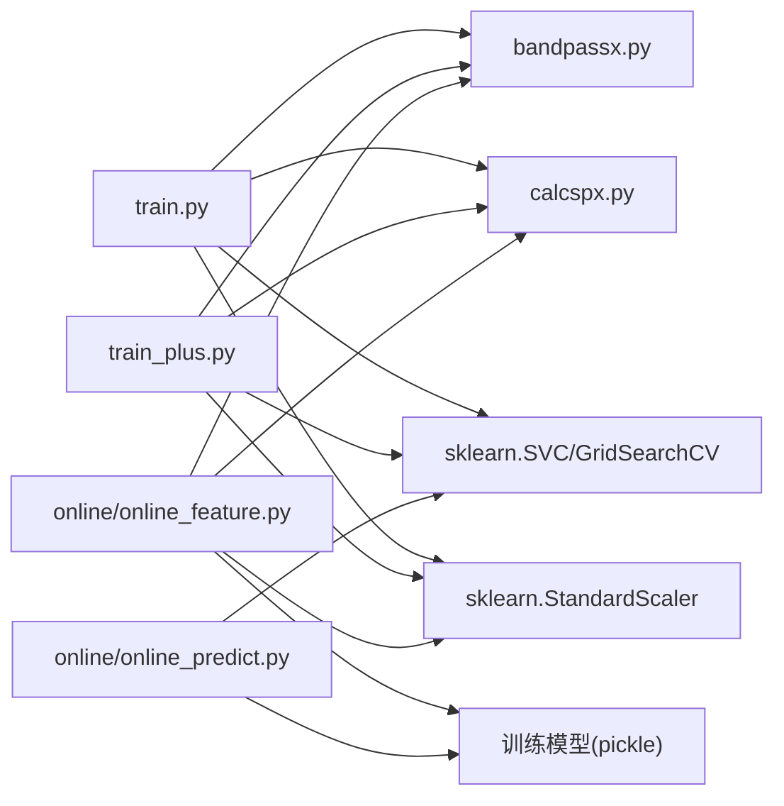

# 数据处理与预处理

<cite>
**本文引用的文件**
- [paradigm/xdf.py](file://paradigm/xdf.py)
- [paradigm/bandpassx.py](file://paradigm/bandpassx.py)
- [paradigm/calcspx.py](file://paradigm/calcspx.py)
- [paradigm/realtime_filter.py](file://paradigm/realtime_filter.py)
- [paradigm/train.py](file://paradigm/train.py)
- [paradigm/train_plus.py](file://paradigm/train_plus.py)
- [paradigm/online/online_feature.py](file://paradigm/online/online_feature.py)
- [paradigm/online/online_predict.py](file://paradigm/online/online_predict.py)
- [paradigm/plotsome.py](file://paradigm/plotsome.py)
- [paradigm/debugPrinter.py](file://paradigm/debugPrinter.py)
- [paradigm/task_markers.json](file://paradigm/task_markers.json)
</cite>

## 目录
1. [简介](#简介)
2. [项目结构](#项目结构)
3. [核心组件](#核心组件)
4. [架构总览](#架构总览)
5. [详细组件分析](#详细组件分析)
6. [依赖分析](#依赖分析)
7. [性能考虑](#性能考虑)
8. [故障排查指南](#故障排查指南)
9. [结论](#结论)
10. [附录](#附录)

## 简介
本文件系统性梳理本仓库中的数据处理与预处理流程，覆盖以下主题：
- XDF文件格式解析：文件结构、流信息提取、时间戳处理
- EEG数据预处理：数据格式转换、通道重命名、Montage设置
- 带通滤波器设计与实现：参数设置、频率响应特性与时域滤波效果
- CSP算法：数学原理、协方差矩阵计算、特征值分解与投影矩阵优化
- 数据质量控制：基线校正、伪迹检测与剔除策略
- 特征工程：特征选择、降维与特征组合策略
- 数据标准化与归一化：统计参数与变换方法

## 项目结构
本项目围绕“离线训练-在线推理”两条主线组织，核心模块如下：
- 数据加载与预处理：XDF解析、事件构建、Epochs截取、Montage设置
- 滤波与特征：带通滤波、CSP特征提取、对数方差特征
- 特征选择与建模：互信息排序、特征子集选择、SVM分类器训练与网格搜索
- 在线流水线：实时滤波、特征提取、标准化与预测
- 可视化与调试：PSD估计、绘图工具、调试打印

图表来源
- [paradigm/xdf.py:1-37](file://paradigm/xdf.py#L1-L37)
- [paradigm/train.py:42-148](file://paradigm/train.py#L42-L148)
- [paradigm/train_plus.py:55-152](file://paradigm/train_plus.py#L55-L152)
- [paradigm/bandpassx.py:7-79](file://paradigm/bandpassx.py#L7-L79)
- [paradigm/calcspx.py:7-87](file://paradigm/calcspx.py#L7-L87)
- [paradigm/online/online_feature.py:7-52](file://paradigm/online/online_feature.py#L7-L52)
- [paradigm/online/online_predict.py:3-17](file://paradigm/online/online_predict.py#L3-L17)

章节来源
- [paradigm/xdf.py:1-37](file://paradigm/xdf.py#L1-L37)
- [paradigm/train.py:42-148](file://paradigm/train.py#L42-L148)
- [paradigm/train_plus.py:55-152](file://paradigm/train_plus.py#L55-L152)

## 核心组件
- XDF解析与事件构建：从XDF中提取EEG与Markers流，构建MNE事件矩阵，截取Epochs
- 带通滤波器：FIR/FIR滤波器设计与应用，支持离线批处理与在线因果滤波
- CSP特征提取：协方差矩阵平均、正则化、广义特征值分解、投影矩阵与对数方差特征
- 特征工程：互信息特征选择、特征子集选择、降维与特征组合
- 标准化与建模：StandardScaler标准化、SVM分类器与网格搜索
- 在线流水线：实时特征提取、标准化与预测

章节来源
- [paradigm/bandpassx.py:7-79](file://paradigm/bandpassx.py#L7-L79)
- [paradigm/calcspx.py:7-87](file://paradigm/calcspx.py#L7-L87)
- [paradigm/train.py:145-169](file://paradigm/train.py#L145-L169)
- [paradigm/train_plus.py:149-181](file://paradigm/train_plus.py#L149-L181)
- [paradigm/online/online_feature.py:7-52](file://paradigm/online/online_feature.py#L7-L52)

## 架构总览
下图展示了从XDF到在线预测的完整数据流：XDF解析与事件构建 -> Epochs截取与Montage -> 带通滤波 -> CSP特征 -> 特征选择 -> 标准化 -> SVM训练 -> 模型保存 -> 在线特征提取与预测。

图表来源
- [paradigm/train.py:42-148](file://paradigm/train.py#L42-L148)
- [paradigm/train_plus.py:55-152](file://paradigm/train_plus.py#L55-L152)
- [paradigm/online/online_feature.py:20-52](file://paradigm/online/online_feature.py#L20-L52)
- [paradigm/online/online_predict.py:9-17](file://paradigm/online/online_predict.py#L9-L17)

## 详细组件分析

### XDF文件格式解析与事件构建
- 文件结构分析
  - 使用pyxdf加载XDF，遍历streams，识别类型为“EEG”和“Markers”的流
  - 从EEG流获取时间序列数据与采样率，从Markers流获取标记时间戳与标记值
- 事件构建
  - 使用MNE创建事件矩阵，格式为三列：[样本索引, 0, 事件码]
  - 通过标记值映射到事件码，筛选目标事件（如起止标记）
- 时间戳处理
  - 将Marker时间戳与EEG时间戳对齐，通过搜索最近样本索引构建事件
- Epochs截取与Montage
  - 使用MNE Epochs在指定时间窗内截取数据，baseline=None表示不进行基线校正
  - 设置标准10-20电极位置，缺失电极忽略

图表来源
- [paradigm/xdf.py:5-37](file://paradigm/xdf.py#L5-L37)
- [paradigm/train.py:63-98](file://paradigm/train.py#L63-L98)
- [paradigm/train_plus.py:69-94](file://paradigm/train_plus.py#L69-L94)

章节来源
- [paradigm/xdf.py:5-37](file://paradigm/xdf.py#L5-L37)
- [paradigm/train.py:63-98](file://paradigm/train.py#L63-L98)
- [paradigm/train_plus.py:69-94](file://paradigm/train_plus.py#L69-L94)
- [paradigm/task_markers.json:1-23](file://paradigm/task_markers.json#L1-L23)

### EEG数据预处理：格式转换、通道重命名与Montage设置
- 数据格式转换
  - 将XDF中的时间序列转置为通道×样本的矩阵，便于后续处理
- 通道重命名
  - 使用MNE创建info时，将通道名设置为“Ch1”、“Ch2”等，便于可视化与分析
- Montage设置
  - 使用标准10-20电极蒙特аж，缺失电极忽略，确保空间一致性

章节来源
- [paradigm/train.py:64-69](file://paradigm/train.py#L64-L69)
- [paradigm/train_plus.py:69-73](file://paradigm/train_plus.py#L69-L73)

### 带通滤波器设计与实现
- 设计与参数
  - 使用巴特沃斯滤波器（Butterworth），阶数为4，带通范围由低频与高频边界定义
  - 归一化截止频率为边界频率除以奈奎斯特频率（采样率的一半）
- 时域滤波
  - 离线批处理：使用零相位滤波（filtfilt）避免相位失真
  - 在线因果滤波：使用lfilter并维护每个通道的状态向量（zi），保证实时性
- 频带划分
  - 离线训练中采用多频带叠加（如4–24 Hz，50%重叠），在线仅对当前窗口滤波

图表来源
- [paradigm/bandpassx.py:7-79](file://paradigm/bandpassx.py#L7-L79)
- [paradigm/realtime_filter.py:6-32](file://paradigm/realtime_filter.py#L6-L32)

章节来源
- [paradigm/bandpassx.py:7-79](file://paradigm/bandpassx.py#L7-L79)
- [paradigm/realtime_filter.py:6-32](file://paradigm/realtime_filter.py#L6-L32)
- [paradigm/train.py:107-117](file://paradigm/train.py#L107-L117)
- [paradigm/train_plus.py:109-119](file://paradigm/train_plus.py#L109-L119)

### CSP算法：数学原理与实现细节
- 协方差矩阵计算
  - 对每个trial计算样本外积并归一化（trace缩放），随后对所有trial取均值
  - 添加小正则项（如1e-6*I）提升数值稳定性
- 广义特征值分解
  - 求解cov_1与cov_2的广义特征值问题，得到投影矩阵W
  - 按特征值降序排列，选择最优投影方向
- 投影与特征提取
  - 将W应用于每个trial，得到CSP特征；取首尾若干通道作为最终特征
  - 计算对数方差作为分类特征

图表来源
- [paradigm/calcspx.py:21-87](file://paradigm/calcspx.py#L21-L87)

章节来源
- [paradigm/calcspx.py:21-87](file://paradigm/calcspx.py#L21-L87)
- [paradigm/train.py:118-142](file://paradigm/train.py#L118-L142)
- [paradigm/train_plus.py:121-146](file://paradigm/train_plus.py#L121-L146)

### 数据质量控制：基线校正、伪迹检测与剔除策略
- 基线校正
  - Epochs构建时baseline=None，表示不进行基线校正；若需要可改为baseline=(tmin, 0)或自定义区间
- 伪迹检测与剔除
  - 可结合PSD估计与阈值策略进行自动剔除；也可基于幅度阈值、突变检测等规则
  - 本仓库未直接实现伪迹剔除逻辑，建议在Epochs阶段增加异常样本过滤
- 通道质量
  - 使用Montage与可视化检查缺失通道；缺失通道忽略不影响整体分析

章节来源
- [paradigm/train.py:96-97](file://paradigm/train.py#L96-L97)
- [paradigm/train_plus.py:92-93](file://paradigm/train_plus.py#L92-L93)
- [paradigm/plotsome.py:19-54](file://paradigm/plotsome.py#L19-L54)

### 特征工程：特征选择、降维与特征组合
- 特征选择
  - 使用互信息对特征进行排序，选择Top-k特征，减少冗余与噪声
- 降维
  - 通过CSP投影与对数方差特征天然降低维度
- 特征组合
  - 多频带特征拼接后进行特征选择，形成高维稀疏特征向量

图表来源
- [paradigm/train.py:135-148](file://paradigm/train.py#L135-L148)
- [paradigm/train_plus.py:139-152](file://paradigm/train_plus.py#L139-L152)

章节来源
- [paradigm/train.py:135-148](file://paradigm/train.py#L135-L148)
- [paradigm/train_plus.py:139-152](file://paradigm/train_plus.py#L139-L152)

### 数据标准化与归一化
- 统计参数计算
  - 使用StandardScaler对训练集进行拟合，记录均值与标准差
- 变换方法
  - 对训练集与在线数据均进行相同变换，保持分布一致
- 在线应用
  - OnlineFeature加载模型中的scaler，对特征向量进行标准化

章节来源
- [paradigm/train.py:150-152](file://paradigm/train.py#L150-L152)
- [paradigm/train_plus.py:154-156](file://paradigm/train_plus.py#L154-L156)
- [paradigm/online/online_feature.py:50-51](file://paradigm/online/online_feature.py#L50-L51)

## 依赖分析
- 模块耦合
  - train.py与train_plus.py共享XDF解析、Epochs截取、滤波、CSP、特征选择与建模流程
  - online_feature.py依赖已训练模型中的滤波频带、CSP投影矩阵、特征索引与标准化器
- 外部依赖
  - pyxdf：XDF解析
  - mne：Raw、Epochs、Montage
  - scipy：信号处理（butter、filtfilt、lfilter、eigh等）
  - numpy：数组运算
  - scikit-learn：StandardScaler、SVM、GridSearchCV、互信息特征选择

图表来源
- [paradigm/train.py:108-169](file://paradigm/train.py#L108-L169)
- [paradigm/train_plus.py:110-181](file://paradigm/train_plus.py#L110-L181)
- [paradigm/online/online_feature.py:4-18](file://paradigm/online/online_feature.py#L4-L18)
- [paradigm/online/online_predict.py:5-8](file://paradigm/online/online_predict.py#L5-L8)

章节来源
- [paradigm/train.py:108-169](file://paradigm/train.py#L108-L169)
- [paradigm/train_plus.py:110-181](file://paradigm/train_plus.py#L110-L181)
- [paradigm/online/online_feature.py:4-18](file://paradigm/online/online_feature.py#L4-L18)
- [paradigm/online/online_predict.py:5-8](file://paradigm/online/online_predict.py#L5-L8)

## 性能考虑
- 滤波性能
  - 离线批处理使用零相位滤波，相位无失真，适合离线分析
  - 在线实时滤波需维护状态向量，避免相位延迟，提高实时性
- 计算复杂度
  - CSP协方差计算与特征值分解为主要开销，建议限制通道数与trial数
  - 特征选择可显著降低维度，提升训练与推理速度
- 内存占用
  - Epochs与trials均为三维张量，注意及时释放中间变量，避免内存峰值过高

## 故障排查指南
- XDF解析失败
  - 检查文件路径是否正确，确认存在EEG与Markers流
  - 使用调试打印定位具体流名称与类型
- 事件构建错误
  - 确认标记映射文件与实际标记值一致
  - 检查时间戳对齐是否正确，必要时增加容差
- CSP特征异常
  - 检查协方差矩阵是否正定，适当增大正则项
  - 确认trials维度为通道×样本×trial
- 在线特征提取异常
  - 确保在线窗口大小与训练一致，通道数量匹配
  - 检查标准化器是否与训练一致

章节来源
- [paradigm/debugPrinter.py:21-25](file://paradigm/debugPrinter.py#L21-L25)
- [paradigm/calcspx.py:40-43](file://paradigm/calcspx.py#L40-L43)
- [paradigm/online/online_feature.py:20-52](file://paradigm/online/online_feature.py#L20-L52)

## 结论
本仓库提供了完整的BCI数据处理与预处理流水线：从XDF解析到Epochs截取，再到多频带滤波、CSP特征提取、互信息特征选择与SVM建模，并支持在线实时特征提取与预测。通过合理的滤波设计、稳健的CSP实现与严格的特征工程，能够有效提升分类性能与实时性。建议在实际部署中结合具体任务进一步完善伪迹检测与剔除策略，并根据硬件资源调整滤波阶数与特征维度。

## 附录
- 可视化工具
  - 使用Welch估计功率谱密度（PSD），支持按通道与类别绘制对比图
- 标记映射
  - 任务标记与事件码映射，便于事件构建与Epochs截取

章节来源
- [paradigm/plotsome.py:19-129](file://paradigm/plotsome.py#L19-L129)
- [paradigm/task_markers.json:1-23](file://paradigm/task_markers.json#L1-L23)