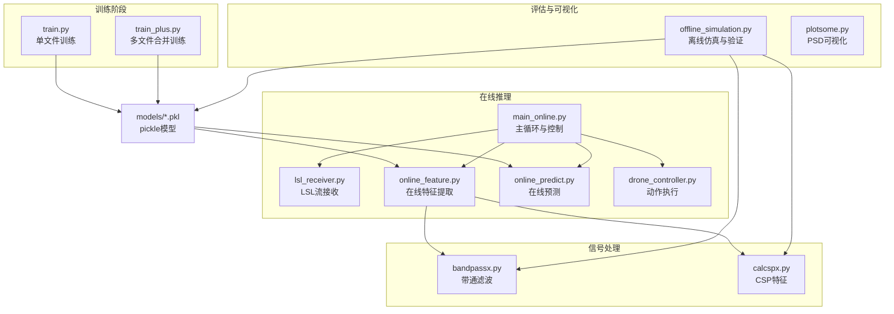
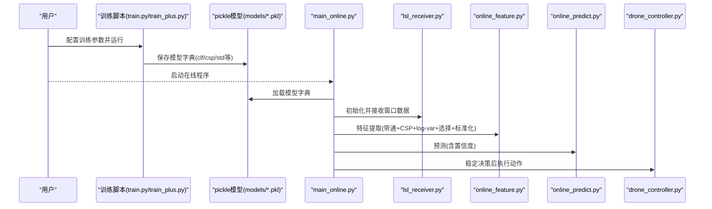
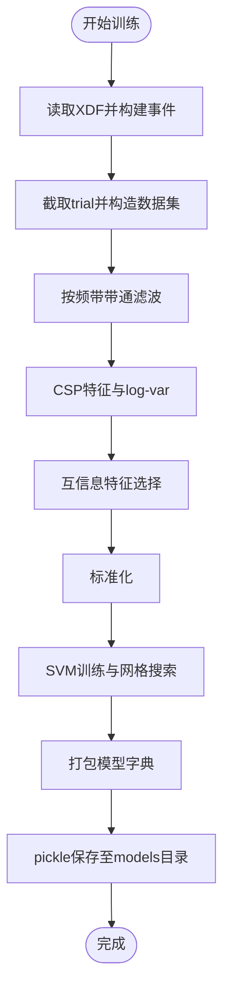
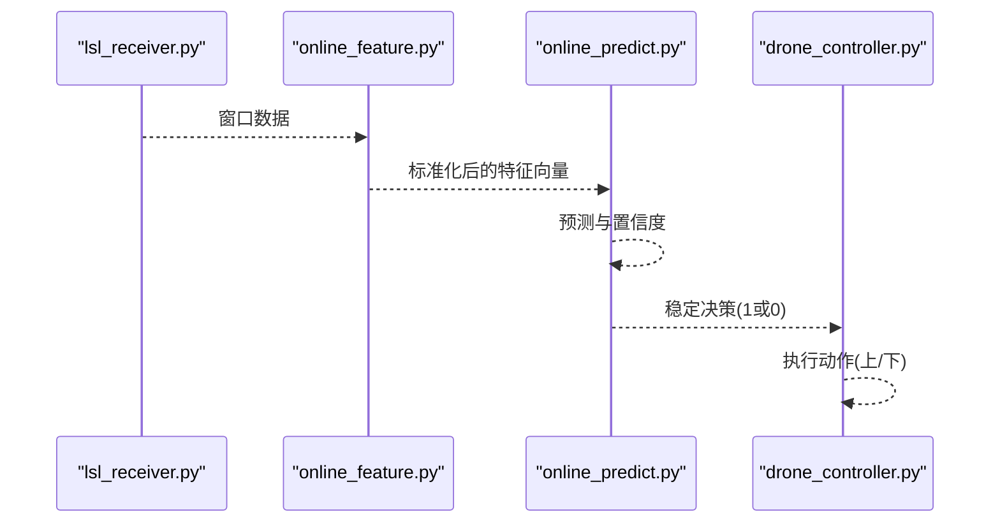
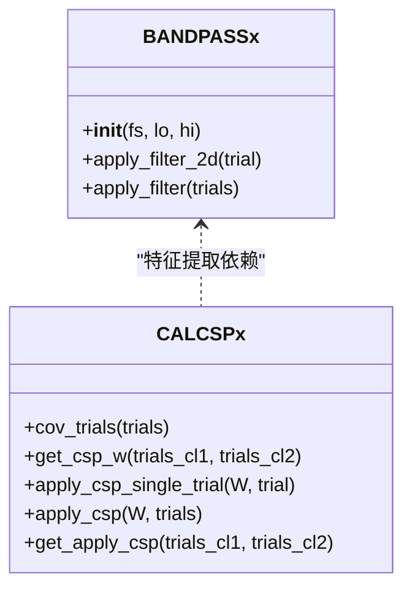
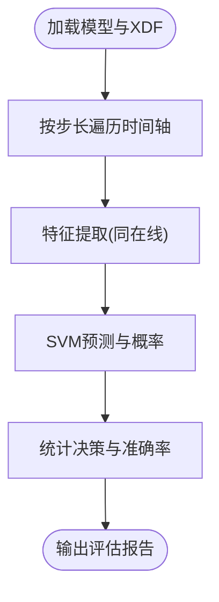
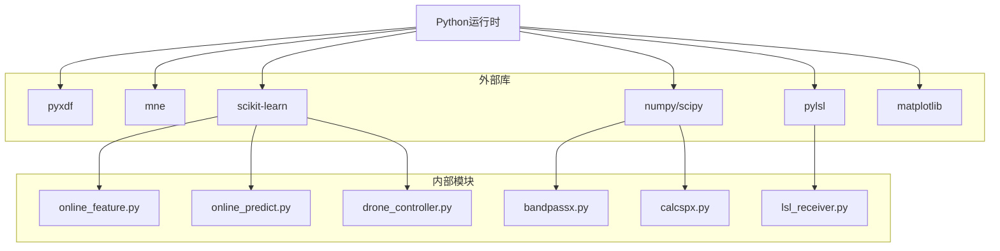

# 模型管理与部署

<cite>
**本文引用的文件**
- [paradigm/train.py](file://paradigm/train.py)
- [paradigm/train_plus.py](file://paradigm/train_plus.py)
- [paradigm/main_online.py](file://paradigm/main_online.py)
- [paradigm/offline_simulation.py](file://paradigm/offline_simulation.py)
- [paradigm/online/online_feature.py](file://paradigm/online/online_feature.py)
- [paradigm/online/online_predict.py](file://paradigm/online/online_predict.py)
- [paradigm/online/lsl_receiver.py](file://paradigm/online/lsl_receiver.py)
- [paradigm/online/drone_controller.py](file://paradigm/online/drone_controller.py)
- [paradigm/bandpassx.py](file://paradigm/bandpassx.py)
- [paradigm/calcspx.py](file://paradigm/calcspx.py)
- [paradigm/plotsome.py](file://paradigm/plotsome.py)
- [paradigm/task_markers.json](file://paradigm/task_markers.json)
</cite>

## 目录
1. [简介](#简介)
2. [项目结构](#项目结构)
3. [核心组件](#核心组件)
4. [架构总览](#架构总览)
5. [详细组件分析](#详细组件分析)
6. [依赖分析](#依赖分析)
7. [性能考虑](#性能考虑)
8. [故障排查指南](#故障排查指南)
9. [结论](#结论)
10. [附录](#附录)

## 简介
本文件系统性阐述本项目的“模型管理与部署”能力，覆盖以下方面：
- 训练模型的保存格式与序列化方法：基于 pickle 的模型打包与版本化策略
- 模型加载与初始化流程：参数校验、内存管理与兼容性检查
- 模型性能评估指标与测试方法：分类报告、混淆矩阵、AUC/ROC
- 模型部署技术要求：依赖库管理、运行时环境配置与性能优化
- 模型更新与维护流程：增量训练、模型迁移与版本演进
- 模型监控与故障诊断：性能跟踪、异常检测与自动恢复
- 安全性与可靠性保障：数据保护、访问控制与备份策略

## 项目结构
项目采用“功能域+层次”的组织方式：
- paradigm/training：离线训练脚本与合并训练脚本
- paradigm/online：在线推理流水线（数据接收、特征提取、预测、控制）
- paradigm/models：训练产出的模型文件（pickle）
- paradigm/util：信号处理与可视化工具
- paradigm/task_markers.json：实验标记映射

图表来源
- [paradigm/train.py:1-201](file://paradigm/train.py#L1-L201)
- [paradigm/train_plus.py:1-213](file://paradigm/train_plus.py#L1-L213)
- [paradigm/main_online.py:1-97](file://paradigm/main_online.py#L1-L97)
- [paradigm/offline_simulation.py:1-195](file://paradigm/offline_simulation.py#L1-L195)
- [paradigm/online/online_feature.py:1-52](file://paradigm/online/online_feature.py#L1-L52)
- [paradigm/online/online_predict.py:1-17](file://paradigm/online/online_predict.py#L1-L17)
- [paradigm/online/lsl_receiver.py:1-32](file://paradigm/online/lsl_receiver.py#L1-L32)
- [paradigm/online/drone_controller.py:1-13](file://paradigm/online/drone_controller.py#L1-L13)
- [paradigm/bandpassx.py:1-79](file://paradigm/bandpassx.py#L1-L79)
- [paradigm/calcspx.py:1-87](file://paradigm/calcspx.py#L1-L87)
- [paradigm/plotsome.py:1-135](file://paradigm/plotsome.py#L1-L135)

章节来源
- [paradigm/train.py:1-201](file://paradigm/train.py#L1-L201)
- [paradigm/train_plus.py:1-213](file://paradigm/train_plus.py#L1-L213)
- [paradigm/main_online.py:1-97](file://paradigm/main_online.py#L1-L97)
- [paradigm/offline_simulation.py:1-195](file://paradigm/offline_simulation.py#L1-L195)
- [paradigm/online/online_feature.py:1-52](file://paradigm/online/online_feature.py#L1-L52)
- [paradigm/online/online_predict.py:1-17](file://paradigm/online/online_predict.py#L1-L17)
- [paradigm/online/lsl_receiver.py:1-32](file://paradigm/online/lsl_receiver.py#L1-L32)
- [paradigm/online/drone_controller.py:1-13](file://paradigm/online/drone_controller.py#L1-L13)
- [paradigm/bandpassx.py:1-79](file://paradigm/bandpassx.py#L1-L79)
- [paradigm/calcspx.py:1-87](file://paradigm/calcspx.py#L1-L87)
- [paradigm/plotsome.py:1-135](file://paradigm/plotsome.py#L1-L135)

## 核心组件
- 训练与保存
  - 单文件训练：从 XDF 读取数据，构建事件、截取 trial，带通滤波，CSP+log-var 特征，特征选择，标准化+SVM 训练，网格搜索超参，输出模型字典并 pickle 序列化保存
  - 合并训练：支持多 XDF 文件拼接，分层训练与评估，输出更稳健的模型
- 在线推理
  - LSL 接收：从实时流拉取窗口数据
  - 特征提取：按频带滤波、CSP 投影、log-var 特征、特征选择、标准化
  - 预测：SVM 预测与置信度
  - 控制：根据稳定决策驱动动作
- 离线仿真与评估
  - 读取模型与配置，遍历 XDF 时间轴，进行特征提取与预测，统计准确率等指标
- 信号处理与可视化
  - 带通滤波器与 CSP 计算类
  - PSD 可视化工具

章节来源
- [paradigm/train.py:1-201](file://paradigm/train.py#L1-L201)
- [paradigm/train_plus.py:1-213](file://paradigm/train_plus.py#L1-L213)
- [paradigm/main_online.py:1-97](file://paradigm/main_online.py#L1-L97)
- [paradigm/offline_simulation.py:1-195](file://paradigm/offline_simulation.py#L1-L195)
- [paradigm/online/online_feature.py:1-52](file://paradigm/online/online_feature.py#L1-L52)
- [paradigm/online/online_predict.py:1-17](file://paradigm/online/online_predict.py#L1-L17)
- [paradigm/online/lsl_receiver.py:1-32](file://paradigm/online/lsl_receiver.py#L1-L32)
- [paradigm/online/drone_controller.py:1-13](file://paradigm/online/drone_controller.py#L1-L13)
- [paradigm/bandpassx.py:1-79](file://paradigm/bandpassx.py#L1-L79)
- [paradigm/calcspx.py:1-87](file://paradigm/calcspx.py#L1-L87)
- [paradigm/plotsome.py:1-135](file://paradigm/plotsome.py#L1-L135)

## 架构总览
下图展示了从训练到在线推理的关键交互：

图表来源
- [paradigm/train.py:184-201](file://paradigm/train.py#L184-L201)
- [paradigm/train_plus.py:194-213](file://paradigm/train_plus.py#L194-L213)
- [paradigm/main_online.py:18-97](file://paradigm/main_online.py#L18-L97)
- [paradigm/online/lsl_receiver.py:1-32](file://paradigm/online/lsl_receiver.py#L1-L32)
- [paradigm/online/online_feature.py:1-52](file://paradigm/online/online_feature.py#L1-L52)
- [paradigm/online/online_predict.py:1-17](file://paradigm/online/online_predict.py#L1-L17)
- [paradigm/online/drone_controller.py:1-13](file://paradigm/online/drone_controller.py#L1-L13)

## 详细组件分析

### 训练与模型保存（pickle）
- 模型打包内容
  - 分类器：SVM（含最优超参）
  - CSP 权重：按频带存储的混合矩阵
  - 特征选择索引：互信息排序后的 top-k 索引
  - 预处理：StandardScaler
  - 配置：采样率、信号窗、频带范围、CSP 特征索引等
- 保存与加载
  - 保存：将上述字典写入 pickle 文件
  - 加载：在线与离线仿真均通过 pickle 读取模型字典
- 版本控制策略
  - 建议在文件名中加入版本号（如 model001、model002），并在模型字典中增加元数据字段记录版本、训练日期、参数快照等

图表来源
- [paradigm/train.py:107-169](file://paradigm/train.py#L107-L169)
- [paradigm/train_plus.py:109-181](file://paradigm/train_plus.py#L109-L181)

章节来源
- [paradigm/train.py:184-201](file://paradigm/train.py#L184-L201)
- [paradigm/train_plus.py:194-213](file://paradigm/train_plus.py#L194-L213)

### 在线推理流水线
- 数据接收
  - LSL 接收器解析流，维护环形缓冲区，按采样率填充窗口
- 特征提取
  - 按模型字典中的频带范围逐段滤波
  - 对每段应用对应 CSP 混合矩阵，取指定 CSP 分量，计算 log-var，拼接后按特征选择索引裁剪，并用 StandardScaler 标准化
- 预测
  - 使用 SVM 进行预测与概率估计，取最大概率作为置信度
- 决策与控制
  - 置信度滑动平均，达到阈值后进入稳定窗口，连续一致则触发动作

图表来源
- [paradigm/online/lsl_receiver.py:1-32](file://paradigm/online/lsl_receiver.py#L1-L32)
- [paradigm/online/online_feature.py:1-52](file://paradigm/online/online_feature.py#L1-L52)
- [paradigm/online/online_predict.py:1-17](file://paradigm/online/online_predict.py#L1-L17)
- [paradigm/online/drone_controller.py:1-13](file://paradigm/online/drone_controller.py#L1-L13)

章节来源
- [paradigm/main_online.py:18-97](file://paradigm/main_online.py#L18-L97)
- [paradigm/online/lsl_receiver.py:1-32](file://paradigm/online/lsl_receiver.py#L1-L32)
- [paradigm/online/online_feature.py:1-52](file://paradigm/online/online_feature.py#L1-L52)
- [paradigm/online/online_predict.py:1-17](file://paradigm/online/online_predict.py#L1-L17)
- [paradigm/online/drone_controller.py:1-13](file://paradigm/online/drone_controller.py#L1-L13)

### 信号处理与特征工程
- 带通滤波器
  - 设计巴特沃斯带通滤波器，支持 2D/3D 输入，零相位滤波
- CSP 特征
  - 计算每试验归一化协方差并正则化，求解广义特征分解得到混合矩阵，对试验进行投影

图表来源
- [paradigm/bandpassx.py:1-79](file://paradigm/bandpassx.py#L1-L79)
- [paradigm/calcspx.py:1-87](file://paradigm/calcspx.py#L1-L87)

章节来源
- [paradigm/bandpassx.py:1-79](file://paradigm/bandpassx.py#L1-L79)
- [paradigm/calcspx.py:1-87](file://paradigm/calcspx.py#L1-L87)

### 离线仿真与评估
- 读取模型与配置，遍历 XDF 时间轴，按相同特征提取流程生成样本
- 使用测试集进行预测，输出分类报告、混淆矩阵、AUC
- 支持平滑与阈值策略下的决策统计

图表来源
- [paradigm/offline_simulation.py:12-195](file://paradigm/offline_simulation.py#L12-L195)

章节来源
- [paradigm/offline_simulation.py:1-195](file://paradigm/offline_simulation.py#L1-L195)

### 模型评估指标与测试方法
- 准确率与分类报告：离线仿真脚本输出
- 混淆矩阵：离线仿真脚本输出
- ROC/AUC：离线仿真脚本输出
- PSD 可视化：用于对比两类试验的功率谱差异

章节来源
- [paradigm/train.py:175-182](file://paradigm/train.py#L175-L182)
- [paradigm/train_plus.py:185-192](file://paradigm/train_plus.py#L185-L192)
- [paradigm/offline_simulation.py:180-192](file://paradigm/offline_simulation.py#L180-L192)
- [paradigm/plotsome.py:1-135](file://paradigm/plotsome.py#L1-L135)

## 依赖分析
- 外部库
  - pyxdf：读取 XDF 数据流
  - mne：事件构建与 epoch 截取
  - scikit-learn：SVM、标准化、特征选择、网格搜索、交叉验证
  - scipy/numpy：信号处理与数值计算
  - pylsl：实时 LSL 流接收
  - matplotlib：PSD 可视化
- 内部模块
  - bandpassx：带通滤波
  - calcspx：CSP 特征
  - online/*：在线推理子模块
  - task_markers.json：标记映射

图表来源
- [paradigm/train.py:1-18](file://paradigm/train.py#L1-L18)
- [paradigm/train_plus.py:1-22](file://paradigm/train_plus.py#L1-L22)
- [paradigm/main_online.py:1-11](file://paradigm/main_online.py#L1-L11)
- [paradigm/offline_simulation.py:1-11](file://paradigm/offline_simulation.py#L1-L11)
- [paradigm/online/online_feature.py:1-5](file://paradigm/online/online_feature.py#L1-L5)
- [paradigm/online/online_predict.py:1-1](file://paradigm/online/online_predict.py#L1-L1)
- [paradigm/online/lsl_receiver.py:1-4](file://paradigm/online/lsl_receiver.py#L1-L4)
- [paradigm/online/drone_controller.py:1-1](file://paradigm/online/drone_controller.py#L1-L1)
- [paradigm/bandpassx.py:1-4](file://paradigm/bandpassx.py#L1-L4)
- [paradigm/calcspx.py:1-4](file://paradigm/calcspx.py#L1-L4)
- [paradigm/plotsome.py:1-6](file://paradigm/plotsome.py#L1-L6)

章节来源
- [paradigm/train.py:1-18](file://paradigm/train.py#L1-L18)
- [paradigm/train_plus.py:1-22](file://paradigm/train_plus.py#L1-L22)
- [paradigm/main_online.py:1-11](file://paradigm/main_online.py#L1-L11)
- [paradigm/offline_simulation.py:1-11](file://paradigm/offline_simulation.py#L1-L11)

## 性能考虑
- 计算复杂度
  - 特征提取：每频带滤波与 CSP 投影，整体与通道数、样本数、频带数线性相关
  - 标准化与预测：O(N_features) 级别
- 内存管理
  - 在线窗口大小与缓冲区长度需与实时性平衡
  - 滑动平均与稳定窗口的队列长度影响内存占用与响应延迟
- 优化建议
  - 使用更高效的特征选择策略（如递归特征消除）减少维度
  - 将标准化与特征选择权重缓存复用，避免重复计算
  - 在线预测可考虑批处理与向量化操作
  - 使用更轻量的模型（如线性 SVM 或树模型）以降低推理延迟

## 故障排查指南
- 模型加载失败
  - 检查模型文件是否存在与可读
  - 确认 pickle 兼容性（Python 版本、依赖库版本）
- 在线无输出或误判
  - 检查 LSL 流是否连通与采样率匹配
  - 校验窗口长度与信号窗配置
  - 调整置信度阈值与稳定窗口长度
- 性能退化
  - 重新训练并保存新模型，核对特征选择索引与标准化参数
  - 对比离线仿真结果，定位特征提取或阈值问题

章节来源
- [paradigm/main_online.py:18-97](file://paradigm/main_online.py#L18-L97)
- [paradigm/online/lsl_receiver.py:1-32](file://paradigm/online/lsl_receiver.py#L1-L32)
- [paradigm/offline_simulation.py:1-195](file://paradigm/offline_simulation.py#L1-L195)

## 结论
本项目提供了完整的从离线训练到在线部署的流水线，采用 pickle 序列化模型，结合带通滤波与 CSP 特征，使用 SVM 进行分类。通过离线仿真与在线主循环实现了可验证的实时控制闭环。建议进一步引入版本化元数据、自动化评估与回归检测、以及更严格的异常与恢复机制，以提升系统的可靠性与可维护性。

## 附录

### 模型保存与加载要点
- 保存字段建议包含：clf、csp、mu_inf、filter_bands、fs、signal_win_start、signal_win_end、csp_feature_index、std、feature_num（可选）、版本与训练元数据
- 加载时优先校验关键字段存在性与类型一致性，缺失或不一致时触发降级或报错

章节来源
- [paradigm/train.py:184-201](file://paradigm/train.py#L184-L201)
- [paradigm/train_plus.py:194-213](file://paradigm/train_plus.py#L194-L213)
- [paradigm/main_online.py:18-36](file://paradigm/main_online.py#L18-L36)
- [paradigm/offline_simulation.py:12-24](file://paradigm/offline_simulation.py#L12-L24)

### 评估与可视化
- 分类报告、混淆矩阵、AUC 输出路径见离线仿真脚本
- PSD 可视化工具可用于对比两类试验的频谱特性

章节来源
- [paradigm/train.py:175-182](file://paradigm/train.py#L175-L182)
- [paradigm/train_plus.py:185-192](file://paradigm/train_plus.py#L185-L192)
- [paradigm/offline_simulation.py:180-192](file://paradigm/offline_simulation.py#L180-L192)
- [paradigm/plotsome.py:1-135](file://paradigm/plotsome.py#L1-L135)

### 部署与运行时配置
- Python 环境：确保安装所需依赖（pyxdf、mne、scikit-learn、scipy、numpy、pylsl、matplotlib）
- LSL 环境：确保 OpenBCI/LSL 设备已连接且流可用
- 模型路径：在线程序与离线仿真需指向同一模型文件

章节来源
- [paradigm/main_online.py:1-11](file://paradigm/main_online.py#L1-L11)
- [paradigm/offline_simulation.py:1-11](file://paradigm/offline_simulation.py#L1-L11)

### 更新与维护流程
- 增量训练：在现有模型基础上新增数据集，保持特征选择索引与标准化参数一致
- 模型迁移：导出新模型并标注版本，逐步替换线上模型
- 版本演进：在模型字典中增加版本号与训练元数据，便于追踪与回滚

章节来源
- [paradigm/train_plus.py:27-34](file://paradigm/train_plus.py#L27-L34)
- [paradigm/train.py:25-25](file://paradigm/train.py#L25-L25)
- [paradigm/train_plus.py:34-34](file://paradigm/train_plus.py#L34-L34)

### 监控与故障诊断
- 性能跟踪：记录预测延迟、置信度分布、决策频率
- 异常检测：置信度持续低于阈值、特征提取异常、LSL 流中断
- 自动恢复：检测到异常后切换到备用模型或降级策略

章节来源
- [paradigm/main_online.py:44-97](file://paradigm/main_online.py#L44-L97)
- [paradigm/offline_simulation.py:53-195](file://paradigm/offline_simulation.py#L53-L195)

### 安全性与可靠性
- 数据保护：限制模型文件访问权限，加密传输
- 访问控制：仅授权用户可更新模型与启动在线程序
- 备份策略：定期备份模型与日志，保留最近 N 个版本

章节来源
- [paradigm/main_online.py:1-11](file://paradigm/main_online.py#L1-L11)
- [paradigm/train.py:197-201](file://paradigm/train.py#L197-L201)
- [paradigm/train_plus.py:208-213](file://paradigm/train_plus.py#L208-L213)