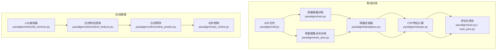
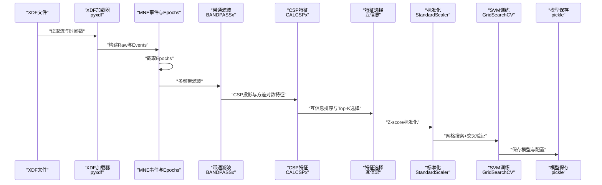
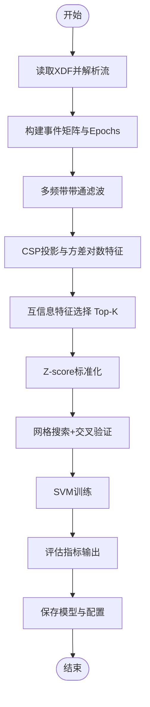
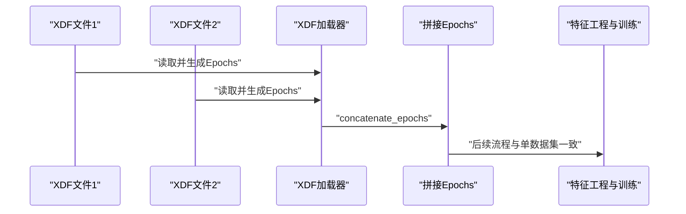
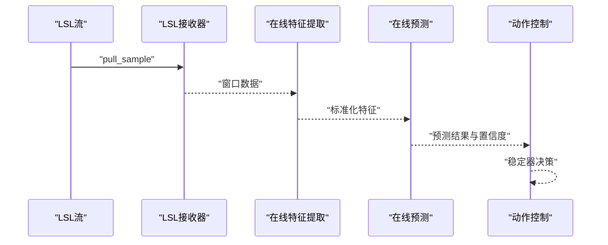
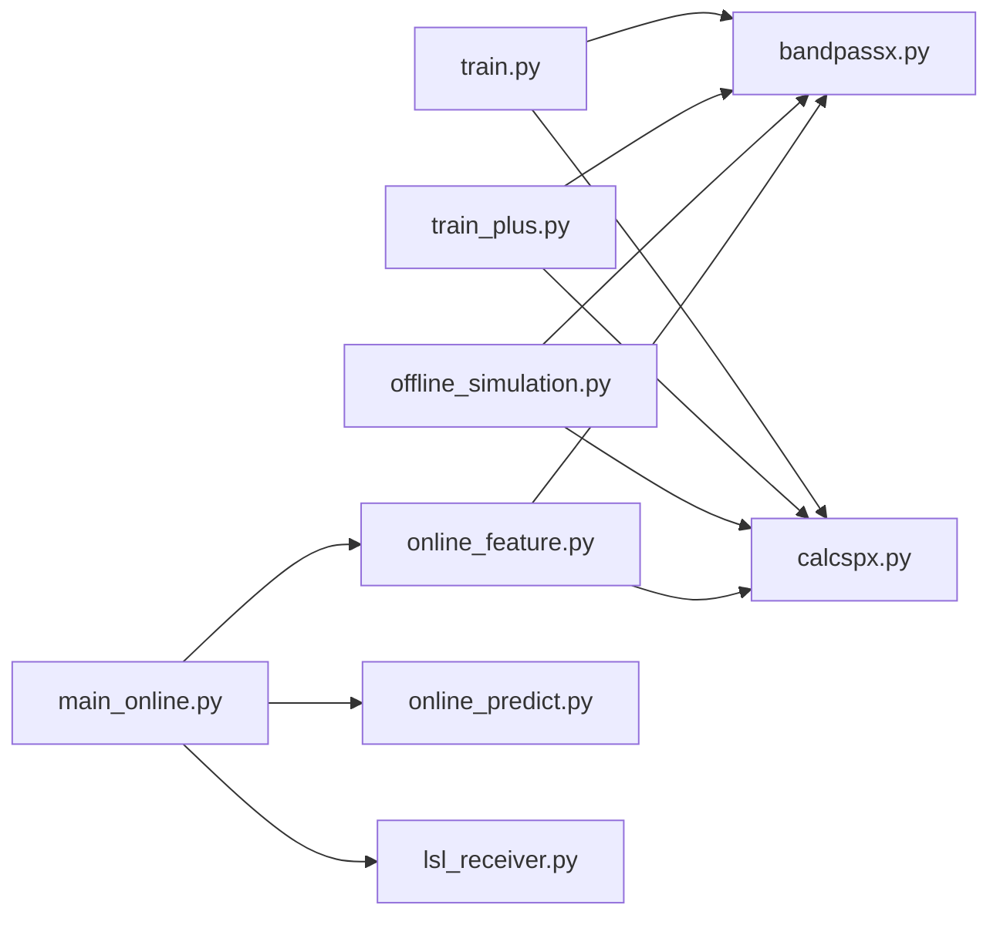

# 模型训练系统

<cite>
**本文引用的文件**
- [paradigm/train.py](file://paradigm/train.py)
- [paradigm/train_plus.py](file://paradigm/train_plus.py)
- [paradigm/xdf.py](file://paradigm/xdf.py)
- [paradigm/bandpassx.py](file://paradigm/bandpassx.py)
- [paradigm/calcspx.py](file://paradigm/calcspx.py)
- [paradigm/task_markers.json](file://paradigm/task_markers.json)
- [paradigm/main_online.py](file://paradigm/main_online.py)
- [paradigm/online/lsl_receiver.py](file://paradigm/online/lsl_receiver.py)
- [paradigm/online/online_feature.py](file://paradigm/online/online_feature.py)
- [paradigm/online/online_predict.py](file://paradigm/online/online_predict.py)
- [paradigm/offline_simulation.py](file://paradigm/offline_simulation.py)
- [paradigm/realtime_filter.py](file://paradigm/realtime_filter.py)
- [paradigm/plotsome.py](file://paradigm/plotsome.py)
- [paradigm/mi_train_psychopy.py](file://paradigm/mi_train_psychopy.py)
</cite>

## 目录
1. [简介](#简介)
2. [项目结构](#项目结构)
3. [核心组件](#核心组件)
4. [架构总览](#架构总览)
5. [详细组件分析](#详细组件分析)
6. [依赖分析](#依赖分析)
7. [性能考虑](#性能考虑)
8. [故障排查指南](#故障排查指南)
9. [结论](#结论)
10. [附录](#附录)

## 简介
本文件面向BCI模型训练系统，提供从单数据集到多数据集合并训练的完整文档，涵盖XDF数据导入、数据预处理、特征提取（带通滤波+CSP+方差对数特征）、特征选择、模型训练与评估、模型保存与版本管理、在线推理与部署、以及质量控制与调试方法。文档同时给出多数据集合并策略、数据集对齐与特征标准化、交叉验证与超参数调优建议，以及模型性能评估指标与监控方法。

## 项目结构
系统采用“功能模块化+分层设计”组织，核心流程分为离线训练与在线推理两大部分：
- 离线训练：XDF解析 → 事件对齐 → 分段截取 → 带通滤波 → CSP特征 → 方差对数特征 → 特征选择 → 标准化 → SVM训练 → 评估 → 模型保存
- 在线推理：LSL流接收 → 窗口基线校正 → 特征提取（同离线）→ 标准化 → 预测 → 决策稳定器 → 执行动作

图表来源
- [paradigm/train.py:1-201](file://paradigm/train.py#L1-L201)
- [paradigm/train_plus.py:1-213](file://paradigm/train_plus.py#L1-L213)
- [paradigm/xdf.py:1-37](file://paradigm/xdf.py#L1-L37)
- [paradigm/bandpassx.py:1-79](file://paradigm/bandpassx.py#L1-L79)
- [paradigm/calcspx.py:1-87](file://paradigm/calcspx.py#L1-L87)
- [paradigm/online/lsl_receiver.py:1-32](file://paradigm/online/lsl_receiver.py#L1-L32)
- [paradigm/online/online_feature.py:1-52](file://paradigm/online/online_feature.py#L1-L52)
- [paradigm/online/online_predict.py:1-17](file://paradigm/online/online_predict.py#L1-L17)
- [paradigm/main_online.py:1-97](file://paradigm/main_online.py#L1-L97)

章节来源
- [paradigm/train.py:1-201](file://paradigm/train.py#L1-L201)
- [paradigm/train_plus.py:1-213](file://paradigm/train_plus.py#L1-L213)
- [paradigm/xdf.py:1-37](file://paradigm/xdf.py#L1-L37)
- [paradigm/bandpassx.py:1-79](file://paradigm/bandpassx.py#L1-L79)
- [paradigm/calcspx.py:1-87](file://paradigm/calcspx.py#L1-L87)
- [paradigm/online/lsl_receiver.py:1-32](file://paradigm/online/lsl_receiver.py#L1-L32)
- [paradigm/online/online_feature.py:1-52](file://paradigm/online/online_feature.py#L1-L52)
- [paradigm/online/online_predict.py:1-17](file://paradigm/online/online_predict.py#L1-L17)
- [paradigm/main_online.py:1-97](file://paradigm/main_online.py#L1-L97)

## 核心组件
- XDF数据读取与事件解析：使用pyxdf加载XDF流，识别EEG与Markers流，构建MNE Raw对象，基于标记时间戳对齐事件，截取感兴趣的时间窗形成epoch。
- 带通滤波：基于Butterworth滤波器在多个频带（如4–24Hz，50%重叠）上对每个trial进行滤波。
- CSP特征：计算两类trial的协方差并求解广义特征值问题，得到混合矩阵W，将信号投影到CSP空间，取特定通道子集的方差对数作为特征。
- 特征选择：基于互信息对所有带内CSP特征排序，选取Top-K特征。
- 标准化与分类：对特征进行Z-score标准化，使用SVM（RBF/Linear）配合网格搜索进行超参数寻优与交叉验证。
- 模型保存：将SVM分类器、CSP混合矩阵、特征索引、滤波带、采样率、信号窗等打包保存为pickle文件。
- 在线推理：从LSL流实时接收窗口数据，执行相同特征提取与标准化，进行预测与稳定决策。

章节来源
- [paradigm/train.py:42-144](file://paradigm/train.py#L42-L144)
- [paradigm/train_plus.py:58-147](file://paradigm/train_plus.py#L58-L147)
- [paradigm/bandpassx.py:7-79](file://paradigm/bandpassx.py#L7-L79)
- [paradigm/calcspx.py:7-87](file://paradigm/calcspx.py#L7-L87)
- [paradigm/online/online_feature.py:7-52](file://paradigm/online/online_feature.py#L7-L52)
- [paradigm/online/online_predict.py:3-17](file://paradigm/online/online_predict.py#L3-L17)

## 架构总览
下图展示了从XDF到模型训练与在线推理的关键数据流与模块交互。

图表来源
- [paradigm/train.py:42-144](file://paradigm/train.py#L42-L144)
- [paradigm/bandpassx.py:7-79](file://paradigm/bandpassx.py#L7-L79)
- [paradigm/calcspx.py:7-87](file://paradigm/calcspx.py#L7-L87)

## 详细组件分析

### 单数据集训练流程（train.py）
- 数据导入与事件对齐：读取XDF，定位EEG与Markers流，基于标记时间戳生成MNE事件矩阵，截取感兴趣时间窗形成epochs。
- 特征工程：多频带带通滤波，每带计算CSP混合矩阵并应用，取特定通道子带的方差对数作为特征，拼接为样本特征矩阵。
- 特征选择：以类别标签为监督，计算互信息，选择Top-K特征。
- 训练与评估：标准化后使用SVM，网格搜索超参数并进行交叉验证；在训练集上输出分类报告、混淆矩阵与AUC。
- 模型保存：将SVM、CSP矩阵、特征索引、滤波带、采样率、信号窗等打包保存。

图表来源
- [paradigm/train.py:42-199](file://paradigm/train.py#L42-L199)

章节来源
- [paradigm/train.py:20-201](file://paradigm/train.py#L20-L201)

### 多数据集合并训练（train_plus.py）
- 批量读取多个XDF文件，分别构建Epochs，随后拼接为一个大的Epochs集合。
- 其余流程与单数据集一致：多频带滤波、CSP特征、互信息选择、标准化、SVM训练与评估，并进行训练/测试划分。
- 模型保存：同样保存SVM、CSP矩阵、特征索引、滤波带、采样率、信号窗等。

图表来源
- [paradigm/train_plus.py:58-98](file://paradigm/train_plus.py#L58-L98)
- [paradigm/train_plus.py:154-210](file://paradigm/train_plus.py#L154-L210)

章节来源
- [paradigm/train_plus.py:27-213](file://paradigm/train_plus.py#L27-L213)

### XDF文件格式处理与数据导入（xdf.py）
- 展示如何使用pyxdf读取XDF流，识别EEG与Markers流，打印流信息与标记内容，构建MNE Raw对象并可视化。

章节来源
- [paradigm/xdf.py:1-37](file://paradigm/xdf.py#L1-L37)

### 带通滤波器（bandpassx.py）
- 实现Butterworth带通滤波器，支持二维与三维输入，使用零相位滤波，保证时域无失真。
- 提供apply_filter_2d与apply_filter接口，分别处理单trial与批量trial。

章节来源
- [paradigm/bandpassx.py:7-79](file://paradigm/bandpassx.py#L7-L79)

### CSP特征计算（calcspx.py）
- 计算每类trial的归一化协方差矩阵并加正则项，求解广义特征值问题得到混合矩阵W。
- 提供apply_csp_single_trial与apply_csp，将信号投影到CSP空间；提供get_apply_csp便捷接口。

章节来源
- [paradigm/calcspx.py:7-87](file://paradigm/calcspx.py#L7-L87)

### 在线推理（main_online.py + online模块）
- LSL接收器：从LSL流持续拉取样本，维护环形缓冲区，填充后再进行处理。
- 在线特征提取：复用训练阶段的滤波与CSP流程，使用训练时的CSP矩阵、特征索引与标准化器。
- 在线预测：调用SVM进行预测与置信度估计。
- 决策稳定器：滑动窗口平均置信度，超过阈值后连续N次一致才执行动作。

图表来源
- [paradigm/main_online.py:54-97](file://paradigm/main_online.py#L54-L97)
- [paradigm/online/lsl_receiver.py:23-32](file://paradigm/online/lsl_receiver.py#L23-L32)
- [paradigm/online/online_feature.py:20-52](file://paradigm/online/online_feature.py#L20-L52)
- [paradigm/online/online_predict.py:9-17](file://paradigm/online/online_predict.py#L9-L17)

章节来源
- [paradigm/main_online.py:1-97](file://paradigm/main_online.py#L1-L97)
- [paradigm/online/lsl_receiver.py:1-32](file://paradigm/online/lsl_receiver.py#L1-L32)
- [paradigm/online/online_feature.py:1-52](file://paradigm/online/online_feature.py#L1-L52)
- [paradigm/online/online_predict.py:1-17](file://paradigm/online/online_predict.py#L1-L17)

### 离线仿真与验证（offline_simulation.py）
- 加载已训练模型，读取XDF并标注Ground Truth，按步长滑动窗口进行特征提取与预测，统计准确率与延迟。
- 支持概率平滑与阈值过滤，便于评估在线性能。

章节来源
- [paradigm/offline_simulation.py:1-195](file://paradigm/offline_simulation.py#L1-L195)

### 实时滤波（realtime_filter.py）
- 提供因果滤波器实现，使用lfilter_zi保留通道独立的状态向量，适合在线实时处理。

章节来源
- [paradigm/realtime_filter.py:1-32](file://paradigm/realtime_filter.py#L1-L32)

### 任务标记映射（task_markers.json）
- 定义实验任务对应的标记值，用于事件对齐与Ground Truth生成。

章节来源
- [paradigm/task_markers.json:1-23](file://paradigm/task_markers.json#L1-L23)

### 图谱分析工具（plotsome.py）
- 提供功率谱密度（PSD）计算与绘图工具，可用于特征前后对比与可视化。

章节来源
- [paradigm/plotsome.py:9-135](file://paradigm/plotsome.py#L9-L135)

### 心理学实验任务生成（mi_train_psychopy.py）
- 通过Psychopy生成视觉刺激与按键响应，向LSL推送标记，用于采集训练数据。

章节来源
- [paradigm/mi_train_psychopy.py:1-229](file://paradigm/mi_train_psychopy.py#L1-L229)

## 依赖分析
- 模块耦合关系
  - train.py与train_plus.py共享特征工程与评估流程，差异在于数据来源（单/多XDF）与是否划分训练/测试集。
  - bandpassx与calcspx被train与online共同依赖，是特征工程的核心。
  - main_online依赖online子模块，复用训练阶段的特征提取与标准化配置。
- 外部依赖
  - pyxdf：XDF读取
  - mne：Raw、Epochs、Montage
  - scikit-learn：StandardScaler、SVM、GridSearchCV、互信息、train_test_split
  - scipy/numpy：滤波、线性代数、统计
  - pylsl：在线数据流
  - matplotlib/seaborn：可视化（部分模块）

图表来源
- [paradigm/train.py:108-120](file://paradigm/train.py#L108-L120)
- [paradigm/train_plus.py:110-122](file://paradigm/train_plus.py#L110-L122)
- [paradigm/offline_simulation.py:9-10](file://paradigm/offline_simulation.py#L9-L10)
- [paradigm/online/online_feature.py:4-5](file://paradigm/online/online_feature.py#L4-L5)
- [paradigm/main_online.py:32-36](file://paradigm/main_online.py#L32-L36)

章节来源
- [paradigm/train.py:108-120](file://paradigm/train.py#L108-L120)
- [paradigm/train_plus.py:110-122](file://paradigm/train_plus.py#L110-L122)
- [paradigm/online/online_feature.py:4-5](file://paradigm/online/online_feature.py#L4-L5)
- [paradigm/main_online.py:32-36](file://paradigm/main_online.py#L32-L36)

## 性能考虑
- 计算复杂度
  - 带通滤波：O(T·C·F)，其中T为样本数、C为通道数、F为频带数。
  - CSP：每类协方差计算O(C²·T·N)，广义特征分解O(C³)，投影O(C²·T·N)。
  - 互信息特征选择：O(K·N·log N)（K为特征维数，N为样本数）。
- 优化建议
  - 并行化：CSP与滤波可按频带并行处理；特征选择可使用更高效的近似方法。
  - 内存管理：大样本数据建议分批处理或使用稀疏表示。
  - 缓存：训练阶段的CSP矩阵与标准化器可缓存，避免重复计算。
- 实时性
  - 在线滤波建议使用因果滤波并保留状态，减少延迟。
  - 特征提取与预测尽量向量化，减少Python循环开销。

## 故障排查指南
- XDF读取失败
  - 检查XDF文件路径与完整性；确认存在EEG与Markers流。
  - 参考[xdf.py:5-37](file://paradigm/xdf.py#L5-L37)。
- 事件对齐错误
  - 确认标记时间戳与采样率一致；检查事件字典与目标标记值。
  - 参考[train.py:75-81](file://paradigm/train.py#L75-L81)与[train_plus.py:77-82](file://paradigm/train_plus.py#L77-L82)。
- 特征维度不匹配
  - 确保CSP特征索引与实际通道数一致；检查滤波带数量与特征拼接逻辑。
  - 参考[train.py:124-141](file://paradigm/train.py#L124-L141)与[train_plus.py:128-145](file://paradigm/train_plus.py#L128-L145)。
- 模型加载异常
  - 确认模型保存路径与pickle兼容性；检查模型字段完整性。
  - 参考[train.py:185-199](file://paradigm/train.py#L185-L199)与[train_plus.py:195-210](file://paradigm/train_plus.py#L195-L210)。
- 在线预测不稳定
  - 调整置信度阈值与稳定窗口长度；检查LSL流采样率与缓冲区大小。
  - 参考[main_online.py:44-49](file://paradigm/main_online.py#L44-L49)与[online_feature.py:20-52](file://paradigm/online/online_feature.py#L20-L52)。

章节来源
- [paradigm/xdf.py:5-37](file://paradigm/xdf.py#L5-L37)
- [paradigm/train.py:75-81](file://paradigm/train.py#L75-L81)
- [paradigm/train_plus.py:77-82](file://paradigm/train_plus.py#L77-L82)
- [paradigm/train.py:185-199](file://paradigm/train.py#L185-L199)
- [paradigm/train_plus.py:195-210](file://paradigm/train_plus.py#L195-L210)
- [paradigm/main_online.py:44-49](file://paradigm/main_online.py#L44-L49)
- [paradigm/online/online_feature.py:20-52](file://paradigm/online/online_feature.py#L20-L52)

## 结论
本系统提供了从XDF数据到SVM分类器的完整训练流水线，支持单数据集与多数据集合并训练，并具备在线推理能力。通过带通滤波+CSP+方差对数特征与互信息选择，结合标准化与网格搜索，实现了稳健的离线训练与可靠的在线部署。建议在实际应用中加强数据质量控制、异常值检测与模型版本管理，以提升鲁棒性与可维护性。

## 附录

### 训练参数与超参数调优建议
- SVM超参数
  - C：正则化强度，建议在[0.1, 1, 10]范围内搜索。
  - gamma：RBF核系数，建议在['scale', 0.1, 0.01]范围内搜索。
  - kernel：RBF或Linear。
- 特征选择
  - K：Top-K特征，建议从[4,6,8,10]尝试，结合AUC与计算成本权衡。
- 带通滤波
  - 频带范围与重叠：根据任务频段（如运动想象常见于8–30Hz）调整；重叠可提高鲁棒性。
- 交叉验证
  - 建议使用分层K折（stratify=y），确保类别平衡。

章节来源
- [paradigm/train.py:154-169](file://paradigm/train.py#L154-L169)
- [paradigm/train_plus.py:166-181](file://paradigm/train_plus.py#L166-L181)

### 模型保存格式、版本管理与部署
- 保存格式：pickle文件，包含SVM、CSP矩阵、特征索引、滤波带、采样率、信号窗等。
- 版本管理：建议在文件名中加入版本号与日期，如“model_v0.1_YYYYMMDD.pkl”，并在保存时记录训练配置。
- 部署流程：在线端加载pickle，初始化滤波器与CSP矩阵，执行特征提取与预测，加入稳定器与动作控制。

章节来源
- [paradigm/train.py:185-199](file://paradigm/train.py#L185-L199)
- [paradigm/train_plus.py:195-210](file://paradigm/train_plus.py#L195-L210)
- [paradigm/main_online.py:18-38](file://paradigm/main_online.py#L18-L38)

### 训练数据质量控制与数据清洗
- 异常值检测：基于统计阈值（如3σ）剔除显著异常样本；检查EEG幅度与噪声水平。
- 数据清洗：去除工频干扰与电极阻抗异常；必要时进行插值或删除缺失片段。
- 事件对齐：严格依据标记时间戳对齐，避免时间偏移导致的epoch错位。
- 类别平衡：若类别严重不平衡，可采用欠采样/过采样或代价敏感学习。

### 训练过程监控与调试技巧
- 日志与指标：输出最佳参数、交叉验证分数、分类报告、混淆矩阵与AUC。
- 可视化：利用PSD工具观察滤波前后频谱变化；绘制ROC曲线与置信度分布。
- 在线验证：使用离线仿真脚本模拟实时处理，统计准确率与延迟，优化阈值与平滑窗口。

章节来源
- [paradigm/train.py:175-183](file://paradigm/train.py#L175-L183)
- [paradigm/train_plus.py:185-192](file://paradigm/train_plus.py#L185-L192)
- [paradigm/offline_simulation.py:96-191](file://paradigm/offline_simulation.py#L96-L191)
- [paradigm/plotsome.py:56-129](file://paradigm/plotsome.py#L56-L129)