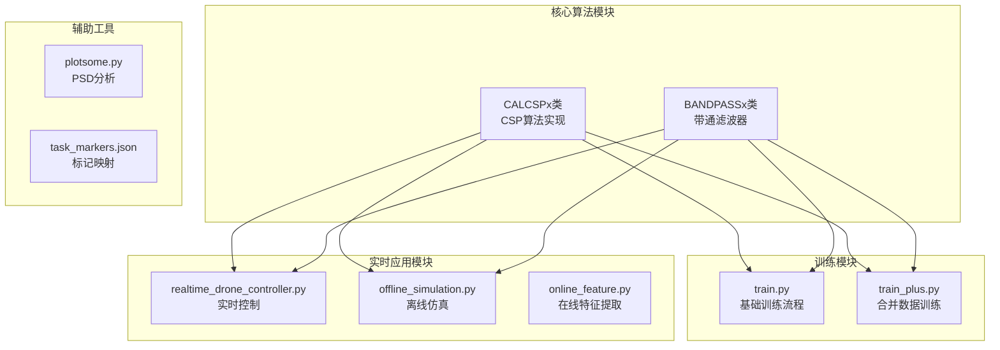
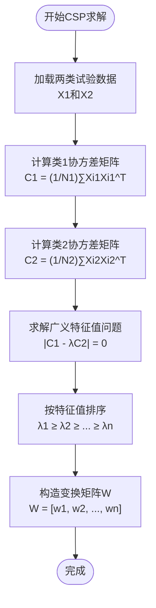
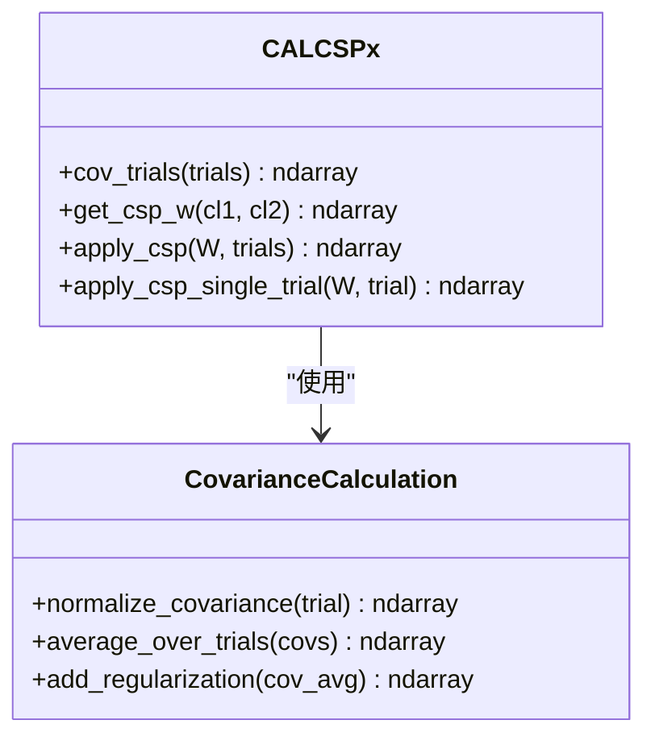
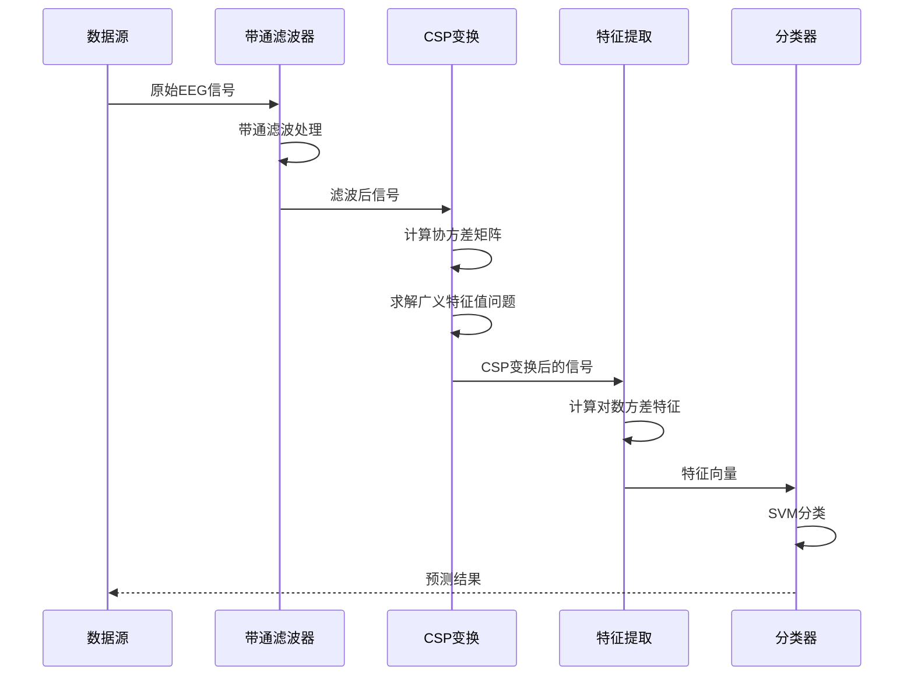
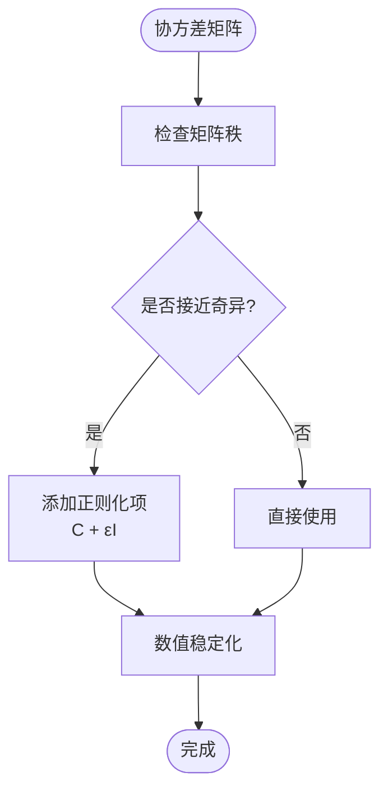
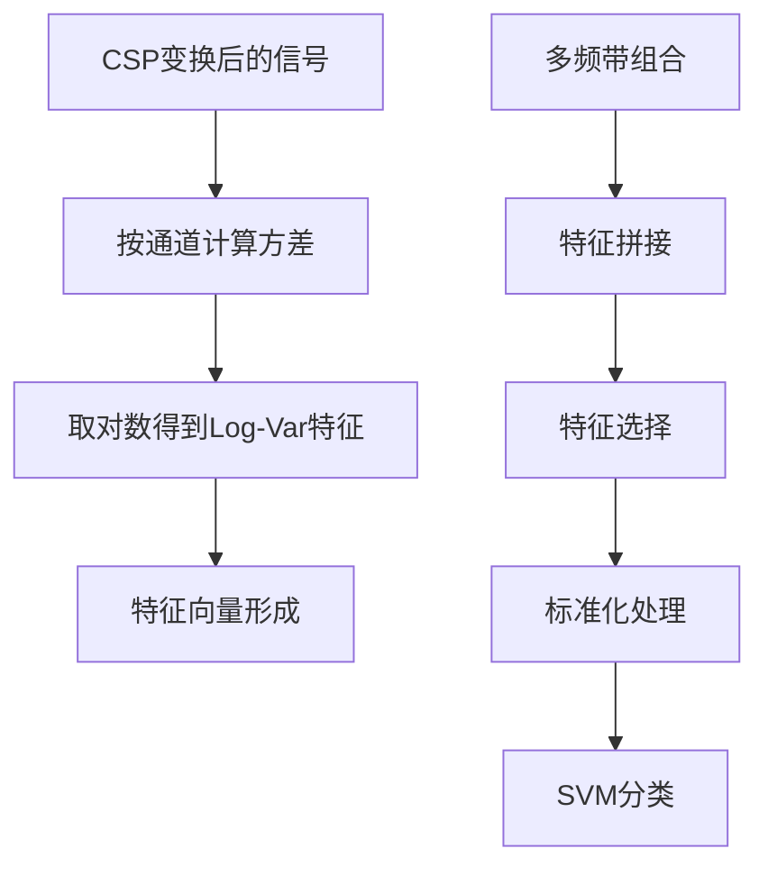
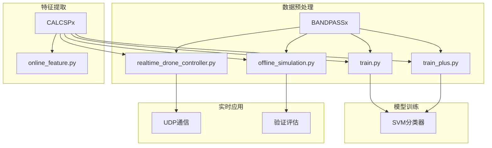
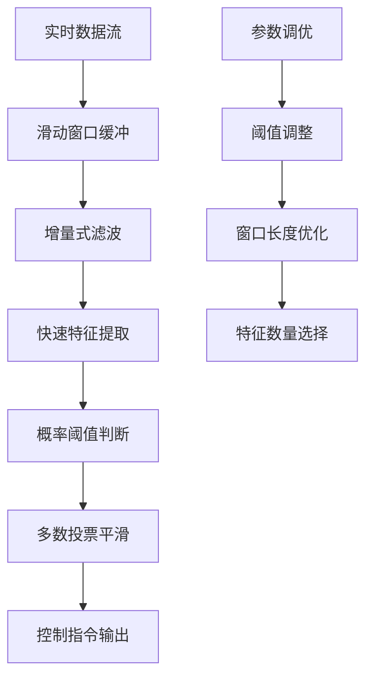

# CSP算法理论基础

<cite>
**本文档引用的文件**
- [calcspx.py](file://paradigm/calcspx.py)
- [bandpassx.py](file://paradigm/bandpassx.py)
- [train.py](file://paradigm/train.py)
- [train_plus.py](file://paradigm/train_plus.py)
- [realtime_drone_controller.py](file://paradigm/realtime_drone_controller.py)
- [offline_simulation.py](file://paradigm/offline_simulation.py)
- [task_markers.json](file://paradigm/task_markers.json)
- [plotsome.py](file://paradigm/plotsome.py)
- [online_feature.py](file://paradigm/online/online_feature.py)
</cite>

## 目录
1. [引言](#引言)
2. [项目结构](#项目结构)
3. [核心组件](#核心组件)
4. [架构概览](#架构概览)
5. [详细组件分析](#详细组件分析)
6. [依赖关系分析](#依赖关系分析)
7. [性能考虑](#性能考虑)
8. [故障排除指南](#故障排除指南)
9. [结论](#结论)
10. [附录](#附录)

## 引言

CSP（共空间模式）算法是脑机接口（BCI）领域中最重要的空间滤波技术之一。该算法通过最大化两类信号的方差比来提取最优特征，为运动想象任务提供了强大的空间滤波能力。本文档深入解析CSP算法的理论基础、实现细节和在BCI系统中的应用优势。

## 项目结构

该项目采用模块化设计，主要包含以下核心模块：



**图表来源**
- [calcspx.py:1-87](file://paradigm/calcspx.py#L1-L87)
- [bandpassx.py:1-79](file://paradigm/bandpassx.py#L1-L79)
- [train.py:1-201](file://paradigm/train.py#L1-L201)

**章节来源**
- [calcspx.py:1-87](file://paradigm/calcspx.py#L1-L87)
- [bandpassx.py:1-79](file://paradigm/bandpassx.py#L1-L79)
- [train.py:1-201](file://paradigm/train.py#L1-L201)

## 核心组件

### CSP变换矩阵W的求解

CSP算法的核心在于求解变换矩阵W，该矩阵能够最大化两类信号的方差比。算法基于广义瑞利商优化问题：



**图表来源**
- [calcspx.py:45-60](file://paradigm/calcspx.py#L45-L60)

### 协方差矩阵计算

协方差矩阵的计算是CSP算法的关键步骤，采用归一化处理确保数值稳定性：



**图表来源**
- [calcspx.py:21-43](file://paradigm/calcspx.py#L21-L43)

**章节来源**
- [calcspx.py:21-60](file://paradigm/calcspx.py#L21-L60)

## 架构概览

整个CSP算法系统采用分层架构设计，从数据预处理到特征提取再到分类识别：



**图表来源**
- [train.py:118-143](file://paradigm/train.py#L118-L143)
- [calcspx.py:45-78](file://paradigm/calcspx.py#L45-L78)

## 详细组件分析

### CSP算法数学原理

#### 广义瑞利商优化

CSP算法解决以下广义瑞利商优化问题：

$$\max_W \frac{W^T C_1 W}{W^T C_2 W}$$

其中：
- $C_1$ 和 $C_2$ 分别是两类信号的协方差矩阵
- $W$ 是待求的变换矩阵

#### 特征值分解过程

算法通过求解广义特征值问题得到最优变换矩阵：

```mermaid
flowchart LR
A[C1W = λC2W] --> B[特征值分解]
B --> C[按特征值降序排列]
C --> D[W = [w1, w2, ..., wn]]
E[C1W = λC2W] --> F[计算条件数]
F --> G[数值稳定性检查]
G --> H[添加正则化项]
```

**图表来源**
- [calcspx.py:56-60](file://paradigm/calcspx.py#L56-L60)

### 协方差矩阵计算实现

#### 归一化处理

协方差矩阵采用迹归一化确保数值稳定性：

$$C_{norm} = \frac{C}{\text{tr}(C)}$$

#### 正则化处理

为提高数值稳定性，添加小的正则化项：



**图表来源**
- [calcspx.py:32-43](file://paradigm/calcspx.py#L32-L43)

**章节来源**
- [calcspx.py:21-43](file://paradigm/calcspx.py#L21-L43)

### CSP滤波器设计思想

#### 方差比最大化

CSP滤波器通过最大化两类信号的方差比来提取最优特征：

$$\frac{\sigma_1^2}{\sigma_2^2} = \frac{W^T C_1 W}{W^T C_2 W}$$

其中 $\sigma_1^2$ 和 $\sigma_2^2$ 分别是两类信号在变换后的方差。

#### 空间滤波效果

CSP滤波器具有以下特性：
- **增强有用信号**：最大化目标类别的方差
- **抑制噪声**：最小化非目标类别的方差
- **特征降维**：将高维EEG信号投影到低维特征空间

**章节来源**
- [calcspx.py:45-60](file://paradigm/calcspx.py#L45-L60)

### 特征提取流程

#### Log-Var特征计算

CSP变换后的特征通过计算对数方差获得：



**图表来源**
- [train.py:135-141](file://paradigm/train.py#L135-L141)

**章节来源**
- [train.py:118-143](file://paradigm/train.py#L118-L143)

## 依赖关系分析

### 模块间依赖关系



**图表来源**
- [train.py:108-120](file://paradigm/train.py#L108-L120)
- [realtime_drone_controller.py:9-33](file://paradigm/realtime_drone_controller.py#L9-L33)

### 外部依赖分析

项目依赖的主要外部库：
- **NumPy**: 数值计算和线性代数运算
- **SciPy**: 信号处理和科学计算
- **scikit-learn**: 机器学习算法和模型选择
- **MNE**: 脑电数据分析和处理

**章节来源**
- [train.py:1-18](file://paradigm/train.py#L1-L18)
- [calcspx.py:1-5](file://paradigm/calcspx.py#L1-L5)

## 性能考虑

### 计算复杂度分析

CSP算法的时间复杂度主要由以下步骤决定：

1. **协方差计算**: O(N × p²) 其中N为样本数，p为通道数
2. **特征值分解**: O(p³) 对于p×p矩阵
3. **变换应用**: O(p² × N) 每个样本

### 内存优化策略

- **批处理**: 对大量试验进行分批处理
- **矩阵存储**: 使用适当的矩阵存储格式
- **并行计算**: 利用多核处理器加速计算

### 实时性能优化



**图表来源**
- [realtime_drone_controller.py:75-121](file://paradigm/realtime_drone_controller.py#L75-L121)

**章节来源**
- [realtime_drone_controller.py:17-31](file://paradigm/realtime_drone_controller.py#L17-L31)

## 故障排除指南

### 常见问题及解决方案

#### 数值稳定性问题

**问题**: 协方差矩阵接近奇异导致求解失败

**解决方案**:
1. 检查数据质量，去除异常值
2. 增加正则化参数
3. 减少特征维度

#### 训练数据不足

**问题**: 训练样本数量不足影响CSP性能

**解决方案**:
1. 合并多个数据集
2. 使用交叉验证
3. 增加数据采集时间

#### 实时延迟过大

**问题**: 实时控制系统响应延迟过高

**解决方案**:
1. 优化特征提取算法
2. 减少特征数量
3. 调整采样频率

**章节来源**
- [calcspx.py:40-42](file://paradigm/calcspx.py#L40-L42)
- [realtime_drone_controller.py:17-19](file://paradigm/realtime_drone_controller.py#L17-L19)

## 结论

CSP算法作为一种经典的BCI空间滤波技术，在该实现中展现了良好的理论完整性和实践价值。通过合理的数学推导、稳健的数值实现和高效的工程化设计，该系统能够在多种BCI应用场景中提供可靠的性能表现。

算法的核心优势包括：
- **理论基础扎实**: 基于严格的数学原理
- **实现稳健**: 包含完善的数值稳定性处理
- **应用广泛**: 支持离线训练和实时应用
- **性能优异**: 在运动想象任务中表现出色

## 附录

### 参数调优指南

#### CSP参数设置

| 参数 | 默认值 | 调优范围 | 说明 |
|------|--------|----------|------|
| 采样率(fs) | 125 Hz | 100-250 Hz | 影响频率分辨率 |
| 通道数 | 16 | 8-32 | 影响计算复杂度 |
| 窗口长度 | 2秒 | 1-4秒 | 影响特征稳定性 |
| 频带范围 | 4-24 Hz | 1-30 Hz | 根据任务需求调整 |

#### 特征选择参数

| 参数 | 默认值 | 调优范围 | 说明 |
|------|--------|----------|------|
| 特征数量(k) | 4-6 | 2-10 | 影响分类性能 |
| 阈值(ε) | 1e-6 | 1e-8-1e-4 | 数值稳定性 |
| 正则化系数 | 1e-6 | 1e-8-1e-2 | 防止过拟合 |

### 计算示例

#### 协方差矩阵计算示例

对于单个试验的协方差矩阵计算：
1. 输入: 试验数据 X ∈ R^(p×t)
2. 计算: C = (1/t) X X^T
3. 归一化: C_norm = C/tr(C)
4. 正则化: C_reg = C_norm + εI

#### CSP变换示例

对于两类试验的CSP变换：
1. 计算: C1 = (1/N1) Σ Xi1 (Xi1)^T
2. 计算: C2 = (1/N2) Σ Xi2 (Xi2)^T
3. 求解: |C1 - λC2| = 0
4. 排序: λ1 ≥ λ2 ≥ ... ≥ λp
5. 构造: W = [w1, w2, ..., wp]

**章节来源**
- [calcspx.py:21-60](file://paradigm/calcspx.py#L21-L60)