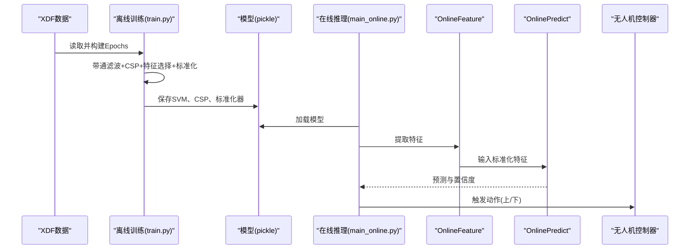
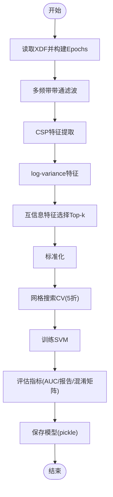
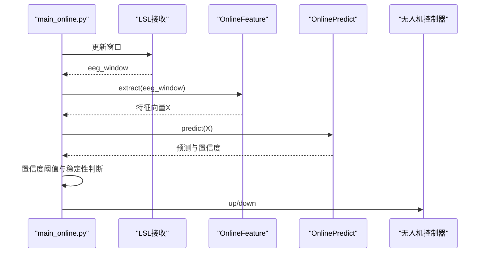
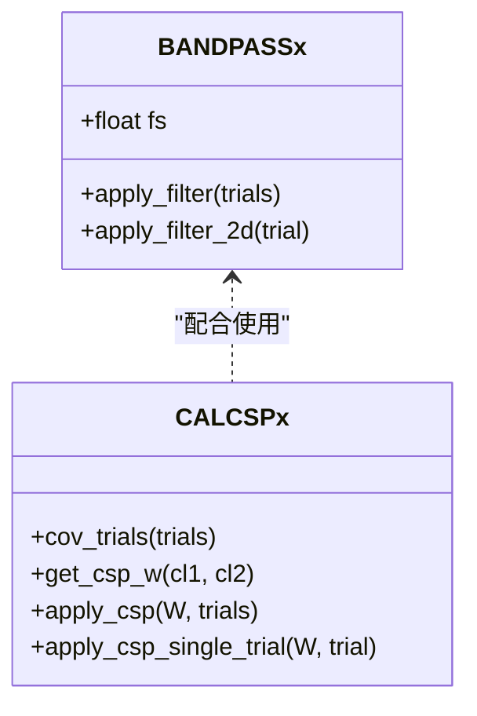
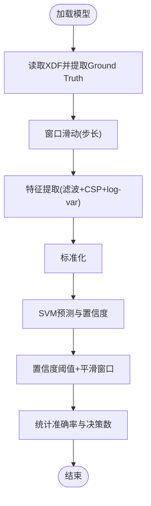
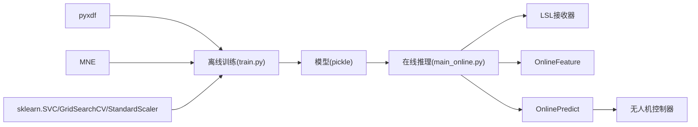

# SVM分类器理论

<cite>
**本文引用的文件**
- [train.py](file://paradigm/train.py)
- [train_plus.py](file://paradigm/train_plus.py)
- [calcspx.py](file://paradigm/calcspx.py)
- [bandpassx.py](file://paradigm/bandpassx.py)
- [online_feature.py](file://paradigm/online/online_feature.py)
- [online_predict.py](file://paradigm/online/online_predict.py)
- [main_online.py](file://paradigm/main_online.py)
- [offline_simulation.py](file://paradigm/offline_simulation.py)
- [task_markers.json](file://paradigm/task_markers.json)
</cite>

## 目录
1. [引言](#引言)
2. [项目结构](#项目结构)
3. [核心组件](#核心组件)
4. [架构总览](#架构总览)
5. [详细组件分析](#详细组件分析)
6. [依赖分析](#依赖分析)
7. [性能考量](#性能考量)
8. [故障排查指南](#故障排查指南)
9. [结论](#结论)
10. [附录](#附录)

## 引言
本文件围绕支持向量机（SVM）在脑电（BCI）分类中的理论与实践展开，结合仓库中基于MNE、CSP、带通滤波与网格搜索的完整流水线，系统阐述以下主题：
- SVM核心概念：最大间隔超平面、支持向量、软间隔与正则化参数C、凸优化问题
- 核函数数学原理：线性核、多项式核、RBF核、Sigmoid核及其适用场景
- 在BCI中的优势：高维特征空间处理、非线性决策边界、鲁棒性
- 参数调优策略：网格搜索、交叉验证、模型保存与加载
- 模型评估指标：分类报告、混淆矩阵、AUC
- 实际应用示例：离线训练、合并多数据集、在线推理与控制

## 项目结构
该BCI项目采用“离线训练—在线推理—闭环控制”的分层结构，其中SVM分类器贯穿特征工程与预测阶段：
- 离线训练：从XDF数据中提取事件、构建epoched数据，进行带通滤波、CSP特征提取、互信息特征选择、标准化与SVM训练，使用网格搜索CV选择最优参数并保存模型
- 在线推理：实时接收EEG窗口，沿用训练时的滤波、CSP、特征选择与标准化，调用SVM进行预测与置信度评估
- 控制闭环：根据预测结果与置信度阈值，触发无人机上下动作

图表来源
- [train.py:107-169](file://paradigm/train.py#L107-L169)
- [train_plus.py:109-181](file://paradigm/train_plus.py#L109-L181)
- [online_feature.py:20-52](file://paradigm/online/online_feature.py#L20-L52)
- [online_predict.py:9-17](file://paradigm/online/online_predict.py#L9-L17)
- [main_online.py:54-97](file://paradigm/main_online.py#L54-L97)

章节来源
- [train.py:1-201](file://paradigm/train.py#L1-L201)
- [train_plus.py:1-213](file://paradigm/train_plus.py#L1-L213)
- [main_online.py:1-97](file://paradigm/main_online.py#L1-L97)

## 核心组件
- SVM分类器与参数搜索
  - 使用SVC进行二分类，开启概率输出以便计算AUC
  - 使用GridSearchCV进行5折交叉验证，搜索C、gamma、kernel等超参数
  - 训练完成后保存包含SVM、CSP权重、特征索引、标准化器等在内的完整模型
- 特征工程
  - 带通滤波：BANDPASSx基于巴特沃斯滤波器设计，对每个频带进行滤波
  - CSP特征提取：CALCSPx计算类间协方差比的广义特征分解，得到混合矩阵W，投影到典型空间
  - 特征选择：基于互信息对各频带CSP特征进行排序，选择Top-k特征
  - 标准化：StandardScaler对特征进行Z-score标准化
- 在线推理
  - OnlineFeature：复用训练时的滤波、CSP、特征选择与标准化
  - OnlinePredict：封装SVM预测与置信度获取
  - main_online：主循环中实现置信度阈值与稳定窗口策略，驱动无人机动作

章节来源
- [train.py:154-169](file://paradigm/train.py#L154-L169)
- [train_plus.py:166-181](file://paradigm/train_plus.py#L166-L181)
- [calcspx.py:45-78](file://paradigm/calcspx.py#L45-L78)
- [bandpassx.py:33-73](file://paradigm/bandpassx.py#L33-L73)
- [online_feature.py:7-52](file://paradigm/online/online_feature.py#L7-L52)
- [online_predict.py:3-17](file://paradigm/online/online_predict.py#L3-L17)

## 架构总览
下图展示了从离线训练到在线推理的关键数据流与模块交互。

图表来源
- [train.py:107-169](file://paradigm/train.py#L107-L169)
- [main_online.py:18-39](file://paradigm/main_online.py#L18-L39)
- [online_feature.py:20-52](file://paradigm/online/online_feature.py#L20-L52)
- [online_predict.py:9-17](file://paradigm/online/online_predict.py#L9-L17)

## 详细组件分析

### SVM离线训练与参数搜索
- 数据准备：从XDF读取EEG与Markers，构建MNE事件矩阵与Epochs，划分两类标签
- 特征工程：多频带带通滤波、CSP投影、log-variance特征、互信息特征选择、标准化
- 模型训练：SVC + GridSearchCV（5折），搜索C、gamma、kernel
- 指标评估：分类报告、混淆矩阵、AUC
- 模型保存：包含SVM、CSP权重、特征索引、标准化器、滤波参数等

图表来源
- [train.py:107-169](file://paradigm/train.py#L107-L169)
- [train.py:171-182](file://paradigm/train.py#L171-L182)
- [train.py:184-199](file://paradigm/train.py#L184-L199)

章节来源
- [train.py:107-169](file://paradigm/train.py#L107-L169)
- [train.py:171-182](file://paradigm/train.py#L171-L182)
- [train.py:184-199](file://paradigm/train.py#L184-L199)

### SVM在线推理与控制
- 在线特征提取：沿用训练时的滤波、CSP、特征选择与标准化
- 预测与置信度：SVM输出概率，取最大概率作为置信度
- 决策策略：置信度阈值过滤 + 稳定性窗口（连续一致预测）决定动作
- 控制执行：根据预测结果触发无人机上下动作

图表来源
- [main_online.py:54-97](file://paradigm/main_online.py#L54-L97)
- [online_feature.py:20-52](file://paradigm/online/online_feature.py#L20-L52)
- [online_predict.py:9-17](file://paradigm/online/online_predict.py#L9-L17)

章节来源
- [main_online.py:54-97](file://paradigm/main_online.py#L54-L97)
- [online_feature.py:20-52](file://paradigm/online/online_feature.py#L20-L52)
- [online_predict.py:9-17](file://paradigm/online/online_predict.py#L9-L17)

### CSP与带通滤波实现
- 带通滤波：BANDPASSx基于巴特沃斯滤波器，对3D数据逐trial滤波，保证时域无相位失真
- CSP：CALCSPx计算两类协方差的归一化平均，加入正则项提升数值稳定性，求解广义特征分解得到混合矩阵W，投影到典型空间

图表来源
- [bandpassx.py:7-73](file://paradigm/bandpassx.py#L7-L73)
- [calcspx.py:7-84](file://paradigm/calcspx.py#L7-L84)

章节来源
- [bandpassx.py:7-73](file://paradigm/bandpassx.py#L7-L73)
- [calcspx.py:21-78](file://paradigm/calcspx.py#L21-L78)

### 离线仿真与评估
- offline_simulation：加载已训练模型，对离线数据进行窗口化滑动，沿用训练时的特征提取与标准化，输出预测、置信度与最终决策，统计准确率与跳过次数

图表来源
- [offline_simulation.py:12-24](file://paradigm/offline_simulation.py#L12-L24)
- [offline_simulation.py:99-178](file://paradigm/offline_simulation.py#L99-L178)

章节来源
- [offline_simulation.py:12-24](file://paradigm/offline_simulation.py#L12-L24)
- [offline_simulation.py:99-178](file://paradigm/offline_simulation.py#L99-L178)

## 依赖分析
- 模块耦合
  - 离线训练依赖：pyxdf、MNE、scipy、sklearn（SVC、GridSearchCV、StandardScaler、互信息、classification_report、confusion_matrix、roc_auc_score）
  - 在线推理依赖：pickle、numpy、LSL接收器、自定义OnlineFeature与OnlinePredict
- 数据流
  - 训练时：XDF -> Epochs -> 滤波 -> CSP -> 特征选择 -> 标准化 -> SVM -> 保存
  - 在线时：窗口 -> 滤波 -> CSP -> 特征选择 -> 标准化 -> SVM -> 决策 -> 控制
- 外部接口
  - LSL接收器负责实时数据流接入
  - 模型以pickle形式保存，便于快速加载与部署

图表来源
- [train.py:2-18](file://paradigm/train.py#L2-L18)
- [main_online.py:8-39](file://paradigm/main_online.py#L8-L39)
- [online_feature.py:3-18](file://paradigm/online/online_feature.py#L3-L18)
- [online_predict.py:3-17](file://paradigm/online/online_predict.py#L3-L17)

章节来源
- [train.py:2-18](file://paradigm/train.py#L2-L18)
- [main_online.py:8-39](file://paradigm/main_online.py#L8-L39)
- [online_feature.py:3-18](file://paradigm/online/online_feature.py#L3-L18)
- [online_predict.py:3-17](file://paradigm/online/online_predict.py#L3-L17)

## 性能考量
- 计算复杂度
  - SVM训练复杂度近似O(n_samples·n_features^2)，在高维特征空间（如CSP+多频带log-var）下需注意特征数量与核函数选择
  - 线性核适合高维稀疏或标准化后的稠密特征，RBF核适合非线性可分场景
- 正则化与偏差-方差权衡
  - C越大，软间隔越紧，更易过拟合；C越小，软间隔越松，可能欠拟合
  - 通过网格搜索与交叉验证选择最优C，结合特征选择降低维度，平衡偏差与方差
- 实时性
  - 在线推理仅进行特征提取与SVM预测，计算开销较小，可通过置信度阈值与稳定性窗口减少误判
- 数据质量
  - CSP与带通滤波显著提升特征判别性；标准化保证不同频带特征在同一尺度

## 故障排查指南
- 模型加载失败
  - 确认模型保存路径与文件名一致，检查pickle文件完整性
- 特征维度不匹配
  - 在线与离线特征应使用相同的滤波频带、CSP特征索引与互信息选择的特征索引
- 置信度始终偏低
  - 调整置信度阈值与平滑窗口长度，检查训练数据是否充分、C与gamma是否合适
- 实时控制抖动
  - 增大稳定性窗口或提高置信度阈值，避免频繁切换动作

章节来源
- [main_online.py:18-39](file://paradigm/main_online.py#L18-L39)
- [online_feature.py:46-52](file://paradigm/online/online_feature.py#L46-L52)
- [offline_simulation.py:134-178](file://paradigm/offline_simulation.py#L134-L178)

## 结论
本项目以SVM为核心，结合CSP与多频带特征，实现了从离线训练到在线推理再到控制闭环的完整BCI分类流水线。通过网格搜索与交叉验证自动选择超参数，利用互信息与标准化提升特征质量，SVM在高维非线性特征空间中展现出良好的判别能力。实践中建议持续优化C与gamma、调整置信度阈值与稳定性窗口，并结合AUC等指标进行模型评估与迭代。

## 附录

### SVM理论要点与调参建议
- 最大间隔超平面与支持向量
  - SVM寻找使正负样本间隔最大化（几何间隔）的超平面，支持向量位于间隔边界上
- 凸优化问题
  - 学习过程转化为对偶问题的凸二次规划，存在全局最优解
- 软间隔与正则化参数C
  - C控制对误分类的惩罚强度；C增大导致更严格的软间隔，C减小允许更多误分类
- 核函数
  - 线性核：适用于线性可分或高维稀疏特征，计算快、泛化好
  - RBF核：适合非线性可分，需调gamma；gamma越大，决策边界越弯曲
  - 多项式核：捕捉多项式非线性关系，需调degree与coef0
  - Sigmoid核：类似神经网络激活，常用于浅层非线性映射
- 调优策略
  - 网格搜索：对C、gamma、kernel进行穷举组合，结合交叉验证选择最优
  - 交叉验证：5折或更高折数，确保评估稳健
  - 指标：准确率、精确率、召回率、F1、AUC、混淆矩阵
- BCI应用优势
  - 高维特征空间：CSP将高维EEG投影到判别性更强的子空间
  - 非线性边界：RBF等核函数适应复杂的脑信号模式
  - 鲁棒性：标准化与特征选择降低噪声影响

### 实际应用示例（代码路径）
- 离线训练与参数搜索
  - [train.py:154-169](file://paradigm/train.py#L154-L169)
  - [train_plus.py:166-172](file://paradigm/train_plus.py#L166-L172)
- 模型保存与加载
  - [train.py:184-199](file://paradigm/train.py#L184-L199)
  - [main_online.py:18](file://paradigm/main_online.py#L18)
- 在线特征提取与预测
  - [online_feature.py:20-52](file://paradigm/online/online_feature.py#L20-L52)
  - [online_predict.py:9-17](file://paradigm/online/online_predict.py#L9-L17)
- 离线仿真与评估
  - [offline_simulation.py:12-24](file://paradigm/offline_simulation.py#L12-L24)
  - [offline_simulation.py:99-178](file://paradigm/offline_simulation.py#L99-L178)