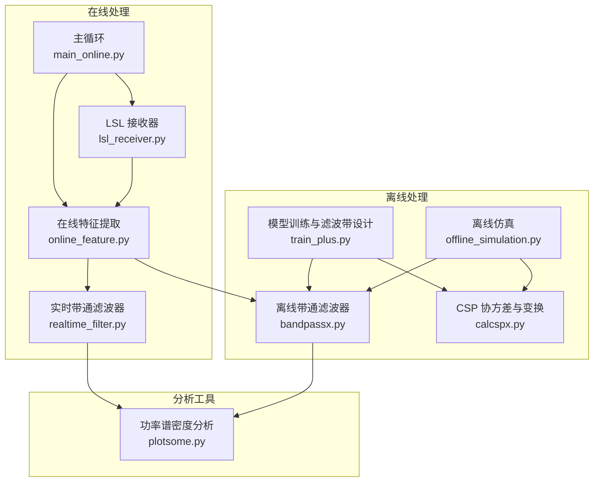
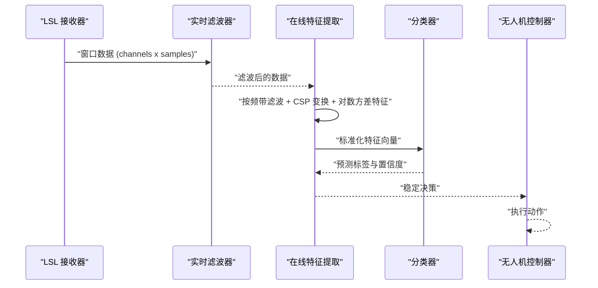
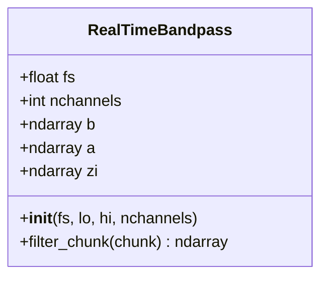
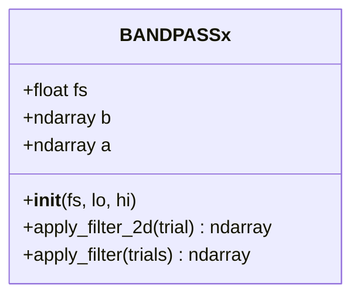
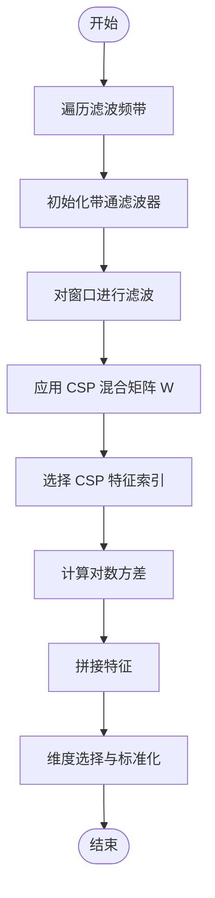
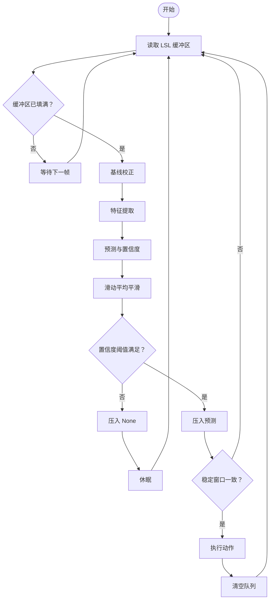
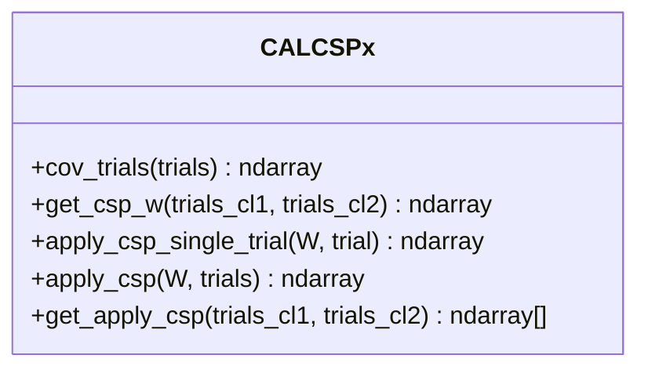
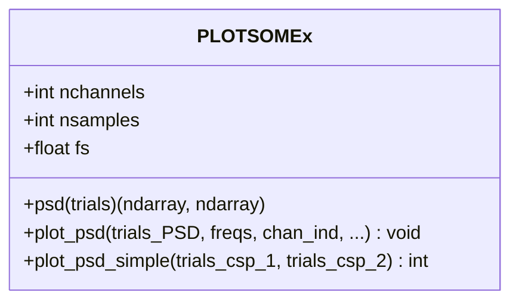
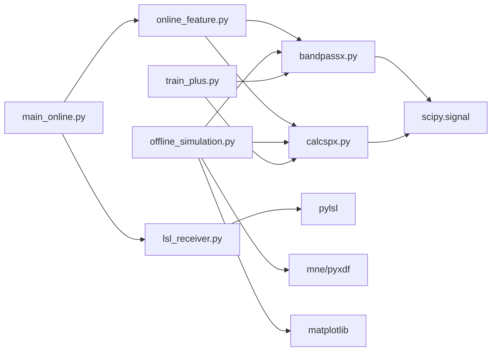

# 数字滤波器理论

<cite>
**本文引用的文件**
- [realtime_filter.py](file://paradigm/realtime_filter.py)
- [bandpassx.py](file://paradigm/bandpassx.py)
- [lsl_receiver.py](file://paradigm/online/lsl_receiver.py)
- [online_feature.py](file://paradigm/online/online_feature.py)
- [main_online.py](file://paradigm/main_online.py)
- [calcspx.py](file://paradigm/calcspx.py)
- [plotsome.py](file://paradigm/plotsome.py)
- [offline_simulation.py](file://paradigm/offline_simulation.py)
- [train_plus.py](file://paradigm/train_plus.py)
</cite>

## 目录
1. [引言](#引言)
2. [项目结构](#项目结构)
3. [核心组件](#核心组件)
4. [架构总览](#架构总览)
5. [详细组件分析](#详细组件分析)
6. [依赖分析](#依赖分析)
7. [性能考虑](#性能考虑)
8. [故障排查指南](#故障排查指南)
9. [结论](#结论)
10. [附录](#附录)

## 引言
本技术文档围绕数字滤波器理论与实现展开，结合仓库中的实时滤波器与离线仿真模块，系统阐述带通滤波器的设计原理与工程实践。重点覆盖：
- 巴特沃斯、切比雪夫与椭圆滤波器的特性对比与适用场景
- 数字滤波器的数学基础：Z 变换、传递函数与频率响应
- 实时滤波器的实现方法：FIR 与 IIR 的选择原则
- 滤波器参数设计指南：截止频率、采样率与滤波器阶数
- 稳定性分析、相位响应与群延迟
- 代码示例与性能优化技巧

## 项目结构
本项目以“在线实时处理”为主线，包含数据采集、滤波、特征提取、分类预测与控制输出等模块。滤波器相关的核心代码集中在以下文件：
- 实时滤波器类：paradigm/realtime_filter.py
- 离线/批处理带通滤波器类：paradigm/bandpassx.py
- 在线数据流接收：paradigm/online/lsl_receiver.py
- 在线特征提取与滤波：paradigm/online/online_feature.py
- 在线主循环：paradigm/main_online.py
- CSP 协方差与变换：paradigm/calcspx.py
- 功率谱密度分析：paradigm/plotsome.py
- 离线仿真与验证：paradigm/offline_simulation.py
- 模型训练与滤波带设计：paradigm/train_plus.py

图表来源
- [lsl_receiver.py:1-32](file://paradigm/online/lsl_receiver.py#L1-L32)
- [online_feature.py:1-52](file://paradigm/online/online_feature.py#L1-L52)
- [realtime_filter.py:1-32](file://paradigm/realtime_filter.py#L1-L32)
- [main_online.py:1-97](file://paradigm/main_online.py#L1-L97)
- [bandpassx.py:1-79](file://paradigm/bandpassx.py#L1-L79)
- [calcspx.py:1-87](file://paradigm/calcspx.py#L1-L87)
- [offline_simulation.py:1-195](file://paradigm/offline_simulation.py#L1-L195)
- [train_plus.py:1-213](file://paradigm/train_plus.py#L1-L213)
- [plotsome.py:1-135](file://paradigm/plotsome.py#L1-L135)

章节来源
- [main_online.py:1-97](file://paradigm/main_online.py#L1-L97)
- [lsl_receiver.py:1-32](file://paradigm/online/lsl_receiver.py#L1-L32)
- [online_feature.py:1-52](file://paradigm/online/online_feature.py#L1-L52)
- [realtime_filter.py:1-32](file://paradigm/realtime_filter.py#L1-L32)
- [bandpassx.py:1-79](file://paradigm/bandpassx.py#L1-L79)
- [calcspx.py:1-87](file://paradigm/calcspx.py#L1-L87)
- [offline_simulation.py:1-195](file://paradigm/offline_simulation.py#L1-L195)
- [train_plus.py:1-213](file://paradigm/train_plus.py#L1-L213)
- [plotsome.py:1-135](file://paradigm/plotsome.py#L1-L135)

## 核心组件
- 实时带通滤波器 RealTimeBandpass
  - 使用 scipy.signal.iirfilter 设计 IIR 滤波器，初始化状态矩阵 zi，支持通道级状态维护与 lfilter 前向滤波
  - 适合在线实时处理，具有因果性与有限延迟
- 离线带通滤波器 BANDPASSx
  - 使用 scipy.signal.butter 设计巴特沃斯带通滤波器，采用 filtfilt 实现零相位滤波
  - 适合离线批处理，消除相位失真，但不适用于实时流式处理
- 在线特征提取 OnlineFeature
  - 遍历滤波频带，对窗口数据进行滤波与 CSP 变换，提取对分类有判别力的对数方差特征
- 在线主循环 main_online
  - 从 LSL 流中读取窗口数据，进行基线校正、特征提取、预测与动作控制
- CSP 协方差与变换 CALCSPx
  - 计算每试验的协方差矩阵并做正则化，求解广义特征值问题得到 CSP 混合矩阵 W，并对试验应用变换
- 功率谱密度分析 PLOTSOMEx
  - 使用 Welch 方法估计功率谱密度，辅助滤波器与特征分析的可视化

章节来源
- [realtime_filter.py:6-32](file://paradigm/realtime_filter.py#L6-L32)
- [bandpassx.py:7-79](file://paradigm/bandpassx.py#L7-L79)
- [online_feature.py:7-52](file://paradigm/online/online_feature.py#L7-L52)
- [main_online.py:1-97](file://paradigm/main_online.py#L1-L97)
- [calcspx.py:7-87](file://paradigm/calcspx.py#L7-L87)
- [plotsome.py:9-135](file://paradigm/plotsome.py#L9-L135)

## 架构总览
下图展示在线实时处理的端到端流程：数据采集 → 实时滤波 → 特征提取 → 分类预测 → 控制输出。

图表来源
- [lsl_receiver.py:23-32](file://paradigm/online/lsl_receiver.py#L23-L32)
- [realtime_filter.py:22-32](file://paradigm/realtime_filter.py#L22-L32)
- [online_feature.py:20-52](file://paradigm/online/online_feature.py#L20-L52)
- [main_online.py:54-97](file://paradigm/main_online.py#L54-L97)

## 详细组件分析

### 实时带通滤波器 RealTimeBandpass
- 设计要点
  - 使用 scipy.signal.iirfilter 设计 IIR 滤波器，阶数与通带纹波由参数决定
  - 通过 scipy.signal.lfilter_zi 计算初始状态，保证首次滤波的稳态一致性
  - 为每个通道维护独立的初始状态 zi，避免通道间干扰
- 处理逻辑
  - 输入为 (channels x samples) 的数据块，逐通道调用 lfilter，并更新对应通道的 zi
  - 适合实时流式处理，具有因果性与较低延迟
- 参数与性能
  - 阶数越高，过渡带越陡峭，但可能引入更大的相位延迟与数值不稳定风险
  - 通道数量较多时，循环遍历的开销可接受，但需注意内存布局与缓存友好性

图表来源
- [realtime_filter.py:6-32](file://paradigm/realtime_filter.py#L6-L32)

章节来源
- [realtime_filter.py:6-32](file://paradigm/realtime_filter.py#L6-L32)

### 离线带通滤波器 BANDPASSx
- 设计要点
  - 使用 scipy.signal.butter 设计巴特沃斯带通滤波器，阶数与边界归一化频率由参数决定
  - 采用 filtfilt 实现零相位滤波，消除相位失真，适合离线批处理
- 处理逻辑
  - 支持二维与三维输入，分别沿样本轴进行滤波
  - 对每个试验独立滤波，便于后续 CSP 与特征提取
- 参数与性能
  - 巴特沃斯在通带内最大平坦特性，适合需要线性相位特性的离线分析
  - filtfilt 的双向卷积会引入瞬态效应，不适合实时流处理

图表来源
- [bandpassx.py:7-79](file://paradigm/bandpassx.py#L7-L79)

章节来源
- [bandpassx.py:7-79](file://paradigm/bandpassx.py#L7-L79)

### 在线特征提取 OnlineFeature
- 设计要点
  - 遍历模型定义的滤波频带，对当前窗口进行带通滤波
  - 对每个频带应用 CSP 混合矩阵 W，提取选定的 CSP 成分
  - 计算对数方差作为特征，再进行维度选择与标准化
- 处理逻辑
  - 将三维输入转换为四维（增加单试验维度）以适配滤波接口
  - 串联滤波、CSP 变换与特征拼接，形成最终特征向量
- 参数与性能
  - 频带数量与 CSP 维度影响特征维度与计算复杂度
  - 维度选择与标准化有助于提升分类器性能

图表来源
- [online_feature.py:20-52](file://paradigm/online/online_feature.py#L20-L52)
- [bandpassx.py:39-73](file://paradigm/bandpassx.py#L39-L73)
- [calcspx.py:62-78](file://paradigm/calcspx.py#L62-L78)

章节来源
- [online_feature.py:7-52](file://paradigm/online/online_feature.py#L7-L52)
- [calcspx.py:45-78](file://paradigm/calcspx.py#L45-L78)

### 在线主循环 main_online
- 设计要点
  - 从 LSL 流中读取窗口数据，进行基线校正
  - 提取特征并进行预测，采用滑动平均与稳定窗口减少误触发
  - 当稳定决策满足阈值时，驱动无人机执行动作
- 处理逻辑
  - 使用队列维持置信度与预测的稳定性判断
  - 通过时间步长控制预测频率，避免过高的 CPU 占用
- 参数与性能
  - 阈值、稳定窗口与置信度窗口影响系统的鲁棒性与响应速度

图表来源
- [main_online.py:54-97](file://paradigm/main_online.py#L54-L97)
- [lsl_receiver.py:23-32](file://paradigm/online/lsl_receiver.py#L23-L32)

章节来源
- [main_online.py:1-97](file://paradigm/main_online.py#L1-L97)
- [lsl_receiver.py:1-32](file://paradigm/online/lsl_receiver.py#L1-L32)

### CSP 协方差与变换 CALCSPx
- 设计要点
  - 对每个试验计算协方差矩阵并做迹归一化与正则化，提高数值稳定性
  - 求解广义特征值问题得到 CSP 混合矩阵 W，并对试验进行变换
- 处理逻辑
  - 支持单试验与多试验的 CSP 应用，便于特征提取与可视化
- 参数与性能
  - 正则化项有助于避免协方差矩阵病态，提升算法鲁棒性

图表来源
- [calcspx.py:7-87](file://paradigm/calcspx.py#L7-L87)

章节来源
- [calcspx.py:21-87](file://paradigm/calcspx.py#L21-L87)

### 功率谱密度分析 PLOTSOMEx
- 设计要点
  - 使用 Welch 方法估计功率谱密度，支持按类别与通道可视化
  - 可限制频率范围与纵轴范围，便于对比不同滤波器或处理阶段的效果
- 处理逻辑
  - 对每个试验与通道计算 PSD，取均值后绘制对比曲线

图表来源
- [plotsome.py:9-135](file://paradigm/plotsome.py#L9-L135)

章节来源
- [plotsome.py:19-135](file://paradigm/plotsome.py#L19-L135)

## 依赖分析
- 组件耦合
  - main_online 依赖 LSLReceiver 与 OnlineFeature；OnlineFeature 依赖 BANDPASSx 与 CALCSPx
  - 离线仿真 offline_simulation 与训练 train_plus 同时依赖 bandpassx 与 calcspx
- 外部依赖
  - scipy.signal：滤波器设计与滤波操作（butter、iirfilter、filtfilt、lfilter、lfilter_zi）
  - numpy：数组运算与状态管理
  - pylsl：实时数据流接入
  - mne/pyxdf：离线数据加载与事件标注
  - matplotlib/scipy.signal.welch：功率谱密度分析

图表来源
- [main_online.py:1-12](file://paradigm/main_online.py#L1-L12)
- [online_feature.py:3-6](file://paradigm/online/online_feature.py#L3-L6)
- [bandpassx.py:3-4](file://paradigm/bandpassx.py#L3-L4)
- [calcspx.py:3-4](file://paradigm/calcspx.py#L3-L4)
- [offline_simulation.py:1-11](file://paradigm/offline_simulation.py#L1-L11)
- [train_plus.py:3-22](file://paradigm/train_plus.py#L3-L22)

章节来源
- [main_online.py:1-12](file://paradigm/main_online.py#L1-L12)
- [offline_simulation.py:1-11](file://paradigm/offline_simulation.py#L1-L11)
- [train_plus.py:3-22](file://paradigm/train_plus.py#L3-L22)

## 性能考虑
- 实时滤波器
  - IIR 滤波器阶数与稳定性：阶数越高，过渡带越陡，但可能引入相位延迟与数值不稳定；建议在满足性能的前提下尽量降低阶数
  - 状态管理：lfilter_zi 初始化与逐通道状态更新可减少瞬态影响，提高首帧一致性
  - 内存与缓存：通道数较多时，注意数组布局与连续内存访问，避免频繁的 Python 循环开销
- 离线滤波器
  - filtfilt 零相位特性带来更好的时域保真度，但不适用于实时流处理；批处理时可显著提升特征质量
- 特征提取与分类
  - CSP 维度与特征选择：通过互信息等方法选择判别力强的特征，降低维度与计算复杂度
  - 标准化与正则化：协方差正则化与特征标准化有助于提升分类器鲁棒性
- 数据流与控制
  - 在线主循环中使用滑动平均与稳定窗口，平衡响应速度与误触发率
  - 时间步长与阈值需根据硬件性能与任务需求调整

[本节为通用性能讨论，无需特定文件来源]

## 故障排查指南
- 实时滤波器
  - 若出现首帧异常或直流漂移，检查 zi 初始化是否正确，确认每个通道的状态是否独立维护
  - 若通道间相互干扰，检查 zi 的复制方式与维度是否匹配
- 离线滤波器
  - 若滤波后出现明显相位畸变，确认是否使用 filtfilt；若需实时处理，改用 lfilter 并自行处理相位
- 在线特征提取
  - 若特征维度异常，检查 CSP 维度选择索引与滤波带数量是否一致
  - 若分类器性能不佳，检查特征标准化与正则化参数
- 在线主循环
  - 若预测过于频繁或误触发，调整置信度阈值与稳定窗口大小
  - 若系统卡顿，检查时间步长与队列长度，避免过度占用 CPU

章节来源
- [realtime_filter.py:16-20](file://paradigm/realtime_filter.py#L16-L20)
- [bandpassx.py:52-52](file://paradigm/bandpassx.py#L52-L52)
- [online_feature.py:40-42](file://paradigm/online/online_feature.py#L40-L42)
- [main_online.py:44-49](file://paradigm/main_online.py#L44-L49)

## 结论
本项目展示了从实时数据采集到特征提取与分类控制的完整链路，其中滤波器设计与实现是关键环节。通过巴特沃斯带通滤波器与 CSP 变换，结合合理的参数设计与稳定性策略，可在脑机接口任务中取得稳健的性能。对于实时性要求更高的场景，IIR 滤波器配合状态管理是更优选择；对于离线分析与可视化，零相位滤波器与功率谱密度分析提供了良好的工具。

[本节为总结性内容，无需特定文件来源]

## 附录

### 数字滤波器数学基础与设计指南
- Z 变换与传递函数
  - IIR 滤波器：H(z)=∑n=0N−1b[n]z−n/1+∑n=1M−1a[n]z−n
  - FIR 滤波器：H(z)=∑n=0N−1b[n]z−n
- 频率响应与相位特性
  - IIR：通常存在非线性相位，可能导致时域失真；可通过零相位滤波（如 filtfilt）缓解
  - FIR：可实现线性相位，相位响应为常数乘以频率，更适合时域保真要求高的应用
- 稳定性分析
  - IIR：极点必须位于单位圆内；可通过合理设计（如巴特沃斯、切比雪夫、椭圆）与数值校验保证稳定性
  - FIR：总是稳定的
- 群延迟
  - FIR：群延迟为(N−1)/2（N 为长度），线性相位
  - IIR：群延迟随频率变化，需通过零相位处理或相位校正补偿
- 截止频率与采样率
  - 归一化截止频率 Ωc=fc/fs，设计时应避免接近 Nyquist 频率，留出足够的过渡带
- 滤波器阶数与代价
  - 巴特沃斯：最大平坦通带，过渡带较宽
  - 切比雪夫 I 型：通带等纹波，阻带衰减更快
  - 切比雪夫 II 型：阻带等纹波，通带平坦
  - 椭圆：通阻带均有等纹波，过渡带最陡，但相位非线性最严重

[本节为概念性内容，无需特定文件来源]

### 代码示例与实现要点（路径指引）
- 实时 IIR 滤波器设计与状态初始化
  - [realtime_filter.py:11-20](file://paradigm/realtime_filter.py#L11-L20)
- 实时 IIR 滤波与状态更新
  - [realtime_filter.py:22-32](file://paradigm/realtime_filter.py#L22-L32)
- 离线巴特沃斯带通滤波与零相位处理
  - [bandpassx.py:33-37](file://paradigm/bandpassx.py#L33-L37)
  - [bandpassx.py:52-52](file://paradigm/bandpassx.py#L52-L52)
- 在线特征提取与 CSP 变换
  - [online_feature.py:28-42](file://paradigm/online/online_feature.py#L28-L42)
  - [calcspx.py:62-78](file://paradigm/calcspx.py#L62-L78)
- 在线主循环与稳定决策
  - [main_online.py:54-97](file://paradigm/main_online.py#L54-L97)
- 离线仿真与验证
  - [offline_simulation.py:99-178](file://paradigm/offline_simulation.py#L99-L178)
- 模型训练与滤波带设计
  - [train_plus.py:109-146](file://paradigm/train_plus.py#L109-L146)

[本节为路径指引，无需特定文件来源]