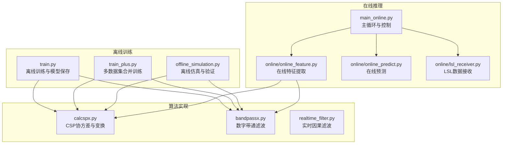
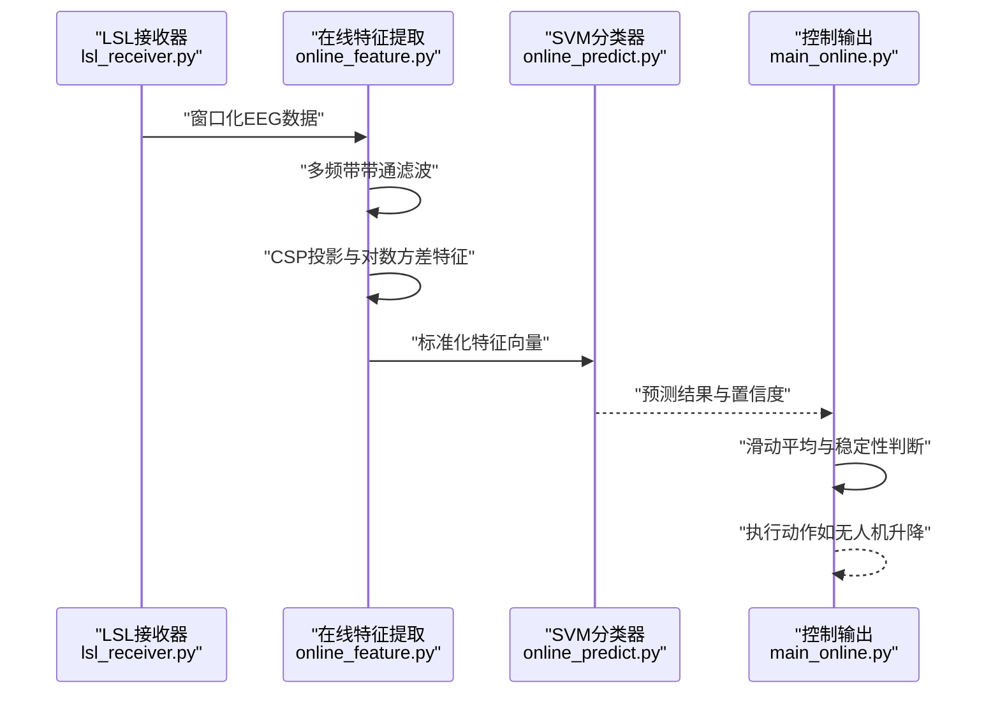
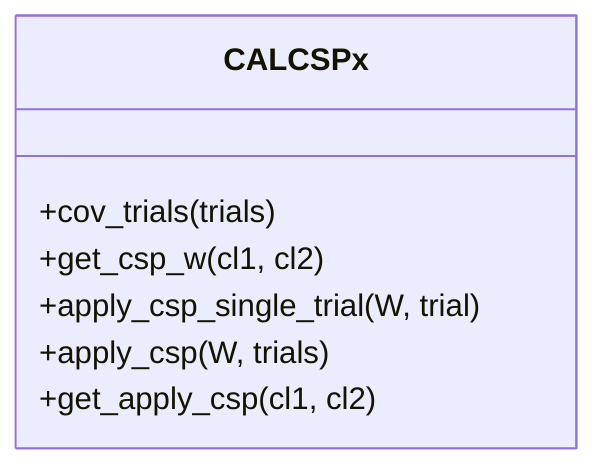
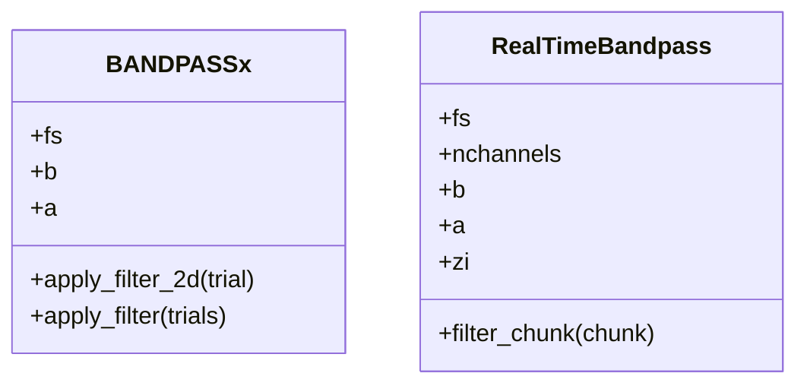
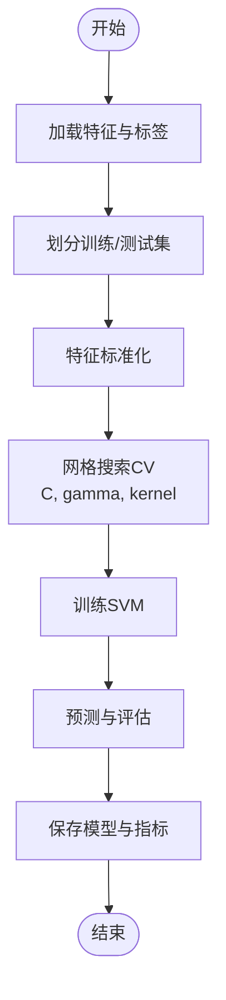
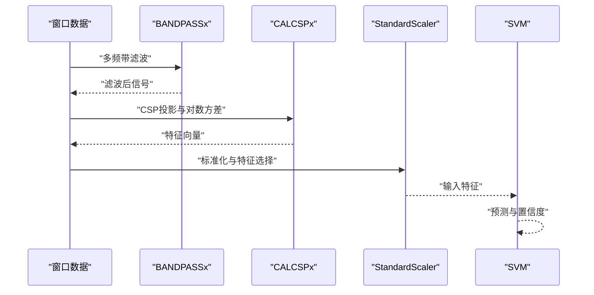
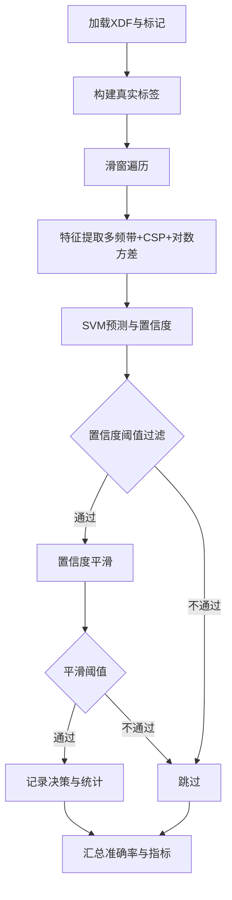
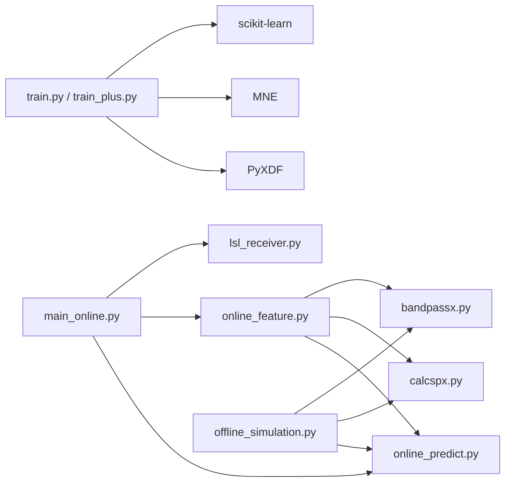

# 算法原理详解

<cite>
**本文引用的文件**   
- [paradigm/calcspx.py](file://paradigm/calcspx.py)
- [paradigm/bandpassx.py](file://paradigm/bandpassx.py)
- [paradigm/realtime_filter.py](file://paradigm/realtime_filter.py)
- [paradigm/train.py](file://paradigm/train.py)
- [paradigm/train_plus.py](file://paradigm/train_plus.py)
- [paradigm/main_online.py](file://paradigm/main_online.py)
- [paradigm/online/online_feature.py](file://paradigm/online/online_feature.py)
- [paradigm/online/online_predict.py](file://paradigm/online/online_predict.py)
- [paradigm/online/lsl_receiver.py](file://paradigm/online/lsl_receiver.py)
- [paradigm/offline_simulation.py](file://paradigm/offline_simulation.py)
- [paradigm/task_markers.json](file://paradigm/task_markers.json)
</cite>

## 目录
1. [引言](#引言)
2. [项目结构](#项目结构)
3. [核心组件](#核心组件)
4. [架构总览](#架构总览)
5. [详细组件分析](#详细组件分析)
6. [依赖分析](#依赖分析)
7. [性能考虑](#性能考虑)
8. [故障排查指南](#故障排查指南)
9. [结论](#结论)
10. [附录](#附录)

## 引言
本技术文档围绕脑机接口（BCI）系统中的关键算法与实现展开，重点阐述以下内容：
- CSP（共空间模式）算法的数学原理、实现细节及其在BCI中的优势
- SVM（支持向量机）分类器的理论基础、核函数选择与参数优化策略
- 带通滤波器的设计原理、数字滤波技术与频率响应特性
- 实时滤波器的实现方法、相位响应与延迟特性
- 特征提取的完整流程：信号预处理、频带分解与特征向量构建
- 算法性能分析、计算复杂度评估与内存使用优化
- 算法参数调优指南与实验验证方法

## 项目结构
该项目采用“功能模块化 + 在线/离线分离”的组织方式，核心模块包括：
- 特征工程与算法实现：CSP、带通滤波、实时滤波
- 训练与模型管理：离线训练脚本、模型保存与加载
- 在线推理：数据流接入、特征提取、预测与控制
- 离线仿真与验证：基于XDF数据的离线验证流程

图表来源
- [paradigm/train.py:1-201](file://paradigm/train.py#L1-L201)
- [paradigm/train_plus.py:1-213](file://paradm/train_plus.py#L1-L213)
- [paradigm/offline_simulation.py:1-195](file://paradigm/offline_simulation.py#L1-L195)
- [paradigm/main_online.py:1-97](file://paradigm/main_online.py#L1-L97)
- [paradigm/online/online_feature.py:1-52](file://paradigm/online/online_feature.py#L1-L52)
- [paradigm/online/online_predict.py:1-17](file://paradigm/online/online_predict.py#L1-L17)
- [paradigm/online/lsl_receiver.py:1-32](file://paradigm/online/lsl_receiver.py#L1-L32)
- [paradigm/calcspx.py:1-87](file://paradigm/calcspx.py#L1-L87)
- [paradigm/bandpassx.py:1-79](file://paradigm/bandpassx.py#L1-L79)
- [paradigm/realtime_filter.py:1-32](file://paradigm/realtime_filter.py#L1-L32)

章节来源
- [paradigm/train.py:1-201](file://paradigm/train.py#L1-L201)
- [paradigm/train_plus.py:1-213](file://paradigm/train_plus.py#L1-L213)
- [paradigm/main_online.py:1-97](file://paradigm/main_online.py#L1-L97)
- [paradigm/online/online_feature.py:1-52](file://paradigm/online/online_feature.py#L1-L52)
- [paradigm/online/online_predict.py:1-17](file://paradigm/online/online_predict.py#L1-L17)
- [paradigm/online/lsl_receiver.py:1-32](file://paradigm/online/lsl_receiver.py#L1-L32)
- [paradigm/calcspx.py:1-87](file://paradigm/calcspx.py#L1-L87)
- [paradigm/bandpassx.py:1-79](file://paradigm/bandpassx.py#L1-L79)
- [paradigm/realtime_filter.py:1-32](file://paradigm/realtime_filter.py#L1-L32)
- [paradigm/offline_simulation.py:1-195](file://paradigm/offline_simulation.py#L1-L195)
- [paradigm/task_markers.json:1-23](file://paradigm/task_markers.json#L1-L23)

## 核心组件
- CSP（共空间模式）：通过广义瑞利商优化，寻找使两类协方差比最大化方向的投影基，实现特征降维与判别增强。
- 带通滤波器：采用巴特沃斯数字滤波器设计，结合零相位滤波以消除相位失真。
- 实时滤波器：采用IIR滤波器与lfilter状态传递，保证因果性和实时性。
- SVM分类器：基于网格搜索进行超参数优化，结合标准化与互信息特征选择提升泛化能力。
- 在线流水线：从LSL接收数据、在线特征提取、SVM预测、稳定决策与控制输出。

章节来源
- [paradigm/calcspx.py:21-84](file://paradigm/calcspx.py#L21-L84)
- [paradigm/bandpassx.py:7-79](file://paradigm/bandpassx.py#L7-L79)
- [paradigm/realtime_filter.py:6-32](file://paradigm/realtime_filter.py#L6-L32)
- [paradigm/train.py:154-169](file://paradigm/train.py#L154-L169)
- [paradigm/online/online_feature.py:7-52](file://paradigm/online/online_feature.py#L7-L52)

## 架构总览
下图展示了从数据采集到在线控制的完整流程，以及离线训练与在线推理之间的衔接。

图表来源
- [paradigm/online/lsl_receiver.py:23-32](file://paradigm/online/lsl_receiver.py#L23-L32)
- [paradigm/online/online_feature.py:20-52](file://paradigm/online/online_feature.py#L20-L52)
- [paradigm/online/online_predict.py:9-17](file://paradigm/online/online_predict.py#L9-L17)
- [paradigm/main_online.py:54-97](file://paradigm/main_online.py#L54-L97)

## 详细组件分析

### CSP（共空间模式）算法
- 数学原理
  - 协方差矩阵估计：对每个试次做通道外积归一化，再按试次求平均，加入小正则项保证数值稳定。
  - 广义特征值问题：对两类协方差矩阵求解广义特征值，排序得到投影基W，使两类协方差比最大化。
  - 特征提取：对试次进行投影，取特定导联的对数方差作为特征。
- 实现要点
  - 协方差归一化与正则化，避免病态矩阵。
  - 投影基排序依据广义特征值大小，确保判别性强的方向优先。
  - 支持单试次与批量试次投影，便于离线与在线一致处理。
- 在BCI中的优势
  - 提高两类间可分性，降低维度，减少SVM负担。
  - 对特定频带与导联组合敏感，适合运动想象等任务。

图表来源
- [paradigm/calcspx.py:7-87](file://paradigm/calcspx.py#L7-L87)

章节来源
- [paradigm/calcspx.py:21-84](file://paradigm/calcspx.py#L21-L84)

### 带通滤波器设计与实现
- 设计原理
  - 数字滤波器：采用巴特沃斯低通原型，转换为带通形式，具有单调下降的幅频响应。
  - 数字域归一化：截止频率除以奈奎斯特频率，避免混叠。
- 实现细节
  - 离线/批处理：使用零相位滤波（双向滤波），消除相位失真，适合离线分析。
  - 在线/实时：使用因果滤波（lfilter），保留状态以连续处理数据块。
- 频率响应特性
  - 截止频率由采样率决定，滤波阶数影响过渡带宽度与群延迟。
  - 零相位滤波在时域上无延迟偏移，但非因果；实时滤波因果但引入延迟。

图表来源
- [paradigm/bandpassx.py:7-79](file://paradigm/bandpassx.py#L7-L79)
- [paradigm/realtime_filter.py:6-32](file://paradigm/realtime_filter.py#L6-L32)

章节来源
- [paradigm/bandpassx.py:7-79](file://paradigm/bandpassx.py#L7-L79)
- [paradigm/realtime_filter.py:6-32](file://paradigm/realtime_filter.py#L6-L32)

### SVM分类器与参数优化
- 理论基础
  - 最大边距分离：在特征空间中寻找最优超平面，最大化正负类之间的几何距离。
  - 核技巧：通过核函数隐式映射到高维空间，处理非线性可分问题。
- 核函数选择
  - RBF核：适合非线性边界，对参数敏感；线性核：线性可分或高维稀疏场景。
- 参数优化策略
  - 网格搜索：对C、gamma、kernel进行穷举组合，交叉验证选择最佳参数。
  - 标准化：先对特征进行标准化，提升SVM收敛与稳定性。
  - 特征选择：互信息筛选Top-K特征，降低维度与噪声。

图表来源
- [paradigm/train.py:154-169](file://paradigm/train.py#L154-L169)
- [paradigm/train_plus.py:166-181](file://paradigm/train_plus.py#L166-L181)

章节来源
- [paradigm/train.py:154-169](file://paradigm/train.py#L154-L169)
- [paradigm/train_plus.py:166-181](file://paradigm/train_plus.py#L166-L181)

### 在线特征提取与实时滤波
- 在线特征提取流程
  - 多频带滤波：对当前窗口分别进行带通滤波。
  - CSP投影：使用离线学习到的投影基对滤波后信号进行投影。
  - 特征构造：取特定导联子集的对数方差，拼接为特征向量。
  - 标准化与选择：使用离线标准化参数与特征选择索引。
- 实时滤波
  - 使用因果滤波器与状态向量，逐通道处理数据块，保证实时性。
  - 与离线零相位滤波相比，实时滤波引入相位延迟，但满足因果性。

图表来源
- [paradigm/online/online_feature.py:20-52](file://paradigm/online/online_feature.py#L20-L52)
- [paradigm/bandpassx.py:39-73](file://paradigm/bandpassx.py#L39-L73)
- [paradigm/calcspx.py:62-78](file://paradigm/calcspx.py#L62-L78)

章节来源
- [paradigm/online/online_feature.py:7-52](file://paradigm/online/online_feature.py#L7-L52)
- [paradigm/realtime_filter.py:22-32](file://paradigm/realtime_filter.py#L22-L32)

### 离线仿真与实验验证
- 离线仿真流程
  - 读取XDF数据与标记，构建真实标签序列。
  - 按固定步长滑窗，逐窗进行特征提取与预测。
  - 使用置信度平滑与阈值过滤，统计有效决策与准确率。
- 实验验证方法
  - 与真实标签对比，计算准确率、混淆矩阵与AUC。
  - 调整置信度阈值与平滑窗口，观察对性能的影响。

图表来源
- [paradigm/offline_simulation.py:53-195](file://paradigm/offline_simulation.py#L53-L195)

章节来源
- [paradigm/offline_simulation.py:53-195](file://paradigm/offline_simulation.py#L53-L195)

## 依赖分析
- 模块耦合
  - 在线模块依赖离线模型（投影基、标准化参数、特征选择索引）。
  - 训练模块依赖MNE、PyXDF、Scikit-learn等生态工具。
- 外部依赖
  - 数字信号处理：SciPy.signal（滤波、零相位滤波、状态传递）
  - 机器学习：Scikit-learn（SVM、网格搜索、互信息特征选择、标准化）
  - 数据接口：PyXDF（XDF读取）、PyLSL（LSL流接收）

图表来源
- [paradigm/train.py:1-201](file://paradigm/train.py#L1-L201)
- [paradigm/train_plus.py:1-213](file://paradigm/train_plus.py#L1-L213)
- [paradigm/online/online_feature.py:1-52](file://paradigm/online/online_feature.py#L1-L52)
- [paradigm/online/online_predict.py:1-17](file://paradigm/online/online_predict.py#L1-L17)
- [paradigm/main_online.py:1-97](file://paradigm/main_online.py#L1-L97)
- [paradigm/offline_simulation.py:1-195](file://paradigm/offline_simulation.py#L1-L195)

章节来源
- [paradigm/train.py:1-201](file://paradigm/train.py#L1-L201)
- [paradigm/train_plus.py:1-213](file://paradigm/train_plus.py#L1-L213)
- [paradigm/online/online_feature.py:1-52](file://paradigm/online/online_feature.py#L1-L52)
- [paradigm/online/online_predict.py:1-17](file://paradigm/online/online_predict.py#L1-L17)
- [paradigm/main_online.py:1-97](file://paradigm/main_online.py#L1-L97)
- [paradigm/offline_simulation.py:1-195](file://paradigm/offline_simulation.py#L1-L195)

## 性能考虑
- 计算复杂度
  - CSP：协方差估计O(C·S·T)，广义特征分解O(C^3)，投影O(C·S·T)；T为试次数，C为通道数，S为采样点数。
  - SVM：训练复杂度受样本数与特征维影响，预测近似线性于特征维。
  - 滤波：离线零相位滤波每通道O(S)，在线因果滤波每通道O(S)；多频带叠加线性增长。
- 内存使用
  - 试次缓存与滤波中间数组占用显著，建议批处理与及时释放中间变量。
  - 在线模式下，仅保留必要状态（如滤波器状态向量）。
- 优化建议
  - 使用更高效的线性代数库（如BLAS/LAPACK）加速协方差与特征分解。
  - 特征选择与降维（如PCA）进一步降低SVM负担。
  - 多线程/向量化处理（如NumPy向量化）提升批处理效率。

## 故障排查指南
- 数据标记与事件对齐
  - 确认标记映射与XDF时间戳对齐，避免事件窗口错位。
- 滤波器参数
  - 截止频率需小于奈奎斯特频率；滤波阶数过高可能导致不稳定或过度衰减。
- 在线稳定性
  - 若出现误触发，提高置信度阈值或增大平滑窗口；若响应迟滞，检查实时滤波延迟与窗口长度。
- 模型一致性
  - 在线特征提取必须使用离线相同的滤波带、CSP投影基与标准化参数，否则性能会显著下降。

章节来源
- [paradigm/task_markers.json:1-23](file://paradigm/task_markers.json#L1-L23)
- [paradigm/main_online.py:54-97](file://paradigm/main_online.py#L54-L97)
- [paradigm/online/online_feature.py:20-52](file://paradigm/online/online_feature.py#L20-L52)

## 结论
本项目在离线与在线两个层面完整实现了基于CSP+SVM的BCI特征提取与分类流程。通过多频带滤波与CSP投影，有效提升了两类间的可分性；借助网格搜索与互信息特征选择，SVM在有限样本下仍具备良好泛化能力。在线模块以因果滤波与滑动窗口实现低延迟实时控制，配合置信度平滑与稳定性判断，兼顾准确性与鲁棒性。后续可在算法加速、特征融合与自适应调节方面进一步优化。

## 附录
- 参数调优清单
  - CSP导联索引与特征数量：根据导联分布与任务类型调整。
  - 滤波带范围与重叠：平衡频谱分辨率与计算开销。
  - SVM核与正则化：RBF核适合非线性，线性核适合高维稀疏。
  - 置信度阈值与平滑窗口：权衡响应速度与误报率。
- 实验验证方法
  - 离线：使用独立测试集计算准确率、AUC与混淆矩阵。
  - 在线：通过滑窗与阈值过滤统计有效决策与准确率，结合延迟测量评估实时性能。