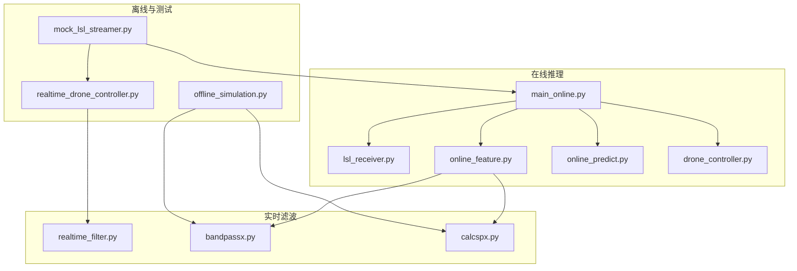
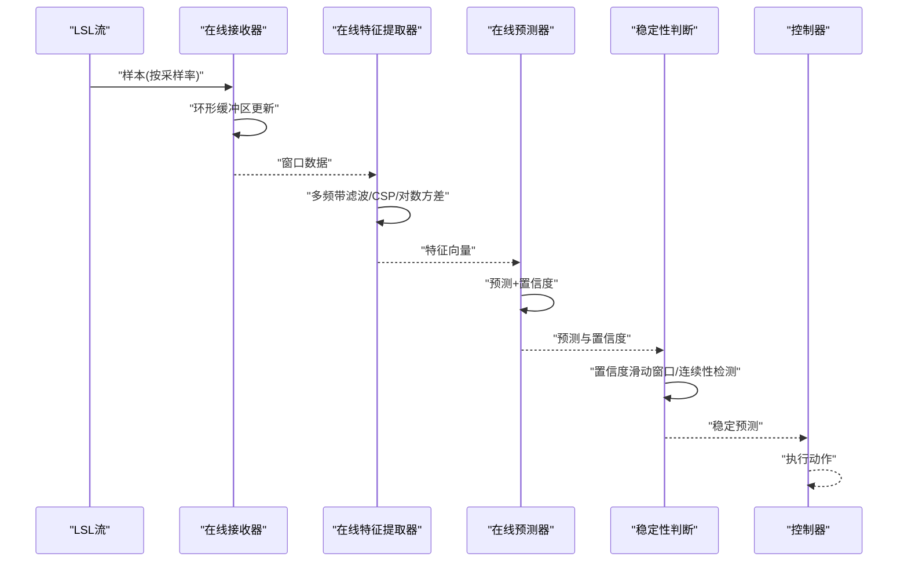
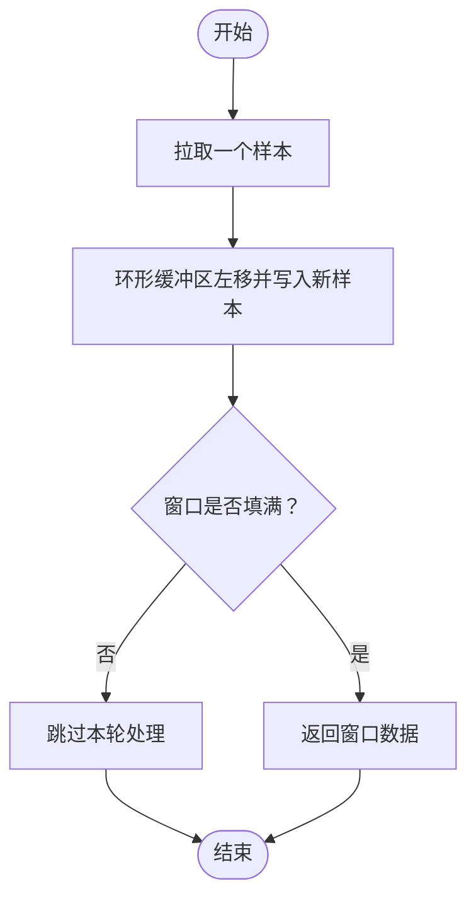
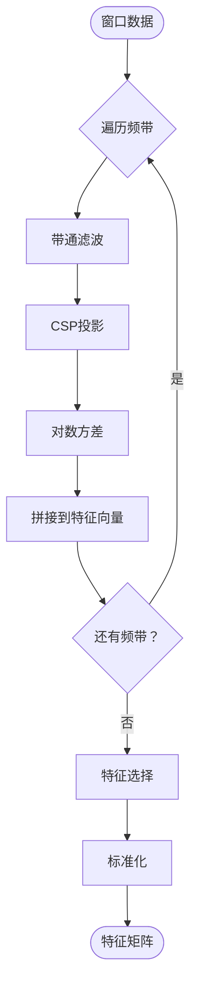
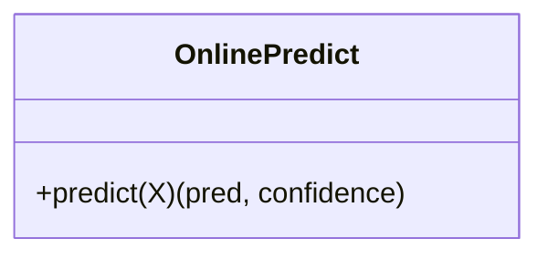
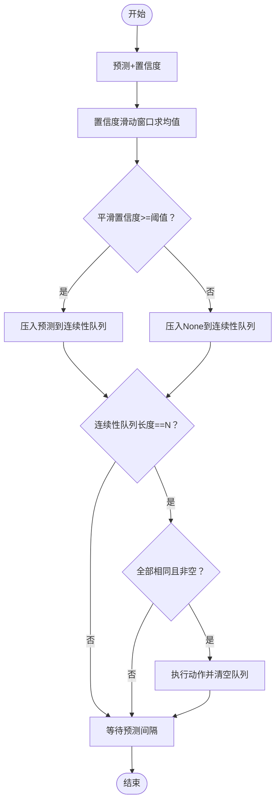
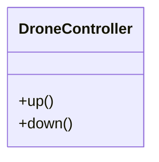
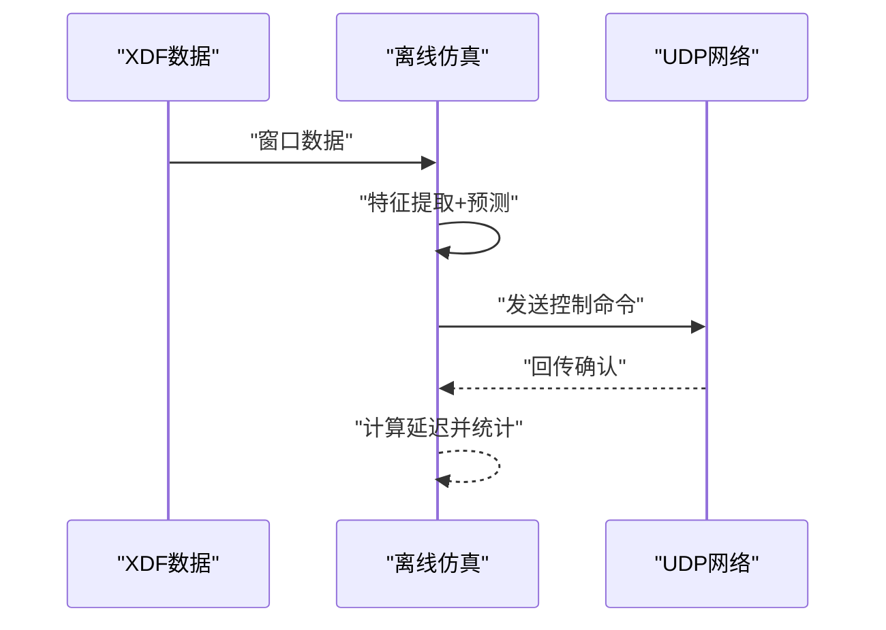
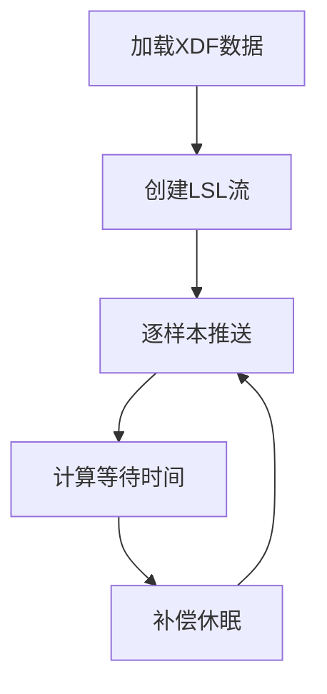
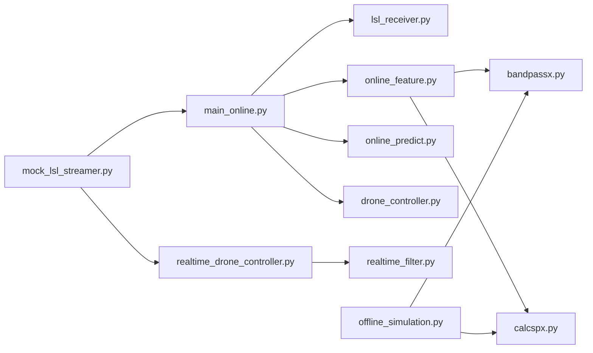

# 实时性约束与性能

<cite>
**本文引用的文件**
- [main_online.py](file://paradigm/main_online.py)
- [lsl_receiver.py](file://paradigm/online/lsl_receiver.py)
- [online_feature.py](file://paradigm/online/online_feature.py)
- [online_predict.py](file://paradigm/online/online_predict.py)
- [realtime_filter.py](file://paradigm/realtime_filter.py)
- [bandpassx.py](file://paradigm/bandpassx.py)
- [calcspx.py](file://paradigm/calcspx.py)
- [drone_controller.py](file://paradigm/online/drone_controller.py)
- [realtime_drone_controller.py](file://paradigm/realtime_drone_controller.py)
- [mock_lsl_streamer.py](file://paradigm/mock_lsl_streamer.py)
- [offline_simulation.py](file://paradigm/offline_simulation.py)
</cite>

## 目录
1. [引言](#引言)
2. [项目结构](#项目结构)
3. [核心组件](#核心组件)
4. [架构总览](#架构总览)
5. [详细组件分析](#详细组件分析)
6. [依赖关系分析](#依赖关系分析)
7. [性能考量](#性能考量)
8. [故障排查指南](#故障排查指南)
9. [结论](#结论)
10. [附录](#附录)

## 引言
本文件聚焦于BCI系统在实时性方面的约束与性能优化，围绕采样频率、处理延迟、预测间隔与控制响应时间等关键指标展开，结合缓冲区设计与滑动窗口机制，解释如何在有限资源下保证数据连续性与处理效率。同时给出性能瓶颈识别与优化策略、监控指标与测量方法、稳定性判断机制（置信度阈值、连续性检测、防抖动）、以及系统负载与压力测试方法论，帮助读者在真实部署中获得稳定可靠的脑控体验。

## 项目结构
本项目采用功能分层组织：
- 在线推理主循环与控制逻辑位于在线脚本中，负责从LSL流读取数据、特征提取、模型预测与控制输出。
- 实时滤波器与带通滤波器封装在独立模块中，便于在不同场景复用。
- 离线仿真与模拟流用于离线验证与延迟测量。
- 无人机控制器接口提供抽象的上层控制行为。

图表来源
- [main_online.py:1-97](file://paradigm/main_online.py#L1-L97)
- [lsl_receiver.py:1-32](file://paradigm/online/lsl_receiver.py#L1-L32)
- [online_feature.py:1-52](file://paradigm/online/online_feature.py#L1-L52)
- [online_predict.py:1-17](file://paradigm/online/online_predict.py#L1-L17)
- [realtime_filter.py:1-32](file://paradigm/realtime_filter.py#L1-L32)
- [bandpassx.py:1-79](file://paradigm/bandpassx.py#L1-L79)
- [calcspx.py:1-87](file://paradigm/calcspx.py#L1-L87)
- [drone_controller.py:1-13](file://paradigm/online/drone_controller.py#L1-L13)
- [realtime_drone_controller.py:1-121](file://paradigm/realtime_drone_controller.py#L1-L121)
- [mock_lsl_streamer.py:1-71](file://paradigm/mock_lsl_streamer.py#L1-L71)
- [offline_simulation.py:1-195](file://paradigm/offline_simulation.py#L1-L195)

章节来源
- [main_online.py:1-97](file://paradigm/main_online.py#L1-L97)
- [realtime_drone_controller.py:1-121](file://paradigm/realtime_drone_controller.py#L1-L121)

## 核心组件
- 在线数据接收器：负责从LSL流拉取样本，维护环形缓冲区，保证窗口内数据连续性。
- 在线特征提取器：对多频带信号进行带通滤波、CSP投影、方差对数变换与特征选择/标准化。
- 在线预测器：基于训练好的分类器进行预测与置信度评估。
- 稳定性判断与防抖动：通过置信度滑动窗口与连续性检测，结合多数投票实现平滑输出。
- 控制器：根据稳定预测结果执行上/下动作。
- 实时滤波器：为实时场景提供因果滤波与状态保持。
- 离线仿真与模拟流：用于离线验证、延迟测量与系统压力测试。

章节来源
- [main_online.py:1-97](file://paradigm/main_online.py#L1-L97)
- [lsl_receiver.py:1-32](file://paradigm/online/lsl_receiver.py#L1-L32)
- [online_feature.py:1-52](file://paradigm/online/online_feature.py#L1-L52)
- [online_predict.py:1-17](file://paradigm/online/online_predict.py#L1-L17)
- [realtime_filter.py:1-32](file://paradigm/realtime_filter.py#L1-L32)
- [bandpassx.py:1-79](file://paradigm/bandpassx.py#L1-L79)
- [calcspx.py:1-87](file://paradigm/calcspx.py#L1-L87)
- [drone_controller.py:1-13](file://paradigm/online/drone_controller.py#L1-L13)
- [offline_simulation.py:1-195](file://paradigm/offline_simulation.py#L1-L195)
- [mock_lsl_streamer.py:1-71](file://paradigm/mock_lsl_streamer.py#L1-L71)

## 架构总览
系统采用“数据采集—特征提取—模型预测—稳定性判断—控制输出”的流水线式实时架构。数据以固定采样率从LSL流持续到达，通过环形缓冲区维持固定长度的窗口；特征提取器按频带进行滤波与CSP投影；分类器输出类别与置信度；通过置信度滑动窗口与连续性检测形成稳定决策；最终由控制器执行动作。

图表来源
- [main_online.py:54-97](file://paradigm/main_online.py#L54-L97)
- [lsl_receiver.py:23-32](file://paradigm/online/lsl_receiver.py#L23-L32)
- [online_feature.py:20-52](file://paradigm/online/online_feature.py#L20-L52)
- [online_predict.py:9-17](file://paradigm/online/online_predict.py#L9-L17)
- [drone_controller.py:3-13](file://paradigm/online/drone_controller.py#L3-L13)

## 详细组件分析

### 在线数据接收器（LSLReceiver）
- 功能：解析LSL流，拉取样本，维护环形缓冲区，保证窗口内数据连续。
- 关键点：
  - 缓冲区大小由模型中的信号窗口长度决定，确保每次特征提取使用固定长度窗口。
  - 每次更新将新样本左移一位并写入末尾，实现滑动窗口效果。
  - 在主循环中检查窗口是否填满，未填满则跳过处理，避免零填充影响特征质量。

图表来源
- [lsl_receiver.py:23-32](file://paradigm/online/lsl_receiver.py#L23-L32)
- [main_online.py:56-60](file://paradigm/main_online.py#L56-L60)

章节来源
- [lsl_receiver.py:1-32](file://paradigm/online/lsl_receiver.py#L1-L32)
- [main_online.py:54-60](file://paradigm/main_online.py#L54-L60)

### 在线特征提取器（OnlineFeature）
- 功能：对输入窗口进行多频带带通滤波、CSP投影、对数方差计算、特征选择与标准化。
- 关键点：
  - 按模型定义的频带循环处理，每个频带独立滤波与CSP投影。
  - 使用方差对数作为特征，随后进行特征选择与标准化，适配分类器输入。
  - 与离线仿真一致的特征提取流程，保证一致性。

图表来源
- [online_feature.py:20-52](file://paradigm/online/online_feature.py#L20-L52)
- [bandpassx.py:39-73](file://paradigm/bandpassx.py#L39-L73)
- [calcspx.py:21-84](file://paradigm/calcspx.py#L21-L84)

章节来源
- [online_feature.py:1-52](file://paradigm/online/online_feature.py#L1-L52)
- [bandpassx.py:1-79](file://paradigm/bandpassx.py#L1-L79)
- [calcspx.py:1-87](file://paradigm/calcspx.py#L1-L87)

### 在线预测器（OnlinePredict）
- 功能：对特征向量进行预测，输出类别与置信度。
- 关键点：
  - 使用训练好的分类器进行概率预测与类别预测。
  - 置信度取概率最大值，用于后续稳定性判断。

图表来源
- [online_predict.py:1-17](file://paradigm/online/online_predict.py#L1-L17)

章节来源
- [online_predict.py:1-17](file://paradigm/online/online_predict.py#L1-L17)

### 稳定性判断与防抖动（主循环）
- 功能：通过置信度滑动窗口与连续性检测，结合多数投票实现稳定输出。
- 关键点：
  - 置信度滑动窗口：使用固定长度队列记录最近若干次置信度，计算均值作为平滑置信度。
  - 连续性检测：当连续多次预测一致且非空时，认为稳定，触发控制动作。
  - 防抖动：清空队列避免重复执行，减少抖动。

图表来源
- [main_online.py:70-96](file://paradigm/main_online.py#L70-L96)

章节来源
- [main_online.py:44-96](file://paradigm/main_online.py#L44-L96)

### 控制器（DroneController）
- 功能：根据稳定预测结果执行上/下动作。
- 关键点：
  - 作为抽象接口，便于替换为真实无人机或模拟器控制逻辑。

图表来源
- [drone_controller.py:1-13](file://paradigm/online/drone_controller.py#L1-L13)

章节来源
- [drone_controller.py:1-13](file://paradigm/online/drone_controller.py#L1-L13)

### 实时滤波器（RealTimeBandpass）
- 功能：为实时场景提供因果滤波，保留状态以避免相位偏移。
- 关键点：
  - 为每个通道维护状态向量，逐通道滤波并更新状态。
  - 适用于在线处理中对因果性有要求的场景。

图表来源
- [realtime_filter.py:1-32](file://paradigm/realtime_filter.py#L1-L32)

章节来源
- [realtime_filter.py:1-32](file://paradigm/realtime_filter.py#L1-L32)

### 离线仿真与延迟测量（offline_simulation.py）
- 功能：离线重放XDF数据，模拟实时处理与控制，测量端到端延迟。
- 关键点：
  - 使用概率平滑窗口与置信度阈值，统计有效决策数量与准确率。
  - 通过UDP发送消息并接收回传，测量往返延迟。

图表来源
- [offline_simulation.py:153-178](file://paradigm/offline_simulation.py#L153-L178)

章节来源
- [offline_simulation.py:1-195](file://paradigm/offline_simulation.py#L1-L195)

### 模拟LSL流（mock_lsl_streamer.py）
- 功能：将离线XDF数据以固定采样率实时推送到LSL流，供在线脚本消费。
- 关键点：
  - 计算每个样本间的等待时间，补偿代码执行耗时，保证稳定的采样节奏。

图表来源
- [mock_lsl_streamer.py:46-61](file://paradigm/mock_lsl_streamer.py#L46-L61)

章节来源
- [mock_lsl_streamer.py:1-71](file://paradigm/mock_lsl_streamer.py#L1-L71)

## 依赖关系分析
- 在线主循环依赖接收器、特征提取器、预测器与控制器。
- 特征提取器内部依赖带通滤波器与CSP工具。
- 实时滤波器可独立复用于实时场景。
- 离线仿真与模拟流为系统提供验证与延迟测量能力。

图表来源
- [main_online.py:1-12](file://paradigm/main_online.py#L1-L12)
- [online_feature.py:1-6](file://paradigm/online/online_feature.py#L1-L6)
- [realtime_drone_controller.py:1-11](file://paradigm/realtime_drone_controller.py#L1-L11)
- [offline_simulation.py:1-11](file://paradigm/offline_simulation.py#L1-L11)
- [mock_lsl_streamer.py:1-43](file://paradigm/mock_lsl_streamer.py#L1-L43)

章节来源
- [main_online.py:1-12](file://paradigm/main_online.py#L1-L12)
- [online_feature.py:1-6](file://paradigm/online/online_feature.py#L1-L6)
- [realtime_drone_controller.py:1-11](file://paradigm/realtime_drone_controller.py#L1-L11)
- [offline_simulation.py:1-11](file://paradigm/offline_simulation.py#L1-L11)
- [mock_lsl_streamer.py:1-43](file://paradigm/mock_lsl_streamer.py#L1-L43)

## 性能考量

### 实时性指标与约束
- 采样频率：系统以固定采样率从LSL流获取样本，采样率来源于模型配置。
- 处理延迟：从窗口数据可用到控制输出，需考虑特征提取、预测与稳定性判断的总时延。
- 预测间隔：主循环通过睡眠控制预测频率，决定控制刷新率。
- 控制响应时间：从稳定预测到执行动作的时间，受网络与控制器延迟影响。

章节来源
- [main_online.py:20-24](file://paradigm/main_online.py#L20-L24)
- [main_online.py:45-46](file://paradigm/main_online.py#L45-L46)
- [realtime_drone_controller.py:17-18](file://paradigm/realtime_drone_controller.py#L17-L18)

### 缓冲区设计与滑动窗口
- 环形缓冲区：接收器维护固定长度的环形缓冲区，保证每次特征提取使用连续窗口。
- 置信度滑动窗口：记录最近若干次置信度，计算均值以降低瞬时噪声影响。
- 连续性检测：连续多次预测一致且非空时才触发稳定输出，避免误触发。
- 多数投票：对最近若干次有效预测进行多数投票，进一步平滑输出。

章节来源
- [lsl_receiver.py:21-32](file://paradigm/online/lsl_receiver.py#L21-L32)
- [main_online.py:46-49](file://paradigm/main_online.py#L46-L49)
- [main_online.py:76-96](file://paradigm/main_online.py#L76-L96)
- [realtime_drone_controller.py:17-19](file://paradigm/realtime_drone_controller.py#L17-L19)
- [realtime_drone_controller.py:115-116](file://paradigm/realtime_drone_controller.py#L115-L116)

### 性能瓶颈识别与优化策略
- CPU密集型操作
  - 特征提取：多频带滤波与CSP投影为主要开销。可考虑：
    - 向量化与并行化：利用NumPy与SciPy的高效实现，避免显式循环。
    - 预分配数组：减少动态内存分配带来的开销。
    - 频带级并行：在支持的硬件上对不同频带进行并行处理。
  - 分类器预测：概率预测与类别选择为轻量操作，通常不是瓶颈。
- 内存使用优化
  - 固定尺寸缓冲区：环形缓冲区与固定长度特征向量避免频繁扩容。
  - 队列长度控制：滑动窗口与连续性队列使用固定maxlen，限制峰值内存。
- I/O性能提升
  - LSL流：尽量使用pull_sample而非pull_chunk以简化逻辑；若需要批量，应评估批大小对实时性的影响。
  - UDP通信：在离线仿真中测量往返延迟，优化网络栈与超时设置。

章节来源
- [online_feature.py:20-52](file://paradigm/online/online_feature.py#L20-L52)
- [main_online.py:46-49](file://paradigm/main_online.py#L46-L49)
- [offline_simulation.py:153-178](file://paradigm/offline_simulation.py#L153-L178)

### 性能监控指标与测量方法
- 端到端延迟：离线仿真通过UDP发送与回传测量往返延迟，可用于评估整体性能。
- 处理时延：在特征提取与预测之间插入时间戳，计算单帧处理耗时。
- 置信度与准确率：统计平滑后有效决策数量与准确率，评估稳定性判断效果。
- 丢包与抖动：通过连续性队列与多数投票观察输出抖动情况。

章节来源
- [offline_simulation.py:153-178](file://paradigm/offline_simulation.py#L153-L178)
- [main_online.py:70-74](file://paradigm/main_online.py#L70-L74)

### 稳定性判断机制
- 置信度阈值：仅当置信度达到阈值时才进入后续稳定判断。
- 置信度滑动窗口：对最近若干次置信度求均值，降低瞬时噪声影响。
- 连续性检测：连续多次预测一致且非空，触发稳定输出。
- 防抖动处理：清空队列避免重复执行，多数投票进一步平滑输出。

章节来源
- [main_online.py:44-49](file://paradigm/main_online.py#L44-L49)
- [main_online.py:76-96](file://paradigm/main_online.py#L76-L96)
- [realtime_drone_controller.py:17-19](file://paradigm/realtime_drone_controller.py#L17-L19)
- [realtime_drone_controller.py:115-116](file://paradigm/realtime_drone_controller.py#L115-L116)

### 系统负载测试与压力测试方法论
- 离线负载测试
  - 使用离线仿真重放长时间XDF数据，统计有效决策数量、准确率与平均处理时延。
  - 改变置信度阈值与滑动窗口长度，评估稳定性与吞吐量权衡。
- 在线压力测试
  - 使用模拟LSL流以固定采样率推送数据，观察在线脚本在高负载下的表现。
  - 逐步提高采样率或增加频带数量，评估系统上限。
- 网络压力测试
  - 在离线仿真中调整UDP超时与发送频率，评估网络抖动对稳定性的影响。

章节来源
- [offline_simulation.py:1-195](file://paradigm/offline_simulation.py#L1-L195)
- [mock_lsl_streamer.py:1-71](file://paradigm/mock_lsl_streamer.py#L1-L71)

## 故障排查指南
- 数据缺失或缓冲区未填满
  - 现象：主循环跳过处理。
  - 排查：检查LSL流连接状态与采样率，确认模型窗口长度与采样率匹配。
- 置信度始终过低
  - 现象：连续压入None，无法触发稳定输出。
  - 排查：降低置信度阈值或增大滑动窗口长度，检查特征提取与标准化是否正常。
- 输出抖动或误触发
  - 现象：输出不稳定，频繁切换。
  - 排查：增大连续性检测窗口与多数投票窗口，检查网络延迟与超时设置。
- 处理时延过大
  - 现象：控制响应滞后明显。
  - 排查：优化特征提取与预测路径，减少不必要的计算；检查I/O与网络栈。

章节来源
- [main_online.py:56-60](file://paradigm/main_online.py#L56-L60)
- [main_online.py:76-96](file://paradigm/main_online.py#L76-L96)
- [offline_simulation.py:153-178](file://paradigm/offline_simulation.py#L153-L178)

## 结论
本系统通过环形缓冲区与滑动窗口机制，在有限资源下实现了稳定的实时脑控。通过对置信度与连续性的综合判断，结合多数投票平滑输出，有效降低了误触发与抖动风险。离线仿真与模拟流为性能评估与压力测试提供了可靠手段。在实际部署中，建议根据硬件能力与任务需求，合理设置采样率、预测间隔与稳定性参数，持续监控端到端延迟与准确率，以获得最佳的实时性与鲁棒性。

## 附录
- 参数建议
  - 采样率：依据模型配置与设备能力设定。
  - 预测间隔：根据控制响应需求与系统处理能力折中。
  - 置信度阈值：建议从较高值开始，逐步下调以平衡稳定性与灵敏度。
  - 窗口长度：置信度滑动窗口与连续性检测窗口应与预测间隔协调。