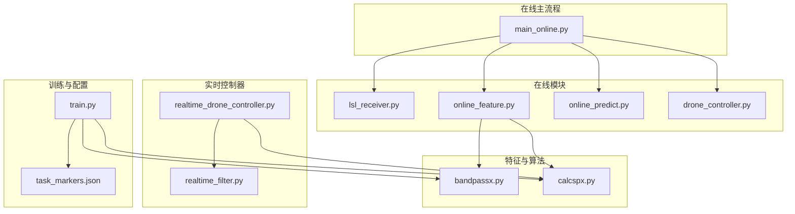
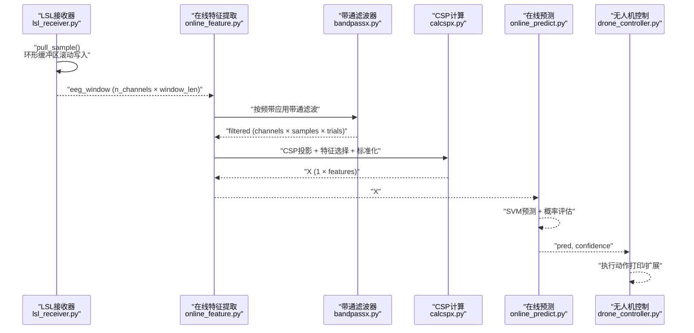
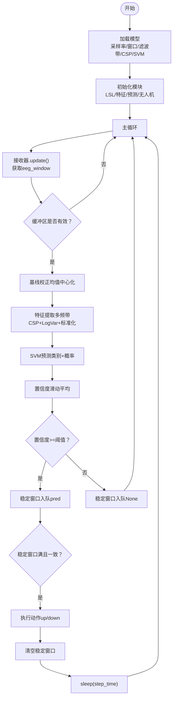
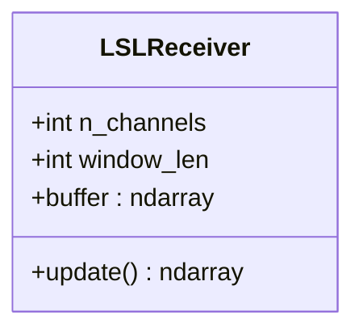
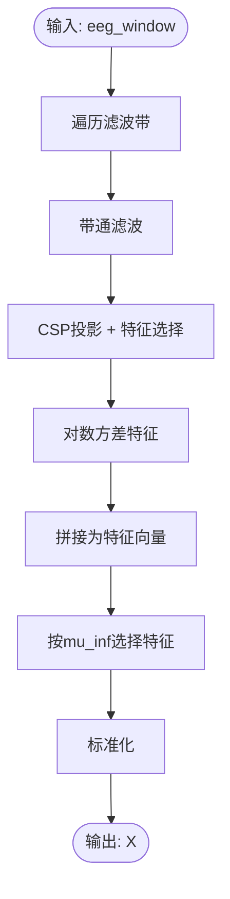
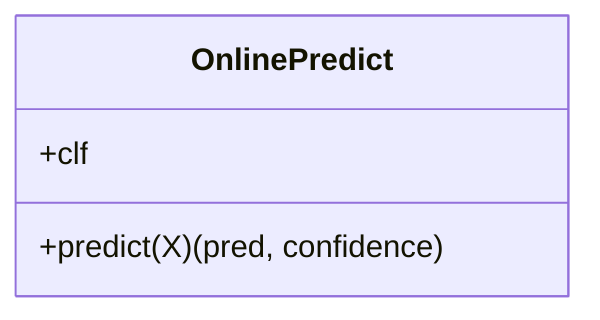
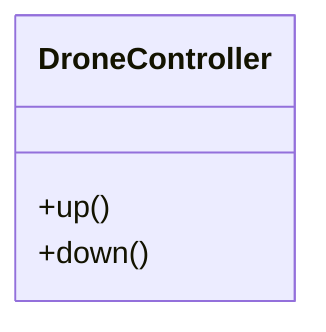
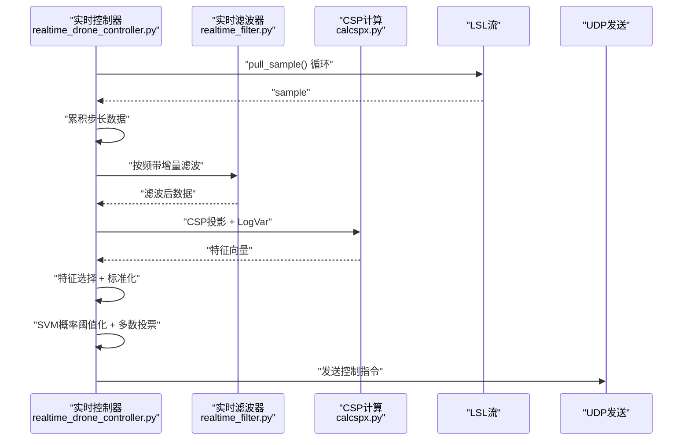
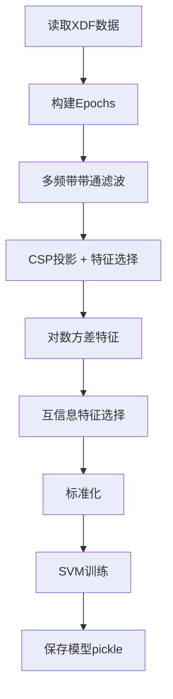
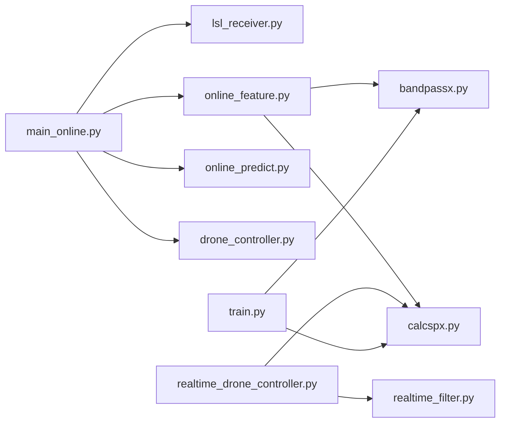

# 数据流架构

<cite>
**本文引用的文件**
- [paradigm/main_online.py](file://paradigm/main_online.py)
- [paradigm/online/lsl_receiver.py](file://paradigm/online/lsl_receiver.py)
- [paradigm/online/online_feature.py](file://paradigm/online/online_feature.py)
- [paradigm/online/online_predict.py](file://paradigm/online/online_predict.py)
- [paradigm/online/drone_controller.py](file://paradigm/online/drone_controller.py)
- [paradigm/bandpassx.py](file://paradigm/bandpassx.py)
- [paradigm/calcspx.py](file://paradigm/calcspx.py)
- [paradigm/realtime_drone_controller.py](file://paradigm/realtime_drone_controller.py)
- [paradigm/realtime_filter.py](file://paradigm/realtime_filter.py)
- [paradigm/train.py](file://paradigm/train.py)
- [paradigm/task_markers.json](file://paradigm/task_markers.json)
</cite>

## 目录
1. [引言](#引言)
2. [项目结构](#项目结构)
3. [核心组件](#核心组件)
4. [架构总览](#架构总览)
5. [详细组件分析](#详细组件分析)
6. [依赖分析](#依赖分析)
7. [性能考虑](#性能考虑)
8. [故障排查指南](#故障排查指南)
9. [结论](#结论)
10. [附录](#附录)

## 引言
本文件面向BCI系统从EEG信号采集到无人机控制执行的完整数据流，系统性梳理实时数据处理链路中的缓冲区管理、信号预处理、特征提取（含CSP）、模型预测（SVM）与控制决策执行等环节。文档重点说明各阶段数据格式变化、传递机制、同步与一致性保障、缓存与队列策略、数据完整性校验、异常数据处理与错误恢复。

## 项目结构
本仓库围绕在线BCI控制展开，主要由以下模块构成：
- 在线主流程：负责模型加载、模块初始化、主循环与控制参数设置
- 在线数据采集：基于LSL的接收器，维护环形缓冲区
- 在线特征提取：多频带带通滤波 + CSP + 方差对数特征 + 标准化
- 在线预测：SVM分类器概率与类别预测
- 无人机控制：打印动作或扩展为实际控制接口
- 实时控制器：另一套实现，包含因果滤波与UDP控制指令发送
- 训练脚本：离线训练CSP+SVM模型，产出pickle模型文件
- 其他工具：带通滤波器、CSP计算工具、任务标记映射

图表来源
- [paradigm/main_online.py:1-97](file://paradigm/main_online.py#L1-L97)
- [paradigm/online/lsl_receiver.py:1-32](file://paradigm/online/lsl_receiver.py#L1-L32)
- [paradigm/online/online_feature.py:1-52](file://paradigm/online/online_feature.py#L1-L52)
- [paradigm/online/online_predict.py:1-17](file://paradigm/online/online_predict.py#L1-L17)
- [paradigm/online/drone_controller.py:1-13](file://paradigm/online/drone_controller.py#L1-L13)
- [paradigm/bandpassx.py:1-79](file://paradigm/bandpassx.py#L1-L79)
- [paradigm/calcspx.py:1-87](file://paradigm/calcspx.py#L1-L87)
- [paradigm/realtime_drone_controller.py:1-121](file://paradigm/realtime_drone_controller.py#L1-L121)
- [paradigm/realtime_filter.py:1-32](file://paradigm/realtime_filter.py#L1-L32)
- [paradigm/train.py:1-201](file://paradigm/train.py#L1-L201)
- [paradigm/task_markers.json:1-23](file://paradigm/task_markers.json#L1-L23)

章节来源
- [paradigm/main_online.py:1-97](file://paradigm/main_online.py#L1-L97)
- [paradigm/online/lsl_receiver.py:1-32](file://paradigm/online/lsl_receiver.py#L1-L32)
- [paradigm/online/online_feature.py:1-52](file://paradigm/online/online_feature.py#L1-L52)
- [paradigm/online/online_predict.py:1-17](file://paradigm/online/online_predict.py#L1-L17)
- [paradigm/online/drone_controller.py:1-13](file://paradigm/online/drone_controller.py#L1-L13)
- [paradigm/bandpassx.py:1-79](file://paradigm/bandpassx.py#L1-L79)
- [paradigm/calcspx.py:1-87](file://paradigm/calcspx.py#L1-L87)
- [paradigm/realtime_drone_controller.py:1-121](file://paradigm/realtime_drone_controller.py#L1-L121)
- [paradigm/realtime_filter.py:1-32](file://paradigm/realtime_filter.py#L1-L32)
- [paradigm/train.py:1-201](file://paradigm/train.py#L1-L201)
- [paradigm/task_markers.json:1-23](file://paradigm/task_markers.json#L1-L23)

## 核心组件
- 在线主流程（main_online.py）
  - 加载离线训练得到的模型（包含CSP混合矩阵、特征索引、滤波带、标准化器、SVM分类器等）
  - 初始化LSL接收器、在线特征提取器、在线预测器、无人机控制器
  - 维护置信度滑动平均队列与稳定判定队列，实现阈值与稳定性过滤后执行控制命令
- 在线数据采集（lsl_receiver.py）
  - 通过LSL解析并连接EEG流，维护n通道×窗口长度的环形缓冲区，逐样本滚动写入
- 在线特征提取（online_feature.py）
  - 遍历滤波带，对窗口内EEG进行带通滤波
  - 应用CSP投影，取特征通道子集，计算方差对数作为特征
  - 按模型特征索引选择并标准化
- 在线预测（online_predict.py）
  - 使用SVM分类器进行类别预测与概率评估
- 无人机控制（drone_controller.py）
  - 提供向上/向下动作接口（可扩展为实际控制）
- 实时控制器（realtime_drone_controller.py）
  - 另一套在线实现，包含因果滤波器状态保持、UDP发送控制指令、概率阈值与多数投票平滑
- 实时滤波器（realtime_filter.py）
  - 为每个频带维护因果滤波器状态，支持增量滤波
- 训练脚本（train.py）
  - 离线训练CSP+SVM，保存模型元数据（采样率、信号窗、滤波带、CSP矩阵、特征索引、标准化器、SVM）
- 任务标记（task_markers.json）
  - 定义实验任务标记映射，用于离线数据标注与事件对齐

章节来源
- [paradigm/main_online.py:14-97](file://paradigm/main_online.py#L14-L97)
- [paradigm/online/lsl_receiver.py:6-32](file://paradigm/online/lsl_receiver.py#L6-L32)
- [paradigm/online/online_feature.py:7-52](file://paradigm/online/online_feature.py#L7-L52)
- [paradigm/online/online_predict.py:3-17](file://paradigm/online/online_predict.py#L3-L17)
- [paradigm/online/drone_controller.py:3-13](file://paradigm/online/drone_controller.py#L3-L13)
- [paradigm/realtime_drone_controller.py:1-121](file://paradigm/realtime_drone_controller.py#L1-L121)
- [paradigm/realtime_filter.py:6-32](file://paradigm/realtime_filter.py#L6-L32)
- [paradigm/train.py:184-201](file://paradigm/train.py#L184-L201)
- [paradigm/task_markers.json:1-23](file://paradigm/task_markers.json#L1-L23)

## 架构总览
下图展示了从EEG采集到控制执行的端到端数据流，强调数据格式变化与模块间调用关系。

图表来源
- [paradigm/online/lsl_receiver.py:23-32](file://paradigm/online/lsl_receiver.py#L23-L32)
- [paradigm/online/online_feature.py:20-52](file://paradigm/online/online_feature.py#L20-L52)
- [paradigm/bandpassx.py:54-73](file://paradigm/bandpassx.py#L54-L73)
- [paradigm/calcspx.py:69-84](file://paradigm/calcspx.py#L69-L84)
- [paradigm/online/online_predict.py:9-17](file://paradigm/online/online_predict.py#L9-L17)
- [paradigm/online/drone_controller.py:5-13](file://paradigm/online/drone_controller.py#L5-L13)

## 详细组件分析

### 在线主流程（main_online.py）
- 模型加载：读取pickle模型，提取采样率、信号窗、滤波带、CSP矩阵、特征索引、标准化器、SVM分类器
- 模块初始化：创建LSL接收器、在线特征提取器、在线预测器、无人机控制器
- 控制参数：置信度阈值、预测步时长、稳定窗口、置信度滑动窗口
- 主循环：
  - 从LSL接收器获取窗口数据
  - 缓冲区完整性检查（零值检测）
  - 基线校正（逐通道均值中心化）
  - 特征提取
  - 预测与置信度评估
  - 置信度滑动平均
  - 阈值与稳定窗口判定
  - 执行动作并清空队列避免重复触发

图表来源
- [paradigm/main_online.py:18-97](file://paradigm/main_online.py#L18-L97)

章节来源
- [paradigm/main_online.py:14-97](file://paradigm/main_online.py#L14-L97)

### 在线数据采集（lsl_receiver.py）
- 功能：解析并连接EEG LSL流，维护n通道×窗口长度的环形缓冲区
- 数据格式：每步pull_sample返回一帧样本，维度为n_channels；内部以二维数组滚动写入
- 同步性：逐样本推送，保证与后续处理步长一致

图表来源
- [paradigm/online/lsl_receiver.py:6-32](file://paradigm/online/lsl_receiver.py#L6-L32)

章节来源
- [paradigm/online/lsl_receiver.py:6-32](file://paradigm/online/lsl_receiver.py#L6-L32)

### 在线特征提取（online_feature.py）
- 输入：eeg_window（n_channels × window_len）
- 处理流程：
  - 遍历滤波带（如theta、alpha、beta等），对窗口进行带通滤波
  - 应用CSP混合矩阵进行投影，取特征通道子集
  - 计算对数方差作为特征向量
  - 按模型提供的特征索引选择并标准化
- 输出：X（1 × features）

图表来源
- [paradigm/online/online_feature.py:20-52](file://paradigm/online/online_feature.py#L20-L52)
- [paradigm/bandpassx.py:54-73](file://paradigm/bandpassx.py#L54-L73)
- [paradigm/calcspx.py:69-84](file://paradigm/calcspx.py#L69-L84)

章节来源
- [paradigm/online/online_feature.py:7-52](file://paradigm/online/online_feature.py#L7-L52)
- [paradigm/bandpassx.py:7-79](file://paradigm/bandpassx.py#L7-L79)
- [paradigm/calcspx.py:7-87](file://paradigm/calcspx.py#L7-L87)

### 在线预测（online_predict.py）
- 输入：X（1 × features）
- 处理：SVM分类器预测类别与概率
- 输出：pred（类别）、confidence（最大概率）

图表来源
- [paradigm/online/online_predict.py:3-17](file://paradigm/online/online_predict.py#L3-L17)

章节来源
- [paradigm/online/online_predict.py:3-17](file://paradigm/online/online_predict.py#L3-L17)

### 无人机控制（drone_controller.py）
- 提供动作接口：up、down
- 可扩展为实际控制（如UDP发送、ROS话题发布等）

图表来源
- [paradigm/online/drone_controller.py:3-13](file://paradigm/online/drone_controller.py#L3-L13)

章节来源
- [paradigm/online/drone_controller.py:3-13](file://paradigm/online/drone_controller.py#L3-L13)

### 实时控制器（realtime_drone_controller.py）
- 模型加载与参数：从pickle加载CSP、滤波带、特征索引、标准化器、SVM
- 缓冲区与步长：维护2秒长环形缓冲区，按UPDATE_INTERVAL采样步长累积数据
- 因果滤波：为每个频带维护RealTimeBandpass，保持滤波状态
- 特征提取：对缓冲区进行CSP投影、对数方差、特征选择与标准化
- 预测与控制：SVM概率阈值化，多数投票平滑，通过UDP发送控制指令

图表来源
- [paradigm/realtime_drone_controller.py:59-121](file://paradigm/realtime_drone_controller.py#L59-L121)
- [paradigm/realtime_filter.py:22-32](file://paradigm/realtime_filter.py#L22-L32)
- [paradigm/calcspx.py:62-78](file://paradigm/calcspx.py#L62-L78)

章节来源
- [paradigm/realtime_drone_controller.py:1-121](file://paradigm/realtime_drone_controller.py#L1-L121)
- [paradigm/realtime_filter.py:6-32](file://paradigm/realtime_filter.py#L6-L32)
- [paradigm/calcspx.py:7-87](file://paradigm/calcspx.py#L7-L87)

### 训练脚本（train.py）
- 离线训练流程：读取XDF数据，构建MNE Epochs，带通滤波，CSP+LogVar，特征选择，标准化，SVM训练
- 模型保存：包含SVM分类器、CSP矩阵、特征索引、滤波带、采样率、信号窗、标准化器

图表来源
- [paradigm/train.py:107-201](file://paradigm/train.py#L107-L201)

章节来源
- [paradigm/train.py:1-201](file://paradigm/train.py#L1-L201)

## 依赖分析
- 模块耦合
  - main_online.py直接依赖在线模块（lsl_receiver、online_feature、online_predict、drone_controller）
  - online_feature.py依赖bandpassx与calcspx
  - realtime_drone_controller.py依赖realtime_filter与calcspx
  - train.py依赖bandpassx与calcspx，输出pickle模型供在线使用
- 数据依赖
  - 在线特征提取依赖模型中的滤波带、CSP矩阵、特征索引、标准化器
  - 在线预测依赖模型中的SVM分类器
- 外部依赖
  - LSL用于实时数据流接入
  - NumPy/SciPy用于数值与信号处理
  - Pickle用于模型序列化存储

图表来源
- [paradigm/main_online.py:8-11](file://paradigm/main_online.py#L8-L11)
- [paradigm/online/online_feature.py:4-5](file://paradigm/online/online_feature.py#L4-L5)
- [paradigm/realtime_drone_controller.py:9-10](file://paradigm/realtime_drone_controller.py#L9-L10)
- [paradigm/train.py:108-119](file://paradigm/train.py#L108-L119)

章节来源
- [paradigm/main_online.py:8-11](file://paradigm/main_online.py#L8-L11)
- [paradigm/online/online_feature.py:4-5](file://paradigm/online/online_feature.py#L4-L5)
- [paradigm/realtime_drone_controller.py:9-10](file://paradigm/realtime_drone_controller.py#L9-L10)
- [paradigm/train.py:108-119](file://paradigm/train.py#L108-L119)

## 性能考虑
- 缓冲区管理
  - 环形缓冲区滚动写入，避免频繁内存分配
  - 在线主流程与实时控制器均采用固定窗口长度，便于批处理与实时性控制
- 特征计算
  - 多频带并行处理，减少重复计算
  - CSP投影与对数方差在numpy上向量化实现，提升吞吐
- 预测与控制
  - 滑动平均与稳定窗口降低误判率，提高鲁棒性
  - 实时控制器采用UDP短消息发送，延迟低
- 数值稳定性
  - CSP协方差正则化，避免病态矩阵
  - 标准化与小常数避免除零

## 故障排查指南
- 缓冲区为空或无效
  - 现象：eeg_window首列全零
  - 处理：主循环中跳过该步，等待有效数据
- 信号丢失
  - 现象：pull_sample返回空
  - 处理：实时控制器发送悬停指令，避免失控
- 概率过低
  - 现象：置信度低于阈值
  - 处理：稳定窗口入队None，不执行动作
- 模型不匹配
  - 现象：特征维度不一致
  - 处理：确保训练与在线使用的滤波带、特征索引一致

章节来源
- [paradigm/main_online.py:58-61](file://paradigm/main_online.py#L58-L61)
- [paradigm/realtime_drone_controller.py:63-66](file://paradigm/realtime_drone_controller.py#L63-L66)
- [paradigm/online/online_feature.py:46-51](file://paradigm/online/online_feature.py#L46-L51)

## 结论
本BCI系统通过清晰的模块划分与稳健的数据流设计，实现了从EEG采集到无人机控制的闭环。在线主流程与实时控制器提供了两种实现路径，均可在保证实时性的同时通过阈值与稳定窗口提升控制可靠性。训练脚本确保离线与在线的一致性，模型文件承载关键参数与算法结果。未来可在异常恢复、因果滤波与UDP通信等方面进一步增强鲁棒性与可扩展性。

## 附录
- 关键数据结构与复杂度
  - 缓冲区：滚动O(n)写入，空间O(n_channels × window_len)
  - 带通滤波：对每个频带O(T×C)，T为样本数，C为通道数
  - CSP：协方差与特征值分解O(C^3)，投影O(C^2×T)
  - SVM：预测O(features)，概率评估O(1)
- 最佳实践
  - 严格对齐采样率与信号窗
  - 保持滤波带与特征索引一致
  - 使用稳定窗口与阈值抑制误触发
  - 在生产环境增加超时与重连机制