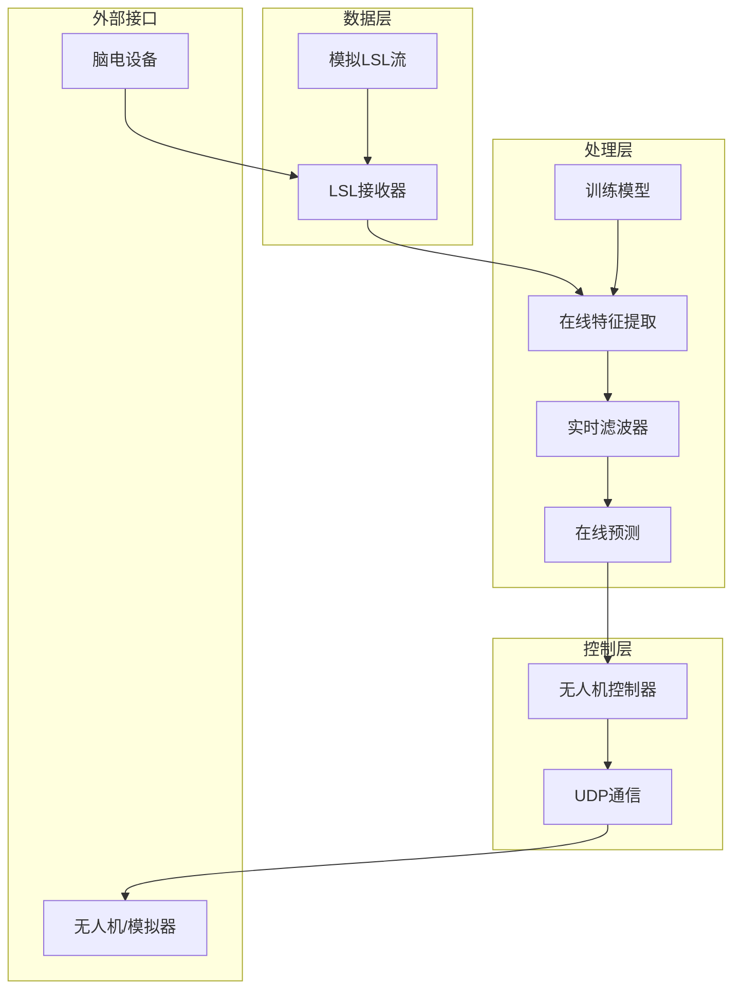
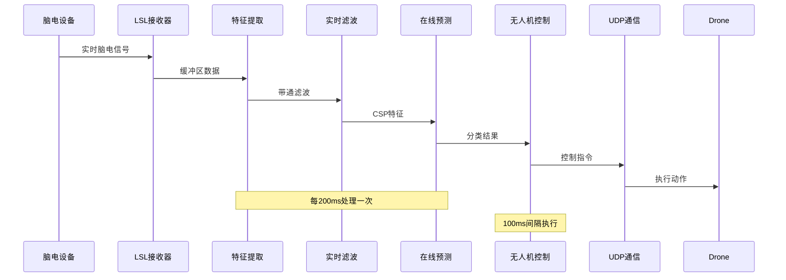
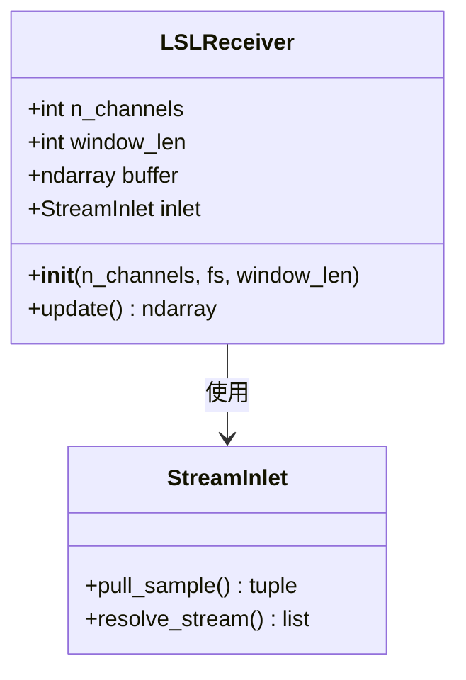
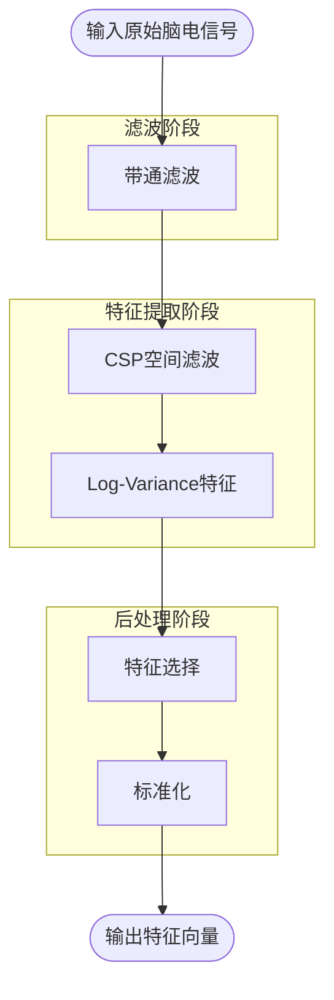
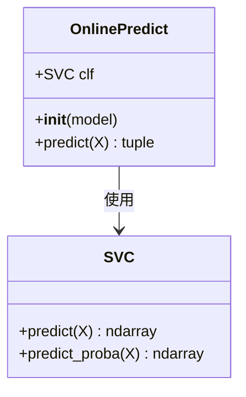
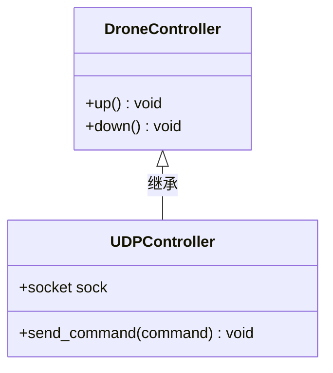
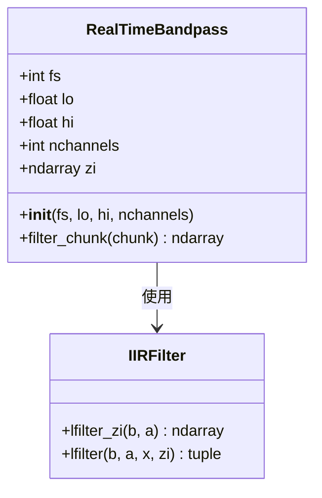
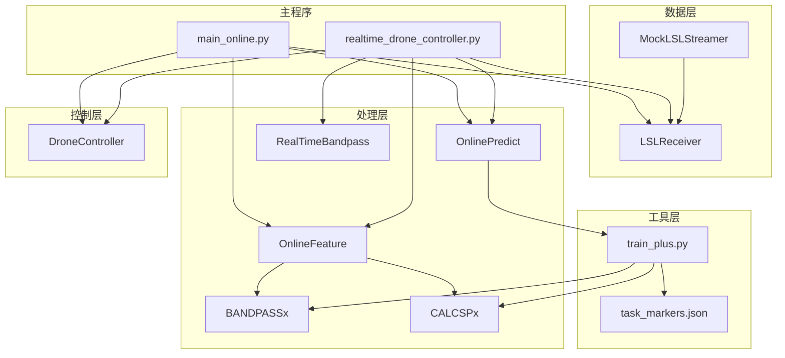

# 整体架构设计

<cite>
**本文档引用的文件**
- [main_online.py](file://paradigm/main_online.py)
- [realtime_drone_controller.py](file://paradigm/realtime_drone_controller.py)
- [drone_controller.py](file://paradigm/online/drone_controller.py)
- [lsl_receiver.py](file://paradigm/online/lsl_receiver.py)
- [online_feature.py](file://paradigm/online/online_feature.py)
- [online_predict.py](file://paradigm/online/online_predict.py)
- [bandpassx.py](file://paradigm/bandpassx.py)
- [calcspx.py](file://paradigm/calcspx.py)
- [realtime_filter.py](file://paradigm/realtime_filter.py)
- [train_plus.py](file://paradigm/train_plus.py)
- [mock_lsl_streamer.py](file://paradigm/mock_lsl_streamer.py)
- [task_markers.json](file://paradigm/task_markers.json)
</cite>

## 目录
1. [引言](#引言)
2. [项目结构](#项目结构)
3. [核心组件](#核心组件)
4. [架构概览](#架构概览)
5. [详细组件分析](#详细组件分析)
6. [依赖关系分析](#依赖关系分析)
7. [性能考虑](#性能考虑)
8. [故障排除指南](#故障排除指南)
9. [结论](#结论)

## 引言

BCI无人机控制系统是一个基于脑机接口技术的实时控制系统，通过分析用户的脑电波信号来控制无人机的飞行高度。该系统采用模块化设计，实现了从脑电信号采集到无人机控制的完整流水线。系统的核心目标是在保证实时性的前提下，实现准确的意图识别和稳定的控制响应。

## 项目结构

系统采用分层架构设计，主要分为三个层次：

**图表来源**
- [main_online.py:1-97](file://paradigm/main_online.py#L1-L97)
- [realtime_drone_controller.py:1-121](file://paradigm/realtime_drone_controller.py#L1-L121)

系统采用模块化设计原则，每个组件都有明确的职责分工：

- **数据层**：负责从LSL流中接收脑电信号，提供实时数据缓冲
- **处理层**：实现特征提取、滤波处理和机器学习预测
- **控制层**：将预测结果转换为具体的无人机控制指令

**章节来源**
- [main_online.py:1-97](file://paradigm/main_online.py#L1-L97)
- [realtime_drone_controller.py:1-121](file://paradigm/realtime_drone_controller.py#L1-L121)

## 核心组件

### 数据采集组件

系统提供了两种数据采集方式：

1. **实时LSL采集**：通过LSL接收器直接从脑电设备获取实时数据
2. **离线模拟采集**：通过模拟LSL流器播放预录制的脑电数据

### 特征提取组件

系统实现了基于CSP（Common Spatial Pattern）和Log-Variance的特征提取算法，能够有效提取运动想象任务中的脑电特征。

### 预测组件

基于训练好的SVM模型，对提取的特征进行分类预测，输出用户意图的概率和置信度。

### 控制组件

将预测结果转换为具体的无人机控制指令，通过UDP协议发送给无人机或模拟器。

**章节来源**
- [lsl_receiver.py:1-32](file://paradigm/online/lsl_receiver.py#L1-L32)
- [online_feature.py:1-52](file://paradigm/online/online_feature.py#L1-L52)
- [online_predict.py:1-17](file://paradigm/online/online_predict.py#L1-L17)
- [drone_controller.py:1-13](file://paradigm/online/drone_controller.py#L1-L13)

## 架构概览

系统采用流水线式架构，实现了完整的实时控制流程：

**图表来源**
- [main_online.py:54-97](file://paradigm/main_online.py#L54-L97)
- [realtime_drone_controller.py:59-121](file://paradigm/realtime_drone_controller.py#L59-L121)

系统架构具有以下特点：

1. **实时性**：采用固定时间间隔的数据处理和控制执行
2. **稳定性**：通过滑动窗口和多数投票机制减少误判
3. **可扩展性**：模块化设计便于功能扩展和算法替换
4. **容错性**：具备信号丢失检测和安全控制机制

## 详细组件分析

### LSL接收器组件

LSL接收器负责从LSL流中获取实时脑电信号，实现数据缓冲和轮转管理：

**图表来源**
- [lsl_receiver.py:6-32](file://paradigm/online/lsl_receiver.py#L6-L32)

LSL接收器的工作流程：
1. 解析LSL流信息，建立数据连接
2. 维护固定长度的环形缓冲区
3. 实现数据轮转，确保最新数据在缓冲区末尾
4. 提供统一的数据访问接口

**章节来源**
- [lsl_receiver.py:1-32](file://paradigm/online/lsl_receiver.py#L1-L32)

### 在线特征提取组件

特征提取组件实现了完整的特征工程流程：

**图表来源**
- [online_feature.py:20-52](file://paradigm/online/online_feature.py#L20-L52)
- [bandpassx.py:7-79](file://paradigm/bandpassx.py#L7-L79)
- [calcspx.py:7-87](file://paradigm/calcspx.py#L7-L87)

特征提取的具体步骤：
1. **带通滤波**：对不同频段进行独立滤波处理
2. **CSP变换**：计算空间滤波器，提取最具判别性的特征
3. **Log-Variance**：计算特征通道的方差对数作为最终特征
4. **特征选择**：基于互信息选择最重要的特征子集
5. **标准化**：对特征进行标准化处理

**章节来源**
- [online_feature.py:1-52](file://paradigm/online/online_feature.py#L1-L52)
- [bandpassx.py:1-79](file://paradigm/bandpassx.py#L1-L79)
- [calcspx.py:1-87](file://paradigm/calcspx.py#L1-L87)

### 在线预测组件

预测组件基于训练好的SVM模型进行实时分类：

**图表来源**
- [online_predict.py:3-17](file://paradigm/online/online_predict.py#L3-L17)

预测组件的功能：
1. **概率预测**：输出各类别的概率分布
2. **置信度计算**：取最大概率值作为置信度
3. **分类决策**：基于阈值判断用户意图

**章节来源**
- [online_predict.py:1-17](file://paradigm/online/online_predict.py#L1-L17)

### 无人机控制器组件

无人机控制器负责将数字指令转换为具体的飞行操作：

**图表来源**
- [drone_controller.py:3-13](file://paradigm/online/drone_controller.py#L3-L13)

控制器的设计考虑：
1. **抽象接口**：定义统一的控制接口
2. **可扩展性**：支持不同的控制实现方式
3. **安全性**：提供安全的默认状态

**章节来源**
- [drone_controller.py:1-13](file://paradigm/online/drone_controller.py#L1-L13)

### 实时滤波器组件

实时滤波器组件实现了因果滤波，确保实时处理的可行性：

**图表来源**
- [realtime_filter.py:6-32](file://paradigm/realtime_filter.py#L6-L32)

实时滤波的特点：
1. **因果性**：滤波器响应仅依赖于当前和过去的输入
2. **状态保持**：维护滤波器状态，确保连续性
3. **通道独立**：每个通道独立处理，提高效率

**章节来源**
- [realtime_filter.py:1-32](file://paradigm/realtime_filter.py#L1-L32)

## 依赖关系分析

系统各组件之间的依赖关系如下：

**图表来源**
- [main_online.py:8-11](file://paradigm/main_online.py#L8-L11)
- [realtime_drone_controller.py:9-11](file://paradigm/realtime_drone_controller.py#L9-L11)
- [train_plus.py:110-123](file://paradigm/train_plus.py#L110-L123)

**章节来源**
- [main_online.py:1-97](file://paradigm/main_online.py#L1-L97)
- [realtime_drone_controller.py:1-121](file://paradigm/realtime_drone_controller.py#L1-L121)

## 性能考虑

### 实时性要求

系统设计满足以下实时性要求：

1. **数据采集频率**：125Hz采样率，确保足够的频域分辨率
2. **处理周期**：每200ms处理一次新的数据块
3. **控制执行间隔**：100ms执行一次控制命令
4. **延迟控制**：整体延迟控制在200-300ms以内

### 性能优化策略

1. **内存管理**：使用环形缓冲区避免频繁内存分配
2. **算法优化**：采用高效的CSP计算和特征选择算法
3. **并行处理**：多通道独立处理，充分利用CPU资源
4. **状态缓存**：缓存滤波器状态，减少重复计算

### 系统边界定义

系统边界包括：

**内部边界**：
- 数据层：LSL接收器和数据缓冲
- 处理层：特征提取和预测模块
- 控制层：无人机控制逻辑

**外部边界**：
- LSL数据流接口：标准的LSL协议
- UDP控制协议：简单的文本命令协议
- 文件接口：模型文件和配置文件

### 外部接口规范

#### LSL数据流接口

| 参数 | 值 | 描述 |
|------|-----|------|
| 流名称 | OpenBCI_Mock | 流标识符 |
| 类型 | EEG | 数据类型 |
| 通道数 | 16 | 脑电通道数量 |
| 采样率 | 125Hz | 数据采样频率 |
| 格式 | float32 | 数据格式 |

#### UDP控制协议

| 命令 | 功能 | 说明 |
|------|------|------|
| up | 上升 | 控制无人机上升 |
| down | 下降 | 控制无人机下降 |
| hover | 悬停 | 保持当前位置 |

**章节来源**
- [mock_lsl_streamer.py:32-42](file://paradigm/mock_lsl_streamer.py#L32-L42)
- [realtime_drone_controller.py:14-15](file://paradigm/realtime_drone_controller.py#L14-L15)

## 故障排除指南

### 常见问题及解决方案

1. **LSL连接失败**
   - 检查脑电设备是否正确连接
   - 确认LSL服务器正在运行
   - 验证网络连接和防火墙设置

2. **信号质量差**
   - 检查电极接触情况
   - 确认滤波器参数设置
   - 验证采样率配置

3. **控制响应延迟**
   - 检查系统负载情况
   - 优化处理算法性能
   - 调整处理周期参数

4. **预测准确性低**
   - 重新校准模型参数
   - 收集更多训练数据
   - 调整特征选择参数

### 调试工具

系统提供了多种调试和监控工具：

- **实时数据显示**：显示当前预测结果和置信度
- **性能监控**：监控处理时间和内存使用
- **日志记录**：记录系统运行状态和错误信息

**章节来源**
- [main_online.py:74-75](file://paradigm/main_online.py#L74-L75)
- [realtime_drone_controller.py:118-119](file://paradigm/realtime_drone_controller.py#L118-L119)

## 结论

BCI无人机控制系统采用模块化设计，实现了从脑电信号到无人机控制的完整流水线。系统具有以下优势：

1. **架构清晰**：分层设计便于理解和维护
2. **实时性强**：优化的算法和数据结构满足实时性要求
3. **扩展性好**：模块化设计支持功能扩展和算法替换
4. **可靠性高**：完善的错误处理和安全机制

通过合理的性能优化和严格的实时性控制，系统能够在保证稳定性的前提下，实现准确的意图识别和流畅的控制体验。未来可以在算法精度、系统响应速度和用户体验方面进一步优化。