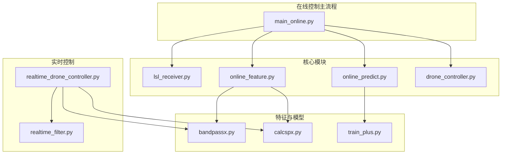
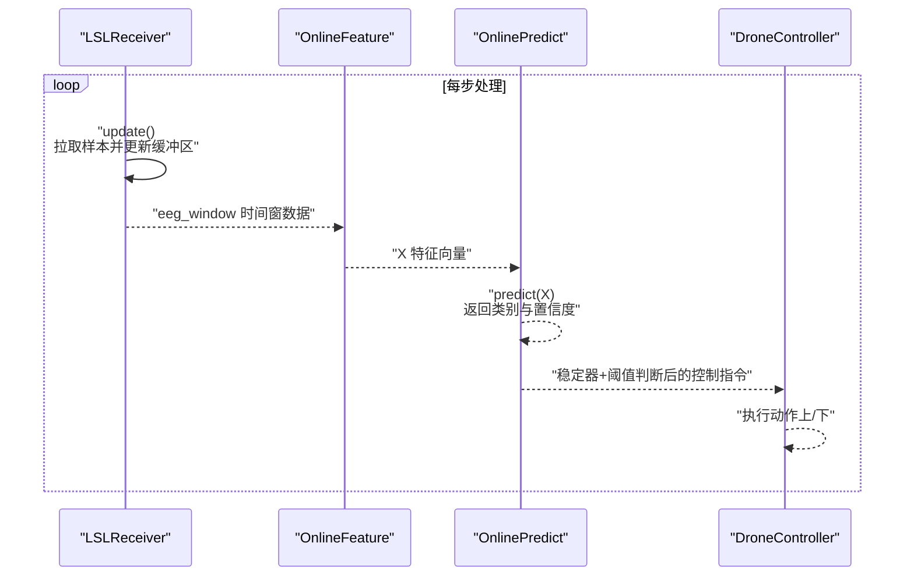
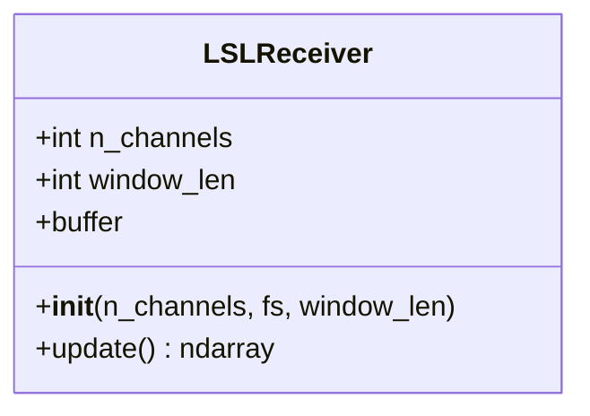
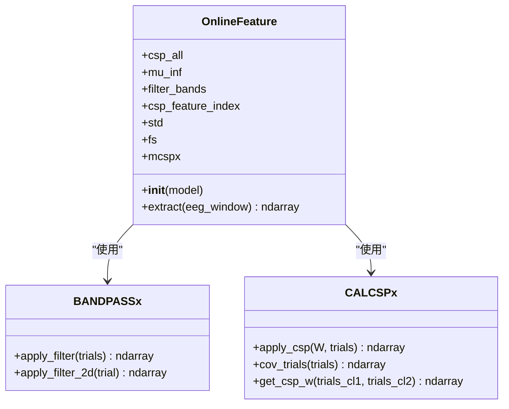
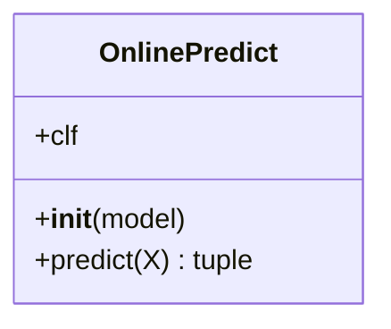
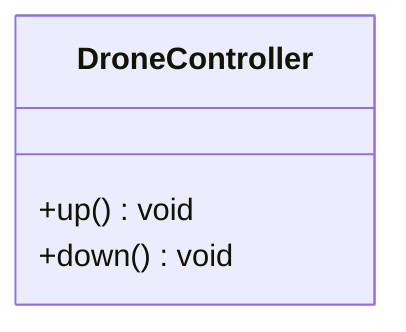
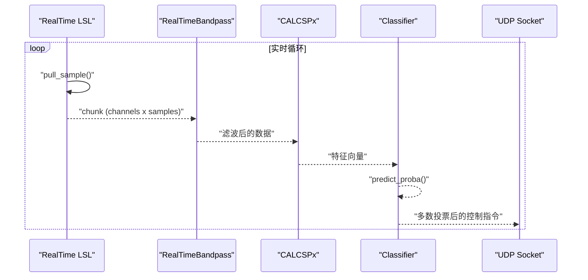
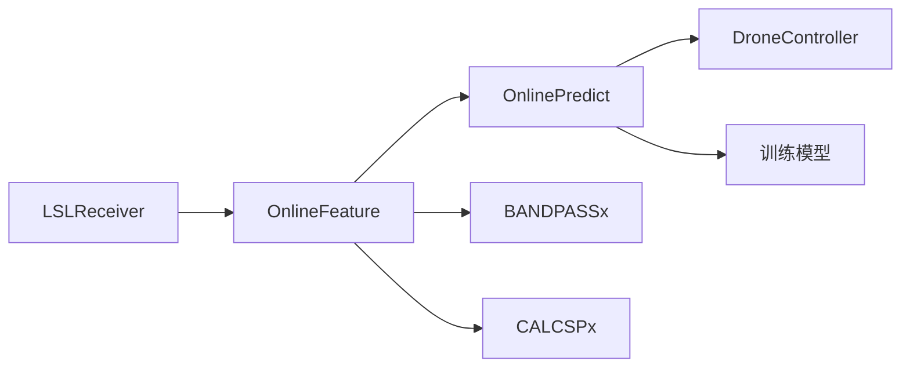

# 模块交互关系

<cite>
**本文引用的文件**
- [paradigm/online/lsl_receiver.py](file://paradigm/online/lsl_receiver.py)
- [paradigm/online/online_feature.py](file://paradigm/online/online_feature.py)
- [paradigm/online/online_predict.py](file://paradigm/online/online_predict.py)
- [paradigm/online/drone_controller.py](file://paradigm/online/drone_controller.py)
- [paradigm/main_online.py](file://paradigm/main_online.py)
- [paradigm/realtime_drone_controller.py](file://paradigm/realtime_drone_controller.py)
- [paradigm/realtime_filter.py](file://paradigm/realtime_filter.py)
- [paradigm/bandpassx.py](file://paradigm/bandpassx.py)
- [paradigm/calcspx.py](file://paradigm/calcspx.py)
- [paradigm/train_plus.py](file://paradigm/train_plus.py)
</cite>

## 目录
1. [简介](#简介)
2. [项目结构](#项目结构)
3. [核心组件](#核心组件)
4. [架构总览](#架构总览)
5. [详细组件分析](#详细组件分析)
6. [依赖关系分析](#依赖关系分析)
7. [性能考量](#性能考量)
8. [故障排查指南](#故障排查指南)
9. [结论](#结论)
10. [附录](#附录)

## 简介
本文件聚焦于BCI系统在线闭环控制链路中的四个核心模块：LSLReceiver（数据接收）、OnlineFeature（特征提取）、OnlinePredict（在线预测）与DroneController（无人机控制）。文档从接口定义、参数传递、返回值处理、状态同步、初始化顺序与生命周期、时序图与接口规范、解耦与依赖注入、模块替换与扩展性、以及错误传播与异常处理等方面，系统梳理模块间的交互关系与实现要点。

## 项目结构
围绕在线闭环控制，相关文件主要分布在paradigm/online目录及若干辅助模块：
- 在线数据接收与控制主流程：main_online.py
- 实时控制与UDP通信：realtime_drone_controller.py
- 实时滤波器：realtime_filter.py
- 特征与模型：bandpassx.py、calcspx.py、train_plus.py
- 四大核心模块：lsl_receiver.py、online_feature.py、online_predict.py、drone_controller.py

图表来源
- [paradigm/main_online.py:1-97](file://paradigm/main_online.py#L1-L97)
- [paradigm/realtime_drone_controller.py:1-121](file://paradigm/realtime_drone_controller.py#L1-L121)
- [paradigm/realtime_filter.py:1-32](file://paradigm/realtime_filter.py#L1-L32)
- [paradigm/online/lsl_receiver.py:1-32](file://paradigm/online/lsl_receiver.py#L1-L32)
- [paradigm/online/online_feature.py:1-52](file://paradigm/online/online_feature.py#L1-L52)
- [paradigm/online/online_predict.py:1-17](file://paradigm/online/online_predict.py#L1-L17)
- [paradigm/online/drone_controller.py:1-13](file://paradigm/online/drone_controller.py#L1-L13)
- [paradigm/bandpassx.py:1-79](file://paradigm/bandpassx.py#L1-L79)
- [paradigm/calcspx.py:1-87](file://paradigm/calcspx.py#L1-L87)
- [paradigm/train_plus.py:1-213](file://paradigm/train_plus.py#L1-L213)

章节来源
- [paradigm/main_online.py:1-97](file://paradigm/main_online.py#L1-L97)
- [paradigm/realtime_drone_controller.py:1-121](file://paradigm/realtime_drone_controller.py#L1-L121)

## 核心组件
- LSLReceiver：负责从LSL流中拉取样本，维护环形缓冲区，提供固定长度的时间窗数据。
- OnlineFeature：基于预训练模型，对时间窗数据进行多频带滤波、CSP投影、方差对数特征提取与标准化。
- OnlinePredict：使用训练好的分类器进行在线预测，返回类别与置信度。
- DroneController：接收控制命令，执行上/下动作（当前为打印模拟）。

章节来源
- [paradigm/online/lsl_receiver.py:1-32](file://paradigm/online/lsl_receiver.py#L1-L32)
- [paradigm/online/online_feature.py:1-52](file://paradigm/online/online_feature.py#L1-L52)
- [paradigm/online/online_predict.py:1-17](file://paradigm/online/online_predict.py#L1-L17)
- [paradigm/online/drone_controller.py:1-13](file://paradigm/online/drone_controller.py#L1-L13)

## 架构总览
在线闭环控制采用“数据采集—特征提取—预测—决策—执行”的流水线式结构。主循环按固定步长从LSL流中读取样本，填充缓冲区后进行特征提取与预测，再通过稳定器与阈值判断，最终驱动无人机控制器执行动作。

图表来源
- [paradigm/main_online.py:54-97](file://paradigm/main_online.py#L54-L97)
- [paradigm/online/lsl_receiver.py:23-32](file://paradigm/online/lsl_receiver.py#L23-L32)
- [paradigm/online/online_feature.py:20-52](file://paradigm/online/online_feature.py#L20-L52)
- [paradigm/online/online_predict.py:9-17](file://paradigm/online/online_predict.py#L9-L17)
- [paradigm/online/drone_controller.py:5-13](file://paradigm/online/drone_controller.py#L5-L13)

## 详细组件分析

### LSLReceiver 组件分析
- 职责：解析LSL流，拉取样本，维护环形缓冲区，提供固定长度的时间窗。
- 关键接口：
  - 初始化：接收通道数、采样率、窗口长度等参数。
  - update：从流中拉取样本，滚动缓冲区，返回当前窗口。
- 参数与返回：
  - 输入：无（内部持有流入口）
  - 返回：(n_channels, window_len) 的numpy数组
- 状态同步：缓冲区状态在update中更新，供后续特征提取模块使用。
- 错误处理：未见显式异常捕获；在主循环中通过检查缓冲区首列是否全零进行早期跳过。

图表来源
- [paradigm/online/lsl_receiver.py:6-32](file://paradigm/online/lsl_receiver.py#L6-L32)

章节来源
- [paradigm/online/lsl_receiver.py:1-32](file://paradigm/online/lsl_receiver.py#L1-L32)
- [paradigm/main_online.py:54-61](file://paradigm/main_online.py#L54-L61)

### OnlineFeature 组件分析
- 职责：基于模型参数，对时间窗数据进行多频带滤波、CSP投影、方差对数特征提取与标准化。
- 关键接口：
  - 初始化：接收模型字典，保存CSP混合矩阵、均值索引、滤波带、标准器等。
  - extract：输入eeg_window，输出特征向量X。
- 参数与返回：
  - 输入：eeg_window (channels x samples)
  - 输出：X (1 x features)
- 处理流程：
  - 遍历滤波带，对每个带应用带通滤波。
  - 对每个带进行CSP投影与特征选择，计算log-variance。
  - 按模型提供的索引选择特征并标准化。
- 依赖：bandpassx.BANDPASSx、calcspx.CALCSPx。

图表来源
- [paradigm/online/online_feature.py:7-52](file://paradigm/online/online_feature.py#L7-L52)
- [paradigm/bandpassx.py:7-79](file://paradigm/bandpassx.py#L7-L79)
- [paradigm/calcspx.py:7-87](file://paradigm/calcspx.py#L7-L87)

章节来源
- [paradigm/online/online_feature.py:1-52](file://paradigm/online/online_feature.py#L1-L52)
- [paradigm/bandpassx.py:1-79](file://paradigm/bandpassx.py#L1-L79)
- [paradigm/calcspx.py:1-87](file://paradigm/calcspx.py#L1-L87)

### OnlinePredict 组件分析
- 职责：对特征向量进行在线预测，返回类别与置信度。
- 关键接口：
  - 初始化：接收模型字典，保存分类器。
  - predict：输入特征向量X，输出类别与置信度。
- 参数与返回：
  - 输入：X (1 x features)
  - 输出：pred, confidence
- 依赖：训练阶段保存的分类器（由train_plus.py生成）。

图表来源
- [paradigm/online/online_predict.py:3-17](file://paradigm/online/online_predict.py#L3-L17)

章节来源
- [paradigm/online/online_predict.py:1-17](file://paradigm/online/online_predict.py#L1-L17)
- [paradigm/train_plus.py:194-213](file://paradigm/train_plus.py#L194-L213)

### DroneController 组件分析
- 职责：接收控制指令，执行上/下动作（当前为打印模拟）。
- 关键接口：
  - up：执行上升动作
  - down：执行下降动作
- 参数与返回：无参数，无返回值（当前实现为打印日志）。

图表来源
- [paradigm/online/drone_controller.py:3-13](file://paradigm/online/drone_controller.py#L3-L13)

章节来源
- [paradigm/online/drone_controller.py:1-13](file://paradigm/online/drone_controller.py#L1-L13)

### 实时控制与UDP通信（对比参考）
- realtime_drone_controller.py展示了另一种实时控制实现：直接从LSL流中拉取样本，构建环形缓冲区，逐频带滤波与CSP投影，使用模型进行预测并通过UDP发送控制指令。
- 该实现强调实时性与鲁棒性（如信号丢失时发送悬停指令），并引入多数投票平滑输出。

图表来源
- [paradigm/realtime_drone_controller.py:59-121](file://paradigm/realtime_drone_controller.py#L59-L121)
- [paradigm/realtime_filter.py:6-32](file://paradigm/realtime_filter.py#L6-L32)
- [paradigm/calcspx.py:6-87](file://paradigm/calcspx.py#L6-L87)

章节来源
- [paradigm/realtime_drone_controller.py:1-121](file://paradigm/realtime_drone_controller.py#L1-L121)
- [paradigm/realtime_filter.py:1-32](file://paradigm/realtime_filter.py#L1-L32)

## 依赖关系分析
- 模块内依赖：
  - OnlineFeature依赖bandpassx与calcspx进行滤波与CSP处理。
  - OnlinePredict依赖训练阶段保存的模型（SVM分类器等）。
  - 主流程main_online.py依赖上述模块与DroneController。
- 模块间耦合：
  - 主流程通过函数调用串联模块，参数通过函数参数与全局模型字典传递。
  - DroneController与主流程通过简单方法调用耦合，便于替换。
- 可能的循环依赖：未发现直接循环导入；模块职责清晰，耦合度适中。

图表来源
- [paradigm/main_online.py:8-11](file://paradigm/main_online.py#L8-L11)
- [paradigm/online/lsl_receiver.py:1-32](file://paradigm/online/lsl_receiver.py#L1-L32)
- [paradigm/online/online_feature.py:1-52](file://paradigm/online/online_feature.py#L1-L52)
- [paradigm/online/online_predict.py:1-17](file://paradigm/online/online_predict.py#L1-L17)
- [paradigm/online/drone_controller.py:1-13](file://paradigm/online/drone_controller.py#L1-L13)
- [paradigm/bandpassx.py:1-79](file://paradigm/bandpassx.py#L1-L79)
- [paradigm/calcspx.py:1-87](file://paradigm/calcspx.py#L1-L87)
- [paradigm/train_plus.py:194-213](file://paradigm/train_plus.py#L194-L213)

章节来源
- [paradigm/main_online.py:1-97](file://paradigm/main_online.py#L1-L97)

## 性能考量
- 缓冲区与滑动窗口：LSLReceiver与实时实现均采用环形缓冲区，避免频繁内存分配，提高实时性。
- 特征计算：多频带滤波与CSP投影在CPU上进行，建议在高采样率场景下评估批处理与向量化优化。
- 预测与决策：OnlinePredict仅进行一次前向推理，开销较小；稳定器与阈值判断为轻量级逻辑。
- I/O与通信：主流程通过sleep控制循环频率；实时版本通过UDP发送指令，注意网络抖动与丢包处理。

## 故障排查指南
- 数据缺失与缓冲区不完整：
  - 现象：主循环检测到缓冲区首列全零则跳过处理。
  - 排查：确认LSL流是否正常、采样率与窗口长度设置是否匹配。
- 预测不稳定：
  - 现象：置信度波动导致频繁切换动作。
  - 排查：调整阈值、稳定器窗口长度与滑动平均窗口大小。
- 控制器无响应：
  - 现象：预测满足条件但未执行动作。
  - 排查：检查DroneController方法调用路径与队列清空逻辑。
- 实时控制异常：
  - 现象：信号丢失时未发送悬停指令或UDP发送失败。
  - 排查：检查网络配置、目标IP与端口、socket发送逻辑。

章节来源
- [paradigm/main_online.py:58-61](file://paradigm/main_online.py#L58-L61)
- [paradigm/main_online.py:76-96](file://paradigm/main_online.py#L76-L96)
- [paradigm/realtime_drone_controller.py:63-66](file://paradigm/realtime_drone_controller.py#L63-L66)
- [paradigm/realtime_drone_controller.py:120-121](file://paradigm/realtime_drone_controller.py#L120-L121)

## 结论
本系统通过清晰的模块划分与接口定义，实现了从脑电数据到无人机控制的闭环流程。LSLReceiver提供稳定的输入，OnlineFeature与OnlinePredict完成特征与预测，DroneController承载执行层。主流程与实时实现展示了两种不同的工程化策略：前者强调简洁与可移植，后者强调实时性与鲁棒性。整体架构具备良好的解耦与扩展潜力，便于替换与插件化演进。

## 附录

### 模块初始化顺序与生命周期
- 初始化顺序（主流程）：
  1) 加载模型与参数
  2) 初始化LSLReceiver
  3) 初始化OnlineFeature
  4) 初始化OnlinePredict
  5) 初始化DroneController
- 生命周期：
  - 初始化：一次性完成
  - 运行期：主循环持续运行，每步更新缓冲区、提取特征、预测、决策与执行
  - 结束：程序退出或外部中断

章节来源
- [paradigm/main_online.py:18-39](file://paradigm/main_online.py#L18-L39)

### 接口规范（主流程）
- LSLReceiver.update
  - 输入：无
  - 输出：(n_channels, window_len) numpy数组
- OnlineFeature.extract
  - 输入：eeg_window (channels x samples)
  - 输出：X (1 x features)
- OnlinePredict.predict
  - 输入：X (1 x features)
  - 输出：pred, confidence
- DroneController.up/down
  - 输入：无
  - 输出：无

章节来源
- [paradigm/online/lsl_receiver.py:23-32](file://paradigm/online/lsl_receiver.py#L23-L32)
- [paradigm/online/online_feature.py:20-52](file://paradigm/online/online_feature.py#L20-L52)
- [paradigm/online/online_predict.py:9-17](file://paradigm/online/online_predict.py#L9-L17)
- [paradigm/online/drone_controller.py:5-13](file://paradigm/online/drone_controller.py#L5-L13)

### 解耦设计与依赖注入
- 解耦方式：
  - 模块间通过函数调用与参数传递交互，避免强耦合。
  - OnlineFeature与OnlinePredict依赖模型字典，而非硬编码参数。
- 依赖注入：
  - 主流程通过构造函数注入模型与控制器实例，便于替换不同实现。
  - DroneController可替换为其他执行器（如UDP控制器），不影响上游模块。

章节来源
- [paradigm/main_online.py:32-38](file://paradigm/main_online.py#L32-L38)
- [paradigm/online/online_feature.py:9-16](file://paradigm/online/online_feature.py#L9-L16)
- [paradigm/online/online_predict.py:5-7](file://paradigm/online/online_predict.py#L5-L7)

### 模块替换与扩展性
- 可替换性：
  - LSLReceiver：可替换为其他数据源（如本地文件、模拟流）。
  - OnlineFeature：可更换滤波器或特征提取算法。
  - OnlinePredict：可更换分类器或集成学习方法。
  - DroneController：可替换为UDP控制器或仿真器接口。
- 插件化支持：
  - 建议通过抽象基类或接口约定统一模块契约，便于动态加载与替换。
  - 模型加载与参数配置可抽象为配置文件或工厂模式，提升可扩展性。

章节来源
- [paradigm/realtime_drone_controller.py:1-121](file://paradigm/realtime_drone_controller.py#L1-L121)
- [paradigm/realtime_filter.py:1-32](file://paradigm/realtime_filter.py#L1-L32)

### 错误传播与异常处理
- 现状：
  - LSLReceiver未显式捕获异常；主循环通过缓冲区完整性检查规避早期数据。
  - OnlineFeature与OnlinePredict依赖模型稳定性；预测失败时可通过阈值与稳定器缓解。
  - DroneController当前为打印模拟，无异常处理。
  - 实时版本在信号丢失时发送悬停指令，增强鲁棒性。
- 改进建议：
  - 在数据拉取与特征提取环节增加异常捕获与重试机制。
  - 在预测失败或异常时回退至安全状态（如悬停）。
  - 为DroneController增加状态机与健康检查，确保执行层的可靠性。

章节来源
- [paradigm/main_online.py:58-61](file://paradigm/main_online.py#L58-L61)
- [paradigm/main_online.py:76-96](file://paradigm/main_online.py#L76-L96)
- [paradigm/realtime_drone_controller.py:63-66](file://paradigm/realtime_drone_controller.py#L63-L66)