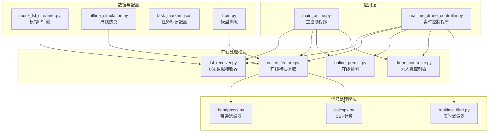
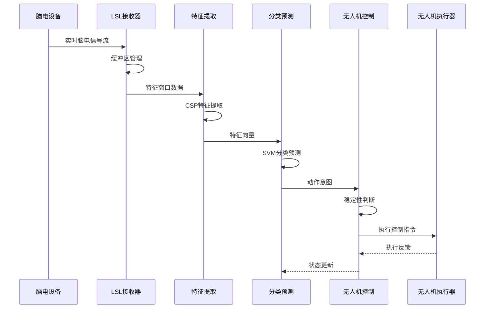
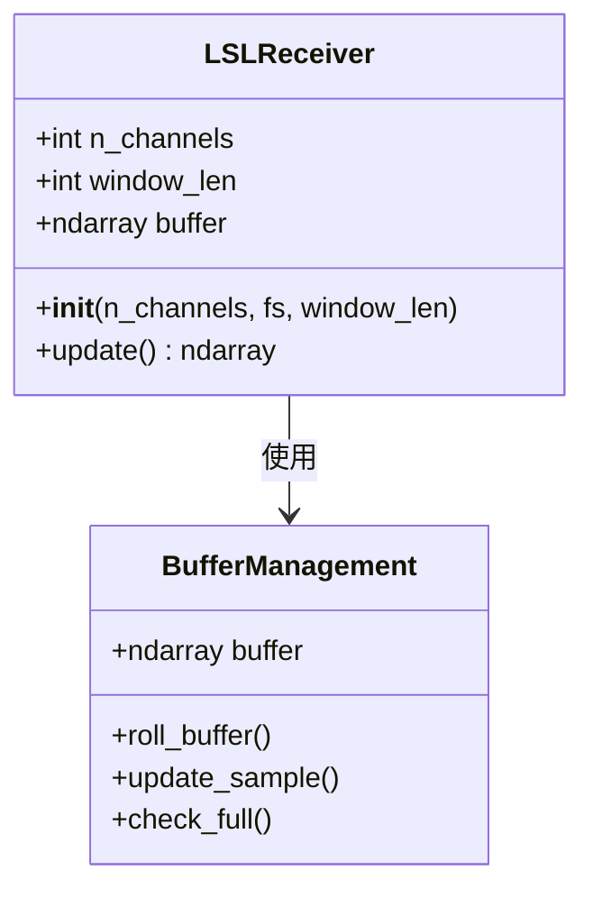
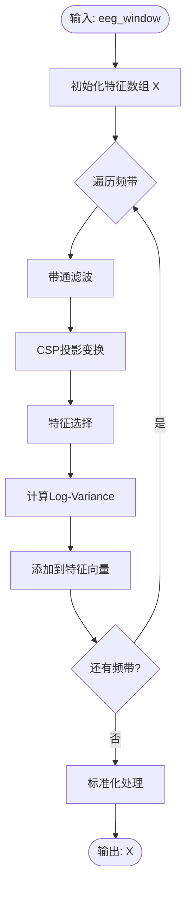
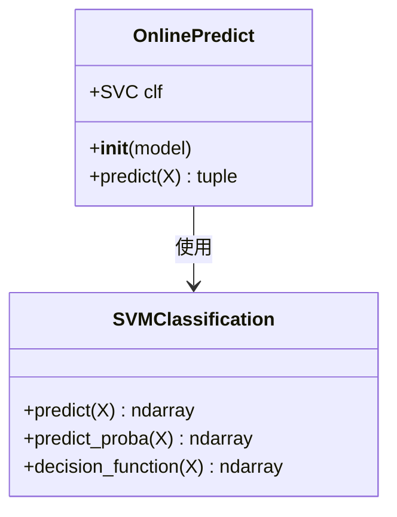
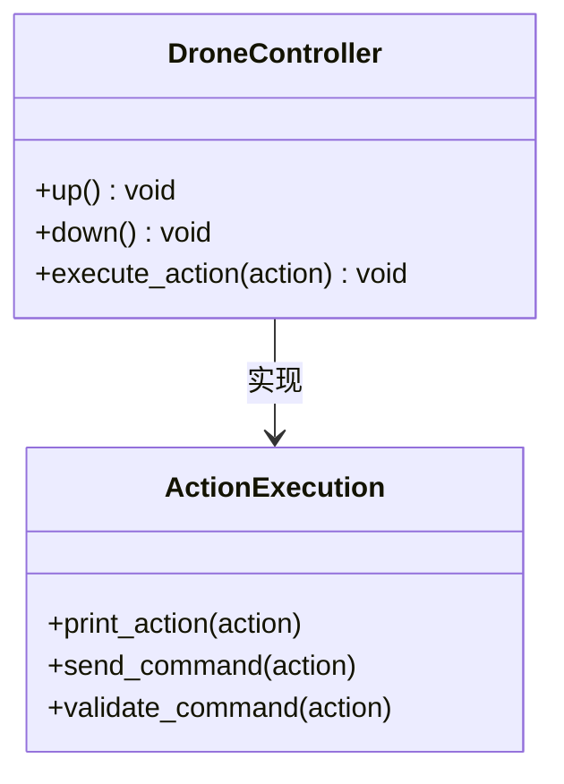
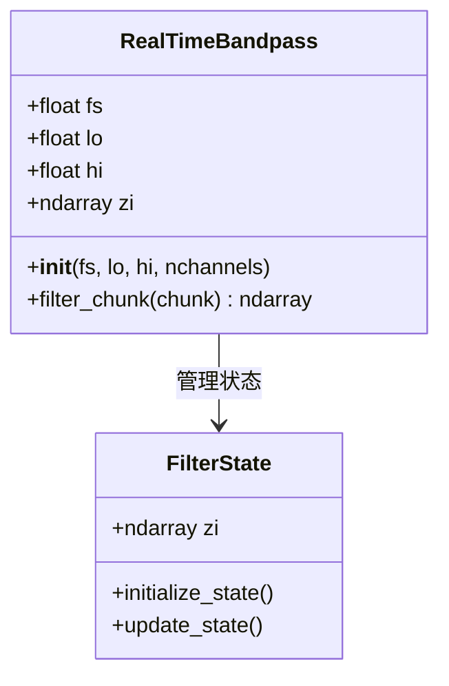
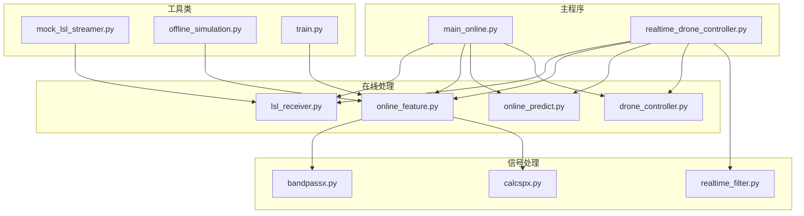
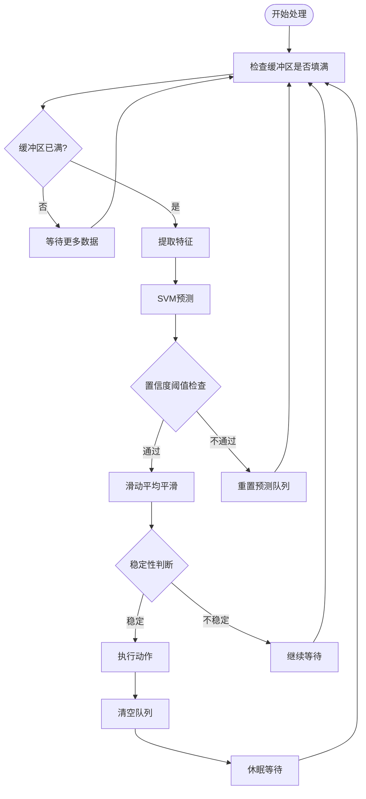

# 系统架构

<cite>
**本文档引用的文件**
- [main_online.py](file://paradigm/main_online.py)
- [realtime_drone_controller.py](file://paradigm/realtime_drone_controller.py)
- [lsl_receiver.py](file://paradigm/online/lsl_receiver.py)
- [online_feature.py](file://paradigm/online/online_feature.py)
- [online_predict.py](file://paradigm/online/online_predict.py)
- [drone_controller.py](file://paradigm/online/drone_controller.py)
- [bandpassx.py](file://paradigm/bandpassx.py)
- [calcspx.py](file://paradigm/calcspx.py)
- [realtime_filter.py](file://paradigm/realtime_filter.py)
- [mock_lsl_streamer.py](file://paradigm/mock_lsl_streamer.py)
- [offline_simulation.py](file://paradigm/offline_simulation.py)
- [task_markers.json](file://paradigm/task_markers.json)
- [train.py](file://paradigm/train.py)
</cite>

## 目录
1. [引言](#引言)
2. [项目结构](#项目结构)
3. [核心组件](#核心组件)
4. [架构总览](#架构总览)
5. [详细组件分析](#详细组件分析)
6. [依赖关系分析](#依赖关系分析)
7. [性能考虑](#性能考虑)
8. [故障排除指南](#故障排除指南)
9. [结论](#结论)

## 引言

BCI无人机控制系统是一个基于脑机接口技术的实时控制系统，旨在通过脑电信号控制无人机的上升和下降动作。该系统采用模块化设计，实现了从脑电信号采集到无人机控制指令执行的完整数据处理流水线。

系统的核心创新在于将传统的离线训练与在线实时处理相结合，通过CSP（Common Spatial Pattern）特征提取和SVM（Support Vector Machine）分类算法，实现了高精度的脑电意图识别。系统支持两种主要的实时控制模式：基于Python的软件控制模式和基于UDP网络的硬件控制模式。

## 项目结构

整个项目采用功能模块化的组织方式，主要分为以下几个层次：

**图表来源**
- [main_online.py:1-97](file://paradigm/main_online.py#L1-L97)
- [realtime_drone_controller.py:1-121](file://paradigm/realtime_drone_controller.py#L1-L121)

**章节来源**
- [main_online.py:1-97](file://paradigm/main_online.py#L1-L97)
- [realtime_drone_controller.py:1-121](file://paradigm/realtime_drone_controller.py#L1-L121)

## 核心组件

系统由五个核心模块组成，每个模块都有明确的职责分工：

### 1. LSL数据接收器 (LSLReceiver)
负责从Lab Streaming Layer (LSL)流中实时接收脑电信号数据，实现数据缓冲和预处理功能。

### 2. 在线特征处理器 (OnlineFeature)
实现CSP特征提取算法，将原始脑电信号转换为机器学习模型可用的特征向量。

### 3. 在线预测器 (OnlinePredict)
基于训练好的SVM模型进行实时分类预测，输出动作意图和置信度。

### 4. 无人机控制器 (DroneController)
管理无人机的控制指令执行，包括上升、下降等基本动作。

### 5. 实时滤波器 (RealTimeBandpass)
提供因果滤波功能，支持实时信号处理需求。

**章节来源**
- [lsl_receiver.py:1-32](file://paradigm/online/lsl_receiver.py#L1-L32)
- [online_feature.py:1-52](file://paradigm/online/online_feature.py#L1-L52)
- [online_predict.py:1-17](file://paradigm/online/online_predict.py#L1-L17)
- [drone_controller.py:1-13](file://paradigm/online/drone_controller.py#L1-L13)
- [realtime_filter.py:1-32](file://paradigm/realtime_filter.py#L1-L32)

## 架构总览

系统采用流水线式的数据处理架构，实现了从信号采集到动作执行的完整闭环：

**图表来源**
- [main_online.py:54-97](file://paradigm/main_online.py#L54-L97)
- [lsl_receiver.py:23-32](file://paradigm/online/lsl_receiver.py#L23-L32)
- [online_feature.py:20-52](file://paradigm/online/online_feature.py#L20-L52)
- [online_predict.py:9-17](file://paradigm/online/online_predict.py#L9-L17)

系统架构的关键特点：
- **模块化设计**：每个组件独立封装，便于维护和扩展
- **实时性保证**：通过缓冲区管理和预测间隔控制确保实时响应
- **稳定性机制**：采用滑动平均和平滑队列防止误触发
- **可扩展性**：支持不同类型的滤波器和分类器替换

## 详细组件分析

### LSL数据接收器分析

LSL接收器实现了高效的环形缓冲区管理，支持实时信号采集：

**图表来源**
- [lsl_receiver.py:6-32](file://paradigm/online/lsl_receiver.py#L6-L32)

核心特性：
- **环形缓冲区**：固定长度的内存缓冲区，支持高效的数据滑动
- **实时更新**：每次接收新样本时自动滚动缓冲区
- **数据预处理**：自动截取指定通道数量的数据

**章节来源**
- [lsl_receiver.py:1-32](file://paradigm/online/lsl_receiver.py#L1-L32)

### 在线特征提取器分析

特征提取器实现了完整的CSP特征提取流程：

**图表来源**
- [online_feature.py:20-52](file://paradigm/online/online_feature.py#L20-L52)
- [bandpassx.py:7-79](file://paradigm/bandpassx.py#L7-L79)
- [calcspx.py:7-87](file://paradigm/calcspx.py#L7-L87)

处理流程：
1. **多频带滤波**：对每个频带应用带通滤波
2. **CSP变换**：使用预训练的CSP混合矩阵进行投影
3. **特征选择**：选择最重要的CSP特征
4. **方差计算**：计算对数方差作为最终特征
5. **标准化**：使用训练时的标准化参数

**章节来源**
- [online_feature.py:1-52](file://paradigm/online/online_feature.py#L1-L52)
- [bandpassx.py:1-79](file://paradigm/bandpassx.py#L1-L79)
- [calcspx.py:1-87](file://paradigm/calcspx.py#L1-L87)

### 在线预测器分析

预测器基于SVM模型进行实时分类：

**图表来源**
- [online_predict.py:3-17](file://paradigm/online/online_predict.py#L3-L17)

工作原理：
- **概率预测**：输出每个类别的概率分布
- **置信度计算**：取最大概率值作为置信度
- **类别决策**：选择概率最高的类别作为预测结果

**章节来源**
- [online_predict.py:1-17](file://paradigm/online/online_predict.py#L1-L17)

### 无人机控制器分析

控制器提供了简单的动作执行接口：

**图表来源**
- [drone_controller.py:3-13](file://paradigm/online/drone_controller.py#L3-L13)

当前实现：
- **模拟控制**：输出动作到控制台
- **扩展接口**：预留了实际硬件控制的接口

**章节来源**
- [drone_controller.py:1-13](file://paradigm/online/drone_controller.py#L1-L13)

### 实时滤波器分析

实时滤波器支持因果滤波，适用于在线处理场景：

**图表来源**
- [realtime_filter.py:6-32](file://paradigm/realtime_filter.py#L6-L32)

特性：
- **因果滤波**：使用lfilter实现因果滤波
- **状态保持**：维护每个通道的滤波器状态
- **实时处理**：支持增量数据处理

**章节来源**
- [realtime_filter.py:1-32](file://paradigm/realtime_filter.py#L1-L32)

## 依赖关系分析

系统各组件之间的依赖关系如下：

**图表来源**
- [main_online.py:8-11](file://paradigm/main_online.py#L8-L11)
- [realtime_drone_controller.py:9-10](file://paradigm/realtime_drone_controller.py#L9-L10)

**章节来源**
- [main_online.py:1-97](file://paradigm/main_online.py#L1-L97)
- [realtime_drone_controller.py:1-121](file://paradigm/realtime_drone_controller.py#L1-L121)

## 性能考虑

### 实时性要求

系统对实时性的要求主要体现在以下几个方面：

1. **采样率匹配**：系统设计支持125Hz的采样率，确保与OpenBCI设备兼容
2. **处理延迟**：从信号采集到动作执行的总延迟应小于100ms
3. **缓冲区管理**：使用环形缓冲区避免内存溢出
4. **预测间隔**：通过step_time参数控制预测频率

### 缓冲区管理策略

**图表来源**
- [main_online.py:54-97](file://paradigm/main_online.py#L54-L97)

### 性能优化措施

1. **特征选择**：使用互信息选择最重要的特征，减少计算复杂度
2. **批量处理**：支持批量数据处理，提高CPU利用率
3. **内存管理**：使用环形缓冲区避免频繁内存分配
4. **并行处理**：滤波和特征提取可以并行处理

### 稳定性判断机制

系统采用了多层次的稳定性判断机制：

1. **置信度阈值**：只有置信度超过阈值的动作才会被采纳
2. **滑动平均**：使用滑动窗口计算置信度的平均值
3. **连续性检测**：要求连续多次预测结果一致才执行动作
4. **动作去抖**：执行动作后清空队列，避免重复执行

**章节来源**
- [main_online.py:44-49](file://paradigm/main_online.py#L44-L49)
- [main_online.py:76-96](file://paradigm/main_online.py#L76-L96)

## 故障排除指南

### 常见问题及解决方案

#### 1. LSL连接问题
**症状**：系统无法找到EEG流
**解决方案**：
- 确认LSL服务器正在运行
- 检查网络连接
- 验证流名称和类型配置

#### 2. 缓冲区为空
**症状**：系统显示缓冲区未填满
**解决方案**：
- 检查信号质量
- 调整缓冲区大小
- 确认采样率设置正确

#### 3. 预测不准确
**症状**：动作执行不准确或频繁误判
**解决方案**：
- 调整置信度阈值
- 检查特征选择参数
- 重新训练模型

#### 4. 实时性能问题
**症状**：处理延迟过大
**解决方案**：
- 优化特征提取算法
- 减少频带数量
- 调整预测间隔

### 调试工具

系统提供了多种调试和监控工具：

1. **离线仿真**：验证算法正确性
2. **模拟LSL流**：测试系统功能
3. **性能监控**：跟踪处理延迟

**章节来源**
- [mock_lsl_streamer.py:1-71](file://paradigm/mock_lsl_streamer.py#L1-L71)
- [offline_simulation.py:1-195](file://paradigm/offline_simulation.py#L1-L195)

## 结论

BCI无人机控制系统展现了良好的模块化设计和实时处理能力。系统通过清晰的组件划分和稳健的处理流程，实现了从脑电信号到无人机控制的完整自动化过程。

### 主要优势

1. **模块化架构**：各组件职责明确，便于维护和扩展
2. **实时性能**：通过缓冲区管理和预测间隔控制确保实时响应
3. **稳定性保障**：多层次的稳定性判断机制防止误操作
4. **可扩展性**：支持不同算法和硬件平台的集成

### 改进建议

1. **硬件抽象层**：增加硬件无关的接口层
2. **错误恢复**：增强系统在异常情况下的恢复能力
3. **性能监控**：增加更详细的性能指标监控
4. **用户界面**：开发图形化配置界面

该系统为BCI控制领域提供了一个可靠的参考实现，具有良好的实用价值和扩展潜力。