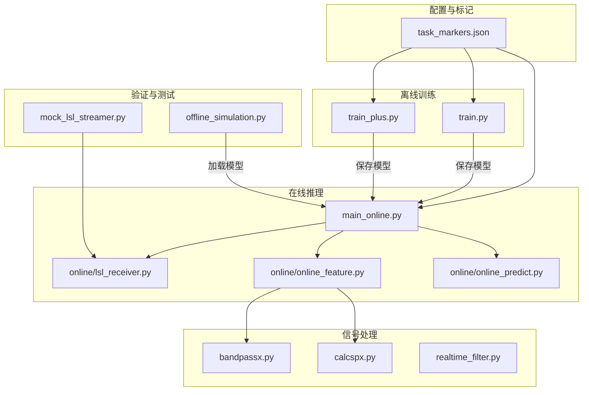
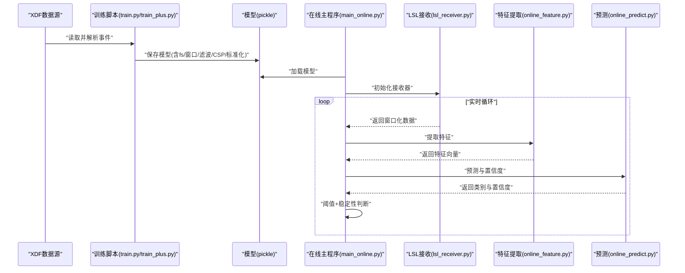
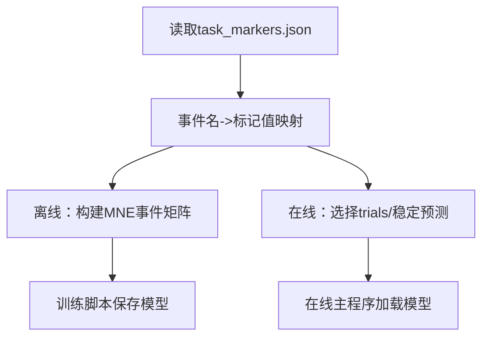
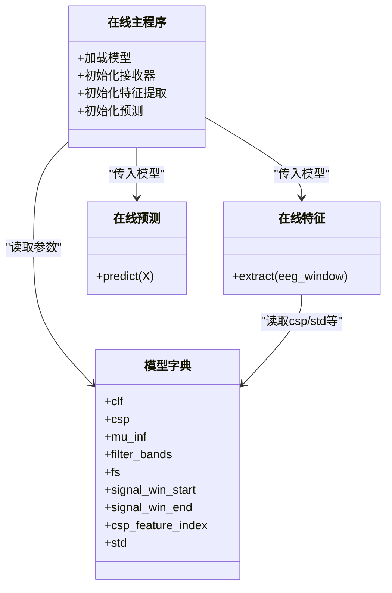
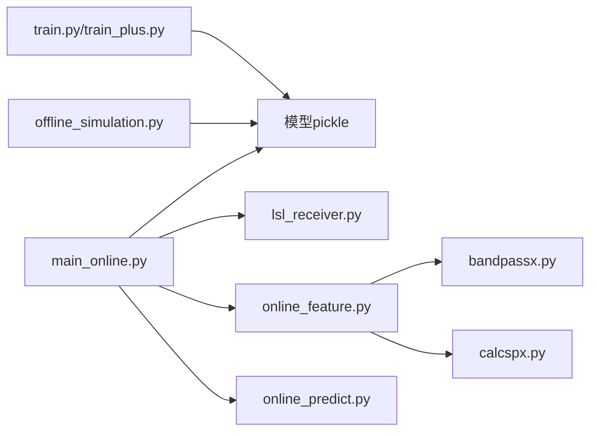

# 配置管理系统

<cite>
**本文引用的文件**
- [task_markers.json](file://paradigm/task_markers.json)
- [main_online.py](file://paradigm/main_online.py)
- [train.py](file://paradigm/train.py)
- [train_plus.py](file://paradigm/train_plus.py)
- [offline_simulation.py](file://paradigm/offline_simulation.py)
- [lsl_receiver.py](file://paradigm/online/lsl_receiver.py)
- [online_feature.py](file://paradigm/online/online_feature.py)
- [online_predict.py](file://paradigm/online/online_predict.py)
- [bandpassx.py](file://paradigm/bandpassx.py)
- [calcspx.py](file://paradigm/calcspx.py)
- [realtime_filter.py](file://paradigm/realtime_filter.py)
- [mock_lsl_streamer.py](file://paradigm/mock_lsl_streamer.py)
</cite>

## 目录
1. [简介](#简介)
2. [项目结构](#项目结构)
3. [核心组件](#核心组件)
4. [架构总览](#架构总览)
5. [详细组件分析](#详细组件分析)
6. [依赖分析](#依赖分析)
7. [性能考虑](#性能考虑)
8. [故障排查指南](#故障排查指南)
9. [结论](#结论)
10. [附录](#附录)

## 简介
本文件面向BCI系统中的“配置管理”主题，围绕以下目标展开：
- 任务标记配置文件的结构与使用：标记值定义、实验条件设置、事件编码规则
- 模型存储机制：pickle格式模型文件的组织、版本控制与迁移策略
- 参数配置指南：采样频率、信号窗口、阈值与性能优化参数
- 配置加载机制、默认值处理与错误恢复策略
- 配置验证方法、参数调试技巧与最佳实践
- 提供配置模板与示例文件，帮助快速建立自定义配置

## 项目结构
本仓库采用按功能域划分的目录结构，核心配置与运行逻辑集中在paradigm目录下：
- 任务标记与训练/推理主流程：task_markers.json、train.py、train_plus.py、main_online.py、offline_simulation.py
- 实时在线处理模块：online/lsl_receiver.py、online/online_feature.py、online/online_predict.py
- 信号处理工具：bandpassx.py、calcspx.py、realtime_filter.py
- 模拟与测试：mock_lsl_streamer.py

图表来源
- [task_markers.json:1-23](file://paradigm/task_markers.json#L1-L23)
- [train.py:20-31](file://paradigm/train.py#L20-L31)
- [train_plus.py:24-41](file://paradigm/train_plus.py#L24-L41)
- [main_online.py:18-38](file://paradigm/main_online.py#L18-L38)
- [offline_simulation.py:13-24](file://paradigm/offline_simulation.py#L13-L24)
- [lsl_receiver.py:6-22](file://paradigm/online/lsl_receiver.py#L6-L22)
- [online_feature.py:7-18](file://paradigm/online/online_feature.py#L7-L18)
- [online_predict.py:3-8](file://paradigm/online/online_predict.py#L3-L8)
- [bandpassx.py:7-37](file://paradigm/bandpassx.py#L7-L37)
- [calcspx.py:7-43](file://paradigm/calcspx.py#L7-L43)
- [realtime_filter.py:6-21](file://paradigm/realtime_filter.py#L6-L21)
- [mock_lsl_streamer.py:13-44](file://paradigm/mock_lsl_streamer.py#L13-L44)

章节来源
- [task_markers.json:1-23](file://paradigm/task_markers.json#L1-L23)
- [train.py:20-31](file://paradigm/train.py#L20-L31)
- [train_plus.py:24-41](file://paradigm/train_plus.py#L24-L41)
- [main_online.py:18-38](file://paradigm/main_online.py#L18-L38)
- [offline_simulation.py:13-24](file://paradigm/offline_simulation.py#L13-L24)
- [lsl_receiver.py:6-22](file://paradigm/online/lsl_receiver.py#L6-L22)
- [online_feature.py:7-18](file://paradigm/online/online_feature.py#L7-L18)
- [online_predict.py:3-8](file://paradigm/online/online_predict.py#L3-L8)
- [bandpassx.py:7-37](file://paradigm/bandpassx.py#L7-L37)
- [calcspx.py:7-43](file://paradigm/calcspx.py#L7-L43)
- [realtime_filter.py:6-21](file://paradigm/realtime_filter.py#L6-L21)
- [mock_lsl_streamer.py:13-44](file://paradigm/mock_lsl_streamer.py#L13-L44)

## 核心组件
- 任务标记配置(task_markers.json)：以JSON形式定义实验事件与对应标记值，支撑离线训练与在线推理的事件对齐
- 训练脚本(train.py, train_plus.py)：读取XDF数据、构建事件、提取特征、训练分类器并保存pickle模型
- 在线推理(main_online.py)：加载pickle模型，从LSL流接收窗口化数据，提取特征并进行预测
- 在线处理模块(lsl_receiver.py, online_feature.py, online_predict.py)：封装实时数据接收、特征提取与预测
- 信号处理(bandpassx.py, calcspx.py, realtime_filter.py)：带通滤波与CSP变换等算法实现
- 离线验证与测试(offline_simulation.py, mock_lsl_streamer.py)：离线评估与模拟LSL流

章节来源
- [task_markers.json:1-23](file://paradigm/task_markers.json#L1-L23)
- [train.py:20-31](file://paradigm/train.py#L20-L31)
- [train_plus.py:24-41](file://paradigm/train_plus.py#L24-L41)
- [main_online.py:18-38](file://paradigm/main_online.py#L18-L38)
- [offline_simulation.py:13-24](file://paradigm/offline_simulation.py#L13-L24)
- [lsl_receiver.py:6-22](file://paradigm/online/lsl_receiver.py#L6-L22)
- [online_feature.py:7-18](file://paradigm/online/online_feature.py#L7-L18)
- [online_predict.py:3-8](file://paradigm/online/online_predict.py#L3-L8)
- [bandpassx.py:7-37](file://paradigm/bandpassx.py#L7-L37)
- [calcspx.py:7-43](file://paradigm/calcspx.py#L7-L43)
- [realtime_filter.py:6-21](file://paradigm/realtime_filter.py#L6-L21)
- [mock_lsl_streamer.py:13-44](file://paradigm/mock_lsl_streamer.py#L13-L44)

## 架构总览
下图展示了从数据采集到在线推理的关键流程，以及配置与模型在其中的位置。

图表来源
- [train.py:184-199](file://paradigm/train.py#L184-L199)
- [train_plus.py:194-210](file://paradigm/train_plus.py#L194-L210)
- [main_online.py:18-97](file://paradigm/main_online.py#L18-L97)
- [lsl_receiver.py:23-32](file://paradigm/online/lsl_receiver.py#L23-L32)
- [online_feature.py:20-52](file://paradigm/online/online_feature.py#L20-L52)
- [online_predict.py:9-17](file://paradigm/online/online_predict.py#L9-L17)

## 详细组件分析

### 任务标记配置文件(task_markers.json)
- 结构说明
  - 键为事件语义名称，值为对应的整数标记序列（通常为单元素数组）
  - 示例：左/右移动、开始/结束、预测类、游标控制目标等
- 使用方式
  - 训练阶段：读取映射，将事件名转换为标记值，用于MNE事件矩阵构建与trials选择
  - 在线阶段：读取映射，结合模型中fs与信号窗口，计算稳定预测
- 事件编码规则
  - 事件编码为整数标记，与XDF Markers流中的值一致
  - 事件矩阵格式为三元组：[样本索引, 0, 事件码]
- 验证要点
  - 确认标记值与XDF中一致
  - 确认事件名到标记值的映射完整且唯一

图表来源
- [task_markers.json:1-23](file://paradigm/task_markers.json#L1-L23)
- [train.py:20-31](file://paradigm/train.py#L20-L31)
- [train_plus.py:24-41](file://paradigm/train_plus.py#L24-L41)
- [main_online.py:18-24](file://paradigm/main_online.py#L18-L24)

章节来源
- [task_markers.json:1-23](file://paradigm/task_markers.json#L1-L23)
- [train.py:20-31](file://paradigm/train.py#L20-L31)
- [train_plus.py:24-41](file://paradigm/train_plus.py#L24-L41)
- [main_online.py:18-24](file://paradigm/main_online.py#L18-L24)

### 模型存储机制与版本控制
- 存储格式
  - 使用pickle序列化，保存训练得到的分类器、CSP混合矩阵、特征选择索引、滤波带信息、采样率、信号窗口、CSP特征索引与标准化器等
- 版本控制
  - 通过文件名后缀(如001/002/combined001)区分不同版本
  - 建议在保存时记录训练参数快照与数据集信息，便于追溯
- 迁移策略
  - 升级算法或特征工程时，保留旧模型字段兼容映射，新增字段提供默认值
  - 读取时先尝试新字段，再降级到旧字段，最后使用默认值
- 模型加载与参数提取
  - 在线主程序从模型中读取fs、signal_win_start、signal_win_end、window_len、n_channels等参数
  - 在线特征模块从模型读取csp、mu_inf、filter_bands、csp_feature_index、std等

图表来源
- [train.py:184-199](file://paradigm/train.py#L184-L199)
- [train_plus.py:194-210](file://paradigm/train_plus.py#L194-L210)
- [main_online.py:18-38](file://paradigm/main_online.py#L18-L38)
- [online_feature.py:9-18](file://paradigm/online/online_feature.py#L9-L18)
- [online_predict.py:5-8](file://paradigm/online/online_predict.py#L5-L8)

章节来源
- [train.py:184-199](file://paradigm/train.py#L184-L199)
- [train_plus.py:194-210](file://paradigm/train_plus.py#L194-L210)
- [main_online.py:18-38](file://paradigm/main_online.py#L18-L38)
- [online_feature.py:9-18](file://paradigm/online/online_feature.py#L9-L18)
- [online_predict.py:5-8](file://paradigm/online/online_predict.py#L5-L8)

### 参数配置指南
- 采样频率(fs)
  - 训练与在线需一致，常见值为125Hz
  - 在线主程序从模型读取fs，用于窗口长度(window_len)计算
- 信号窗口(signal_win_start/signal_win_end)
  - 单位秒，决定trials截取范围
  - 在线主程序据此计算window_len = int((end-start)*fs)
- 阈值与性能参数
  - 阈值(threshold)：置信度阈值，低于则丢弃
  - 稳定性窗口(stability_window)：连续相同预测才生效
  - 置信度滑动窗口(confidence_queue_len)：平滑置信度
  - 预测间隔(step_time)：主循环sleep时间
- 典型参数位置
  - 训练脚本：fs、signal_win_start/end、csp_feature_index、k_top_features、filter_bands
  - 在线主程序：threshold、stability_window、confidence_queue_len、step_time

章节来源
- [train.py:28-57](file://paradigm/train.py#L28-L57)
- [train_plus.py:36-53](file://paradigm/train_plus.py#L36-L53)
- [main_online.py:20-49](file://paradigm/main_online.py#L20-L49)

### 配置加载机制、默认值与错误恢复
- 加载机制
  - 训练脚本：读取task_markers.json，构建事件矩阵，训练并保存pickle模型
  - 在线主程序：打开./models/xxx.pkl，读取fs与信号窗口等参数
  - 离线验证：加载模型并读取各字段
- 默认值处理
  - 在线主程序中，若模型缺少某些字段，应提供默认值或抛出明确异常
  - 建议在加载后校验关键字段是否存在
- 错误恢复策略
  - LSL流断开：重连/等待/提示
  - 缓冲区未满：跳过当前周期
  - 预测置信度不足：丢弃预测，清空队列
  - 模型损坏：捕获异常并提示重新训练

章节来源
- [train.py:20-31](file://paradigm/train.py#L20-L31)
- [main_online.py:56-97](file://paradigm/main_online.py#L56-L97)
- [offline_simulation.py:13-24](file://paradigm/offline_simulation.py#L13-L24)

### 配置验证方法与调试技巧
- 量级检查
  - 训练脚本打印数据形状、极值、均值，辅助确认数据质量
- 事件对齐验证
  - 检查MNE事件矩阵与标记值是否一致
- 在线稳定性验证
  - 使用离线模拟脚本，对比平滑前后准确率与决策数量
- 参数敏感性调试
  - 逐步调整阈值、稳定性窗口与置信度滑动窗口，观察准确率与延迟权衡
- 端到端测试
  - 使用mock_lsl_streamer推送离线数据，验证从流到预测的完整链路

章节来源
- [train.py:50-57](file://paradigm/train.py#L50-L57)
- [offline_simulation.py:134-171](file://paradigm/offline_simulation.py#L134-L171)
- [mock_lsl_streamer.py:13-44](file://paradigm/mock_lsl_streamer.py#L13-L44)

### 最佳实践建议
- 标记规范
  - 统一事件命名与标记值，避免歧义
- 训练与在线一致性
  - fs、信号窗口、滤波带、CSP特征索引必须一致
- 模型版本化
  - 以文件名后缀区分版本，必要时在模型内嵌版本号
- 容错设计
  - 在线主循环加入异常捕获与重试机制
- 文档化
  - 记录每次训练的超参与数据集信息，便于复现

## 依赖分析
- 组件耦合
  - 在线主程序依赖模型字典中的全部关键字段
  - 在线特征模块依赖模型中的csp、filter_bands、csp_feature_index、std等
  - 训练脚本与离线验证脚本共享task_markers.json与模型字段
- 外部依赖
  - pyxdf、mne、numpy、scipy、sklearn、pylsl等

图表来源
- [train.py:184-199](file://paradigm/train.py#L184-L199)
- [train_plus.py:194-210](file://paradigm/train_plus.py#L194-L210)
- [offline_simulation.py:13-24](file://paradigm/offline_simulation.py#L13-L24)
- [main_online.py:18-38](file://paradigm/main_online.py#L18-L38)
- [lsl_receiver.py:6-22](file://paradigm/online/lsl_receiver.py#L6-L22)
- [online_feature.py:7-18](file://paradigm/online/online_feature.py#L7-L18)
- [online_predict.py:3-8](file://paradigm/online/online_predict.py#L3-L8)
- [bandpassx.py:7-37](file://paradigm/bandpassx.py#L7-L37)
- [calcspx.py:7-43](file://paradigm/calcspx.py#L7-L43)

章节来源
- [train.py:184-199](file://paradigm/train.py#L184-L199)
- [train_plus.py:194-210](file://paradigm/train_plus.py#L194-L210)
- [offline_simulation.py:13-24](file://paradigm/offline_simulation.py#L13-L24)
- [main_online.py:18-38](file://paradigm/main_online.py#L18-L38)
- [lsl_receiver.py:6-22](file://paradigm/online/lsl_receiver.py#L6-L22)
- [online_feature.py:7-18](file://paradigm/online/online_feature.py#L7-L18)
- [online_predict.py:3-8](file://paradigm/online/online_predict.py#L3-L8)
- [bandpassx.py:7-37](file://paradigm/bandpassx.py#L7-L37)
- [calcspx.py:7-43](file://paradigm/calcspx.py#L7-L43)

## 性能考虑
- 计算复杂度
  - 特征提取涉及多带滤波与CSP变换，时间复杂度与通道数、样本数、带数成正比
- 实时性
  - 在线主循环sleep时间(step_time)影响延迟与吞吐
  - 置信度滑动窗口与稳定性窗口平衡响应速度与准确性
- 内存占用
  - 窗口长度(window_len)与通道数决定缓冲区大小
- 优化建议
  - 合理选择k_top_features与filter_bands数量
  - 使用高效的滤波实现与向量化操作
  - 在线预测前进行必要的预处理(如baseline校正)

## 故障排查指南
- 无法找到模型
  - 检查模型路径与文件名是否匹配
- LSL流不可用
  - 确认流名称与类型匹配，检查网络与防火墙
- 预测结果不稳定
  - 调整阈值、稳定性窗口与置信度滑动窗口
- 离线验证不通过
  - 对比离线脚本与在线脚本的参数，确保一致性

章节来源
- [main_online.py:56-97](file://paradigm/main_online.py#L56-L97)
- [offline_simulation.py:55-70](file://paradigm/offline_simulation.py#L55-L70)

## 结论
本配置管理体系以task_markers.json为事件语义中心，配合训练脚本输出的pickle模型，实现了从离线训练到在线推理的闭环。通过统一的参数约定、严格的加载与校验机制、以及可扩展的版本化策略，系统具备良好的可维护性与可移植性。建议在实际部署中进一步完善默认值与错误恢复、增加日志与监控，并持续迭代参数以获得更优的实时性能与稳定性。

## 附录
- 配置模板与示例文件
  - 任务标记模板：见task_markers.json
  - 训练脚本示例：见train.py与train_plus.py
  - 在线主程序示例：见main_online.py
  - 离线验证示例：见offline_simulation.py
  - 模拟LSL流示例：见mock_lsl_streamer.py

章节来源
- [task_markers.json:1-23](file://paradigm/task_markers.json#L1-L23)
- [train.py:20-31](file://paradigm/train.py#L20-L31)
- [train_plus.py:24-41](file://paradigm/train_plus.py#L24-L41)
- [main_online.py:18-38](file://paradigm/main_online.py#L18-L38)
- [offline_simulation.py:13-24](file://paradigm/offline_simulation.py#L13-L24)
- [mock_lsl_streamer.py:13-44](file://paradigm/mock_lsl_streamer.py#L13-L44)