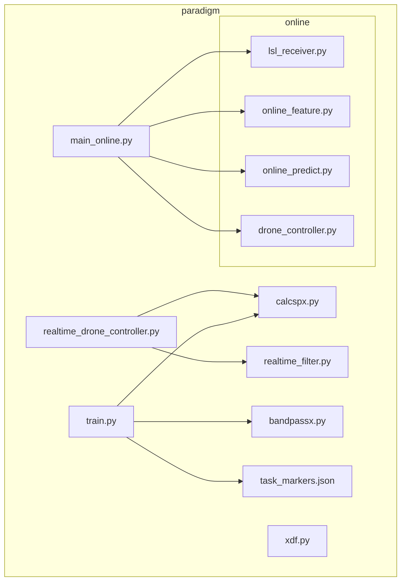
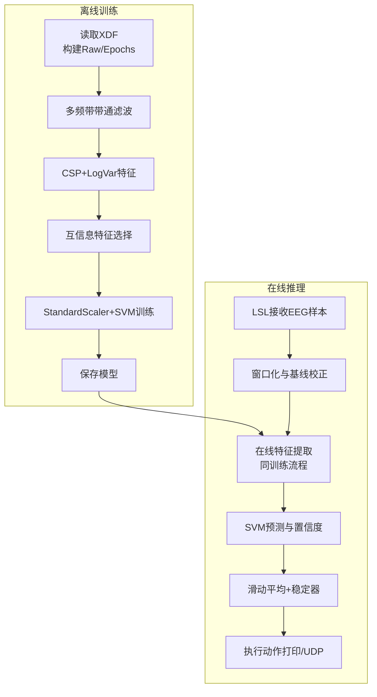
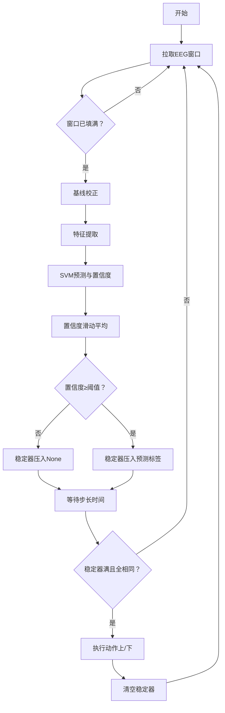
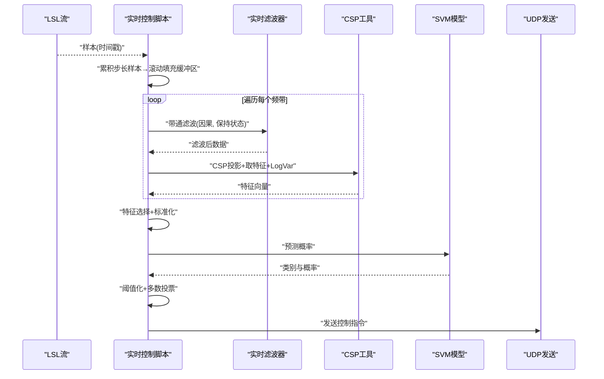
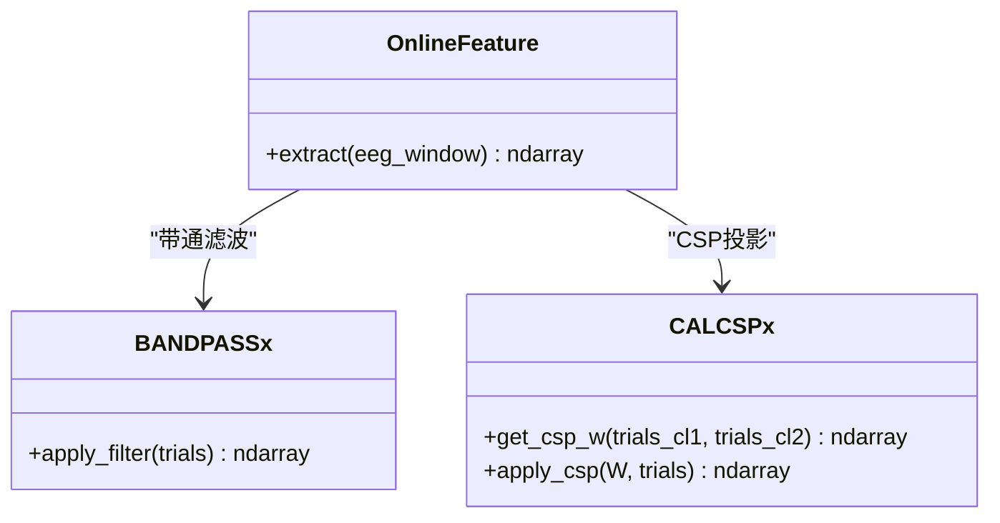
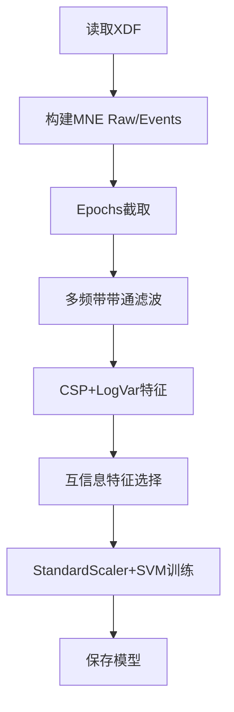
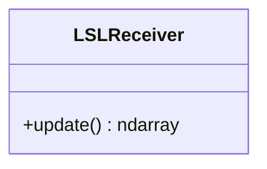
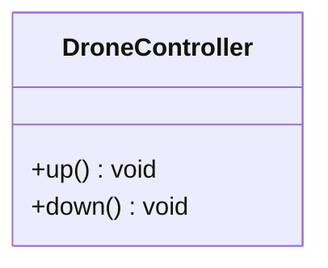
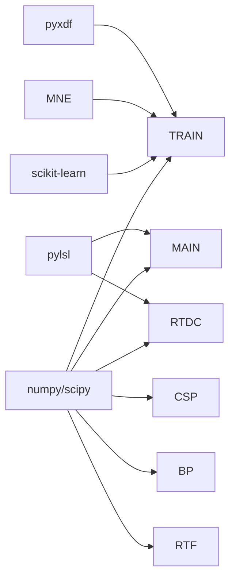

# 项目概述

<cite>
**本文引用的文件**
- [paradigm/main_online.py](file://paradigm/main_online.py)
- [paradigm/realtime_drone_controller.py](file://paradigm/realtime_drone_controller.py)
- [paradigm/train.py](file://paradigm/train.py)
- [paradigm/xdf.py](file://paradigm/xdf.py)
- [paradigm/online/lsl_receiver.py](file://paradigm/online/lsl_receiver.py)
- [paradigm/online/online_feature.py](file://paradigm/online/online_feature.py)
- [paradigm/online/online_predict.py](file://paradigm/online/online_predict.py)
- [paradigm/online/drone_controller.py](file://paradigm/online/drone_controller.py)
- [paradigm/calcspx.py](file://paradigm/calcspx.py)
- [paradigm/bandpassx.py](file://paradigm/bandpassx.py)
- [paradigm/realtime_filter.py](file://paradigm/realtime_filter.py)
- [paradigm/task_markers.json](file://paradigm/task_markers.json)
</cite>

## 目录
1. [引言](#引言)
2. [项目结构](#项目结构)
3. [核心组件](#核心组件)
4. [架构总览](#架构总览)
5. [详细组件分析](#详细组件分析)
6. [依赖分析](#依赖分析)
7. [性能考虑](#性能考虑)
8. [故障排查指南](#故障排查指南)
9. [结论](#结论)
10. [附录](#附录)

## 引言
本项目围绕“基于脑电（EEG）的脑机接口（BCI）无人机控制系统”展开，目标是以非侵入式脑电信号为控制源，通过离线训练得到的CSP+LogVar+SVM分类器，在在线模式下实现对无人机的实时上升/下降控制。系统采用模块化设计，涵盖数据采集（LSL）、特征提取（CSP+频带滤波+方差对数特征）、分类预测（SVM）以及控制执行（UDP/打印），满足低延迟、高稳定性的实时控制需求。

## 项目结构
项目采用“功能域+模块化”的组织方式，核心目录与文件如下：
- paradigm：主程序与算法实现
  - online：在线推理子系统（接收器、特征提取、预测、无人机控制器）
  - 实时控制脚本：realtime_drone_controller.py
  - 训练脚本：train.py
  - 数据处理与可视化：xdf.py
  - 算法工具：calcspx.py（CSP）、bandpassx.py（带通滤波）、realtime_filter.py（实时滤波）
  - 标记映射：task_markers.json
- psychopy_env：Python虚拟环境（含PyVCPY等依赖）

图表来源
- [paradigm/main_online.py:1-97](file://paradigm/main_online.py#L1-L97)
- [paradigm/realtime_drone_controller.py:1-121](file://paradigm/realtime_drone_controller.py#L1-L121)
- [paradigm/train.py:1-201](file://paradigm/train.py#L1-L201)
- [paradigm/xdf.py:1-37](file://paradigm/xdf.py#L1-L37)
- [paradigm/online/lsl_receiver.py:1-32](file://paradigm/online/lsl_receiver.py#L1-L32)
- [paradigm/online/online_feature.py:1-52](file://paradigm/online/online_feature.py#L1-L52)
- [paradigm/online/online_predict.py:1-17](file://paradigm/online/online_predict.py#L1-L17)
- [paradigm/online/drone_controller.py:1-13](file://paradigm/online/drone_controller.py#L1-L13)
- [paradigm/calcspx.py:1-87](file://paradigm/calcspx.py#L1-L87)
- [paradigm/bandpassx.py:1-79](file://paradigm/bandpassx.py#L1-L79)
- [paradigm/realtime_filter.py:1-32](file://paradigm/realtime_filter.py#L1-L32)
- [paradigm/task_markers.json:1-23](file://paradigm/task_markers.json#L1-L23)

章节来源
- [paradigm/main_online.py:1-97](file://paradigm/main_online.py#L1-L97)
- [paradigm/realtime_drone_controller.py:1-121](file://paradigm/realtime_drone_controller.py#L1-L121)
- [paradigm/train.py:1-201](file://paradigm/train.py#L1-L201)
- [paradigm/xdf.py:1-37](file://paradigm/xdf.py#L1-L37)
- [paradigm/online/lsl_receiver.py:1-32](file://paradigm/online/lsl_receiver.py#L1-L32)
- [paradigm/online/online_feature.py:1-52](file://paradigm/online/online_feature.py#L1-L52)
- [paradigm/online/online_predict.py:1-17](file://paradigm/online/online_predict.py#L1-L17)
- [paradigm/online/drone_controller.py:1-13](file://paradigm/online/drone_controller.py#L1-L13)
- [paradigm/calcspx.py:1-87](file://paradigm/calcspx.py#L1-L87)
- [paradigm/bandpassx.py:1-79](file://paradigm/bandpassx.py#L1-L79)
- [paradigm/realtime_filter.py:1-32](file://paradigm/realtime_filter.py#L1-L32)
- [paradigm/task_markers.json:1-23](file://paradigm/task_markers.json#L1-L23)

## 核心组件
- 在线推理管线（main_online.py）
  - 读取离线训练好的模型，初始化LSL接收器、在线特征提取器、在线预测器与无人机控制器
  - 主循环：从LSL拉取窗口化EEG样本，进行基线校正，提取特征，SVM预测，置信度滑动平均，稳定器去抖后执行动作
- 实时控制脚本（realtime_drone_controller.py）
  - 通过LSL解析并连接EEG流，维护2秒环形缓冲区，按固定步长累积样本
  - 针对多个频带进行实时带通滤波，计算CSP+LogVar特征，经特征选择与标准化后SVM预测，多数投票平滑后通过UDP发送控制指令
- 训练流水线（train.py）
  - 读取XDF数据，构建MNE Raw对象，依据标记生成事件与分段（epochs），多频带带通滤波，CSP+LogVar特征，互信息特征选择，StandardScaler+GridSearchCV的SVM训练，最终保存模型
- 在线特征提取（online/online_feature.py）
  - 与训练一致的特征提取流程：多频带带通滤波→CSP投影→取特定导联轴→对数方差→特征选择→标准化
- 在线预测（online/online_predict.py）
  - 使用SVM模型进行类别预测与概率输出
- LSL接收器（online/lsl_receiver.py）
  - 解析EEG流，维护环形缓冲区，提供最新窗口数据
- 无人机控制器（online/drone_controller.py）
  - 提供上/下动作接口（可替换为UDP或仿真）
- CSP与滤波工具
  - calcspx.py：CSP协方差估计、混合矩阵求解、投影应用
  - bandpassx.py：离线/在线通用带通滤波
  - realtime_filter.py：因果滤波器状态保持，逐通道lfilter

章节来源
- [paradigm/main_online.py:1-97](file://paradigm/main_online.py#L1-L97)
- [paradigm/realtime_drone_controller.py:1-121](file://paradigm/realtime_drone_controller.py#L1-L121)
- [paradigm/train.py:1-201](file://paradigm/train.py#L1-L201)
- [paradigm/online/online_feature.py:1-52](file://paradigm/online/online_feature.py#L1-L52)
- [paradigm/online/online_predict.py:1-17](file://paradigm/online/online_predict.py#L1-L17)
- [paradigm/online/lsl_receiver.py:1-32](file://paradigm/online/lsl_receiver.py#L1-L32)
- [paradigm/online/drone_controller.py:1-13](file://paradigm/online/drone_controller.py#L1-L13)
- [paradigm/calcspx.py:1-87](file://paradigm/calcspx.py#L1-L87)
- [paradigm/bandpassx.py:1-79](file://paradigm/bandpassx.py#L1-L79)
- [paradigm/realtime_filter.py:1-32](file://paradigm/realtime_filter.py#L1-L32)

## 架构总览
系统分为“离线训练”和“在线推理/控制”两大阶段，二者通过统一的特征空间与模型参数协同工作。

图表来源
- [paradigm/train.py:1-201](file://paradigm/train.py#L1-L201)
- [paradigm/main_online.py:1-97](file://paradigm/main_online.py#L1-L97)
- [paradigm/realtime_drone_controller.py:1-121](file://paradigm/realtime_drone_controller.py#L1-L121)

## 详细组件分析

### 在线推理主循环（main_online.py）
- 关键流程
  - 读取模型参数（采样率、信号窗、特征索引等）
  - 初始化接收器、特征提取器、预测器、无人机控制器
  - 循环：拉取窗口EEG→检查是否填满→基线校正→特征提取→SVM预测→置信度滑动平均→稳定器→执行动作→睡眠等待
- 参数要点
  - 阈值、步长时间、稳定窗口、置信度滑动窗口等影响实时稳定性与响应速度

图表来源
- [paradigm/main_online.py:54-97](file://paradigm/main_online.py#L54-L97)

章节来源
- [paradigm/main_online.py:1-97](file://paradigm/main_online.py#L1-L97)

### 实时控制主循环（realtime_drone_controller.py）
- 关键流程
  - 加载模型参数（采样率、导联数、信号窗长、CSP特征索引、滤波带、标准化器、SVM）
  - 初始化实时滤波器字典与UDP套接字
  - 连接LSL流，按UPDATE_INTERVAL步长累积样本，滚动填充环形缓冲区
  - 对每个频带：实时滤波→CSP投影→取特征→LogVar→拼接→特征选择+标准化→SVM预测→阈值化→多数投票→发送UDP
- 安全与鲁棒性
  - 信号丢失时发送悬停指令
  - 多数投票平滑输出，降低抖动

图表来源
- [paradigm/realtime_drone_controller.py:49-121](file://paradigm/realtime_drone_controller.py#L49-L121)
- [paradigm/realtime_filter.py:1-32](file://paradigm/realtime_filter.py#L1-L32)
- [paradigm/calcspx.py:1-87](file://paradigm/calcspx.py#L1-L87)

章节来源
- [paradigm/realtime_drone_controller.py:1-121](file://paradigm/realtime_drone_controller.py#L1-L121)
- [paradigm/realtime_filter.py:1-32](file://paradigm/realtime_filter.py#L1-L32)
- [paradigm/calcspx.py:1-87](file://paradigm/calcspx.py#L1-L87)

### 在线特征提取（online/online_feature.py）
- 功能要点
  - 与训练一致的特征提取链路：多频带带通滤波→CSP投影→取特征轴→对数方差→特征选择→标准化
  - 适配在线输入的窗口化数据形状，保证与离线模型参数一致

图表来源
- [paradigm/online/online_feature.py:1-52](file://paradigm/online/online_feature.py#L1-L52)
- [paradigm/bandpassx.py:1-79](file://paradigm/bandpassx.py#L1-L79)
- [paradigm/calcspx.py:1-87](file://paradigm/calcspx.py#L1-L87)

章节来源
- [paradigm/online/online_feature.py:1-52](file://paradigm/online/online_feature.py#L1-L52)
- [paradigm/bandpassx.py:1-79](file://paradigm/bandpassx.py#L1-L79)
- [paradigm/calcspx.py:1-87](file://paradigm/calcspx.py#L1-L87)

### 训练流水线（train.py）
- 关键步骤
  - 读取XDF，构建MNE Raw与事件矩阵，截取感兴趣的时间窗形成epochs
  - 多频带带通滤波，CSP+LogVar特征，互信息特征选择，StandardScaler+GridSearchCV的SVM训练
  - 保存模型（包含SVM、CSP混合矩阵、特征选择索引、滤波带、标准化器、采样率、信号窗等）
- 标记映射
  - task_markers.json定义了任务标记与事件码的对应关系，支撑事件对齐与分段

图表来源
- [paradigm/train.py:1-201](file://paradigm/train.py#L1-L201)
- [paradigm/task_markers.json:1-23](file://paradigm/task_markers.json#L1-L23)

章节来源
- [paradigm/train.py:1-201](file://paradigm/train.py#L1-L201)
- [paradigm/task_markers.json:1-23](file://paradigm/task_markers.json#L1-L23)

### LSL接收器（online/lsl_receiver.py）
- 功能要点
  - 解析并连接EEG LSL流，维护环形缓冲区，提供最新窗口数据
  - 适合在线推理脚本的窗口化数据需求

图表来源
- [paradigm/online/lsl_receiver.py:1-32](file://paradigm/online/lsl_receiver.py#L1-L32)

章节来源
- [paradigm/online/lsl_receiver.py:1-32](file://paradigm/online/lsl_receiver.py#L1-L32)

### 无人机控制器（online/drone_controller.py）
- 功能要点
  - 提供上/下动作接口，便于替换为UDP控制或仿真器调用

图表来源
- [paradigm/online/drone_controller.py:1-13](file://paradigm/online/drone_controller.py#L1-L13)

章节来源
- [paradigm/online/drone_controller.py:1-13](file://paradigm/online/drone_controller.py#L1-L13)

## 依赖分析
- 组件耦合
  - 在线推理主循环依赖LSL接收器、在线特征提取器、在线预测器与无人机控制器
  - 实时控制脚本依赖CSP工具与实时滤波器，与训练模型参数强耦合
  - 训练脚本依赖pyxdf、MNE、scikit-learn、特征选择与网格搜索
- 外部库与用途
  - pyxdf：读取XDF数据流
  - MNE：Raw/Epochs构建与事件对齐
  - scikit-learn：SVM、StandardScaler、GridSearchCV、互信息特征选择
  - pylsl：LSL流解析与实时采样
  - scipy/numpy：信号滤波、线性代数、统计运算
- 潜在风险
  - LSL流断开或数据丢失需有降级策略（如悬停）
  - 模型参数与在线特征链路必须严格一致，否则预测失效

图表来源
- [paradigm/train.py:1-201](file://paradigm/train.py#L1-L201)
- [paradigm/main_online.py:1-97](file://paradigm/main_online.py#L1-L97)
- [paradigm/realtime_drone_controller.py:1-121](file://paradigm/realtime_drone_controller.py#L1-L121)
- [paradigm/calcspx.py:1-87](file://paradigm/calcspx.py#L1-L87)
- [paradigm/bandpassx.py:1-79](file://paradigm/bandpassx.py#L1-L79)
- [paradigm/realtime_filter.py:1-32](file://paradigm/realtime_filter.py#L1-L32)

章节来源
- [paradigm/train.py:1-201](file://paradigm/train.py#L1-L201)
- [paradigm/main_online.py:1-97](file://paradigm/main_online.py#L1-L97)
- [paradigm/realtime_drone_controller.py:1-121](file://paradigm/realtime_drone_controller.py#L1-L121)

## 性能考虑
- 实时性
  - 在线推理主循环通过固定步长时间与稳定器减少误触发；实时控制脚本通过多数投票平滑输出
  - 建议将特征提取与预测尽量向量化，避免Python循环瓶颈
- 稳定性
  - 置信度阈值与滑动窗口长度需结合被试状态调整
  - 多数投票窗口过大可能引入滞后，过小可能导致抖动
- 计算复杂度
  - CSP协方差计算与特征选择在训练阶段完成；在线仅进行投影与LogVar，计算量较小
- I/O与网络
  - LSL拉取与UDP发送应尽量批量/合并，减少系统调用开销

## 故障排查指南
- 无法连接LSL流
  - 检查EEG设备是否启动、LSL流名称与类型匹配
  - 在线脚本会在超时情况下发送悬停指令，确认UDP端点可达
- 预测不稳定/频繁抖动
  - 提升置信度阈值或增大稳定器窗口
  - 检查滤波参数与CSP特征索引是否与训练一致
- 模型不生效
  - 确认模型文件路径正确，采样率、信号窗、特征索引与训练一致
  - 检查特征选择索引与标准化器是否匹配
- 数据缺失/溢出
  - 确保步长样本数量与采样率匹配，缓冲区滚动填充逻辑正确

章节来源
- [paradigm/main_online.py:54-97](file://paradigm/main_online.py#L54-L97)
- [paradigm/realtime_drone_controller.py:49-121](file://paradigm/realtime_drone_controller.py#L49-L121)

## 结论
本项目以简洁稳定的模块化架构实现了从离线训练到在线控制的完整闭环：训练阶段产出统一的特征空间与SVM模型，推理阶段通过LSL实时获取数据，沿用相同的特征提取链路进行在线预测，并以阈值与稳定器保障控制的可靠性。系统具备良好的扩展性，可进一步接入UDP/串口与仿真器，适合作为BCI控制入门与进阶开发的参考范例。

## 附录

### 技术栈与用途概览
- pyxdf：读取XDF数据，构建时间序列与标记流
- MNE：Raw/Epochs构建、事件对齐与可视化
- scikit-learn：SVM分类、特征选择、标准化与网格搜索
- pylsl：LSL流解析与实时采样
- scipy/numpy：滤波、线性代数、统计运算

章节来源
- [paradigm/train.py:1-201](file://paradigm/train.py#L1-L201)
- [paradigm/xdf.py:1-37](file://paradigm/xdf.py#L1-L37)